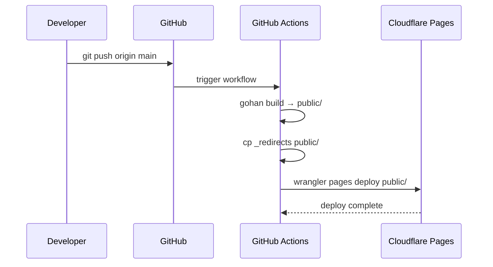

# bmf-tech

[bmf-tech.com](https://bmf-tech.com) のソースリポジトリ。
[gohan](https://github.com/bmf-san/gohan) 製の静的サイトで、Cloudflare Pages でホスティングしている。


## 技術スタック

| レイヤー | 使用技術 |
|---|---|
| 静的サイトジェネレーター | [gohan](https://github.com/bmf-san/gohan) |
| ホスティング | Cloudflare Pages |
| CI/CD | GitHub Actions |
| CSS フレームワーク | [sleyt](https://github.com/bmf-san/sleyt) |
| 言語 | Go (ツール類), HTML/CSS (テーマ) |

## ディレクトリ構成

```
.
├── .github/workflows/deploy.yml  # Cloudflare Pages デプロイワークフロー
├── assets/
│   └── images/posts/             # 記事内画像 (外部→ローカル移行済み)
├── content/
│   ├── en/
│   │   ├── posts/                # 英語記事
│   │   ├── about.md              # About ページ
│   │   ├── picks.md              # picks ページ（curated 記事インデックス）
│   │   ├── privacy-policy.md     # プライバシーポリシー
│   │   ├── categories.yaml       # カテゴリ定義
│   │   └── tags.yaml             # タグ定義
│   └── ja/
│       ├── posts/                # 日本語記事
│       ├── about.md              # About ページ（JA）
│       ├── picks.md              # picks ページ（JA）
│       ├── privacy-policy.md     # プライバシーポリシー（JA）
│       ├── categories.yaml       # カテゴリ定義（JA）
│       └── tags.yaml             # タグ定義（JA）
├── docs/
│   └── DESIGN_DOC.md             # 設計ドキュメント
├── public/                       # ビルド出力 (.gitignore済み)
├── themes/default/
│   └── templates/                # HTMLテンプレート
├── _redirects                    # Cloudflare Pages リダイレクトルール
└── config.yaml                   # gohan 設定
```

## セットアップ

```bash
# リポジトリをクローン
git clone git@github.com:bmf-san/bmf-tech.git
cd bmf-tech

# gohan をインストール
make install-gohan
```

## 開発

```bash
# サイトをビルド
make build

# ローカルサーバーを起動 (http://localhost:1313)
make serve
```

記事の作成・フロントマター・ブランチ運用については [CONTRIBUTING.md](CONTRIBUTING.md) を参照。

## URL 構造

| コンテンツ | URL |
|---|---|
| 英語記事 | `/posts/{slug}/` |
| 日本語記事 | `/ja/posts/{slug}/` |
| picks | `/picks/` |
| About | `/about/` |
| プライバシーポリシー | `/privacy-policy/` |
| タグ別記事一覧 | `/tags/{name}/` |
| カテゴリ別記事一覧 | `/categories/{name}/` |
| アーカイブ | `/archives/{year}/{month}/` |

## デプロイ

`main` ブランチへの push で自動デプロイ。



**CI フロー（`.github/workflows/deploy.yml`）:**

1. GitHub Actions (ubuntu ランナー) が `gohan build` を実行し `public/` を生成
2. `_redirects` を `public/` へコピー
3. `wrangler pages deploy public` で `public/` を Cloudflare Pages へダイレクトアップロード

> Cloudflare Pages 側ではビルドを行わない。ビルドは GitHub Actions ランナー上で完結する。
> `assets/fonts/` など `gohan build` に必要なファイルはリポジトリに含める必要がある。

**GitHub Secrets に設定が必要**:
- `CLOUDFLARE_API_TOKEN` — Cloudflare API トークン (Pages:Edit 権限)
- `CLOUDFLARE_ACCOUNT_ID` — Cloudflare アカウント ID

手動デプロイ: GitHub Actions の `workflow_dispatch` からトリガー可能。

## dev.to クロスポスト

英語記事を [dev.to](https://dev.to) にクロスポストする。
`tools/devto/` 配下の Go CLI ツールで管理する。

**スキップ対象**（投稿しない）:
- カテゴリ `Poem` の記事
- タグ `Book Review` の記事
- `draft: true` の記事

**投稿仕様**:
- `canonical_url` に `https://bmf-tech.com/posts/{slug}/` を設定（SEO 重複コンテンツ対策）
- カバー画像に `https://bmf-tech.com/ogp/{slug}.png` を設定
- 記事 body 先頭に `bmf-tech.com` へのリンクを挿入してトラフィック誘導
- 投稿済み slug は `tools/devto/posted.json` で管理（再実行時はスキップ）

**GitHub Secrets に追加で必要**:
- `DEV_TO_API_KEY` — dev.to API キー ([dev.to/settings/extensions](https://dev.to/settings/extensions) で発行)

**使い方**:

```bash
# 全記事を一括投稿（約 12 分）
make devto-post-all DEV_TO_API_KEY=xxx

# 単一記事を投稿
make devto-post-file FILE=content/en/posts/my-post.md DEV_TO_API_KEY=xxx

# dry-run（API を呼ばずに内容を確認）
make devto-post-all DRY_RUN=1
```

`main` ブランチへの push 時に `content/en/posts/` に新規追加された記事は `.github/workflows/devto-publish.yml` が自動投稿する。

## コントリビューション

[CONTRIBUTING.md](CONTRIBUTING.md) を参照。

## ライセンス

コンテンツ (content/) は著作権保持。ソースコード (themes/) は MIT ライセンス。