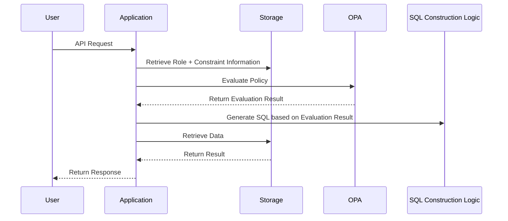
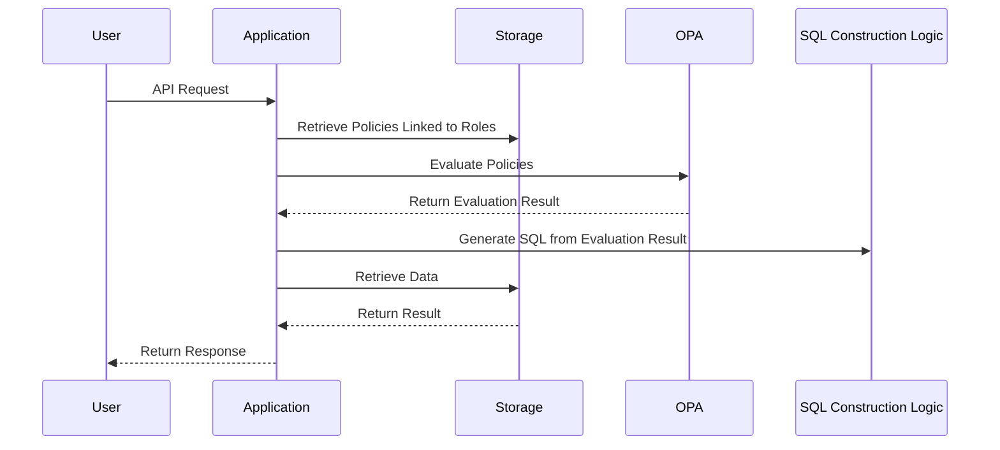

# Overview
Open Policy Agent (OPA) is a powerful mechanism that enables policy-based access control in a loosely coupled manner. Rules are written in a declarative language called Rego, allowing applications to utilize policy evaluation in a simple format.

In this article, we will organize representative patterns of access control using OPA, comparing their characteristics, suitable use cases, and implementation burdens.

Below is a revised and expanded table based on the four access control approaches you mentioned. The original three classifications have been reorganized into four, separating the **SQL Generation Approach** and the **AST Approach**. Additionally, we have updated it from the perspective of responsibility separation.

# Access Control Patterns
| Pattern Name                                   | Role of Rego                                 | Role of Application                           | Features                                                   |
| ---------------------------------------------- | -------------------------------------------- | ---------------------------------------------- | ---------------------------------------------------------- |
| **① Allow/Deny Judgment (Naive Approach)**    | Evaluates the truth value of allow/deny     | Controls the processing based on the result  | Lightweight and fast evaluation. Faithful to Rego's original model |
| **② SQL Generation Approach**                  | Generates complete SQL (template/embedded)  | Executes the SQL received from Rego as is    | Flexible but introduces SQL dependency in Rego. Application dependencies mix into policies |
| **③ Condition Extraction (Structured Condition) Approach** | Returns filter conditions for SQL (structure) | Generates and executes queries like SQL/ES based on conditions | Clearly separates condition logic and data processing, scalable |
| **④ AST Approach (Partial Evaluation)**       | Returns condition expressions as AST         | Converts AST to SQL or uses it for other evaluations | Highly reusable and flexible, but complex implementation and high understanding cost |

# Responsibility Separation Perspective on Each Pattern
| Pattern Name                                   | Responsibility of Rego                       | Responsibility of Application                 | Balance of Responsibility Separation                       |
| ---------------------------------------------- | -------------------------------------------- | ---------------------------------------------- | ---------------------------------------------------------- |
| **① Allow/Deny Judgment (Naive Approach)**    | Only determines whether to allow or deny    | Executes processing based on the allow result | ✔ Completely separated. Rego returns only "Yes/No"      |
| **② SQL Generation Approach**                  | Outputs complete SQL (including logic and format) | Executes it as is                             | ❌ Responsibilities are mixed. Rego needs SQL syntax knowledge |
| **③ Condition Extraction (Structured Condition) Approach** | Generates allow conditions (e.g., `department_id IN [1,2]`) | Constructs and executes SQL based on conditions | ✔ Condition logic and data processing are neatly separated |
| **④ AST Approach (Partial Evaluation)**       | Returns policy condition expressions as abstract syntax (AST) | Interprets and transforms AST for SQL application | △ Separation exists, but application-side AST understanding and transformation implementation are needed |

## Notes: Policy Management and Responsibility Attribution
- **Naive or Condition Extraction Types** tend to have abstract content in Rego that is closer to business logic, making it **easier for product teams to manage**.
- **SQL Generation or AST Types** become complex due to implementation dependencies and transformation processes, making **common management by infrastructure teams more practical**.

# User Configuration and OPA Integration
In applications requiring dynamic access control*, how to supply user-defined permission information to OPA becomes a crucial design point.

*When access control is completed solely by policies, it is defined as static; when it involves handling policies and arbitrary configuration information, it is defined as dynamic.

OPA is a stateless policy engine that requires necessary data to be explicitly supplied from external sources during evaluation. Below are the main approaches and their characteristics.

## Comparison of Data Supply Approaches
A comparison of approaches to passing data necessary for policy evaluation (not the evaluation target, but supplementary information for policy evaluation) to OPA.

| Approach                | Feasibility | Advantages                      | Disadvantages                                   |
| ----------------------- | ----------- | ------------------------------- | ------------------------------------------------ |
| DB Storage → OPA Evaluation | ◎           | Standard, flexible, and reusable | Implementation is somewhat complex               |
| Static Data Embedded in OPA | △           | Simple implementation            | Requires effort for updates                       |
| External Reference from OPA | △           | Can be dynamically retrieved     | Issues with latency and reliability, not recommended for operation |

In use cases requiring dynamic permission settings, the DB storage approach is the most practical for the following reasons:

- Permission settings are made via the UI and may be frequently updated.
- Configuration information has a complex structure, such as roles and departments, and needs to be persisted.
- Consistency, reusability, and version management with other processes are easier.

```
User: Configured to allow access to Department A and Department B
↓ (Save)
DB: Saved in the user_role_policies table
↓ (During evaluation)
App or PDP: Retrieves settings and passes them to OPA as input.data
↓
OPA: Evaluates with Rego rules
```

By clearly separating the flow of responsibilities from user settings → DB storage → OPA integration, a flexible and maintainable access control design can be achieved.

# Revisiting Policy Design
However, while writing this article, I realized that the DB storage → OPA evaluation approach might be wasteful.

Separating the stored configuration values and policies in the DB is likely unnecessary; if the data is consolidated into the policy, the logic in the access control flow becomes simpler.

## Premise
- In RBAC, there are roles and constraint information (data stored in the DB representing the conditions for access control that roles possess).
- Assuming a large amount of data, we will base our approach on SQL filtering (having OPA return conditions for SQL generation).
  - cf. [Considerations on the Impact of Pagination in OPA and Solutions](https://bmf-tech.com/posts/OPA%E3%81%AB%E3%81%8A%E3%81%91%E3%82%8B%E3%83%9A%E3%83%BC%E3%82%B8%E3%83%8D%E3%83%BC%E3%82%B7%E3%83%A7%E3%83%B3%E3%81%B8%E3%81%AE%E5%BD%B1%E9%9F%BF%E3%81%A8%E8%A7%A3%E6%B1%BA%E7%AD%96%E3%81%AB%E9%96%A2%E3%81%99%E3%82%8B%E6%A4%9C%E8%A8%8E)

### When Balancing Role + Constraint Information and Policies


- Constraint information is held in **application-specific formats**, making it unusable directly in OPA. Constraint information effectively serves the role of policies.
- The role of Rego policies is limited (while making allow/deny judgments, it also returns data that could serve as SQL conditions).
- As constraints increase, the SQL generation logic on the application side becomes bloated and complex.

Generating SQL from constraint information is sufficient, so in such cases, OPA may not provide cost benefits that outweigh the complexity injection.

### If We Align Constraint Information with Policies, Establishing a Pure Relationship Between Roles and Policies


While it may seem that only a part of the sequence has changed, it allows us to separate the data model of policies from roles, making responsibility separation easier.

In other words, the application only holds the SQL generation logic, while OPA can focus on returning conditions for access control. Compared to the basic access control format of passing data to OPA for evaluation, the SQL filtering approach has slightly higher coupling but can leverage the benefits of OPA.

# Conclusion
It is crucial to design the overall architecture based on the permission model and the data model of policies.

# Aside
OPA may not be ideally suited for use cases of access control based on user settings (where user settings are used as input).

The data expected in OPA's input seems to be information about the access control targets, rather than rules for access control.

In such approaches, the policy (rego) files and externally stored configuration information become coupled, necessitating changes to both policies and settings.

Whether this is acceptable depends on requirements, trade-offs, and what needs to be resolved, but it seems that the optimal use of OPA would be in a form of static access control.