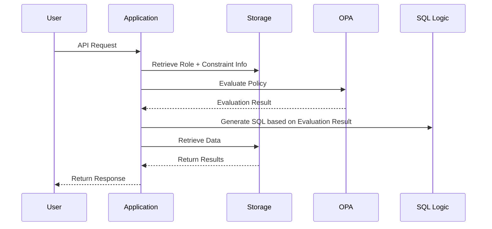
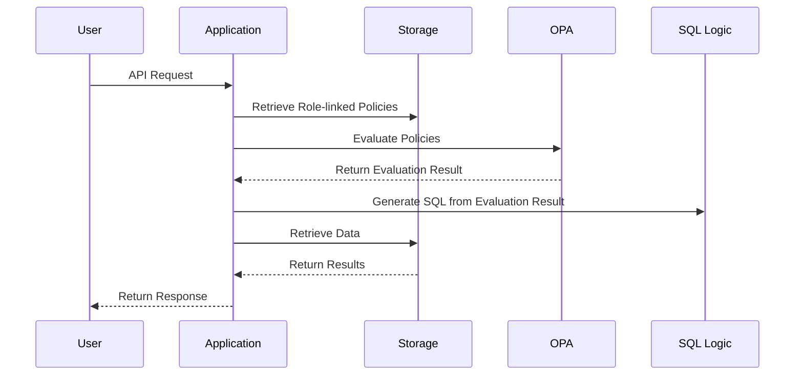

# Overview
Open Policy Agent (OPA) is a powerful mechanism that enables decoupled access control using policies. By writing rules in a declarative language called Rego, applications can leverage policy evaluation in a simple format.

In this article, we will organize representative patterns of access control using OPA, compare their characteristics, suitable use cases, and implementation complexity.

Below is a revised and expanded table based on the four access control approaches you mentioned. The original three categories have been reorganized into four, separating the **SQL Generation Approach** and the **AST Approach**. Additionally, the perspective of responsibility separation has been updated.

# List of Access Control Patterns
| Pattern Name                                | Role of Rego                                | Role of Application                        | Characteristics                                              |
|--------------------------------------------|---------------------------------------------|--------------------------------------------|-------------------------------------------------------------|
| **① Allow/Deny Decision (Naive Approach)** | Evaluates a boolean value for allow/deny    | Controls processing based on the result    | Lightweight and fast evaluation. Faithful to Rego's original model |
| **② SQL Generation Approach**              | Generates complete SQL (template/embedded)  | Executes SQL received from Rego as-is      | Flexible but introduces SQL dependency in Rego. Policies mix with application dependencies |
| **③ Condition Extraction (Structured Conditions) Approach** | Returns filter conditions (structured) for SQL | Generates and executes queries like SQL/ES based on conditions | Clear separation of condition logic and data processing, scalable |
| **④ AST Approach (Partial Evaluation)**    | Returns conditions as an AST                | Converts AST to SQL or uses it for other evaluations | Highly reusable and flexible but complex to implement and understand |

# Responsibility Separation in Each Pattern
| Pattern Name                                | Responsibility of Rego                      | Responsibility of Application              | Balance of Responsibility Separation                         |
|--------------------------------------------|---------------------------------------------|---------------------------------------------|-------------------------------------------------------------|
| **① Allow/Deny Decision (Naive Approach)** | Only determines allow or deny               | Executes processing based on the result     | ✔ Fully separated. Rego only returns "Yes/No"              |
| **② SQL Generation Approach**              | Outputs complete SQL (includes logic + format) | Executes as-is                              | ❌ Mixed responsibilities. Rego requires SQL syntax knowledge |
| **③ Condition Extraction (Structured Conditions) Approach** | Generates allow conditions (e.g., `department_id IN [1,2]`) | Constructs and executes SQL based on conditions | ✔ Clear separation of condition logic and data processing    |
| **④ AST Approach (Partial Evaluation)**    | Returns policy conditions as abstract syntax (AST) | Interprets and converts AST to SQL, etc.    | △ Separated but requires AST understanding and conversion implementation on the application side |

## Notes: Policy Management and Responsibility Attribution
- **Naive or Condition Extraction Types** tend to have abstract Rego content close to business logic, making them **easier for product teams to manage**.
- **SQL Generation or AST Types** involve complex implementation and transformation processes, making **common management by platform teams** more practical.

# Linking User Settings with OPA
In applications requiring dynamic access control*, how user-configured permission information is supplied to OPA becomes a critical design point.

*Defined as dynamic when access control involves both policies and arbitrary configuration information, as opposed to static where policies alone suffice.

OPA is a stateless policy engine, requiring explicit external data supply during evaluation. Below are the main approaches and their characteristics:

## Comparison of Data Supply Approaches
This table compares approaches for supplying data (not evaluation targets but supplementary information for policy evaluation) to OPA.

| Approach                | Feasibility | Advantages                     | Disadvantages                                 |
|-------------------------|-------------|--------------------------------|----------------------------------------------|
| DB Storage → OPA Evaluation | ◎         | Standard, flexible, reusable   | Slightly complex implementation              |
| Static Data Embedded in OPA | △         | Simple implementation          | Maintenance overhead                          |
| External Reference by OPA   | △         | Dynamically retrievable        | Issues with latency and reliability, not recommended for operations |

For use cases requiring dynamic permission settings, the DB storage approach is the most practical for the following reasons:

- Permission settings are configured via UI and may be frequently updated.
- Configuration information often has complex structures, such as roles or departments, requiring persistence.
- Ensures consistency, reusability, and version control across processes.

```
User: Sets access permissions for Department A and Department B
↓ (Save)
DB: Saves to `user_role_policies` table
↓ (At evaluation)
App or PDP: Retrieves settings and passes them as `input.data` to OPA
↓
OPA: Evaluates using Rego rules
```

By clearly separating responsibilities into user settings → DB storage → OPA integration, it is possible to achieve a flexible and maintainable access control design.

# Revisiting Policy Design
While writing this article, I realized that the DB storage → OPA evaluation approach might have inefficiencies.

Separating the stored configuration values and policies in the DB might be unnecessary. If they are combined and maintained as policies, the logic in the access control flow could be simplified.

## Assumptions
- In RBAC, there are roles and constraint information (data stored in the DB representing access control conditions associated with roles).
- Assuming a SQL filtering approach (where OPA returns conditions for SQL generation due to large data volumes).
  - cf. [Considerations on Pagination Impact and Solutions in OPA](https://bmf-tech.com/posts/OPA%E3%81%AB%E3%81%8A%E3%81%91%E3%82%8B%E3%83%9A%E3%83%BC%E3%82%B8%E3%83%8D%E3%83%BC%E3%82%B7%E3%83%A7%E3%83%B3%E3%81%B8%E3%81%AE%E5%BD%B1%E9%9F%BF%E3%81%A8%E8%A7%A3%E6%B1%BA%E7%AD%96%E3%81%AB%E9%96%A2%E3%81%99%E3%82%8B%E6%A4%9C%E8%A8%8E)

### Coexisting Roles + Constraint Information and Policies


- Constraint information is **specific to the application format**, making it unusable as-is in OPA. Constraint information essentially acts as a policy.
- The role of Rego policies is limited (e.g., determining allow/deny or returning data for SQL conditions).
- As constraints increase, the SQL generation logic on the application side becomes bloated and complex.

Since SQL can be generated directly from constraint information, in such cases, OPA may not provide sufficient cost-benefit to justify its added complexity.

### Shifting Constraint Information to Policies for a Pure Role-Policy Relationship


Although the sequence appears similar, the key difference is that policies are extracted as a separate data model from roles, making responsibility separation easier.

In this approach, the application only handles SQL generation logic, while OPA focuses solely on returning conditions for access control. While the SQL filtering approach has slightly higher coupling, it can still leverage OPA's benefits.

# Conclusion
Designing the overall architecture based on the permission model and the policy data model is crucial.

# Miscellaneous
OPA may not be the best fit for access control use cases based on user settings (where user settings are used as input).

The data expected in OPA's input seems to be information about the access control target, rather than rules for access control.

In such an approach, the policy (rego) file and externally stored configuration information become coupled, requiring changes to both the policy and the settings.

Whether this is acceptable depends on the requirements, trade-offs, and what you aim to solve. However, if the optimal use of OPA lies in static access control, this approach may not fully leverage its benefits.

This might be a consideration for policy-based architectures in general.