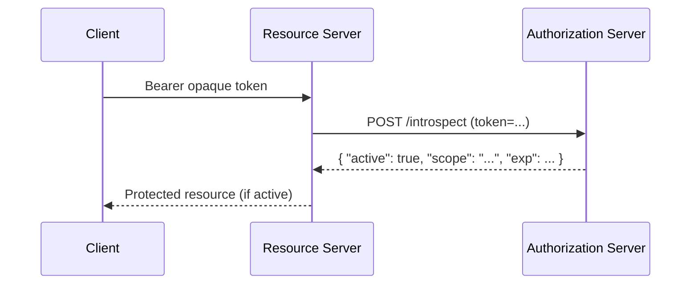
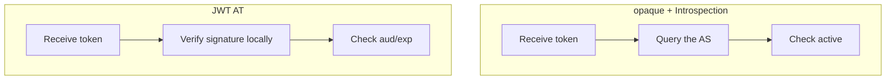

# Overview

How does a resource server that receives an access token judge whether that token is valid? Access tokens come in two broad approaches, and both the validation method and how revocation takes effect differ.

This post compares the validation methods of opaque tokens + Token Introspection (RFC 7662) and JWT access tokens (RFC 9068), and organizes the revocation mechanism via Token Revocation (RFC 7009).

The related RFCs are as follows.

- [RFC 7662 OAuth 2.0 Token Introspection](https://www.rfc-editor.org/rfc/rfc7662)
- [RFC 9068 JSON Web Token (JWT) Profile for OAuth 2.0 Access Tokens](https://www.rfc-editor.org/rfc/rfc9068)
- [RFC 7009 OAuth 2.0 Token Revocation](https://www.rfc-editor.org/rfc/rfc7009)

# Two access token approaches

Access tokens come in two kinds.

- **Opaque token**: an opaque string with no inherent meaning. Validation requires a query to the issuing AS.
- **JWT access token**: a self-contained JWT. If you verify the signature, you can check it locally without querying the AS.

# Opaque + Token Introspection (RFC 7662)

A resource server cannot judge the contents of an opaque token on its own. So it queries the AS's **introspection endpoint** to get the token's state and metadata.



The most important field of the response is `active`; `true` means valid, `false` means invalid. Other fields include `scope`, `sub`, `exp`, `client_id`, and `aud`. The introspection endpoint requires client authentication.

- Advantage: **immediate revocation works**. Because the AS holds the state, once revoked, the next query returns `active: false`.
- Disadvantage: a query to the AS occurs on every request, which can make the AS a bottleneck.

# JWT access token (RFC 9068)

A JWT access token contains the necessary information (sub, scope, exp, aud, etc.) in the token itself. If a resource server verifies the signature, it can check locally without querying the AS.

The main points defined by RFC 9068.

- The header `typ` is **`at+jwt`** (clearly indicating a JWT for an access token). This prevents confusion with JWTs for other purposes, such as ID Tokens.
- Required claims: `iss`, `exp`, `aud`, `sub`, `client_id`, `iat`, `jti`.
- The resource server verifies that `aud` is for itself, that `exp` has not expired, and that the signature is correct.

- Advantage: local validation scales well. You need no query to the AS.
- Disadvantage: **immediate revocation is hard**. Until it expires, you cannot stop the token by itself.

# Comparison of the two approaches



| Aspect | opaque + Introspection | JWT AT |
| --- | --- | --- |
| Validation | Query the AS | Local validation |
| Immediate revocation | Works | Hard (valid until exp) |
| Scalability | The AS can be a bottleneck | Scales well |
| Network load | High (query every time) | Low |

# Token Revocation (RFC 7009)

RFC 7009 defines a **revocation endpoint** for explicitly revoking tokens. Clients revoke tokens on logout, password change, or token leakage.

```
POST /revoke
token=45ghiukldjahdnhzdauz&token_type_hint=refresh_token
```

- For opaque tokens, revocation is immediately reflected in introspection.
- Because JWT access tokens are self-contained, in implementations that pass them through with signature verification alone, revocation does not stop them. So in practice, you combine the following.
  - Make access tokens **short-lived** (a few minutes to about 10 minutes).
  - Check a **blocklist** (holding jti or user ID in Redis, etc. for a short time).

# Summary

- Access tokens come in two approaches, opaque and JWT, with different validation and revocation properties.
- Opaque + Introspection is strong on immediate revocation but requires querying the AS.
- JWT AT scales well with local validation but is weak on immediate revocation; compensate with short lifetimes and blocklists.
- Token Revocation (RFC 7009) is the standard means of revocation; with JWT, combine it with short lifetimes and blocklists.

# References

- [RFC 7662 OAuth 2.0 Token Introspection](https://www.rfc-editor.org/rfc/rfc7662)
- [RFC 9068 JWT Profile for OAuth 2.0 Access Tokens](https://www.rfc-editor.org/rfc/rfc9068)
- [RFC 7009 OAuth 2.0 Token Revocation](https://www.rfc-editor.org/rfc/rfc7009)
