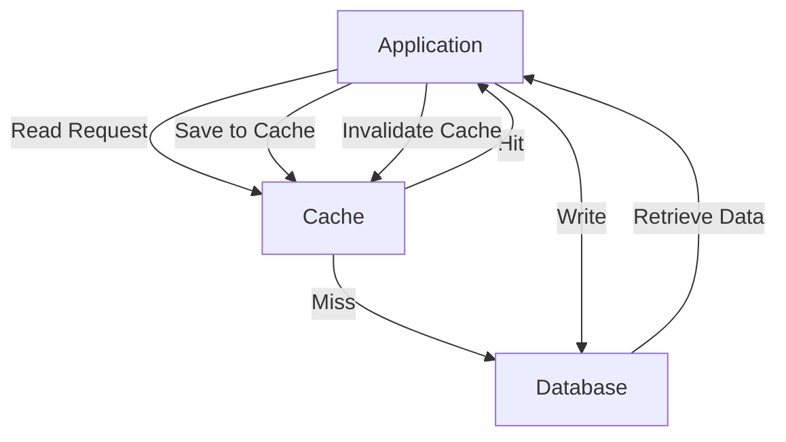
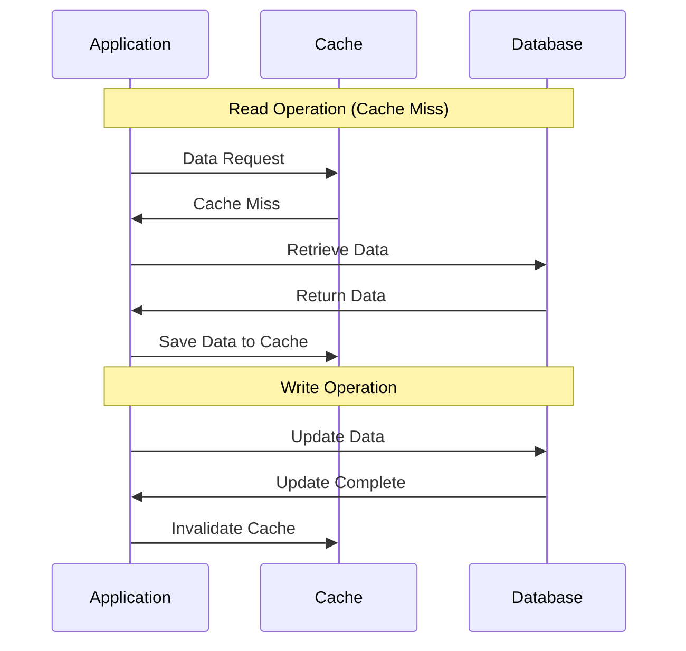
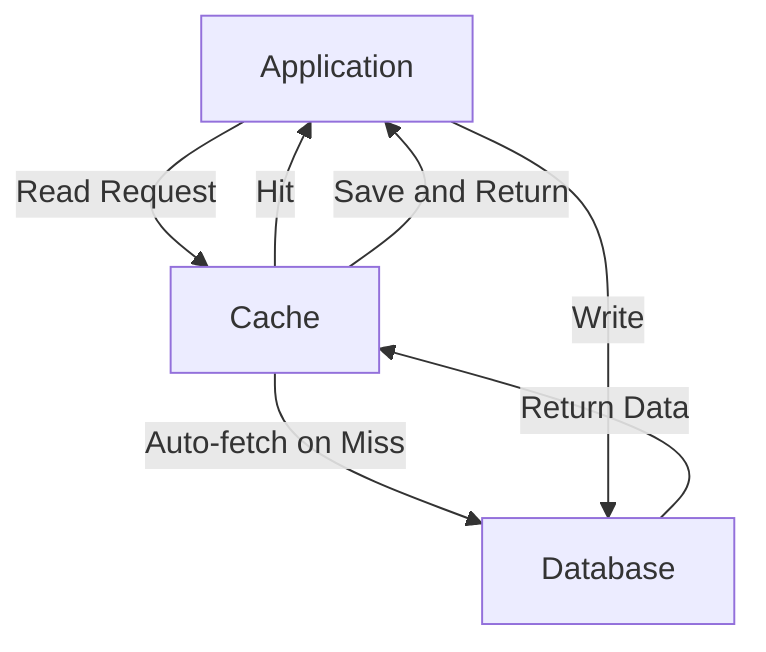
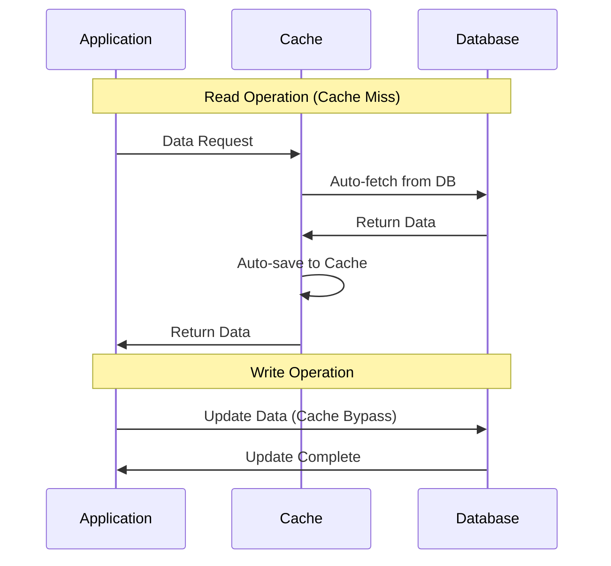
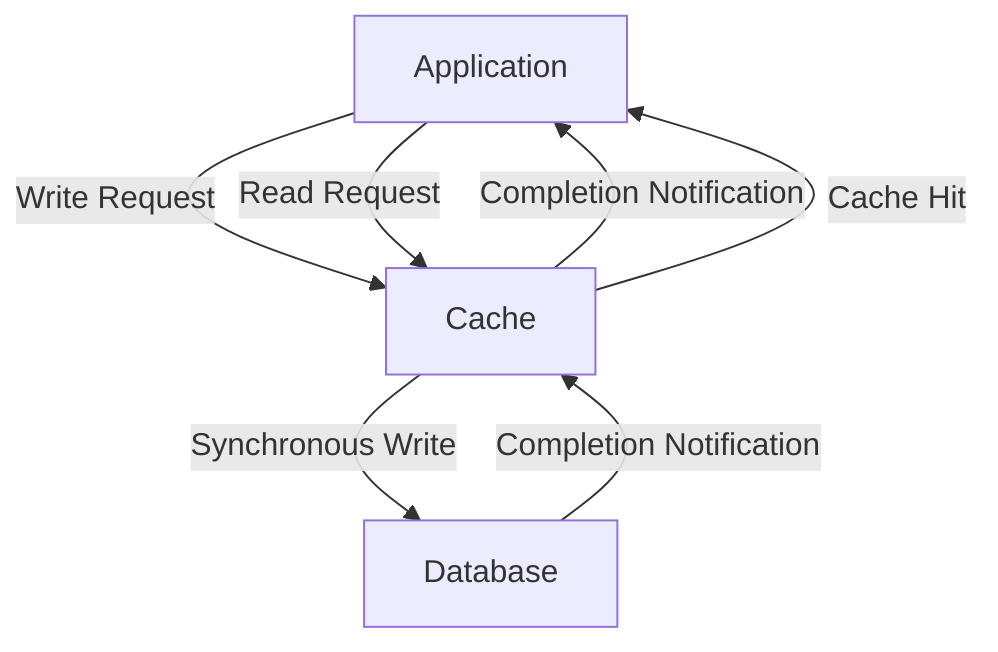
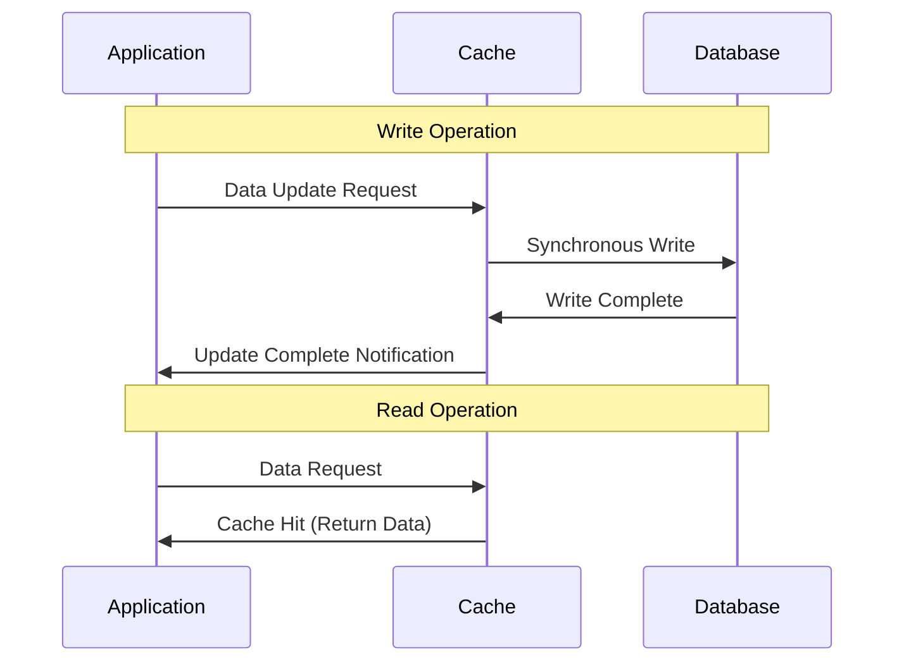
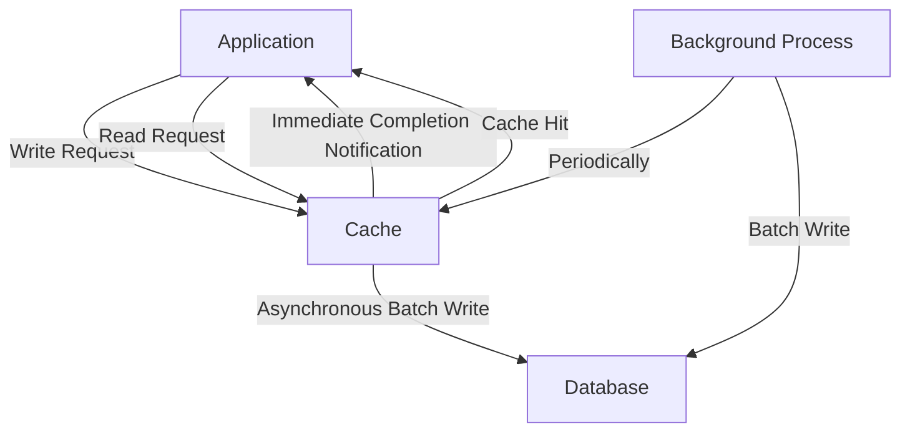
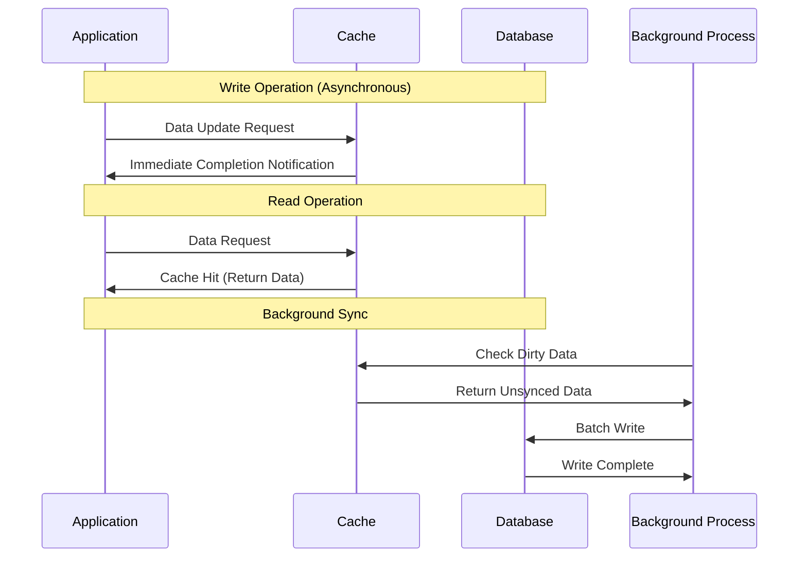
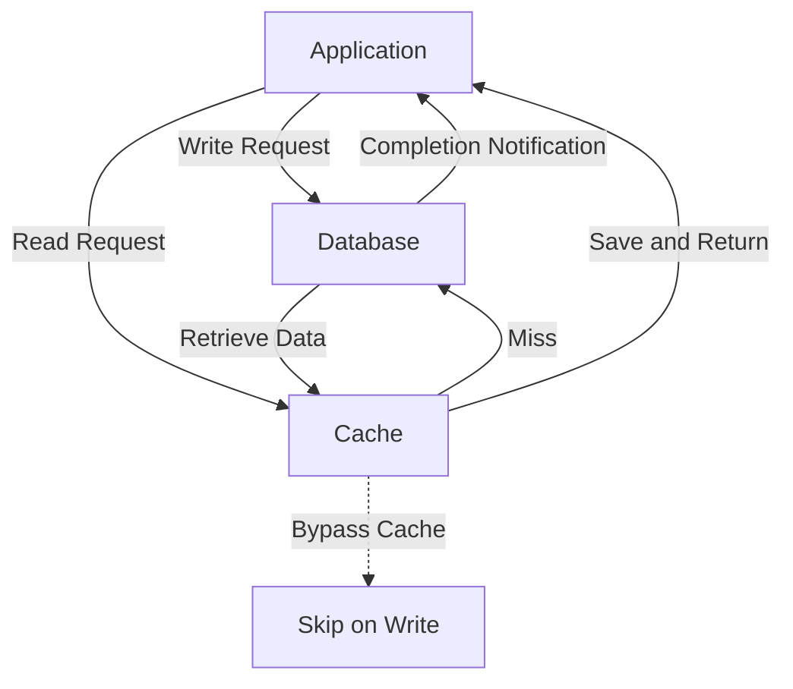
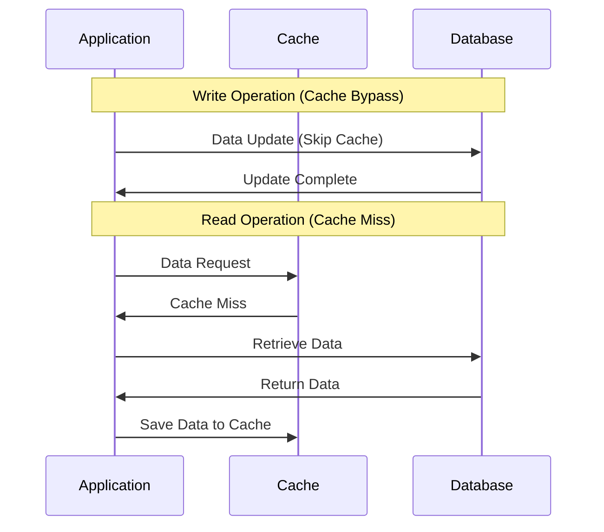

Web applications and distributed systems often rely on caching to enhance performance. This post covers the basic patterns for effective caching.

* Cache Aside
* Read Through
* Write Through
* Write Back
* Write Around

## Cache Aside

### Overview

This pattern involves the application explicitly managing the cache as needed.

### Read Flow

1. Check if data exists in the cache (**Cache Hit**).
2. If not, fetch from the database and save it to the cache (**Cache Miss**).

### Write Flow

1. Update the database.
2. Invalidate or update the cache as needed.

### Characteristics

* Cache management is handled by the application.
* Suitable for data with high read frequency and low update frequency.
* Ensuring consistency between the cache and the database is the application's responsibility.

### Use Cases

* Web applications using Redis, Memcached, etc.

## Read Through

### Overview

In this pattern, the cache automatically handles fetching data from the database during read operations. The application interacts only with the cache, and cache misses are handled transparently.

### Read Flow

1. The application sends a read request to the cache.
2. If the cache hits, it returns the data directly.
3. If the cache misses, the cache fetches the data from the database, saves it, and then returns it to the application.

### Characteristics

* The cache transparently handles database access.
* The application does not need to be aware of the cache.
* Cache miss handling is hidden from the application.
* Writes are typically performed directly to the database.

### Use Cases

* ORM L2 cache, CDN, proxy cache, Hibernate, etc.

## Write Through

### Overview

In this strategy, write operations are first performed on the cache and **simultaneously written to the database**.

### Write Flow

1. Update the cache.
2. Simultaneously reflect the same update in the database.

### Characteristics

* Cache and database always remain consistent.
* Write latency is slightly higher.
* Reads are fast and consistent.

### Use Cases

* User profiles, configuration data, master data where consistency is critical.

## Write Back

### Overview

Write operations are first applied to the cache, and **database writes are performed asynchronously** at a later time.

### Write Flow

1. Write only to the cache (marking it as dirty).
2. Notify the application of immediate completion.
3. Update the database later via batch or event-driven processes.

### Characteristics

* Fast writes (low latency).
* Risk of data loss during crashes.
* Suitable for high-frequency updates (only the final state is written).
* Managing dirty data is crucial.

### Use Cases

* CPU caches, logs, temporary game scores, telemetry data, etc.

## Write Around

### Overview

Write operations **bypass the cache and are written only to the database**.

### Write Flow

1. Bypass the cache and write directly to the database.

### Read Flow

* On a cache miss, fetch the data from the database and save it to the cache.

### Characteristics

* Writes do not pollute the cache (unnecessary data is not cached).
* Cache misses are more likely immediately after a write (data is not in the cache).

### Use Cases

* Access logs, temporary files, backup data (low-frequency access records).

## Comparison Table

| Strategy           | Overview                        | Fast Reads | Fast Writes | Consistency         | Cache Management   |
| ------------------ | ------------------------------ | ---------- | ----------- | ------------------- | ------------------ |
| Cache Aside        | App explicitly manages cache   | ✅          | ⚠️ (manual) | ⚠️ (manual)         | App-managed        |
| Read Through       | Cache transparently fetches DB | ✅          | ⚠️ (direct DB) | ⚠️ (read-only)      | Auto (read)        |
| Write Through      | Simultaneous cache & DB writes | ✅          | ⚠️ (sync wait) | ✅ (always synced)  | Auto               |
| Write Back         | Cache-only writes, async sync  | ✅          | ✅ (async)   | ⚠️ (delayed sync)   | Auto (risky)       |
| Write Around       | Writes bypass cache            | ✅          | ✅ (direct DB) | ⚠️ (read sync only) | Auto               |

## Conclusion

The best strategy depends on your use case and trade-offs:

* **High read frequency with strong consistency** → Write Through
* **Transparent read handling** → Read Through
* **Write performance priority, some data loss acceptable** → Write Back
* **Low-frequency access, cache efficiency** → Write Around
* **Fine-grained control, willing to invest development effort** → Cache Aside

Consider the following factors when choosing:

* **Consistency Requirements**: Is strong consistency necessary?
* **Performance Requirements**: Prioritize read or write performance?
* **Availability Requirements**: Tolerance for data loss risk?
* **Operational Costs**: Complexity of management and development effort?

Effectively leveraging caching strategies can significantly improve application performance and availability. Choosing the right strategy for your project requirements is crucial.