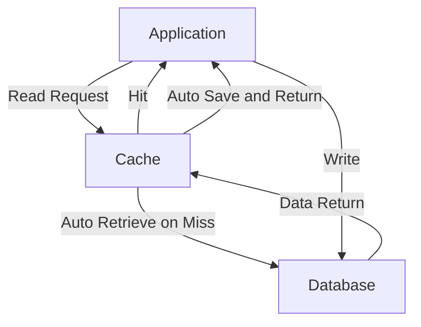
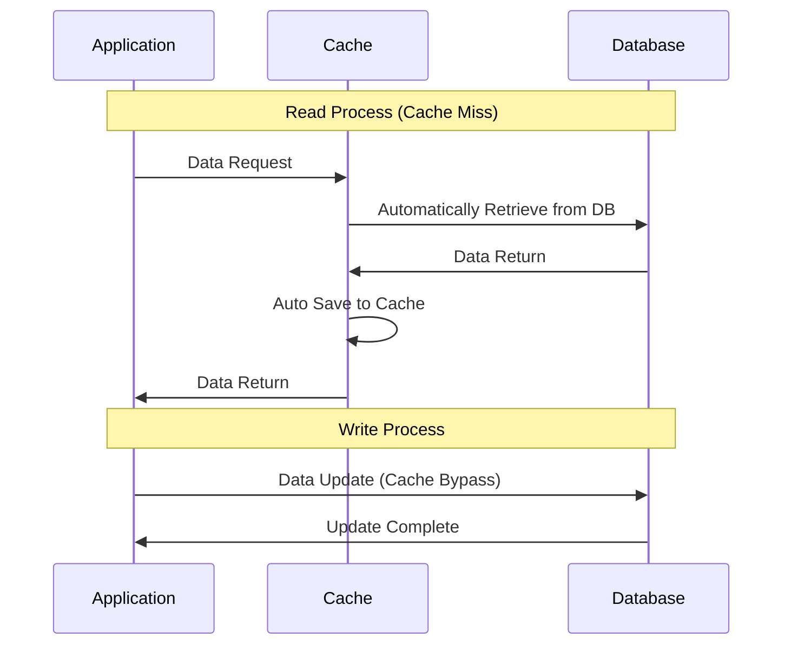
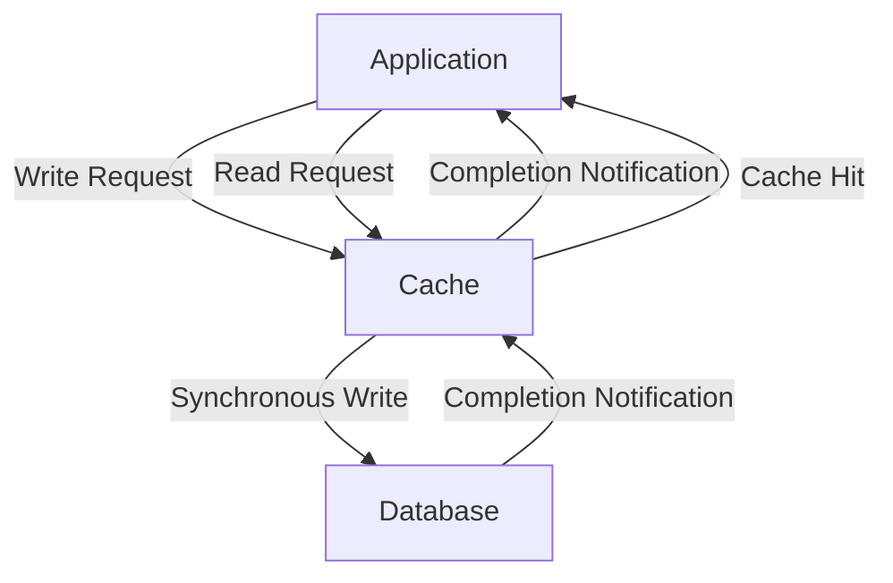
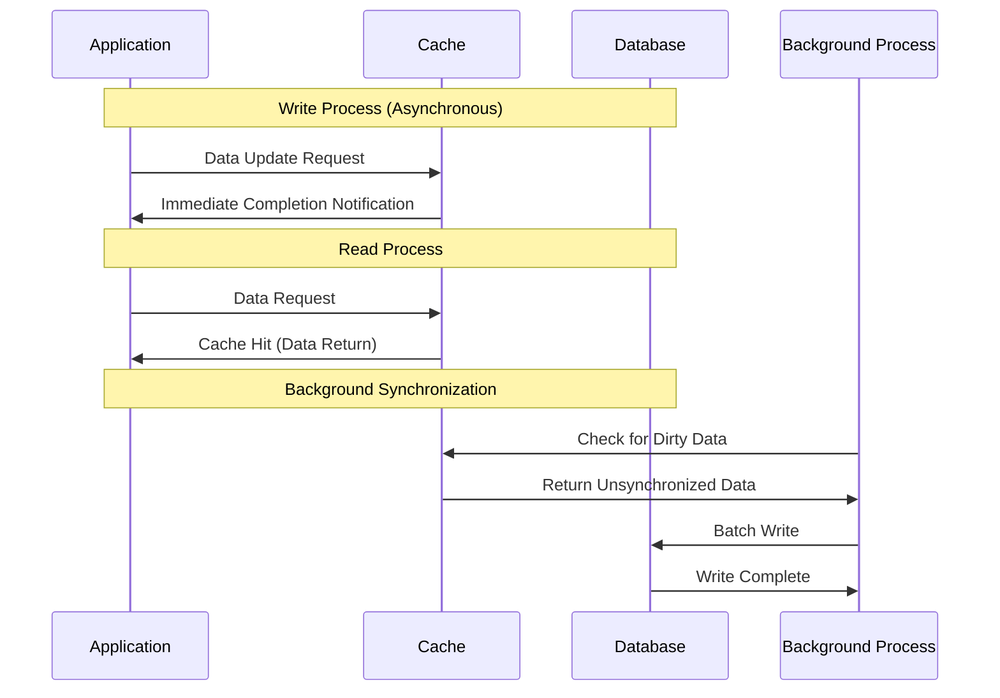
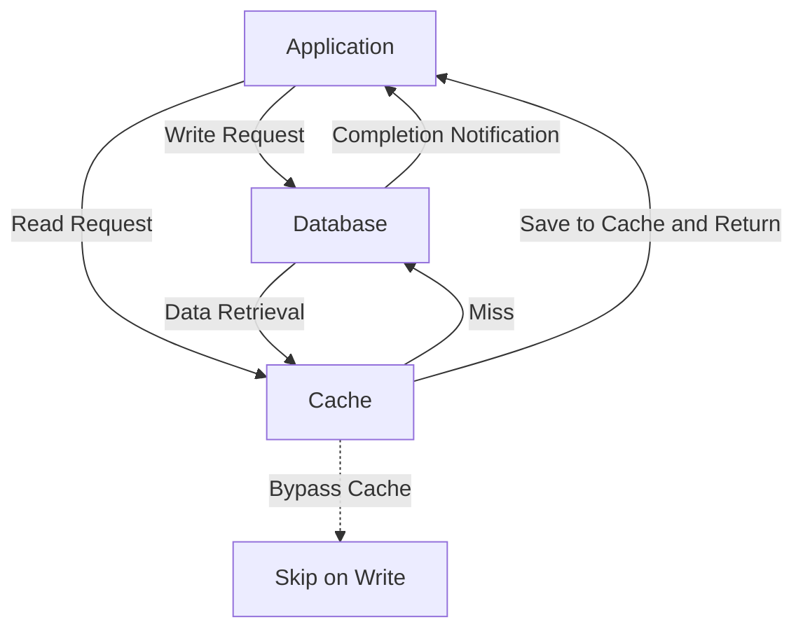
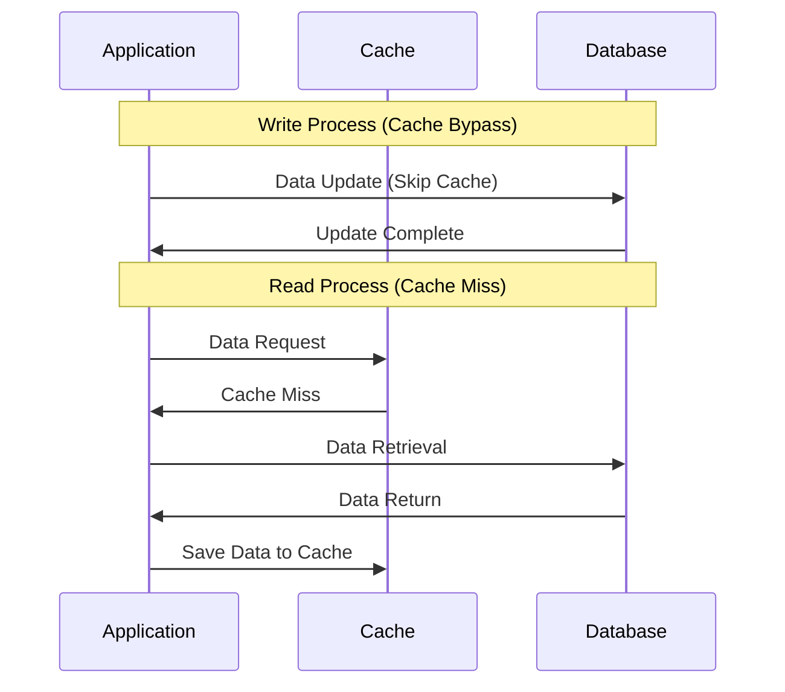

To enhance performance in web applications and distributed systems, it is essential to understand the basic usage patterns of "cache."

* Cache Aside
* Read Through
* Write Through
* Write Back
* Write Around

## Cache Aside

### Overview

This pattern involves the application explicitly managing the cache as needed.

### Read Flow

1. Check if data exists in the cache (**Cache Hit**)
2. If not, retrieve from the DB and save to cache (**Cache Miss**)

### Write Flow

1. Update the database
2. Optionally delete or update the cache

### Features

* Cache management is handled by the application
* Suitable for data with high read frequency and low update frequency
* Cache and DB consistency is the application's responsibility

### Use Cases

* Web applications using Redis, Memcached, etc.

## Read Through

### Overview

In this pattern, the cache automatically handles retrieval from the DB during read operations. The application interacts only with the cache, and processing during cache misses is handled transparently.

### Read Flow

1. The application requests data from the cache
2. If it’s a cache hit, return it directly
3. If it’s a cache miss, the cache retrieves data from the DB and automatically saves it before returning to the application

### Features

* The cache transparently handles DB access
* The application does not need to be aware of the cache's existence
* Processing during cache misses is hidden from the application
* Writes are typically done directly to the DB

### Use Cases

* ORM L2 cache features, CDN, proxy cache, Hibernate, etc.

## Write Through

### Overview

This strategy involves writing operations first to the cache and **simultaneously writing to the DB**.

### Write Flow

1. Update the cache
2. Immediately reflect the same content in the DB

### Features

* Cache and DB maintain consistency
* Write latency is somewhat higher
* Reads are fast and consistent

### Use Cases

* User profiles, configuration information, master data, etc., where consistency is prioritized

## Write Back

### Overview

In this strategy, write operations are reflected only in the cache first, and **writing to the DB is processed asynchronously with a delay**.

### Write Flow

1. Write only to the cache (mark as dirty)
2. Notify the application of completion immediately
3. Later, update the DB in batches or driven by events

### Features

* Fast writes (low latency)
* Risk of data loss in case of a crash
* Suitable for high-frequency updates (consecutive updates to the same key can result in only the final outcome)
* Management of dirty data is crucial

### Use Cases

* CPU cache, logs, temporary game scores, measurement data, etc.

## Write Around

### Overview

This strategy involves writing operations **without reflecting in the cache, writing only to the DB**.

### Write Flow

1. Write directly to the DB, bypassing the cache

### Read Flow

* A cache miss occurs during read → retrieve from DB and save to cache

### Features

* Writes do not pollute the cache (no unnecessary data in the cache)
* Reading immediately after writing is prone to misses (as it does not exist in the cache)

### Use Cases

* Access logs, temporary files, backup data, etc. (records with low-frequency access)

## Comparison Table of Each Pattern

| Strategy            | Overview                          | Fast Read | Fast Write  | Consistency          | Cache Management     |
| ------------------- | --------------------------------- | --------- | ----------- | --------------------- | -------------------- |
| Cache Aside         | Application explicitly manages cache | ◎         | △ (Management needed) | △ (Manual)           | Managed by application |
| Read Through        | Cache transparently retrieves from DB | ◎         | △ (Direct to DB) | △ (Only during read) | Automatic (Read)     |
| Write Through       | Simultaneous write to cache and DB  | ◎         | △ (Same wait) | ◎ (Always synchronized) | Automatic             |
| Write Back          | Write only to cache, sync later    | ◎         | ◎ (Asynchronous) | △ (Delayed sync)     | Automatic (Risky)     |
| Write Around        | Bypass cache during writes          | ◎         | ◎ (Direct to DB) | △ (Consistency during read) | Automatic             |

## Conclusion

Which strategy is best depends on the use case and trade-offs.

* **If reads are primary and consistency is important** → Write Through
* **If transparency in reading is prioritized** → Read Through
* **If write performance is the top priority and some data loss risk is acceptable** → Write Back
* **For low-frequency access and cache efficiency** → Write Around
* **If fine control is needed and development effort can be allocated** → Cache Aside

When making a selection, consider the following factors:

* **Consistency Requirements**: Is strong consistency needed?
* **Performance Requirements**: Which is prioritized, read or write?
* **Availability Requirements**: What is the tolerance for data loss risk?
* **Operational Costs**: Complexity of management and development effort

By effectively utilizing cache strategies, the performance and availability of applications can be significantly improved. It is crucial to choose the one that fits the requirements of each project.