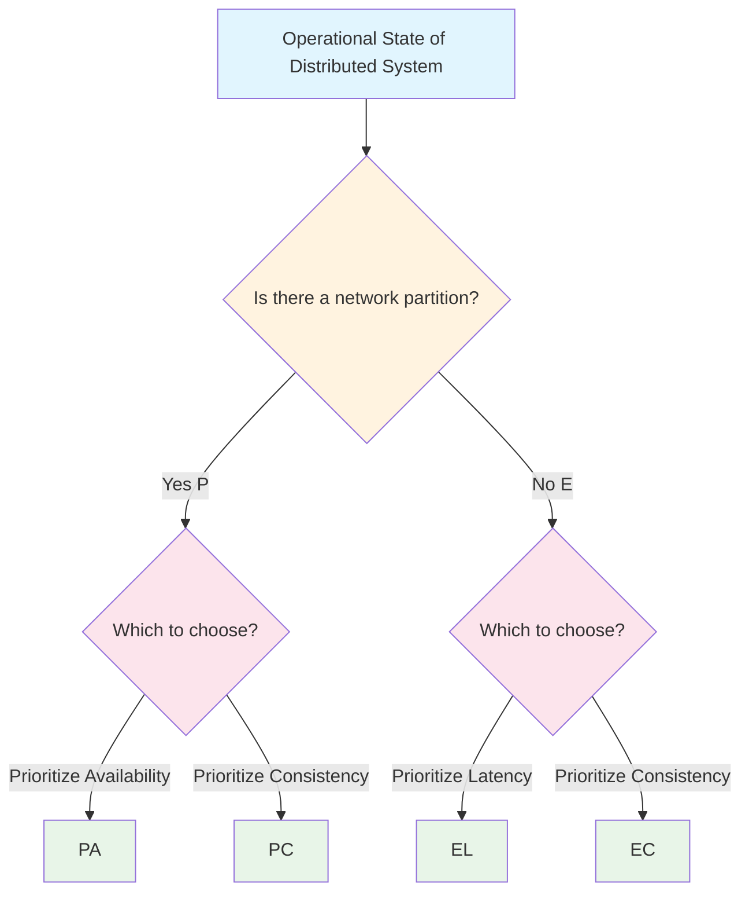

This post discusses the important theories of the CAP theorem and PACELC theorem in distributed systems.

# What is the CAP Theorem

The CAP theorem states that in a distributed system, only **two out of the following three properties** can be achieved simultaneously:

* **Consistency**: All nodes return the same data
* **Availability**: Always returns a response
* **Partition Tolerance**: Continues to operate even if the network is partitioned

Since partition (P) is unavoidable in distributed systems, you are essentially forced to choose between **C or A**.

# Misleading Aspects of the CAP Theorem

The formula of "two out of three" in the CAP theorem is misleading for the following reasons:

1. **Partitions rarely occur**: In a state without partitions, neither C nor A is lost.
2. **Granular choices**: Different choices can be made for different operations or data within the same system.
3. **Degree of properties**: The three attributes are not binary; they exist on a spectrum.

Example:

| System    | Classification | Explanation                       |
|-----------|----------------|----------------------------------|
| Zookeeper | CP             | Maintains consistency at the cost of availability |
| Cassandra | AP             | Sacrifices consistency for high availability |

# What is the PACELC Theorem

The CAP theorem has an important gap: it does not address the trade-offs when **no partition occurs**.

The PACELC theorem was introduced to complement this issue. According to the PACELC theorem, when a partition (P) occurs, the system must trade off between availability (A) and consistency (C). When there is no partition (E), the system must trade off between latency (L) and consistency (C).

In other words, distributed systems face different trade-offs in the following two situations:

* **During Partition**: Choose A or C (same as CAP theorem)
* **When No Partition**: Need to choose L or C

This indicates that even during normal times when no partition occurs, maintaining strong consistency incurs latency due to communication, and if low latency is prioritized, consistency must be relaxed.

**Components of the PACELC Theorem**:
* **P**: When a partition occurs
* **A/C**: Availability or Consistency
* **E**: Otherwise (when there is no partition)
* **L/C**: Latency or Consistency

**Characteristics of Each Classification**:
- **PA Type**: Prioritizes availability during partitions (e.g., Cassandra, DynamoDB)
- **PC Type**: Prioritizes consistency during partitions (e.g., HBase, MongoDB strong consistency mode)
- **EL Type**: Prioritizes low latency during normal times (e.g., caching systems)
- **EC Type**: Prioritizes consistency even during normal times (e.g., Spanner, distributed RDBMS)

This theorem allows designers of distributed systems to clearly organize design decisions for both normal and abnormal situations.

# Conclusion

In designing distributed systems, it is important to consider both the CAP theorem and PACELC theorem. This enables a clear understanding of the trade-offs regarding system availability, consistency, and latency, allowing for appropriate design choices.

# References
- [en.wikipedia.org - CAP theorem](https://en.wikipedia.org/wiki/CAP_theorem)
- [en.wikipedia.org - PACELC design principle](https://en.wikipedia.org/wiki/PACELC_design_principle)
- [www.infoq.com - 12 Years Later CAP Theorem: How the Rules Have Changed](https://www.infoq.com/jp/articles/cap-twelve-years-later-how-the-rules-have-changed/)