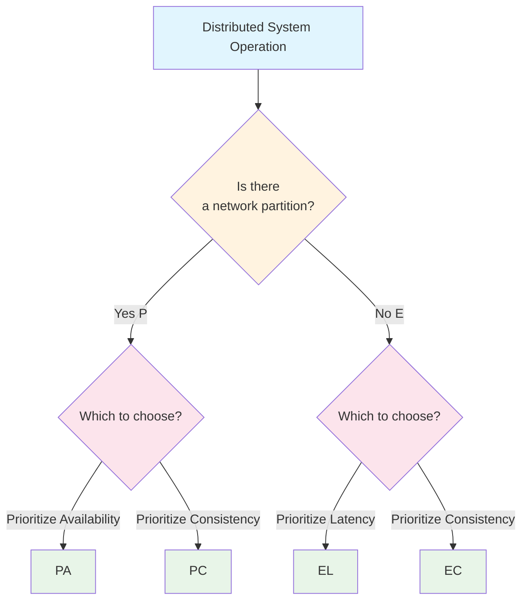

CAP theorem and PACELC theorem are critical theories in distributed systems.

# What is CAP Theorem

CAP theorem states that in a distributed system, it is only possible to achieve **two out of the following three properties simultaneously**:

* **Consistency**: All nodes return the same data
* **Availability**: Always responds to requests
* **Partition Tolerance**: Operates despite network partitions

Since Partition (P) is unavoidable in distributed systems, the practical choice boils down to "**Consistency (C) or Availability (A)**."

# Misleading Aspects of CAP Theorem

The "two out of three" rule in CAP theorem can be misleading for the following reasons:

1. **Partitions are rare**: When there are no partitions, both C and A can be maintained.
2. **Granular choices**: Different operations or data within the same system can make different trade-offs.
3. **Degree matters**: The three attributes are not binary (0 or 1) but exist in degrees.

Example:

| System      | Classification | Explanation                          |
|-------------|----------------|--------------------------------------|
| Zookeeper   | CP             | Sacrifices availability for consistency |
| Cassandra   | AP             | Relaxes consistency to maintain high availability |

# What is PACELC Theorem

CAP theorem has a significant gap: it does not address the **trade-offs when there are no partitions**.

PACELC theorem complements CAP theorem by introducing the idea that when a partition (P) occurs, the system must trade off between availability (A) and consistency (C). When there is no partition (E), the system faces a trade-off between latency (L) and consistency (C).

In other words, distributed systems encounter two distinct trade-offs:

* **During Partition**: Choose between A or C (same as CAP theorem)
* **Without Partition**: Choose between L or C

This highlights that even in normal conditions without partitions, maintaining strong consistency incurs latency due to communication, while prioritizing low latency requires relaxing consistency.

**Components of PACELC Theorem**:
* **P**: When a partition occurs
* **A/C**: Availability or Consistency
* **E**: When there is no partition
* **L/C**: Latency or Consistency

**Characteristics of Each Classification**:
- **PA Type**: Prioritizes availability during partitions (e.g., Cassandra, DynamoDB)
- **PC Type**: Prioritizes consistency during partitions (e.g., HBase, MongoDB in strong consistency mode)
- **EL Type**: Prioritizes low latency during normal conditions (e.g., caching systems)
- **EC Type**: Prioritizes consistency even during normal conditions (e.g., Spanner, distributed RDBMS)

This theorem enables distributed system designers to clearly organize design decisions for both normal and abnormal conditions.

# Summary

When designing distributed systems, it is essential to consider both CAP theorem and PACELC theorem. This allows for a clear understanding of the trade-offs between availability, consistency, and latency, enabling appropriate design choices.

# References
- [en.wikipedia.org - CAP theorem](https://en.wikipedia.org/wiki/CAP_theorem)
- [en.wikipedia.org - PACELC design principle](https://en.wikipedia.org/wiki/PACELC_design_principle)
- [www.infoq.com - CAP theorem 12 years later: How the "rules" have changed](https://www.infoq.com/jp/articles/cap-twelve-years-later-how-the-rules-have-changed/)