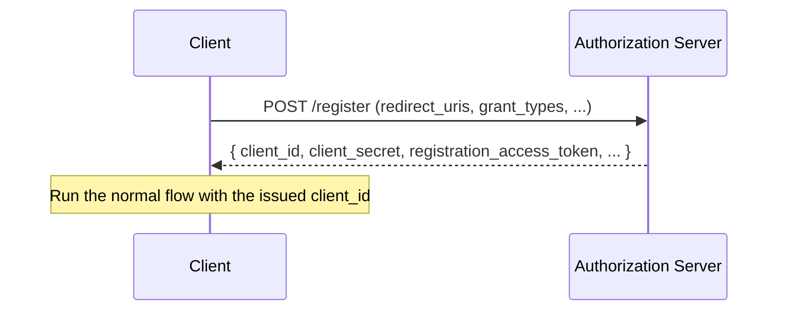

# Overview

An OAuth client is usually registered manually with the authorization server (AS) in advance, and issued a `client_id` and `client_secret`. When a very large number of clients exist, or when clients grow dynamically in a federated environment, manual registration is not practical.

**Dynamic Client Registration (RFC 7591)** and **Dynamic Client Registration Management (RFC 7592)** solve this. This post organizes their mechanisms and security considerations.

The related RFCs are as follows.

- [RFC 7591 OAuth 2.0 Dynamic Client Registration Protocol](https://www.rfc-editor.org/rfc/rfc7591)
- [RFC 7592 OAuth 2.0 Dynamic Client Registration Management Protocol](https://www.rfc-editor.org/rfc/rfc7592)

# Why DCR is needed

- **Many clients**: when many apps are automatically registered as clients in a SaaS or platform.
- **Federation**: when you want to dynamically register clients in an environment that integrates with several ASes.
- **Automation**: when you want to automate manual client management through an API.

# RFC 7591: registration

RFC 7591 defines a mechanism where a client POSTs metadata to the AS's **registration endpoint** to register itself dynamically.

The registration request includes client metadata such as `redirect_uris`, `grant_types`, `token_endpoint_auth_method`, and `client_name`. After validation, the AS issues a `client_id` (and a `client_secret` if needed).

# RFC 7592: management

RFC 7592 is a management protocol for **reading, updating, and deleting** registered clients. It operates using the **registration access token** issued at registration and a client-specific management URL (configuration endpoint).

| Operation | Method |
| --- | --- |
| Read | GET |
| Update | PUT |
| Delete | DELETE |

The registration access token authorizes management operations for that client; if leaked, someone else could rewrite the client configuration, so manage it carefully.

# Security considerations

DCR is convenient, but "anyone can register" can itself be a risk.

- **Open registration**: if anyone can register a client without authentication, attackers can create clients freely. Registration is often restricted with an initial access token.
- **redirect_uri validation**: treating the `redirect_uri` of dynamically registered clients loosely becomes an entry point for token hijacking. Require exact matching (RFC 9700).
- **Relationship to the Mix-Up attack**: an attacker may register a client dynamically at their own AS, gaining a foothold for a Mix-Up attack. Clients that handle several ASes need the `iss` countermeasure (see "[What is OAuth 2.1?](/en/posts/oauth-2-1-security-bcp/)").

# Summary

- DCR is a mechanism for registering and managing clients via an API (RFC 7591 registration / RFC 7592 management).
- It avoids manual registration in environments with many clients or federation.
- Because of the "anyone can register" risk, protect it with initial access tokens and redirect_uri validation.

# References

- [RFC 7591 OAuth 2.0 Dynamic Client Registration Protocol](https://www.rfc-editor.org/rfc/rfc7591)
- [RFC 7592 OAuth 2.0 Dynamic Client Registration Management Protocol](https://www.rfc-editor.org/rfc/rfc7592)
