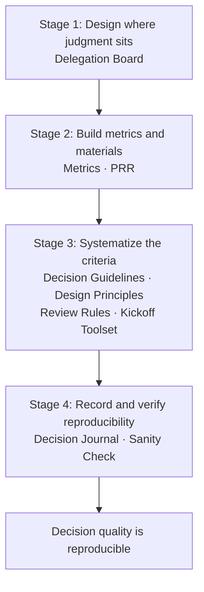

# Introduction

When a team is small, most important decisions happen inside one person's head. But as the team grows and decisions spread out to the field, their quality starts to vary with who decides and in what situation. Before you notice, the bottleneck of the organization has shifted to "judgment" itself.

The measures that line up to address this are management practices: 1on1s, OKRs, review rules, metrics, and so on. Each one supports the quality of decisions, but if you keep adding them one by one, they easily become a loose collection whose aim you can no longer explain.

In this article, I describe a way to design these practices not as a set of individual measures, but as a single system built around "the quality and reproducibility of decisions." I call that system a "deck."

# What to center on: the quality and reproducibility of decisions

To turn something into a system, you need a single axis that runs through the scattered practices. The axis I place here is "the quality and reproducibility of decisions."

High quality alone leaves a decision closed inside one person. If the criteria are not put into words, delegation becomes "throwing it over the wall," and in the end you review everything yourself. That is exactly why I pair quality with "reproducibility."

The state to aim for is "the quality of decisions is reproducible." Even when the person or the situation changes, the quality stays above a certain bar, and you can explain the decision. Once this axis is in place, many management practices line up as "parts for the quality and reproducibility of decisions."

# The "deck" metaphor

After laying the practices side by side, the framing that clicked for me was a "deck." Like a deck in a card game, you hold a bundle of the types (cards) you need, and you draw and play them as the situation calls for.

The important point is that a deck is not a "loose collection." A deck has an intent, and the cards mesh with one another. When you start a new project, instead of designing measures from scratch, you can begin by drawing the cards you need from this deck. I design management as that kind of reusable bundle of types.

# Four stages centered on judgment

The cards in the deck connect through four stages centered on "judgment." The further the stages advance, the more judgment moves away from a specific individual and toward a state the team can explain and reproduce. Each card (practice) also has its own purpose: it serves the deck's aim while, on its own, solving a single problem.

As a concrete example, I list the cards of the deck I actually run, stage by stage. That said, these are only examples; no fixed set of cards exists. You decide which cards to hold, in which stage, and how many, to fit the state of the team—and as the team changes, you reshuffle the deck.

1. **Design where judgment sits**: clarify who owns which decision, and agree on the scope of delegation. For example, a "Delegation Board" makes visible on a single sheet which decisions you delegate and how far.
2. **Build the metrics and materials for judgment**: make it possible to decide based on metrics and materials rather than gut feel. "Metrics" for platform development, and a "PRR (Production Readiness Review)" that surfaces the points to check before going to production, belong here.
3. **Systematize the decision criteria**: turn the criteria into types so anyone can judge and design in the same way. Decision Guidelines that define "how we decide," Design Principles that define "what good design is," the shaping of Review Rules that mechanically determine the weight of a review, a project kickoff toolset, and so on line up here.
4. **Record and verify reproducibility**: record the decisions you make in a "Decision Journal," and verify—through a sanity check of architectural understanding—whether "the team can explain and judge even without me."

Laying them out by stage also reveals the dependencies between cards. For example, design principles only function once the metrics and materials that support them are in place, and you can reuse a decision you made only after you record it in the decision journal. Each earlier stage supports the next.

# Building it isn't enough

This is the most important point: no practice works just because you built it. If guidelines and checks merely sit there, no one reads them. For them to turn into outcomes, there are conditions.

- **It keeps being operated**: if updating, recording, and running it stop, it quickly becomes a hollow formality.
- **It is actually used (adoption)**: it works only when people reference it in the moments of judgment and review. If people forget, make it "work mechanically through a mechanism," like lint, CI, or AI review.
- **It works together with other practices**: an abstract criterion becomes usable only as a set with another practice that gives it concreteness.
- **It is shared and agreed within the team**: a type that lives inside one person's head produces no reproducibility.

More often than not, checking whether the existing cards meet their "conditions to work" has a bigger effect than adding more cards.

# Who it helps, and how it connects to business value

Who does it help, and with what? I break the answer into three layers.

- **The individual**: with something to anchor a decision, even less-experienced members can decide without going far off. Because they can trace past decisions and their reasons, newer members ramp up faster.
- **The team**: "only-that-person-knows" decisions decrease, and the range of what you can delegate naturally widens. Judgment and knowledge do not stay in one person's memory; they accumulate on the team's side.
- **The organization**: you can measure what went well and carry it forward. Instead of thinking from a blank slate every time you start up, you can begin on top of the types you already have.

And these values ultimately convert into business value. The higher the quality and reproducibility of decisions, the more the team can scale without dropping quality as it grows, and the lower the risk of decision-making. Investment in the reproducibility of decisions turns into the speed and safety of the business. The reason you can explain management practices as an "investment" rather than a "cost" is that this connection exists.

# Types don't rob individuality

Finally, let me touch on the most easily misunderstood point. When I say I turn judgment into types, some people brace themselves: "won't that rob members of their individuality and constrain how they think?" In fact, the opposite holds.

A type is a mechanism for abstracting each person's strengths and expertise and returning them to a single persona called the team. It takes a good way of judging that someone holds and, rather than leaving it theirs alone, makes it a shared asset of the team. If you see it as a device that converts individuality into "the team's strength" rather than erasing it, your resistance to standardization should change quite a bit.

# Summary

- Don't let management practices become a loose collection of "seems good." Design them as a single system (a deck) around the quality and reproducibility of decisions.
- Practices connect to judgment through four stages: where it sits → materials → mechanism → verification.
- No practice works just because you built it. It becomes an outcome only after it meets the conditions of operation, adoption, interlock, and agreement.
- The value to the individual, the team, and the organization ultimately converts into the speed and safety of the business.
- Types don't rob individuality. They return each person's strengths to a single persona called the team.

The system is still something I am growing while running it. Even so, I believe that simply switching my mindset from "adding practices" to "designing a system" gradually raises the resolution of my management.
