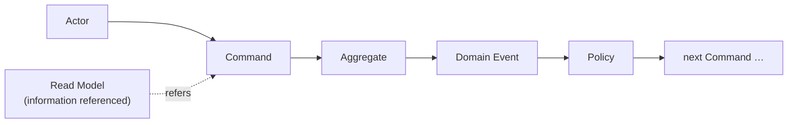
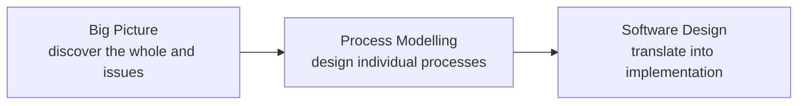
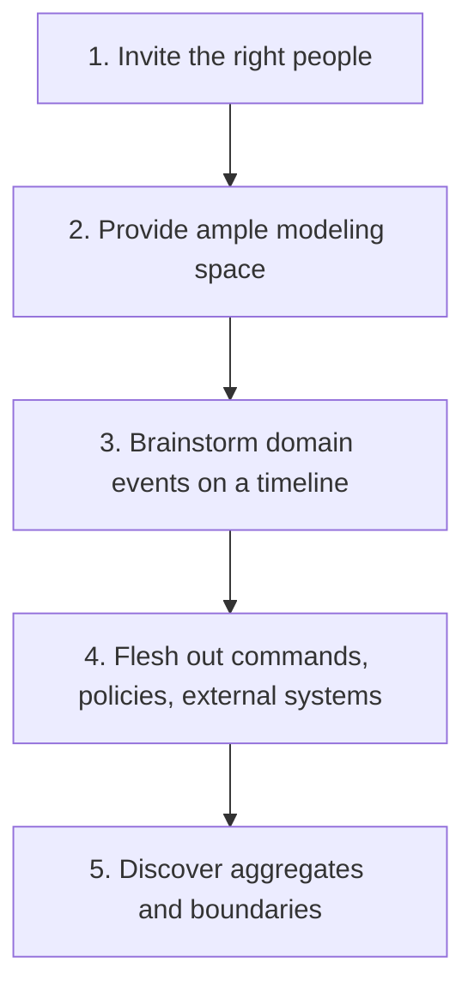

# Overview

In software development, knowledge of the business is often concentrated in a few people.

Developers understand the code and data structures, but they rarely grasp the fine-grained flow of day-to-day operations. Business people know the operations well, but they cannot tell how those map onto the system.

If we keep designing in this state, gaps in understanding surface later and become a source of rework and defects.

One technique to dissolve this "split in business knowledge" is **EventStorming**.

In this article, I will organize what EventStorming is, what elements it is built from, and how to run it, in a way that is understandable to non-developers as well.

# What Is EventStorming

EventStorming is a **workshop-style modeling technique that visualizes the flow of a business using sticky notes and a wall**.

It was created in 2012 by Alberto Brandolini in the context of domain-driven design (DDD). Note that the official spelling is a single word: "EventStorming".

Its characteristics are as follows.

* It runs with no computer—just a large wall, a roll of paper, and color-coded sticky notes
* It brings developers and business people (domain experts) into the same room
* It requires no strict notation like UML, so anyone can take part

The important point is that EventStorming is **not a technique for producing a design document itself**.

Its goal is for stakeholders to discover the flow of the business and align their understanding while working together hands-on. More than leaving behind a clean diagram, the value lies in the shared understanding built in the participants' minds during the process.

# Why Focus on "Events"

EventStorming starts from **domain events**.

A domain event is **something that actually happened in the business—a fact**. Examples include "an order was placed", "stock was allocated", and "a payment was completed". They are always written in the **past tense**.

Why start from events? Because events **tend to become a shared language across departments and roles**.

For example, the fact "an order was placed" can be shared as "something that happened" regardless of whether you are in sales, the warehouse, or accounting. By contrast, if a conversation starts from table structures or class designs, business people find it hard to join in.

By starting from the universally understandable unit of "a fact that happened", people with different backgrounds can discuss things on a level playing field.

# Core Building Blocks (Sticky Note Colors)

In EventStorming, you place sticky notes of different colors for each kind of element. The colors vary slightly between practitioners, but the common ones are as follows.

| Color | Element | Meaning |
| --- | --- | --- |
| Orange | Domain Event | A fact that happened in the business (past tense). e.g. an order was placed |
| Blue | Command | The action or decision that triggers an event. e.g. place an order |
| Yellow (small) | Actor | The person who executes a command. e.g. customer, staff |
| Yellow (large) | Aggregate | A cluster of related data that takes a command and produces events. e.g. Order |
| Purple | Policy | A reaction rule of the form "whenever X happens, do Y" |
| Green | Read Model | Information or a screen referenced to make a decision |
| Pink | External System | A third-party service such as a payment gateway or shipping company |
| Red | Hotspot | A question, conflict, or unresolved point |

These connect roughly along the following flow.

In other words, you visualize the chain of cause and effect—"someone (Actor) performs an action (Command), and as a result a fact happens (Domain Event); that fact triggers the next move (Policy)"—as a sequence of sticky notes.

The red **Hotspot** is especially important. By posting points raised during discussion—"we are not sure how this part works" or "different departments interpret this differently"—and not erasing them on the spot, you make the **gaps in understanding and the issues within the organization visible**.

# Three Levels (Formats)

EventStorming uses different levels of detail depending on the purpose. The three representative ones are as follows.

| Format | Purpose | Main elements |
| --- | --- | --- |
| Big Picture | Get a bird's-eye view of the whole business across departments and discover issues and inconsistencies | Domain Events, Hotspots |
| Process Modelling | Design and improve an individual business process | Commands, Policies, Read Models, External Systems |
| Software Design | Design event-driven software in detail | Aggregates, aggregate boundaries |

It is common to raise the resolution step by step: first grasp the overall picture and issues with the **Big Picture**, then refine individual flows with **Process Modelling**, and finally translate them into implementation with **Software Design**.

# How to Run a Session

The basic flow is as follows.

### 1. Invite the Right People

You could say the success of EventStorming is decided by the participants.

You need both **the people who ask questions** (often developers) and **the people who have the answers** (domain experts and product owners who know the business). With only one side, you cannot depict the reality of the business correctly.

### 2. Provide Ample Modeling Space

Prepare a long wall and a roll of paper so you can keep adding sticky notes. If you run out of space midway, it limits ideas, so the more space the better. For remote sessions, use an online whiteboard such as Miro.

### 3. Brainstorm Domain Events on a Timeline

First, write the events that occur in the business on orange sticky notes, **in the past tense**. At the start, produce quantity without worrying about order, then rearrange them along the timeline afterward.

### 4. Flesh Out Commands, Policies, and External Systems

For the events lined up, add "what triggered this event (Command)", "who performs it (Actor)", "what always happens after this event (Policy)", and "which external service is involved".

### 5. Discover Aggregates and Boundaries

Finally, find the **aggregates** from clusters of commands and events, and draw boundaries around clusters of related elements. This leads to the discovery of bounded contexts described below.

# Connection to Domain-Driven Design

EventStorming pairs especially well with domain-driven design (DDD).

* **Discovering bounded contexts**: As you observe clusters of sticky notes, boundaries—"beyond here is a different business area"—emerge naturally
* **Building a ubiquitous language**: Through discussion, words that meant different things to different people get organized, and a shared team vocabulary grows
* **A gateway to event-driven architecture**: Because you design starting from domain events, it extends naturally into event-driven and microservice design

For bounded contexts, see also the separate article "[Bounded Contexts](/en/posts/bounded-context-explanation/)".

# Pitfalls

It is a useful technique, but there are a few caveats.

* **Without the right people, the value fades**: If those who know the business are absent, the model becomes one built on guesswork alone
* **The completeness of the diagram is not the goal**: The essence is the shared understanding built in the participants' minds during the process. Do not make producing a clean artifact an end in itself
* **Big Picture is best done in person**: Broad exploration is hard to run online, and in-person sessions are considered more effective

# Summary

* EventStorming is a workshop-style modeling technique that visualizes the flow of a business using sticky notes and a wall
* By starting from domain events—"facts that happened in the business"—people with different backgrounds can discuss things on a level playing field
* You arrange color-coded sticky notes such as domain events, commands, aggregates, and policies, and visualize them as a chain of cause and effect
* You use the three levels—Big Picture, Process Modelling, and Software Design—depending on the purpose
* The essence is not the diagram itself but the shared understanding built during the process

# References

* [EventStorming official site](https://www.eventstorming.com/)
* [Learning Domain-Driven Design](https://www.oreilly.com/library/view/learning-domain-driven-design/9781098100124/) by Vlad Khononov (O'Reilly)

