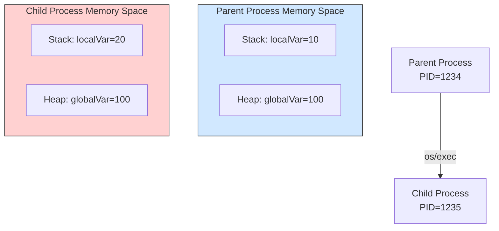
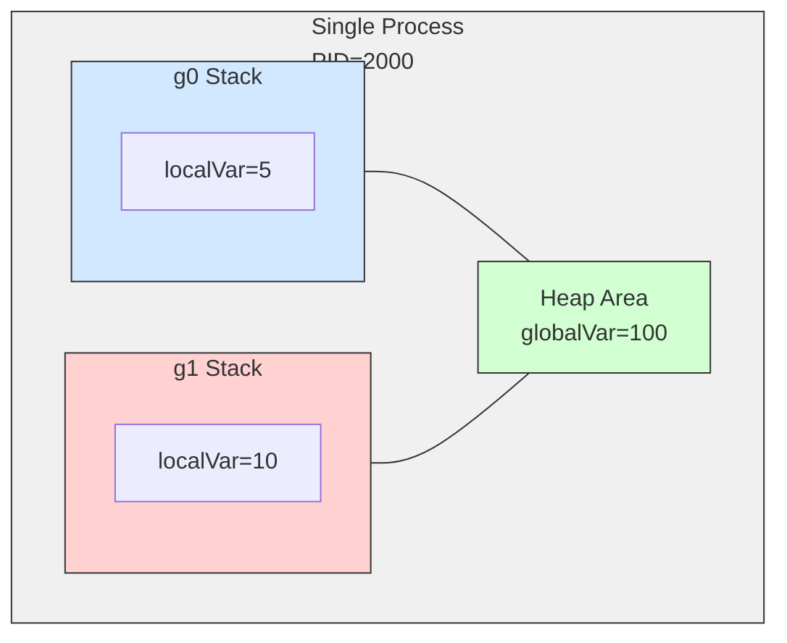

# 

# Overview

Using Go to lightly observe process address spaces, goroutine behavior, stack, and heap.

# Checking Differences Between Child Processes and Address Spaces

In Go, new processes are typically launched using the `os/exec` package. Internally, `os/exec` performs operations equivalent to `fork()` + `exec()` on Unix-like OSes to execute a new program (in this example, itself).

Display the addresses of the same variables in parent and child processes to confirm the independence of memory spaces.

```go
package main

import (
	"fmt"
	"os"
	"os/exec"
)

var globalVar = 100

func main() {
	localVar := 10
	fmt.Printf("Parent: PID=%d, globalVar=%p, localVar=%p\n",
		os.Getpid(), &globalVar, &localVar)

	cmd := exec.Command(os.Args[0], "child")
	cmd.Stdout = os.Stdout
	cmd.Run()
}

func init() {
	if len(os.Args) > 1 && os.Args[1] == "child" {
		localVar := 20
		fmt.Printf("Child: PID=%d, globalVar=%p, localVar=%p\n",
			os.Getpid(), &globalVar, &localVar)
		os.Exit(0)
	}
}
```

```sh
Parent: PID=15224, globalVar=0x100720448, localVar=0x14000102020
Child: PID=15225, globalVar=0x10502c448, localVar=0x14000090020
```

## Meaning of Execution Results

* **Process Isolation**: Different PIDs are displayed for parent and child.
* **Address Space Independence**:

  * Both the global variable `globalVar` and the local variable `localVar` show different addresses in parent and child.
  * This is because Unix-like OSes allocate independent **virtual address spaces** for each process. Although the numbers may appear similar, they are completely separate in physical memory.

## Diagram of Memory Spaces Between Processes



# Observing Goroutines and Memory Sharing

Using Go's lightweight threads, **goroutines**, to observe memory. Since goroutines operate within the same process, they share the virtual address space. To confirm this, display the addresses of global and local variables across multiple goroutines.

```go
package main

import (
	"fmt"
	"os"
	"runtime"
	"sync"
	"time"
)

var globalVar = 100

func worker(id int, wg *sync.WaitGroup) {
	defer wg.Done()

	localVar := id * 10
	fmt.Printf("Goroutine %d: PID=%d, globalVar=%p (value=%d), localVar=%p (value=%d)\n",
		id, os.Getpid(), &globalVar, globalVar, &localVar, localVar)

	// Intentionally cause a data race by modifying the global variable
	globalVar += id
	time.Sleep(100 * time.Millisecond)
}

func main() {
	localVar := 5
	fmt.Printf("Main: PID=%d, globalVar=%p (value=%d), localVar=%p (value=%d)\n",
		os.Getpid(), &globalVar, globalVar, &localVar, localVar)
	fmt.Printf("Number of goroutines: %d\n", runtime.NumGoroutine())

	var wg sync.WaitGroup
	for i := 1; i <= 3; i++ {
		wg.Add(1)
		go worker(i, &wg)
	}

	wg.Wait()
	fmt.Printf("Final globalVar value: %d\n", globalVar)
	fmt.Printf("Number of goroutines: %d\n", runtime.NumGoroutine())
}
```

```sh
Main: PID=19628, globalVar=0x1031503c8 (value=100), localVar=0x14000104020 (value=5)
Number of goroutines: 1
Goroutine 3: PID=19628, globalVar=0x1031503c8 (value=100), localVar=0x14000104050 (value=30)
Goroutine 1: PID=19628, globalVar=0x1031503c8 (value=100), localVar=0x14000180000 (value=10)
Goroutine 2: PID=19628, globalVar=0x1031503c8 (value=103), localVar=0x14000096000 (value=20)
Final globalVar value: 106
Number of goroutines: 1
```

## Analysis

1. **Same PID**
   All goroutines operate within the same process, so the PID is identical.
2. **Global Variable Sharing**
   The address of `globalVar` is the same across all goroutines.
3. **Local Variable Independence**
   Each goroutine has an independent **stack**, but in this example, the address of `localVar` is obtained and passed to `fmt.Printf`, causing it to escape to the heap. Even so, each goroutine is allocated a separate memory region, maintaining independence.
4. **Data Race**
   The value of `globalVar` becoming 106 is coincidental; the result varies depending on execution timing. To safely perform concurrent processing, synchronization mechanisms like channels or mutexes are required.
   → Use `go run -race` to detect race conditions.

## Diagram of Memory Sharing Between Goroutines



# Safe Concurrent Processing Using Goroutines and Channels

Using channels allows data exchange without directly updating shared variables.

```go
package main

import (
	"fmt"
	"time"
)

var globalVar = 100

func worker(id int, ch chan<- string) {
	localVar := id
	ch <- fmt.Sprintf("Goroutine %d: globalVar=%p, localVar=%p", id, &globalVar, &localVar)
}

func main() {
	ch := make(chan string)
	for i := 0; i < 3; i++ {
		go worker(i, ch)
	}

	for i := 0; i < 3; i++ {
		fmt.Println(<-ch)
	}
	time.Sleep(100 * time.Millisecond)
}
```

# Heap Area and Garbage Collection

In Go, dynamic memory is often placed in the heap, but the placement can be confirmed via **escape analysis**.

```go
package main

import "fmt"

func main() {
	heapSlice := make([]int, 3)
	heapSlice[0] = 42
	fmt.Printf("heapSlice addr: %p\n", &heapSlice[0])
}
```

```sh
heapSlice addr: 0x140000ac030
```

* The heap area is managed by GC, and explicit deallocation is unnecessary.

# Differences Between Stack and Heap

| Item          | Stack                            | Heap              |
| ------------- | -------------------------------- | ----------------- |
| Management    | Automatically allocated/released with function calls | Managed by GC     |
| Independence  | Independent per goroutine        | Shared across the process |
| Speed         | Fast                             | Relatively slower |
| Placement     | Non-escaping variables           | Escaping variables |

# Summary

1. **Process Independence**
   Child processes have separate virtual address spaces from parent processes, and variables are not shared.
2. **Goroutine Memory Sharing**
   Goroutines operate within the same process, sharing global variables but maintaining independent stacks.
3. **Memory Management Characteristics**
   Go automatically allocates stack and heap using escape analysis, and manages the heap with GC.