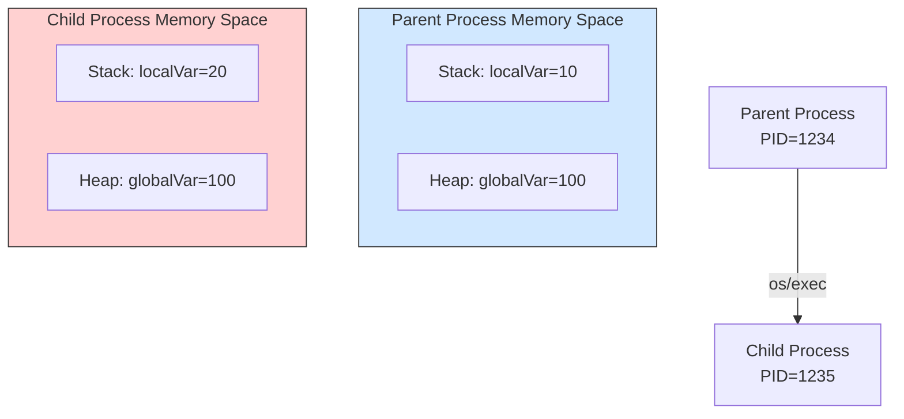
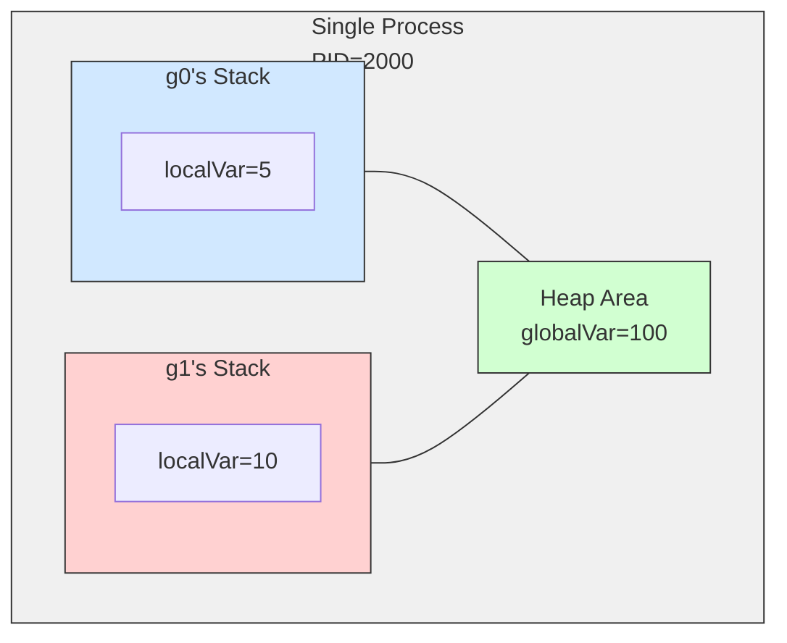

# 

# Overview

Using Go, we will take a light look at the address space of processes, the behavior of goroutines, and the stack and heap.

# Confirming the Difference Between Child Processes and Address Space

In Go, the standard `os/exec` package is used to start new processes. `os/exec` internally performs operations equivalent to `fork()` + `exec()` on Unix-like OSs to execute a new program (in this example, itself).

We will display the addresses of the same variable in the parent and child processes to confirm the independence of memory space.

```go
package main

import (
	"fmt"
	"os"
	"os/exec"
)

var globalVar = 100

func main() {
	localVar := 10
	fmt.Printf("Parent: PID=%d, globalVar=%p, localVar=%p\n",
		os.Getpid(), &globalVar, &localVar)

	cmd := exec.Command(os.Args[0], "child")
	cmd.Stdout = os.Stdout
	cmd.Run()
}

func init() {
	if len(os.Args) > 1 && os.Args[1] == "child" {
		localVar := 20
		fmt.Printf("Child: PID=%d, globalVar=%p, localVar=%p\n",
			os.Getpid(), &globalVar, &localVar)
		os.Exit(0)
	}
}
```

```sh
Parent: PID=15224, globalVar=0x100720448, localVar=0x14000102020
Child: PID=15225, globalVar=0x10502c448, localVar=0x14000090020
```

## Meaning of the Execution Results

* **Process Isolation**: Different PIDs are displayed for parent and child.
* **Independence of Address Space**:

  * Both the global variable `globalVar` and the local variable `localVar` show different addresses in parent and child.
  * This is because Unix-like OSs allocate independent **virtual address spaces** for each process. Even if the numbers appear similar, they are completely separate in physical memory.

## Diagram of Memory Space Between Processes



# Observing Goroutines and Memory Sharing

We will use Go's lightweight threads, **goroutines**, to observe memory. Since goroutines operate within the same process, they share the virtual address space. To confirm this, we will display the addresses of global and local variables across multiple goroutines.

```go
package main

import (
	"fmt"
	"os"
	"runtime"
	"sync"
	"time"
)

var globalVar = 100

func worker(id int, wg *sync.WaitGroup) {
	defer wg.Done()

	localVar := id * 10
	fmt.Printf("Goroutine %d: PID=%d, globalVar=%p (value=%d), localVar=%p (value=%d)\n",
		id, os.Getpid(), &globalVar, globalVar, &localVar, localVar)

	// Modify global variable (intentionally causing data race)
	// Multiple goroutines access the same variable without synchronization → race condition
	globalVar += id
	time.Sleep(100 * time.Millisecond)
}

func main() {
	localVar := 5
	fmt.Printf("Main: PID=%d, globalVar=%p (value=%d), localVar=%p (value=%d)\n",
		os.Getpid(), &globalVar, globalVar, &localVar, localVar)
	fmt.Printf("Number of goroutines: %d\n", runtime.NumGoroutine())

	var wg sync.WaitGroup
	for i := 1; i <= 3; i++ {
		wg.Add(1)
		go worker(i, &wg)
	}

	wg.Wait()
	fmt.Printf("Final globalVar value: %d\n", globalVar)
	fmt.Printf("Number of goroutines: %d\n", runtime.NumGoroutine())
}
```

```sh
Main: PID=19628, globalVar=0x1031503c8 (value=100), localVar=0x14000104020 (value=5)
Number of goroutines: 1
Goroutine 3: PID=19628, globalVar=0x1031503c8 (value=100), localVar=0x14000104050 (value=30)
Goroutine 1: PID=19628, globalVar=0x1031503c8 (value=100), localVar=0x14000180000 (value=10)
Goroutine 2: PID=19628, globalVar=0x1031503c8 (value=103), localVar=0x14000096000 (value=20)
Final globalVar value: 106
Number of goroutines: 1
```

## Analysis

1. **Same PID**
   All goroutines operate within the same process, so the PID is the same.
2. **Shared Global Variable**
   The address of `globalVar` is the same across all goroutines.
3. **Independence of Local Variables**
   Each goroutine has its own independent **stack**, but in this example, the address of `localVar` is obtained and passed to `fmt.Printf`, causing it to be allocated on the heap due to escape analysis. Still, it is placed in different memory areas for each goroutine, maintaining independence.
4. **Data Race**
   The value of `globalVar` being 106 is coincidental, and the result may vary depending on execution timing. To safely perform concurrent processing, synchronization mechanisms like channels or mutexes are necessary. → Detect races with `go run -race`.

## Diagram of Memory Sharing Between Goroutines



# Safe Concurrent Processing with Goroutines and Channels

Using channels allows data to be exchanged without directly updating shared variables.

```go
package main

import (
	"fmt"
	"time"
)

var globalVar = 100

func worker(id int, ch chan<- string) {
	localVar := id
	ch <- fmt.Sprintf("Goroutine %d: globalVar=%p, localVar=%p", id, &globalVar, &localVar)
}

func main() {
	ch := make(chan string)
	for i := 0; i < 3; i++ {
		go worker(i, ch)
	}

	for i := 0; i < 3; i++ {
		fmt.Println(<-ch)
	}
	time.Sleep(100 * time.Millisecond)
}
```

# Heap Area and Garbage Collection

In Go, dynamic memory is often placed in the heap, but the allocation destination can be confirmed with **escape analysis**.

```go
package main

import "fmt"

func main() {
	heapSlice := make([]int, 3)
	heapSlice[0] = 42
	fmt.Printf("heapSlice addr: %p\n", &heapSlice[0])
}
```

```sh
heapSlice addr: 0x140000ac030
```

* The heap area is managed by GC, and there is no need to explicitly free it.

# Differences Between Stack and Heap

| Item          | Stack                             | Heap                |
|---------------|----------------------------------|---------------------|
| Management    | Automatically allocated and freed with function calls | Managed by GC       |
| Area Independence | Independent for each goroutine | Shared across the process |
| Speed         | Fast                             | Relatively slower    |
| Allocation Condition | Variables that do not escape | Variables that escape |

# Summary

1. **Process Independence**
   Child processes have separate virtual address spaces from parent processes, and variables are not shared.
2. **Memory Sharing in Goroutines**
   They operate within the same process and share global variables, but stacks are independent.
3. **Memory Management Characteristics**
   Go automatically allocates between stack and heap via escape analysis and manages the heap with GC.