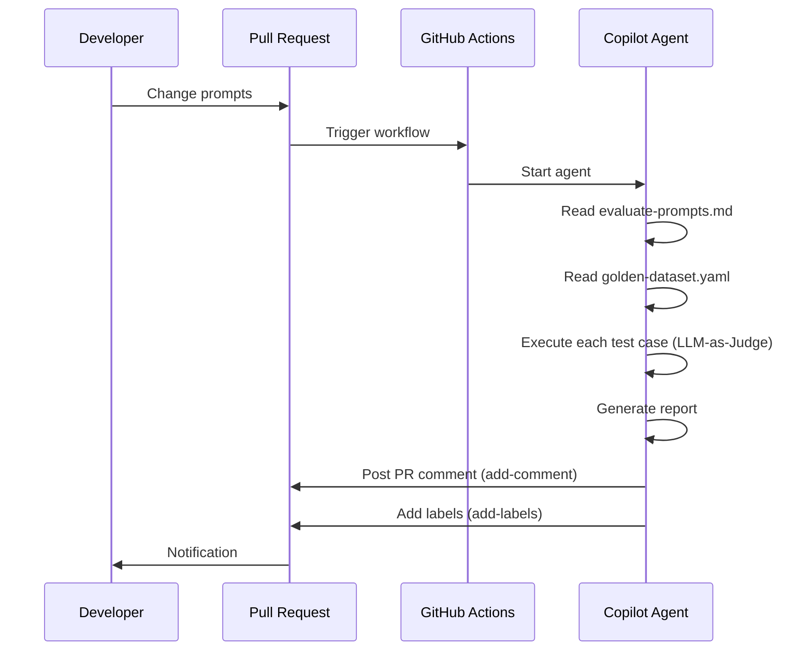

As the development of incorporating LLMs into products increases, there are more instances where prompts are integrated into the software engineering process. Driven by the need to "continuously manage prompt quality" and "optimize the management and evaluation of prompts," we explored a mechanism to handle prompts with processes equivalent to code.

In this article, we introduce the architecture and implementation of a prompt management and evaluation platform using **GitHub Agentic Workflows (gh-aw)**.

## What is GitHub Agentic Workflows

[GitHub Agentic Workflows](https://github.github.com/gh-aw/) is a system where **natural language instructions** written in `.github/workflows/*.md` are interpreted and executed by GitHub Copilot, Claude by Anthropic, OpenAI Codex, and others.

It is easier to understand when compared to traditional GitHub Actions (defining procedures in YAML).

**Traditional GitHub Actions:**

```yaml
- name: Run tests
  run: pytest tests/
```

**GitHub Agentic Workflows:**

```markdown
---
on:
  pull_request:
permissions:
  contents: read
engine: copilot
---

## Step 1: Run Tests
1. Run all Python tests in the tests/ directory
2. Summarize the results in a report format
3. Comment on the PR if there are any failed tests
```

In the YAML front matter, you declare triggers, permissions, and allowed operations (Safe Outputs), and below that, you write natural language instructions in Markdown. The Copilot agent reads and executes this instruction.

The `.md` file is compiled into a `.lock.yml` (an actual executable GitHub Actions YAML file) using the `gh aw compile` command.

## Architecture Overview

The directory structure is as follows.

```
.
├── .github/
│   └── workflows/
│       ├── evaluate-prompts.md        # Instructions for Copilot agent (written by humans)
│       └── evaluate-prompts.lock.yml  # Compiled workflow (auto-generated)
├── prompts/                            # Prompts to be evaluated
│   └── code-review.md
│
└── tests/
    └── golden-dataset.yaml            # Evaluation criteria dataset
```

## Implementation of Each Component

### 1. Prompt Files (`prompts/`)

Prompts are managed in Markdown files.

```markdown
# Code Review Prompt

You are an experienced software engineer.
Please review the submitted code from the following perspectives.

### Review Perspectives
1. **Accuracy**: Are there any bugs in the logic?
2. **Readability**: Are the naming and structure clear?
3. **Security**: Are there any security concerns?
...
```

### 2. Golden Dataset (`tests/golden-dataset.yaml`)

The core of the evaluation is the **Golden Dataset**. It defines the evaluation criteria as "For this input, this quality of output is expected."

```yaml
test_cases:
  - id: "code-review-001"
    category: "code_review"
    description: "Can it correctly review code containing bugs?"
    input:
      user_message: "Please review the following code."
      context: |
        def divide(a, b):
            return a / b
    expected_output:
      criteria:
        - name: "Problem Identification"
          description: "Can it point out the division by zero issue?"
          weight: 0.4
        - name: "Improvement Proposal"
          description: "Can it suggest an appropriate fix?"
          weight: 0.4
        - name: "Clarity of Explanation"
          description: "Can it explain the issues clearly?"
          weight: 0.2
```

Each test case defines **evaluation criteria and weights**. This clarifies the judgment axis when the LLM evaluates the output (LLM-as-Judge).

### 3. Instruction Workflow (`evaluate-prompts.md`)

The orchestration of the evaluation is defined in natural language instructions. The structure consists of five steps.

```markdown
---
on:
  pull_request:
    paths:
      - 'prompts/**'

safe-outputs:
  add-comment:
    target: triggering
  add-labels:
    allowed: [needs-improvement, prompt-evaluation]

engine: copilot
---

### Step 1: Identify Changed Prompt Files
1. Identify files changed in the Pull Request:
   gh pr view ${{ github.event.pull_request.number }} --json files \
     --jq '.files[].path' | grep '^prompts/.*\.md$'

### Step 2: Load Golden Dataset
1. Load tests/golden-dataset.yaml
2. Check the structure of each test case

### Step 3: Evaluate Prompts
For each test case:
- Use the prompt content as a system prompt
- Generate output and score each criterion from 1-5

### Step 4: Generate Evaluation Report
Generate a report in Markdown format

### Step 5: Output Results
- Post as a comment on the PR (add-comment)
- If the score is below 3.0, add the needs-improvement label
```

The `safe-outputs` settings restrict the agent's operations to "posting comments on PRs" and "adding specific labels" only. Direct code changes or pushes to the main branch are not allowed.

## Evaluation Flow

The flow from creating a PR to receiving feedback is shown.



The evaluation report is posted as a Markdown comment on the PR. If the score is below 3.0/5.0, a `needs-improvement` label is automatically added.

## Security Design

The permission settings are designed to be minimal.

```yaml
permissions:
  contents: read  # Read-only access to the repository
```

Posting comments on PRs and adding labels are done via `safe-outputs`, so `pull-requests: write` is not needed. The design prevents the agent from rewriting code or pushing branches even if it malfunctions.

## Application: Extending to Other AI Assets

This design is centered on the idea of "handling prompts with the same quality management process as code." The same mechanism can be applied to various AI assets.

| Target                               | Items to Place in `prompts/`         | Example Evaluation Criteria     |
| ---------------------------------- | ------------------------------------- | ----------------------------- |
| General AI Prompts                   | system prompt, few-shot examples      | Output quality, constraint adherence |
| Claude skills/tools                | tool's `description`, `input_schema` | Correct tool selection        |
| MCP server descriptions            | tool/resource description            | Correct interpretation and invocation by LLM |
| RAG query templates                | Query generation prompts             | Search accuracy and recall    |
| Chatbot system prompts             | system prompt                         | Persona and constraint adherence |

The file format and evaluation logic for the evaluation target can be flexibly adjusted by changing the natural language instructions in `evaluate-prompts.md`.

## Conclusion

By using GitHub Agentic Workflows, you can achieve a Continuous AI workflow where "prompts can be reviewed in a PR and merged if they pass automated tests," all with natural language instructions and without writing a single line of YAML.

As prompt engineering becomes an organizational activity, the importance of such quality management platforms will increase. The architecture introduced here is just one example, but it has the potential to be applied to the quality management of various AI assets by leveraging the flexibility of GitHub Agentic Workflows.