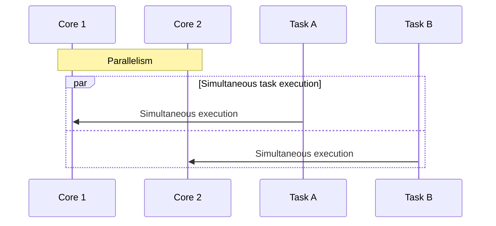

# Overview
Go language strongly supports concurrency through lightweight goroutines and runtime mechanisms. Since Go 1.5, `GOMAXPROCS` is set to the number of available CPU cores by default, enabling parallel execution by properly configuring it. This article organizes the relationship between goroutine scheduling, multi-core utilization in CPU-bound processing, and the relationship between OS processes, threads, and goroutines.

# Difference Between Concurrency and Parallelism
In Go, you can mainly implement concurrency directly, handling multiple tasks overlapped using goroutines. True parallelism requires an execution environment with multiple CPU cores and setting `GOMAXPROCS` to 2 or more.

## Concurrency from a Time Axis Perspective
This represents how tasks are executed overlapped by dividing time on a single core. The actual scheduler switches at preemption points or I/O completion notifications, so the switching timing is not strictly deterministic, but goroutines dynamically switch while waiting for I/O or runtime preemption.


- Multiple processes start simultaneously but are actually executed by switching on a single core by dividing time.
- Goroutines are switched to another goroutine efficiently handling multiple tasks due to I/O waiting or preemption.

## Parallelism from a Time Axis Perspective
This shows tasks being physically executed simultaneously on multiple cores. This is possible when the execution environment has multiple cores and `GOMAXPROCS` is set to 2 or more.



- Multiple goroutines are executed simultaneously on different cores, speeding up CPU-bound processing.
- Write concurrent processing in the code, and parallel execution occurs when environmental requirements are met.

# What is a Goroutine?
- **Lightweight Execution Unit**: Starts with a smaller initial stack (a few KB) than a regular OS thread, expanding and contracting as needed. Even if generated in large numbers, the overhead is small.
- **How to Generate**:

  ```go
  go func() {
      // Processing to be executed concurrently
  }()
  ```

  The return value cannot be obtained directly, and communication uses channels or synchronization primitives.
- **Runtime Control**: The Go runtime scheduler is responsible for execution timing and assignment to OS threads.

# M-P-G Model (Machine, Processor, Goroutine)
Core concepts of the Go runtime:

- **G (goroutine)**: Lightweight thread created by the user. Holds function call history, stack, and scheduling state.
- **M (Machine / OS thread)**: Thread that actually runs on the OS. Executes goroutines on the CPU.
- **P (Processor / Virtual Processor)**: Execution context within the Go runtime. Manages runnable queues and other resources for executing goroutines, with M retrieving and executing G through P.
  - The number of P determines the maximum number of goroutines that can be executed concurrently, configurable with `runtime.GOMAXPROCS` (usually the same as the number of CPU cores).

## Flow of G → P → M
1. When a goroutine is created, it is registered in the local queue of P or the global queue.
2. An idle M retrieves P and takes out a goroutine from the queue to execute.
3. After completion or interruption due to I/O waiting or preemption, another runnable goroutine is executed similarly.

Goroutines are generated, interrupted, and resumed lightly, achieving high concurrency and parallelism. However, generating a large number may cause scheduling overhead or stack growth costs, so appropriate granularity design and profiling verification are important.

# Deep Dive into the M-P-G Model and Reference Articles
- [Ardan Labs: Scheduling in Go (Part 1)](https://www.ardanlabs.com/blog/2018/08/scheduling-in-go-part1.html)
- [Ardan Labs: Scheduling in Go (Part 2)](https://www.ardanlabs.com/blog/2018/08/scheduling-in-go-part2.html)
- [Illustrated Tales of Go Runtime Scheduler - Medium](https://medium.com/@ankur_anand/illustrated-tales-of-go-runtime-scheduler-74809ef6d19b)

Refer to these for a deeper understanding, using diagrams and specific code examples.

## GOMAXPROCS and Parallel Execution
- Set the number of P with `runtime.GOMAXPROCS(n)`. Since Go 1.5, the number of available CPU cores is set by default, but in earlier versions, the default was 1. It can also be explicitly set with the environment variable `GOMAXPROCS`, affecting the behavior of OS thread usage.
- When the number of P is 1, only one goroutine can be executed concurrently. Setting the number of P to 2 or more allows goroutines to be executed simultaneously on multiple OS threads, parallelizing CPU-bound processing on multi-core.
- In most cases, the default setting is sufficient, but adjust as needed considering GC and I/O characteristics.

## Details of Scheduling
### Runnable Queue and Work Stealing
- Each P has a local runnable queue, registering new goroutines or those stolen from other P.
- When the local queue is empty, goroutines are stolen from other P's queues for load balancing.
- The global queue is also used as needed to manage the rapidly increasing goroutines.

### Preemptive Scheduling
- Since Go 1.14, preemption is applied to goroutines that occupy the CPU for a long time. Interrupts occur after function calls or at loop checkpoints, switching to other goroutines.
- Prevents starvation by specific goroutines, improving overall responsiveness and throughput.

### Behavior During Blocking Operations
- When a goroutine blocks on channel operations or mutex waiting, it waits on P. In the case of network I/O, it is handled by asynchronous polling with Go runtime's netpoller, avoiding long-term blocking of OS threads. Understanding the blocking behavior of system calls and platform-dependent implementation differences is beneficial by referring to actual code examples and diagrams.
- When M blocks on a system call, the runtime dedicates that M, generating a new M or using an idle M to continue executing goroutines on other P.
- Network I/O is processed asynchronously with netpoller, returning the goroutine to the runnable queue upon completion.

### System Call and Thread Management
- When a goroutine blocks on a system call, M is dedicated, and the remaining P→M path progresses other goroutines. M is generated and reused minimally.

## Stack Management and Memory Efficiency
- Goroutines start with a small initial stack and automatically expand and contract as needed. Even if generated in large numbers, memory consumption is kept low while maintaining high concurrency. However, deep recursion or large arrays as local variables can cause significant stack growth, leading to relocation costs.
  - Example: In functions with deep recursive calls, stack size increases, and relocation frequency rises, so consider replacing recursion with loops or moving arrays to the heap (using slices, allocating large buffers outside functions, etc.).
  - Profiling and tracing to confirm stack growth behavior and implement appropriate design and implementation are desirable.
- Functions with deep recursion or large local variables should be cautious of stack relocation costs.

## CPU-Bound Processing and Parallel Utilization
- Divide CPU-bound processing into multiple goroutines and set `GOMAXPROCS` appropriately, allowing the Go runtime to execute in parallel on multiple OS threads, utilizing multi-core.
- Consider the overhead of division and result combination, synchronization costs, and design with appropriate granularity.
- Example:

  ```go
  runtime.GOMAXPROCS(4)
  var wg sync.WaitGroup
  for i := 0; i < 4; i++ {
      wg.Add(1)
      go func(id int) {
          defer wg.Done()
          heavyComputation(id)
      }(i)
  }
  wg.Wait()
  ```

## Affinity with I/O-Bound Processing
- The Go runtime has built-in asynchronous network I/O polling (netpoller), allowing other goroutines to be executed even while waiting for I/O. Due to platform-specific implementation differences and system call behavior, understanding the mechanism of netpoller and OS-dependent processing is important, along with confirming behavior and profiling in the actual environment. It is easy to achieve high throughput in servers handling many simultaneous connections, but understanding implementation details allows for more optimal design.

## Scheduler Tuning
- **GOMAXPROCS**: Default setting (number of cores) is basic. Adjust only for special requirements.
- **Goroutine Granularity**: Excessively fine generation increases overhead. Design concurrent tasks with appropriate units.
- **Understanding Blocking**: Understand the impact of long CPU usage or large system calls and verify performance.
- **Profiling**: Analyze CPU profiles and scheduling wait times with `go tool pprof` to identify bottlenecks.
- **Synchronization Methods**: Use channels and mutexes appropriately to avoid unnecessary contention and deadlocks.
- **Runtime Logs**: Log scheduler behavior with `GODEBUG=schedtrace=1000,scheddetail=1` and observe behavior during load testing.

## Preemption Mechanism (Go 1.14 and Later)
- Since Go 1.14, preemptive scheduling works on goroutines with long CPU occupation. Interrupts occur after function calls or at loop checkpoints, switching to other goroutines. However, preemption points are inserted at timings according to the Go runtime implementation and situation, so it does not guarantee strict real-time performance. For example, inserting checkpoints periodically in a long loop, the concept is as follows.

```go
func busyLoop() {
    for i := 0; i < 1e9; i++ {
        // Calculation processing in the loop
        _ = i * i
        // The Go runtime may insert a preemption point around here, allowing other goroutines to execute
    }
}
```

Actual preemption is done automatically within the runtime, and there is no need to describe it explicitly, but understanding that loops and function calls can be safe points makes it easier to maintain concurrency even in processes that occupy the CPU for a long time.

## Relationship Between OS Processes, Threads, and Goroutines
- **OS Process**: Execution unit of a program. A Go program usually starts as one OS process.
- **OS Thread (M)**: Entity running on the CPU. Managed by the Go runtime, generating multiple threads to execute goroutines.
- **Goroutine (G)**: Lightweight user-level thread. Does not directly occupy OS threads, executed through M-P-G by the Go runtime scheduler.
- **P (Virtual Processor)**: Execution context of the Go runtime. Manages goroutines in a runnable state, with M retrieving and executing G through P. The number of P (`GOMAXPROCS`) determines the number of goroutines that can be executed concurrently.

```
[OS Process]
    ├─ Go runtime starts → Generates and manages multiple OS threads (M)
    ├─ Prepares multiple P within the Go runtime (GOMAXPROCS)
    └─ Goroutines (G) are generated at the user level and placed in the runnable queue of P
       └─ An idle M retrieves P and takes out G from the queue to execute
```

Understanding the mechanism that achieves high concurrency and parallelism simultaneously, and using benchmarks and profiling to optimize performance.

## Conclusion
The Go runtime provides a lightweight goroutine generation and advanced scheduling mechanism based on the M-P-G model, clearly distinguishing and naturally supporting concurrency and parallelism. Developers can optimize performance and improve throughput by understanding `GOMAXPROCS` settings, goroutine granularity, profiling, synchronization methods, and more.

## References
- [Go Memory Model Reference](https://go.dev/ref/mem)
- [Go Blog: Go Scheduler (Official Runtime Scheduler Explanation)](https://go.dev/blog/goroutine-scheduler)
- [Go Source Code: runtime/proc.go (Scheduler Implementation Part)](https://go.googlesource.com/go/+/refs/heads/master/src/runtime/proc.go)
- [Ardan Labs: Scheduling in Go (Part 1)](https://www.ardanlabs.com/blog/2018/08/scheduling-in-go-part1.html)
- [Ardan Labs: Scheduling in Go (Part 2)](https://www.ardanlabs.com/blog/2018/08/scheduling-in-go-part2.html)
- [Illustrated Tales of Go Runtime Scheduler - Medium](https://medium.com/@ankur_anand/illustrated-tales-of-go-runtime-scheduler-74809ef6d19b)
- [Go 1.14 Release Notes (Details on Preemptive Scheduling Introduction)](https://go.dev/doc/go1.14)
- [Go GitHub Repository: runtime Package](https://github.com/golang/go/tree/master/src/runtime)
