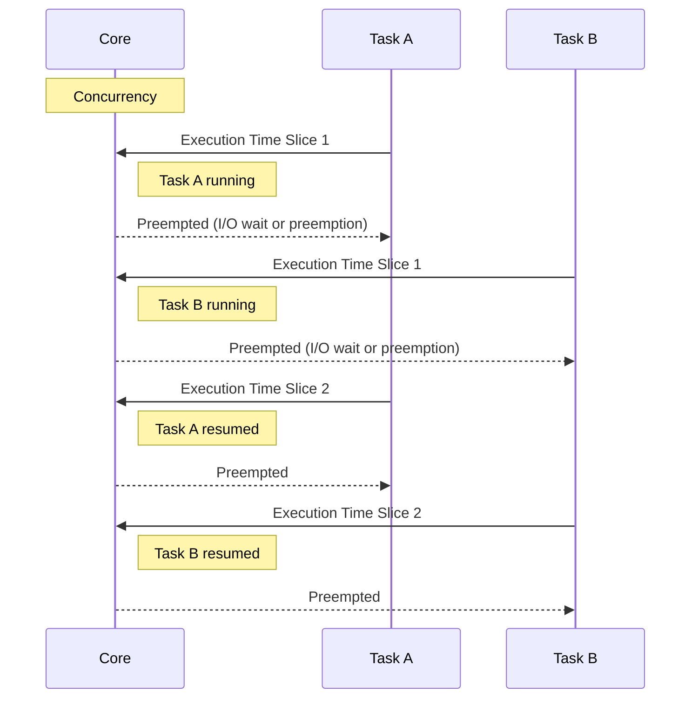
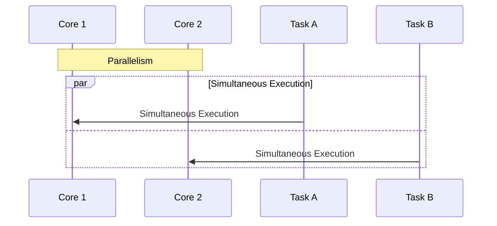

# Overview
Go language strongly supports concurrency through lightweight goroutines and runtime mechanisms. Since Go 1.5, `GOMAXPROCS` is set to the number of available CPU cores by default, enabling parallel execution when configured correctly. This article organizes the mechanisms of goroutine scheduling and multi-core utilization in CPU-bound processing, as well as the relationships between OS processes, threads, and goroutines.

# Difference Between Concurrency and Parallelism
In Go, the primary implementation that can be directly instructed is concurrency, where multiple tasks are handled concurrently using goroutines. To achieve true parallel execution, the execution environment must have multiple CPU cores and `GOMAXPROCS` must be set to 2 or more.

## Concurrency from a Temporal Perspective
This represents how tasks are executed by overlapping time slices on a single core. The actual scheduler switches at preemption points or I/O completion notifications, so the switching timing is not strictly deterministic, but goroutines operate dynamically switching during I/O waits or runtime preemptions.



- Multiple processes are started simultaneously, but in reality, they are executed by switching on a single core by dividing time.
- By waiting for I/O or preemption, goroutines switch to another goroutine, efficiently handling multiple tasks.

## Parallelism from a Temporal Perspective
This shows how tasks are executed physically simultaneously on multiple cores. This is possible when the execution environment has multiple cores and `GOMAXPROCS` is set to 2 or more.



- Multiple goroutines are executed simultaneously on different cores, speeding up CPU-bound processing.
- While concurrency is described in the code, parallel execution occurs when the environmental requirements are met.

# What is a Goroutine?
- **Lightweight Execution Unit**: Starts with a smaller initial stack (a few KB) than a normal OS thread and can grow or shrink as needed. Even when generated in large numbers, the overhead is minimal.
- **Creation Method**:

  ```go
  go func() {
      // Process to execute concurrently
  }()
  ```

  The return value cannot be obtained directly, and communication uses channels or synchronization primitives.
- **Runtime Control**: The timing of execution and allocation to OS threads is managed by the Go runtime scheduler.

# M-P-G Model (Machine, Processor, Goroutine)
Core concepts of the Go runtime:

- **G (goroutine)**: Lightweight threads created by the user. Holds function call history, stack, and scheduling state.
- **M (Machine / OS Thread)**: The actual thread running on the OS. Executes goroutines on the CPU.
- **P (Processor / Virtual Processor)**: Execution context within the Go runtime. Manages runnable queues that hold goroutines in an executable state, with M retrieving and executing G via P.
  - The number of P determines the upper limit of concurrently executable goroutines, which can be set with `runtime.GOMAXPROCS` (usually equal to the number of CPU cores).

## Flow of G → P → M
1. When a goroutine is created, it is registered in the local queue of P or the global queue.
2. An available M retrieves P, takes a goroutine from the queue, and executes it.
3. After completion or being blocked by I/O or preemption, another executable goroutine is executed similarly.

Goroutines are generated, suspended, and resumed lightweight, achieving high concurrency and parallelism. However, generating them in large numbers may lead to scheduling overhead and stack growth costs, so appropriate granularity design and verification through profiling are important.

# In-Depth Look at the M-P-G Model and Reference Articles
- [Ardan Labs: Scheduling in Go (Part 1)](https://www.ardanlabs.com/blog/2018/08/scheduling-in-go-part1.html)
- [Ardan Labs: Scheduling in Go (Part 2)](https://www.ardanlabs.com/blog/2018/08/scheduling-in-go-part2.html)
- [Illustrated Tales of Go Runtime Scheduler - Medium](https://medium.com/@ankur_anand/illustrated-tales-of-go-runtime-scheduler-74809ef6d19b)

Referencing these articles and including diagrams and specific code examples can deepen understanding.

## GOMAXPROCS and Parallel Execution
- Set the number of P with `runtime.GOMAXPROCS(n)`. Since Go 1.5, the default is set to the number of available CPU cores, while earlier versions defaulted to 1. The environment variable `GOMAXPROCS` can also be explicitly set, affecting OS thread usage behavior.
- When P is 1, goroutines can perform concurrency, but only one can execute simultaneously. Setting P to 2 or more allows multiple OS threads to execute goroutines simultaneously, enabling parallelization of CPU-bound processing across multiple cores.
- In many cases, the default setting is sufficient, but adjustments may be necessary considering GC and I/O characteristics.

## Scheduling Details
### Runnable Queue and Work Stealing
- Each P has a local runnable queue that registers new goroutines or goroutines stolen from other Ps.
- When the local queue is empty, it steals goroutines from other Ps' queues for load balancing.
- A global queue is also used as needed to manage a sudden increase in goroutines.

### Preemptive Scheduling
- Since Go 1.14, preemption is applied to goroutines that occupy the CPU for extended periods. Interruptions occur after function calls or at checkpoints within loops, allowing switching to other goroutines.
- This prevents starvation by specific goroutines and improves overall responsiveness and throughput.

### Behavior During Blocking Operations
- When a goroutine blocks due to channel operations or mutex waits, that goroutine waits on P. In the case of network I/O, it is handled by the Go runtime's netpoller through asynchronous polling, avoiding long-term blocking of OS threads. To understand the blocking behavior of system calls and platform-dependent implementation differences, it is advisable to refer to actual code examples and diagrams.
- When M is blocked by a system call, the runtime specializes that M and continues executing other Ps' goroutines using a new M or an idle M.
- Network I/O is processed asynchronously by the netpoller, returning the goroutine to the runnable queue upon completion.

### System Calls and Thread Management
- When a goroutine blocks on a system call, M is specialized, allowing other goroutines to proceed along the remaining P→M path. M is generated and reused in minimal numbers.

## Stack Management and Memory Efficiency
- Goroutines start with a small initial stack and automatically grow or shrink as needed. Even when generated in large numbers, they maintain high concurrency while keeping memory consumption low. However, deep recursion or large arrays as local variables can lead to significant stack growth and relocation costs.
  - Example: In functions with deep recursive calls, the stack size increases, leading to higher relocation frequency, so consider replacing recursion with loops or moving arrays to the heap (using slices, allocating large buffers outside functions, etc.).
  - It is advisable to confirm stack growth behavior through profiling and tracing and to implement appropriate design and implementation.
- Functions with deep recursion or large local variables should be mindful of stack relocation costs.

## Utilizing Parallelism for CPU-Bound Processing
- By dividing CPU-bound processing into multiple goroutines and setting `GOMAXPROCS` appropriately, the Go runtime can execute in parallel across multiple OS threads, leveraging multi-core capabilities.
- Be mindful of the overhead of division and result merging, as well as synchronization costs, and design with appropriate granularity.
- Example:

  ```go
  runtime.GOMAXPROCS(4)
  var wg sync.WaitGroup
  for i := 0; i < 4; i++ {
      wg.Add(1)
      go func(id int) {
          defer wg.Done()
          heavyComputation(id)
      }(i)
  }
  wg.Wait()
  ```

## Affinity with I/O-Bound Processing
- The Go runtime has built-in asynchronous network I/O polling (netpoller), allowing other goroutines to execute even while waiting for I/O. Since behavior varies due to platform-specific implementation differences and system call behavior, it is important to understand the workings of the netpoller and OS-dependent processing, and to conduct operational verification and profiling in actual environments. High throughput is easier to achieve in servers handling many simultaneous connections, but understanding implementation details allows for more optimal design.

## Scheduler Tuning
- **GOMAXPROCS**: Default settings (number of cores) are fundamental. Adjust only for special requirements.
- **Goroutine Granularity**: Too fine-grained generation increases overhead. Design concurrent tasks with appropriate units.
- **Understanding Blocking**: Recognize the impact of long CPU usage or large system calls and verify performance.
- **Profiling**: Analyze CPU profiles and scheduling wait times using tools like `go tool pprof` to identify bottlenecks.
- **Synchronization Methods**: Use channels and mutexes appropriately to avoid unnecessary contention and deadlocks.
- **Runtime Logging**: Log scheduler behavior with `GODEBUG=schedtrace=1000,scheddetail=1` to observe behavior during load testing.

## Mechanism of Preemption (Since Go 1.14)
- Since Go 1.14, preemptive scheduling applies to goroutines that occupy the CPU for long periods. Interruptions occur after function calls or at checkpoints within loops, allowing switching to other goroutines. However, preemption points are inserted based on the Go runtime's implementation and situation, so strict real-time guarantees are not provided. For example, a pseudo-code image showing regular checkpoints within a long loop would look like this:

```go
func busyLoop() {
    for i := 0; i < 1e9; i++ {
        // Calculation processing within the loop
        _ = i * i
        // The Go runtime may insert a preemption point around here, allowing execution of other goroutines
    }
}
```

Actual preemption is performed automatically within the runtime, and there is no need to explicitly write it, but understanding that loops or function calls can serve as safe points makes it easier to maintain concurrency even in long-running CPU-intensive processes.

## Relationship Between OS Processes, Threads, and Goroutines
- **OS Process**: The unit of program execution. Go programs typically start as a single OS process.
- **OS Thread (M)**: The entity that runs on the CPU. Managed by the Go runtime, which generates and manages multiple threads to execute goroutines.
- **Goroutine (G)**: Lightweight user threads. They do not directly occupy OS threads, and the Go runtime scheduler executes them via M-P-G.
- **P (Virtual Processor)**: The execution context of the Go runtime. It manages goroutines in an executable state, with M retrieving P to execute G. The number of P (`GOMAXPROCS`) determines the number of concurrently executable goroutines.

```
[OS Process]
    ├─ Go Runtime Starts → Generates and Manages Multiple OS Threads (M)
    ├─ Prepares Multiple Ps (GOMAXPROCS)
    └─ Goroutines (G) are generated at the user level and placed in P's runnable queue
       └─ When an available M retrieves P, it takes G from the queue and executes it
```

Understanding the mechanisms that achieve high concurrency and parallelism simultaneously can aid in performance optimization through benchmarking and profiling.

## Conclusion
The Go runtime provides lightweight goroutine generation and advanced scheduling mechanisms based on the M-P-G model, clearly distinguishing and naturally supporting concurrency and parallelism. By understanding `GOMAXPROCS` settings, goroutine granularity, profiling, and synchronization methods, developers can optimize performance and improve throughput.