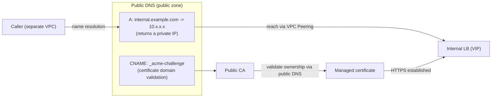

While designing a setup to secure internal VPC traffic (a call from one app to another app's internal API) with HTTPS, I wondered: "Couldn't the certificate's domain just be a private domain handed out by Cloud DNS?" So let me sort this out.

The conclusion up front: **if you want to use a managed certificate (a publicly trusted certificate), the domain must live in public DNS.** You cannot issue a managed certificate for a domain in a private zone.

# The assumed setup

- Expose a regional internal LB (INTERNAL_MANAGED) over HTTPS (443)
- The caller lives in a separate VPC and reaches the internal LB's VIP via VPC Peering
- Attach a Google Cloud Certificate Manager managed certificate to the internal LB

# DNS plays two roles

In this setup, DNS actually serves two distinct roles.

| Role | What it does |
| --- | --- |
| (A) Certificate domain validation | Certificate Manager's DNS Authorization (`_acme-challenge` CNAME) and CAA |
| (B) Name resolution | The A record that resolves the LB's VIP |

The question "couldn't a Cloud DNS private zone have worked?" is mainly about (B). For (B) alone, a private zone works.

# (A) Managed certificate validation requires public DNS

This is the crux. When issuing a managed certificate (one signed by a public CA), Google's CA looks up the `_acme-challenge` record **from the public internet DNS** to verify domain ownership.

A private zone resolves only from inside the VPC, so an external CA cannot see it. In other words, **you cannot issue a managed certificate for a domain in a private zone.**

| Zone type | Resolvable by an external CA? | Managed certificate |
| --- | --- | --- |
| Public zone | Yes | Usable |
| Private zone (VPC only) | No | Not usable |

# What if you really want HTTPS with a private zone?

If you insist on HTTPS with a private zone (a VPC-only domain), your options change.

- Use a **self-managed certificate**. Stand up a private CA (GCP's [Certificate Authority Service](https://cloud.google.com/certificate-authority-service), AWS's [ACM Private CA](https://docs.aws.amazon.com/privateca/)) and upload the certificate it issues to the LB.
- The caller must also add that private CA's root certificate to its trust store.
- You lose the convenience of "it's a public CA, so it's trusted without any extra setup."

# The compromise we adopted: public domain + private IP

This time, we avoided a private zone and went with the following.

- The domain itself lives in public DNS (a public zone)
- But the value the A record returns is a **private IP (the internal LB's VIP)**
- The certificate is a public managed certificate

Putting a private-IP A record in public DNS looks odd at first, but because the domain is public, the same public zone holds both validation (A) and name resolution (B), and the certificate stays managed. Actual reachability is via VPC Peering, so even though the IP is visible in public DNS, it isn't reachable from the outside.

# How is this usually handled?

TLS for internal traffic is a classic dilemma, and depending on scale it tends to settle into one of these.

- **Public domain + private IP + public managed certificate** (this case). Zero CA operations, the easiest. Common for internal APIs called only from within the VPC.
- **Managed private CA** (ACM Private CA / GCP CAS). When you want to strictly keep internal domains closed. Easier to operate than a classic homegrown CA.
- **Service mesh** (Istio / Linkerd, etc.) handling mTLS. When you have many services and want to hide certificate operations.

# Summary

- Managed certificate validation requires public DNS. **You cannot use a managed certificate for a domain in a private zone.**
- To do HTTPS with a private zone, you need self-managed operations: a private CA plus distributing the root certificate.
- To avoid that, "public domain + private IP + managed certificate" is an easy compromise.

The intuition "a private domain probably can't use a managed certificate" was correct: as long as the certificate is public, validation always goes through public DNS. That was the key takeaway.
