# Introducing gogocoin — A Self-Hosted Crypto Trading Bot

## Why I Built It

Open-source crypto bots and automated trading services are everywhere. I built gogocoin anyway because I wanted the hands-on experience of implementing something that works exactly as I intend and actually earning returns with my own money. I had built a similar bot once before; this time I rebuilt it from scratch with the help of AI. Running it in production has been a continuous source of learning — it has become a hobby as much as a software project.

[gogocoin](https://github.com/bmf-san/gogocoin)

## Getting Started

**gogocoin is bitFlyer-only.** All exchange communication goes through the author's own [`go-bitflyer-api-client`](https://github.com/bmf-san/go-bitflyer-api-client) library; no other exchange works. The bot places orders via bitFlyer's spot-only endpoint (`/v1/me/sendchildorder`), so **margin / futures trading (e.g. FX\_BTC\_JPY) does not work**.

There are two ways to use gogocoin.

**A. Use as a library (recommended)**

`example/` is a fully working sample and a starting point for your own repo.

```bash
git clone https://github.com/bmf-san/gogocoin.git && cd gogocoin/example

# Create config and set API credentials via environment variables
cp configs/config.example.yaml configs/config.yaml
export BITFLYER_API_KEY=your_key
export BITFLYER_API_SECRET=your_secret

make run
# or: go run ./cmd/

# → Dashboard at http://localhost:8080
```

Using `example/configs/config.example.yaml` as-is, the bot runs an XRP/JPY scalping strategy with a 1000 JPY order size. Adjust `trading.symbols` and `strategy_params.scalping.order_notional` to trade different pairs or sizes. The bot stores trade data in SQLite (no external database needed).

You can also integrate gogocoin into your own module via `go get github.com/bmf-san/gogocoin@latest`.

**B. Docker for quick testing**

`example/` includes a `Dockerfile` and `docker-compose.yml` that build a fully working binary with the same EMA+RSI scalping strategy registered.

```bash
git clone https://github.com/bmf-san/gogocoin.git && cd gogocoin/example
cp configs/config.example.yaml configs/config.yaml
# Edit configs/config.yaml and set your API credentials
make up

# → Dashboard at http://localhost:8080
```

The Dockerfile build context is the repo root, so run `make up` from the `example/` directory.

## Architecture

The codebase follows a four-layer architecture. `internal/` houses domain logic, use cases, and external adapters (bitFlyer client, SQLite repository, HTTP handlers, etc.); `pkg/strategy` is a public package providing the Strategy interface definition and a scalping reference implementation. The Composition Root (wiring all services together) lives in the caller's repository — `example/cmd/main.go` is a working sample.

### C4 Context — System Overview

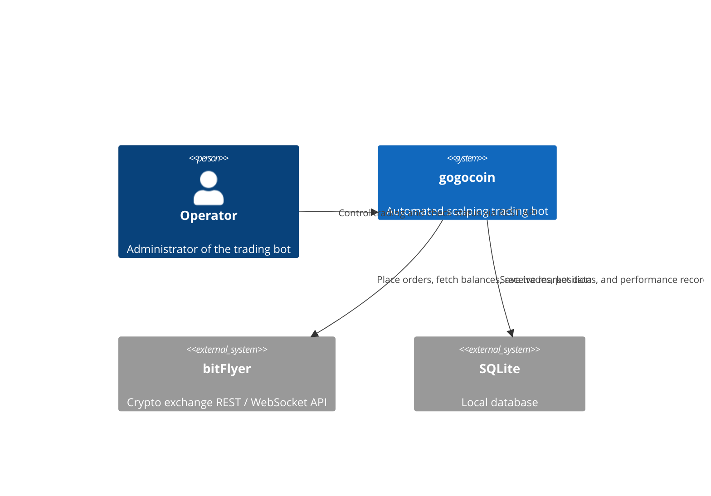

### C4 Container — Main Containers

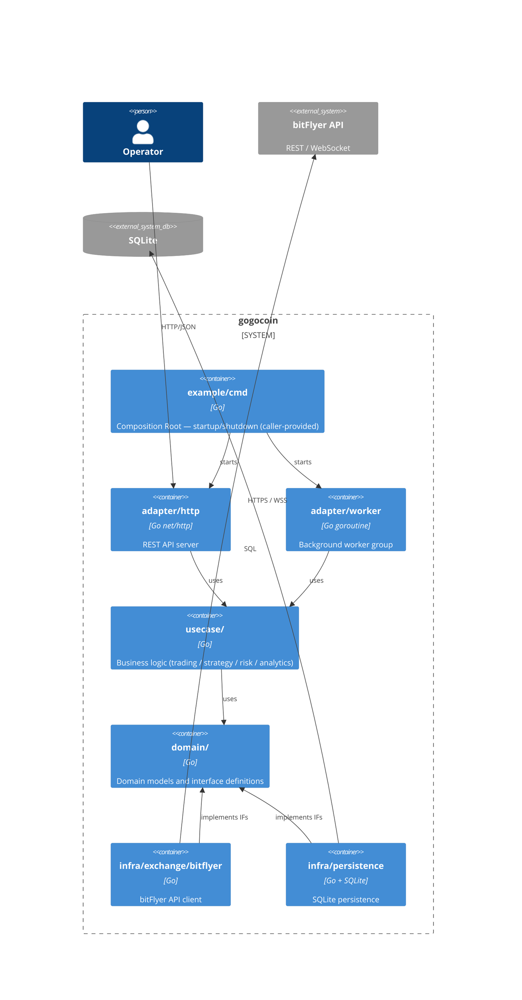

### C4 Component — usecase/trading

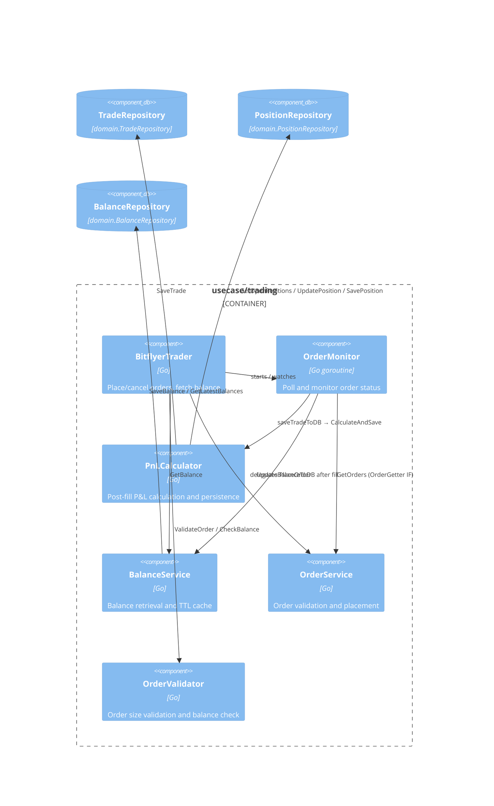

### Dependency Graph

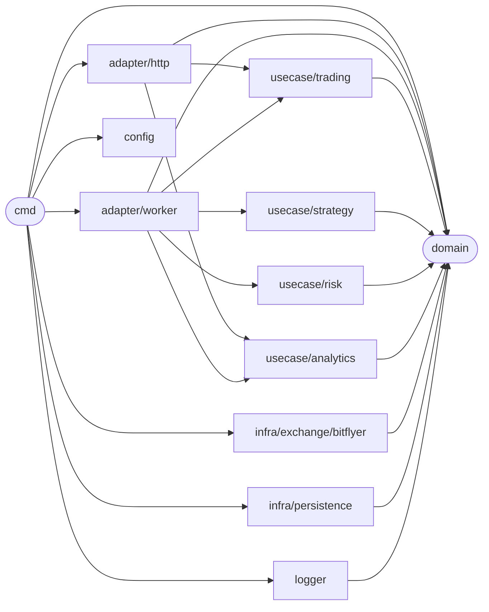

Dependency rules are enforced in CI:

| Rule | Detail |
|---|---|
| `domain/` has zero internal imports | stdlib only; knows nothing of infra or usecase |
| `usecase/` does not import `infra/` | depends only on `domain/` interfaces |
| `adapter/` holds no concrete infra types | uses `domain/` interfaces only |
| `infra/` implements `domain/` | knows nothing of `usecase/` or `adapter/` |
| Composition Root lives in the caller's repository | `internal/` needs no wiring |

The public API (subject to semantic versioning) lives under `pkg/`. `pkg/engine` is the engine entry point; `pkg/strategy` provides the Strategy interface and registry.

## Use Cases

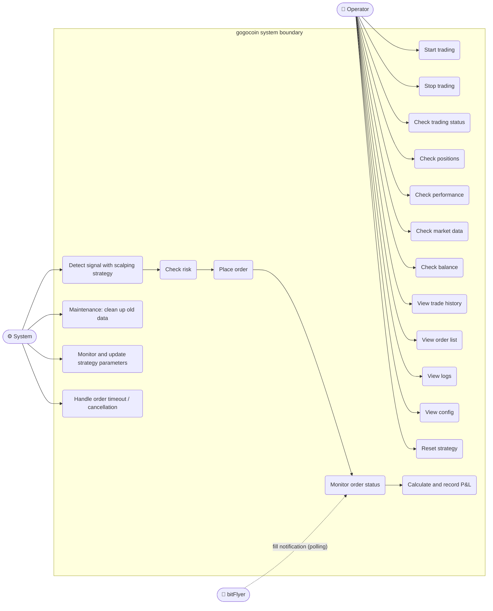

The operator controls and monitors the bot via the HTTP API (including the web dashboard). Signal generation, order placement, P&L calculation, and data cleanup run autonomously.

## Trading Flow

The following shows the main path from receiving a WebSocket tick to filling an order and recording P&L.

### 6.1 Scalping Trading Flow

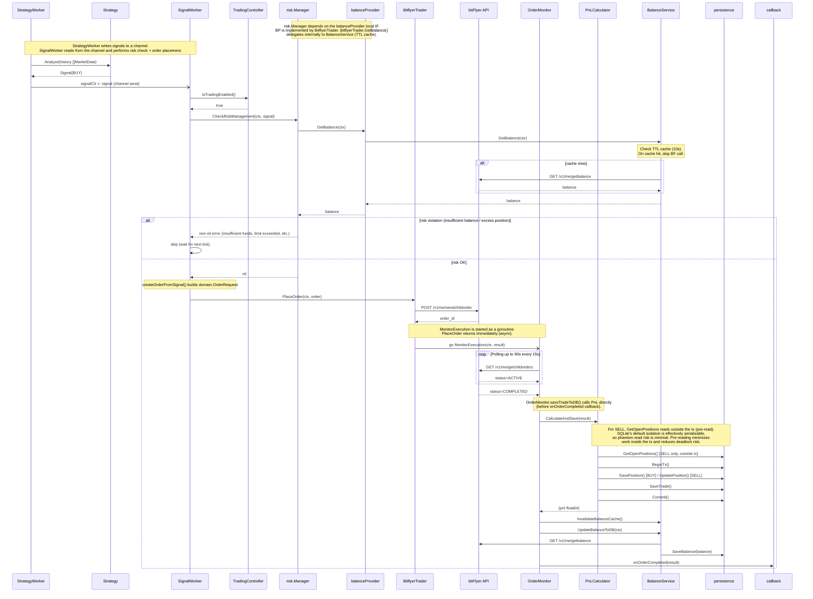

`StrategyWorker` and `SignalWorker` are connected asynchronously via a Go channel. `PlaceOrder()` returns immediately after placing the order; `OrderMonitor` handles fill monitoring in a goroutine. `PnLCalculator` saves position and trade records within the same transaction; `OrderMonitor` appends the balance snapshot separately after that completes.

### 6.2 REST API Trading Control Flow

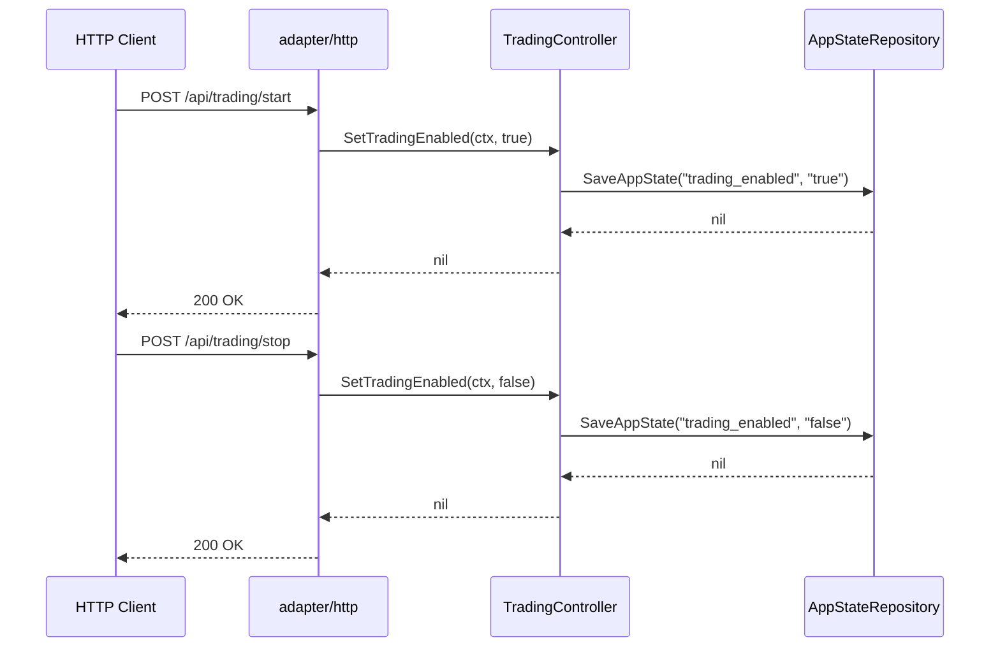

### 6.3 Market Data Collection Flow

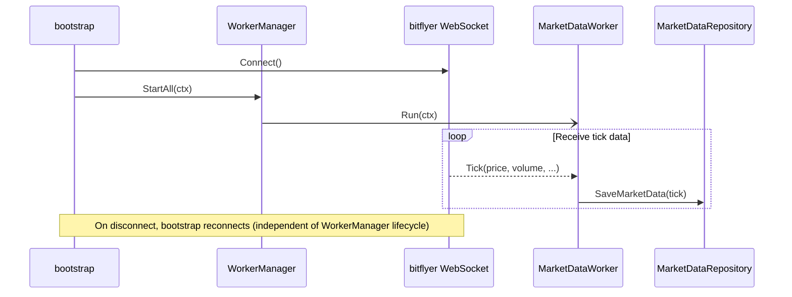

### 6.4 Order Timeout / CANCELED•EXPIRED Flow

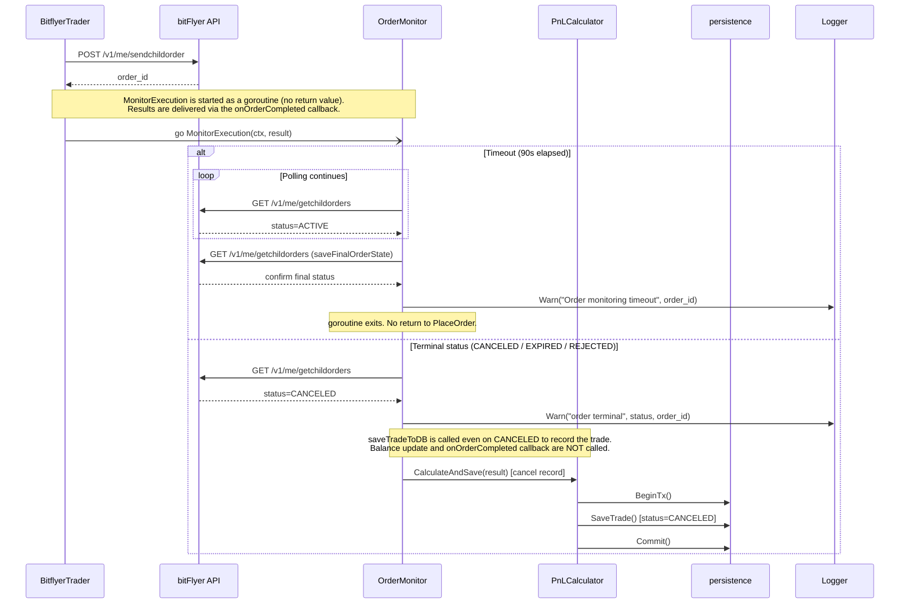

### 6.5 Rate Limit Retry Flow

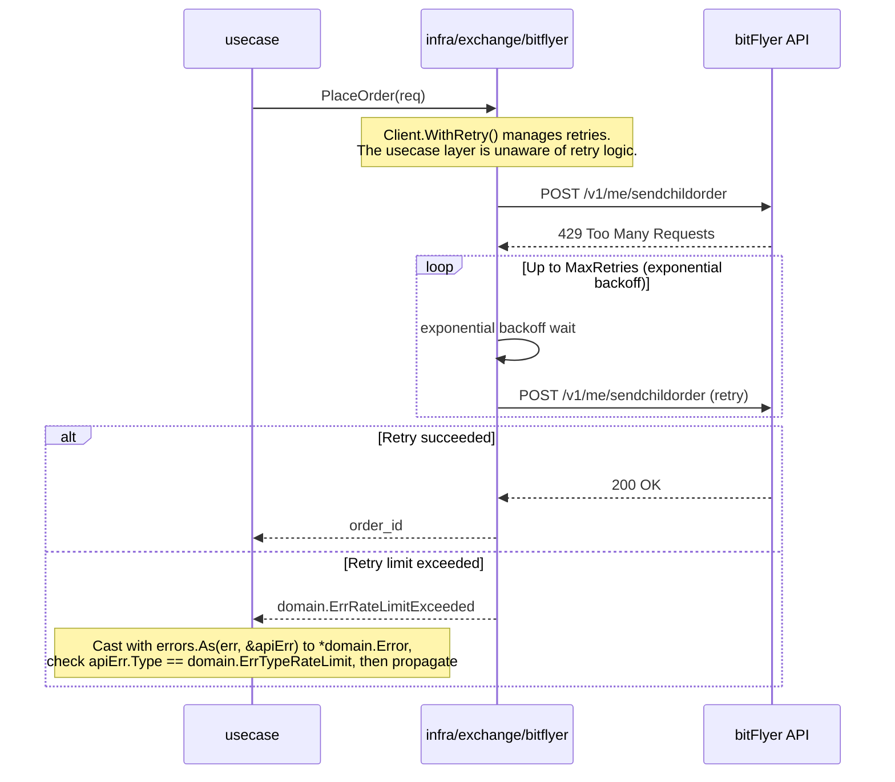

### 6.6 MaintenanceWorker Flow

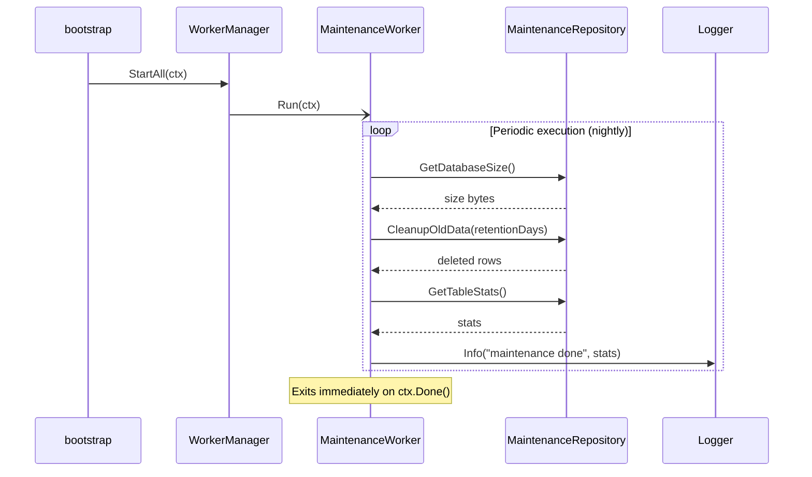

## Strategy Interface

Every trading strategy follows the `Strategy` interface defined in `pkg/strategy/strategy.go`. This keeps the engine decoupled from any specific algorithm:

```go
// AutoScaleConfig holds the order-size auto-scaling parameters returned by
// Strategy.GetAutoScaleConfig. The engine uses this to compute buy notional
// without reading strategy-specific config keys directly.
type AutoScaleConfig struct {
    Enabled     bool
    BalancePct  float64 // % of available JPY balance to use (0-100)
    MaxNotional float64 // hard cap in JPY; 0 = unlimited
    FeeRate     float64
}

type Strategy interface {
    // GenerateSignal generates a signal from the latest market data point and
    // the historical series for the same symbol.
    GenerateSignal(ctx context.Context, data *MarketData, history []MarketData) (*Signal, error)

    // Analyze generates a signal from a batch of historical data.
    Analyze(data []MarketData) (*Signal, error)

    // Lifecycle
    Start(ctx context.Context) error
    Stop(ctx context.Context) error
    IsRunning() bool
    GetStatus() StrategyStatus
    Reset() error

    // Metrics & trade accounting
    GetMetrics() StrategyMetrics
    RecordTrade()
    InitializeDailyTradeCount(count int)

    // Configuration
    Name() string
    Description() string
    Version() string
    Initialize(config map[string]interface{}) error
    UpdateConfig(config map[string]interface{}) error
    GetConfig() map[string]interface{}

    // Order sizing — each strategy owns this logic so the engine never reads
    // strategy-specific config keys directly.
    GetStopLossPrice(entry float64) float64   // 0 = no stop-loss
    GetTakeProfitPrice(entry float64) float64 // 0 = no take-profit
    GetBaseNotional(symbol string) float64
    GetAutoScaleConfig() AutoScaleConfig
}
```

`Initialize()` receives the `strategy_params.<name>` block from `config.yaml` as a `map[string]interface{}`. `UpdateConfig()` allows live parameter updates via the HTTP API without restarting the bot.

Strategies self-register via the global registry using the same mechanism as `database/sql` driver registration. A `register.go` file in each strategy package calls `strategy.Register("name", constructor)` inside `init()`, and `main.go` pulls the strategy in with a blank import (`_ "github.com/bmf-san/gogocoin/pkg/strategy/scalping"`). Adding a new strategy is an `import` change in `main.go` — no engine code needs to change.

## Engine Risk Management

The engine (`StrategyWorker`) enforces stop-loss and take-profit on every market tick, independently of any signal. It calls `GetStopLossPrice` / `GetTakeProfitPrice` on each tick and closes the position immediately when the price crosses the threshold — no signal required.

A `max_open_positions_per_symbol: 1` guard in `config.yaml` prevents position stacking. Without it, consecutive BUY signals during a downtrend accumulate multiple open positions on the same symbol, and when stop-loss fires all of them close simultaneously, multiplying the loss. With the guard set to 1, any BUY is rejected if the symbol already has an open position.

The engine also supports balance-proportional order sizing as a framework feature via `GetAutoScaleConfig()`. To enable it, override `GetAutoScaleConfig()` in your own strategy to return `Enabled: true` with a `BalancePct` and optional `MaxNotional`.

## Balance Cache — Double-Checked Locking

The trading loop polls account balance frequently. Calling the bitFlyer REST API on every tick would quickly exhaust the rate limit of 50 requests per minute. `BalanceService` caches the result with a 60-second TTL and uses a double-checked locking pattern to prevent thundering-herd API calls when the cache expires:

```go
func (s *BalanceService) GetBalance(ctx context.Context) ([]domain.Balance, error) {
    // First check: read without write lock
    s.cache.mu.RLock()
    cacheTimestamp := s.cache.timestamp
    cacheData := s.cache.data
    s.cache.mu.RUnlock()

    if time.Since(cacheTimestamp) < CacheDuration && len(cacheData) > 0 {
        result := make([]domain.Balance, len(cacheData))
        copy(result, cacheData)
        return result, nil
    }

    // Serialize fetches: only one goroutine calls the API at a time
    s.fetchMu.Lock()
    defer s.fetchMu.Unlock()

    // Second check: re-verify after acquiring the lock
    s.cache.mu.RLock()
    cacheTimestamp = s.cache.timestamp
    cacheData = s.cache.data
    s.cache.mu.RUnlock()
    if time.Since(cacheTimestamp) < CacheDuration && len(cacheData) > 0 {
        result := make([]domain.Balance, len(cacheData))
        copy(result, cacheData)
        return result, nil
    }

    // ... call API and update cache
}
```

The outer `cache.mu` (a `sync.RWMutex`) allows concurrent reads of fresh cache data. The inner `fetchMu` (a `sync.Mutex`) serialises API calls so that exactly one goroutine fetches when the cache is stale.

## Data Model

Trade data is persisted in SQLite. The table-to-domain-model mapping:

| Table | Content | Notes |
|---|---|---|
| `trades` | Filled order records | `order_id UNIQUE` for idempotency. Immutable (no UPDATE) |
| `positions` | FIFO positions | 3 states: OPEN / PARTIAL / CLOSED. Created on BUY, updated on SELL |
| `balances` | Balance snapshots | Append-only (no overwrites). Latest row per currency |
| `market_data` | WebSocket tick data | UNIQUE(symbol, timestamp) |
| `performance_metrics` | Daily performance metrics | Snapshot appended after each fill |
| `logs` | Structured log entries | `fields` column is JSON |
| `app_state` | Runtime flag KV store | e.g. `trading_enabled` |

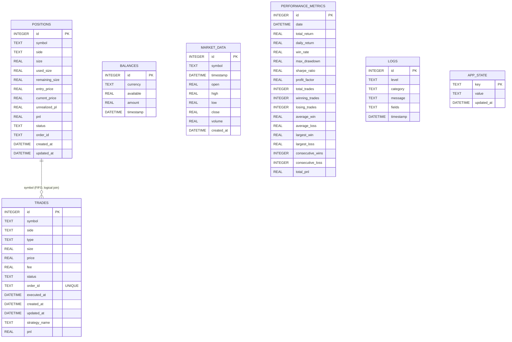

No foreign key constraints are defined. The only cross-table logical reference is between `positions` and `trades`, but `PnLCalculator` writes both within the **same transaction** (BeginTx → SavePosition/UpdatePosition → SaveTrade → Commit). Transaction atomicity guarantees consistency, making DB-level FK constraints unnecessary.

## Web Dashboard


The embedded web UI at `http://localhost:8080` has four pages, navigable via the sidebar.

- **Dashboard** — Four summary cards (total P&L, today's P&L, win rate, daily trade count) plus a system status panel showing connection state, active strategy, uptime, and live prices for monitored currency pairs.
- **Performance** — Per-currency balance table (total / available), three risk metrics (Sharpe ratio, profit factor, max drawdown), and a daily P&L history table.
- **Trade History** — Full trade log with timestamp, currency pair, side, price, size, fee, and P&L columns.
- **System Logs** — Log viewer filterable by level (DEBUG / INFO / WARN / ERROR) and category (system / trading / API / strategy / UI / data).

Start and stop buttons in the top bar control the bot in real time. Configuration (API credentials, trading parameters) lives in `config.yaml`. The bot writes data to SQLite — no external database required.

## Running in Production

gogocoin ships as a single statically-linked binary. [gogocoin-vps-template](https://github.com/bmf-san/gogocoin-vps-template) is a sample reference for running it on ConoHa VPS, covering systemd configuration and deployment steps.

Initial VPS setup (systemd service installation, etc.) uses `make setup`. Ongoing deployment is automated via the included GitHub Actions workflow (`workflow_dispatch`), which builds for linux/amd64 and transfers the binary to the VPS with `rsync`.

## Summary

gogocoin is a minimal self-hosted trading bot that lets you freely implement your own trading strategy and run it with real money. Having your own code directly tied to real P&L is genuinely exciting — and there is no end to how deep you can go tuning strategies and building new features. If any of this sounds interesting, feel free to give it a try.

- **GitHub**: [bmf-san/gogocoin](https://github.com/bmf-san/gogocoin)
- **VPS Template**: [bmf-san/gogocoin-vps-template](https://github.com/bmf-san/gogocoin-vps-template)
