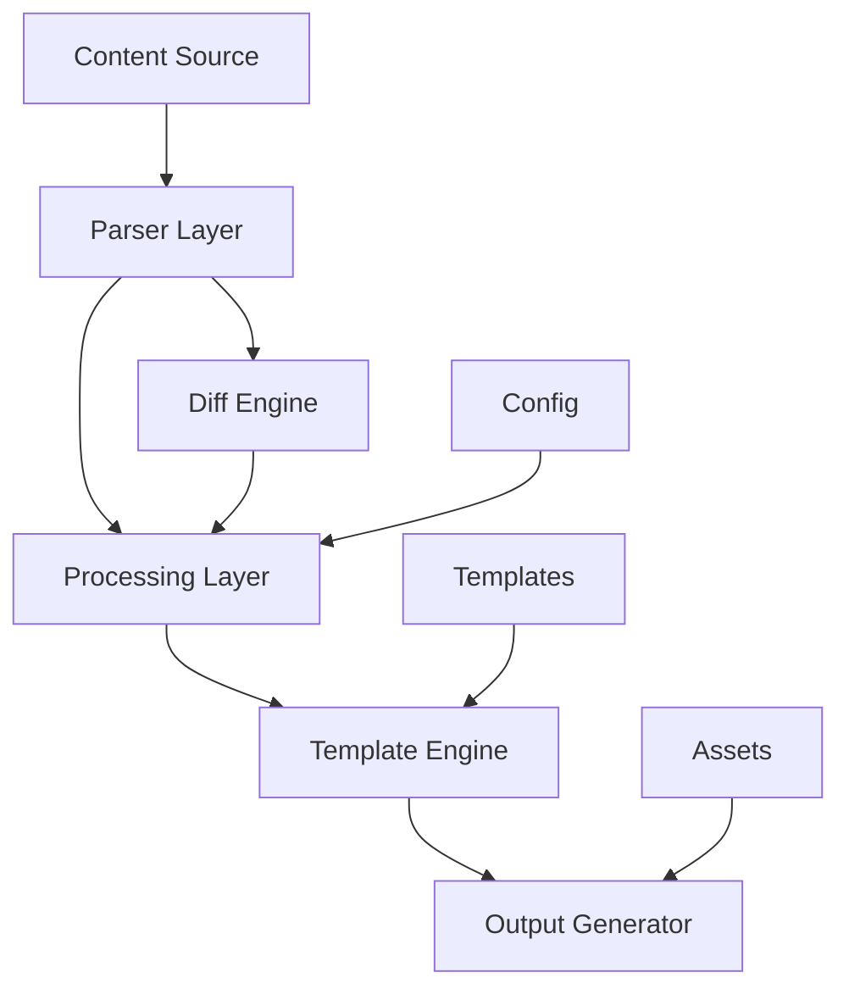
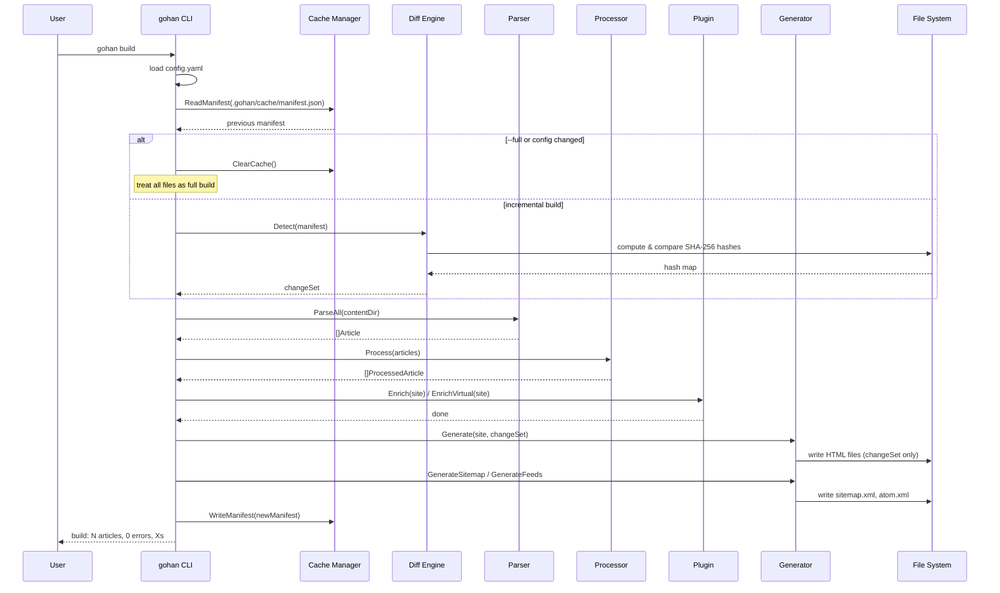
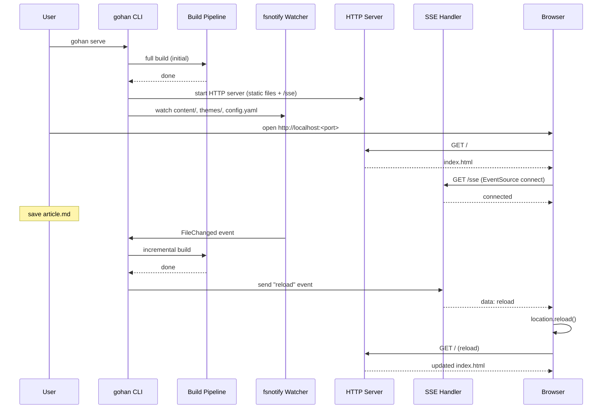

# Introducing gohan — A Go Static Site Generator with Incremental Builds

## Why I Built It

This site (bmf-tech.com) runs on gohan. I wanted a static site generator I could fully understand — one that regenerates only the pages that change. Most generators either rebuild everything unconditionally or depend on `git diff`, which becomes unreliable after branch switches or fresh clones. gohan persists a SHA-256 content-hash manifest, so incremental builds stay accurate without relying on Git history.

## Quick Start

```bash
# 1. Create a project directory
mkdir myblog && cd myblog

# 2. Add config.yaml
cat > config.yaml << 'EOF'
site:
  title: My Blog
  base_url: https://example.com
  language: en
build:
  content_dir: content
  output_dir: public
theme:
  name: default
EOF

# 3. Create your first article
gohan new --title="Hello, World!" hello-world

# 4. Build the site
gohan build

# 5. Preview locally with live reload
gohan serve   # open http://127.0.0.1:1313
```

## Architecture

### System Design



### Directory Structure

Input:

```text
.
├── config.yaml
├── content/
│   ├── posts/        # Blog posts (list, tag, archive pages)
│   └── pages/        # Static pages (About, Contact, etc.)
├── themes/
│   └── default/
│       └── layouts/  # Template files
├── assets/           # CSS, images, and other static files
└── taxonomies/
    ├── tags.yaml
    └── categories.yaml
```

Output (`public/`):

```text
public/
├── index.html
├── posts/
├── pages/
├── tags/
├── categories/
├── archives/
├── feed.xml
├── atom.xml
├── sitemap.xml
└── assets/
```

## Incremental Build Engine

The core of the incremental build lives in `internal/diff/git.go`. The `Detect()` method compares the current working tree against a persisted `BuildManifest`.

```go
func (g *GitDiffEngine) Detect(manifest *model.BuildManifest) (*model.ChangeSet, error) {
    current, err := hashAllFiles(g.rootDir)
    if err != nil {
        return nil, err
    }

    if manifest == nil {
        cs := &model.ChangeSet{}
        for path := range current {
            cs.AddedFiles = append(cs.AddedFiles, path)
        }
        return cs, nil
    }

    cs := &model.ChangeSet{}
    for path, hash := range current {
        if prev, ok := manifest.FileHashes[path]; !ok {
            cs.AddedFiles = append(cs.AddedFiles, path)
        } else if prev != hash {
            cs.ModifiedFiles = append(cs.ModifiedFiles, path)
        }
    }
    for path := range manifest.FileHashes {
        if _, ok := current[path]; !ok {
            cs.DeletedFiles = append(cs.DeletedFiles, path)
        }
    }
    return cs, nil
}
```

`hashAllFiles()` walks the content directory and computes a SHA-256 hex digest for every file. On the first build (or when no manifest exists), all files count as `Added`. Later builds detect three change types — `Added`, `Modified`, and `Deleted` — and regenerate only the affected HTML pages.

`config.yaml` is itself hashed on every build. If it changes, the cache is cleared automatically and a full rebuild runs. The `--full` flag forces the same behaviour explicitly.

Cache data is stored in `.gohan/cache/manifest.json`.

```text
.gohan/
└── cache/
    └── manifest.json   # file hash registry
```

### Build Sequence (`gohan build`)



### Dev Server — Live Reload (`gohan serve`)



## Features

Beyond incremental builds, gohan ships with many capabilities out of the box.

- **Markdown + Front Matter** — GitHub Flavored Markdown with YAML metadata.
- **Taxonomy** — Tag and category pages generated automatically.
- **Atom feed & sitemap** — `atom.xml` and `sitemap.xml` generated automatically.
- **Customisable themes** — Full control via Go `html/template`.
- **i18n** — Mirror directory layout such as `content/en/` and `content/ja/`. Locale-switch links generate automatically.
- **Syntax highlighting** — Server-side rendering via Chroma. No client-side JavaScript needed.
- **Mermaid diagrams** — Output as SVG at build time or as `<pre class="mermaid">` for client-side rendering.
- **OGP image generation** — Open Graph images generate per article at build time.
- **Pagination** — Configurable articles-per-page count.
- **Related articles** — Similar article links based on shared tags.
- **GitHub source links** — Edit links pointing to Markdown sources, added automatically.
- **Live-reload dev server** — `gohan serve` watches content and rebuilds on every save.

## Plugin System

gohan deliberately avoids Go's standard `plugin` package and a library-style design, instead opting for a **compiled-in approach**. The reason is straightforward: the priority is the simplest, shortest path to a working SSG. Dynamic loading or external library dependencies add friction to installation, builds, and distribution. The compiled-in model serves well enough until there is a concrete reason to change it.

Plugins compile into the gohan binary and activate per-project via `config.yaml`. No recompilation needed by users. The plugin interfaces live in `internal/plugin/plugin.go`.

```go
type Plugin interface {
    Name() string
    Enabled(cfg map[string]interface{}) bool
    TemplateData(article *model.ProcessedArticle, cfg map[string]interface{}) (map[string]interface{}, error)
}

type SitePlugin interface {
    Name() string
    Enabled(cfg map[string]interface{}) bool
    VirtualPages(site *model.Site, cfg map[string]interface{}) ([]*model.VirtualPage, error)
}
```

`Plugin` (article-level) exposes extra data for a single article through the template as `.PluginData.<name>`. `SitePlugin` (site-level) runs after all articles have processed and can produce **virtual pages** — pages with no Markdown source.

The built-in registry ships two plugins.

```go
func DefaultRegistry() *Registry {
    return &Registry{
        plugins: []Plugin{
            amazonbooks.New(),
        },
        sitePlugins: []SitePlugin{
            bookshelf.New(),
        },
    }
}
```

`amazon_books` generates Amazon affiliate book card data (image, URL, title) from ASIN values in article frontmatter. `bookshelf` aggregates book frontmatter across the whole site and produces a virtual `/bookshelf` page.

Example `config.yaml` setup:

```yaml
plugins:
  amazon_books:
    enabled: true
    tag: "your-associate-tag-22"
  bookshelf:
    enabled: true
```

## CLI Reference

### `gohan build`

```bash
gohan build [--full] [--config=path] [--output=dir] [--parallel=N] [--dry-run]
```

| Flag | Description |
|---|---|
| `--full` | Force a full rebuild, ignoring the previous manifest |
| `--config` | Path to the config file (default: `./config.yaml`) |
| `--output` | Override the output directory |
| `--parallel` | Number of parallel workers (default: number of CPUs) |
| `--dry-run` | Print files that would be rebuilt without writing any output |
| `--draft` | Include draft articles (`draft: true`) in the build |

### `gohan new`

```bash
gohan new [--title="Title"] [--type=post|page] <slug>
```

### `gohan serve`

```bash
gohan serve [--port=N] [--host=addr]
```

| Flag | Description |
|---|---|
| `--port` | Port number (default: `1313`) |
| `--host` | Host address (default: `127.0.0.1`) |

## Install and Usage

```bash
# Homebrew (macOS/Linux)
brew install bmf-san/tap/gohan

# Go install
go install github.com/bmf-san/gohan/cmd/gohan@latest

# Build
gohan build

# Dev server with live reload
gohan serve
```

## User Guide

For detailed configuration options and template usage, see the documentation.

| Guide | Description |
|---|---|
| [Getting Started](https://github.com/bmf-san/gohan/blob/main/docs/guide/getting-started.md) | Installation, first site, build & preview |
| [Configuration](https://github.com/bmf-san/gohan/blob/main/docs/guide/configuration.md) | All `config.yaml` fields and Front Matter |
| [Templates](https://github.com/bmf-san/gohan/blob/main/docs/guide/templates.md) | Theme templates, variables, built-in functions |
| [Taxonomy](https://github.com/bmf-san/gohan/blob/main/docs/guide/taxonomy.md) | Tags, categories, and archive pages |
| [CLI Reference](https://github.com/bmf-san/gohan/blob/main/docs/guide/cli.md) | All commands and flags |

## Closing

gohan is the engine behind this site. SHA-256 manifest-driven incremental builds keep iteration fast. The compiled plugin system keeps the binary self-contained. From i18n to OGP to Mermaid, everything runs at build time with no client-side JavaScript required.

- **GitHub**: [bmf-san/gohan](https://github.com/bmf-san/gohan)
