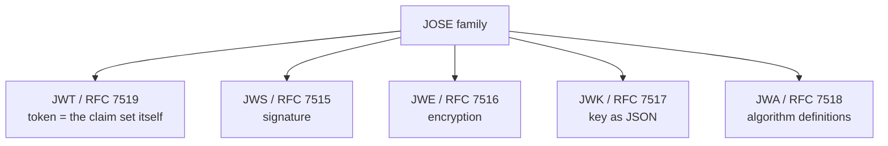

# Overview

When researching JWT, you keep running into similar-looking terms such as JWS, JWE, JWK, and JWA, which can be confusing. Questions like "what is the difference between JWT and JWS?" or "what is that dot-separated string?" clear up quickly once you understand that these specifications together form a family called **JOSE**.

This post lays out the JOSE family (JSON Object Signing and Encryption): the role of each specification, how they relate, how to use them, and the best practices (RFC 8725) for using them safely.

The related RFCs are as follows.

- [RFC 7515 JSON Web Signature (JWS)](https://www.rfc-editor.org/rfc/rfc7515)
- [RFC 7516 JSON Web Encryption (JWE)](https://www.rfc-editor.org/rfc/rfc7516)
- [RFC 7517 JSON Web Key (JWK)](https://www.rfc-editor.org/rfc/rfc7517)
- [RFC 7518 JSON Web Algorithms (JWA)](https://www.rfc-editor.org/rfc/rfc7518)
- [RFC 7519 JSON Web Token (JWT)](https://www.rfc-editor.org/rfc/rfc7519)
- [RFC 8725 JSON Web Token Best Current Practices](https://www.rfc-editor.org/rfc/rfc8725)

# What is JOSE

JOSE (JSON Object Signing and Encryption) is a set of standard specifications for safely exchanging JSON-represented data by signing and encrypting it. The IETF jose working group standardized it. People sometimes call the group of specs **JWx**.



# The relationship between JWT and JWS/JWE

Many people confuse "JWT" and "JWS". Sorting out this relationship first makes everything else easier to understand.

- **JWT** refers to the "content", that is, the set of claims itself — an abstract concept.
- How that content is "protected and carried" gives two representations.
  - Carried with a signature → **JWS** representation (3 parts)
  - Carried encrypted → **JWE** representation (5 parts)

```
JWT = content ({ "sub": "alice", "exp": 1700000000, "aud": "api" })
       |
       |- carried signed     -> JWS -> header.payload.signature (3 parts)
       |- carried encrypted  -> JWE -> header.encrypted_key.iv.ciphertext.tag (5 parts)
```

The 3-part `xxx.yyy.zzz` string you paste into [jwt.io](https://jwt.io/) is, strictly speaking, a "JWT signed with JWS". The reason you can base64url-decode the payload and read the content is that JWS only signs (does not encrypt).

In short:

- **JWT**: what you assert (the content)
- **JWS**: a container that carries the content signed (the content stays visible, but signing prevents tampering) — the everyday "JWT"
- **JWE**: a container that carries the content encrypted (it hides the content)

# JWS (signature)

JWS has three parts joined by dots.

```
eyJhbGci...  .  eyJzdWIi...  .  SflKxwRJ...
|- header -|    |- payload -|   |signature|
  {alg, typ}     {claim set}      signature
```

- What it guarantees: integrity (tamper detection) and the authenticity of the issuer. It provides **no confidentiality** (anyone can read the payload).
- Signing uses one of two approaches.
  - **HMAC (HS256, etc.)**: symmetric key. Sign and verify with a shared secret.
  - **Digital signature (RS256 / ES256, etc.)**: asymmetric key. Sign with a private key, verify with a public key.

The verifier looks at the header's `alg` and verifies the signature with the issuer's key. As described later, trusting this `alg` blindly opens the door to attacks.

# JWE (encryption)

JWE has five parts and hides the content by encrypting it.

```
header . encrypted_key . iv . ciphertext . tag
|JOSE|   |encrypted CEK|  IV  |ciphertext|  |auth tag|
(alg,enc)
```

- What it guarantees: confidentiality (hides the content) and integrity.
- When to use: when you need to put confidential claims such as PII into a token. JWS only signs, so the content is visible; use JWE if you want to hide it.

## Hybrid encryption (two stages)

JWE handles keys in two stages.

1. Generate a random Content Encryption Key (CEK) and encrypt the body with the CEK (symmetric encryption keeps this fast). This is the `enc` parameter.
2. Encrypt the CEK itself with the recipient's public key. This becomes `encrypted_key`, and the method used is the `alg` parameter.

To decrypt, the recipient extracts the CEK with its private key, then decrypts the body with that CEK. Public-key encryption is slow and size-limited, so you cannot use it for the body; instead, fast symmetric encryption protects the body, and the public key wraps only that key. TLS uses the same idea.

## Distinguishing JWS from JWE

- Count the dot-separated parts: **3 means JWS, 5 means JWE**.
- If the header has `enc`, the object is a JWE.

# JWK (key as JSON)

JWK is a specification for representing keys as JSON. Public key distribution (`jwks_uri`) relies on it heavily.

```json
{
  "kty": "RSA",
  "kid": "2026-key-1",
  "use": "sig",
  "alg": "RS256",
  "n": "0vx7...",
  "e": "AQAB"
}
```

A set of JWKs bundled in a `keys` array forms a **JWK Set (JWKS)**. In practice, an authorization server publishes a JWKS at `jwks_uri`, and resource servers fetch keys from there to verify JWS signatures. This forms a cornerstone of an authentication platform.

# JWA (algorithm definitions)

JWA defines the values of `alg` / `enc` used in JWS/JWE/JWK. The answer to "what exactly is RS256?" lives here.

```
Signature/MAC (JWS alg):
  HS256/384/512 ... HMAC + SHA (symmetric)
  RS256/384/512 ... RSASSA-PKCS1-v1_5 + SHA (asymmetric)
  ES256/384/512 ... ECDSA + SHA (asymmetric, elliptic curve)
  PS256/...      ... RSASSA-PSS
  none           ... no signature (dangerous)

Key management (JWE alg):     RSA-OAEP, ECDH-ES, A128KW ...
Content encryption (JWE enc): A128GCM, A256GCM, A128CBC-HS256 ...

Key type (kty): RSA(n,e,d..) / EC(crv,x,y,d) / oct(k)
```

You select algorithms by identifier (the value of `alg`) by design. This lets you migrate to another algorithm when you find a weak one (cryptographic agility). As described below, this flexibility also leaves room for attacks.

# Security: JWT BCP (RFC 8725)

Well-known incidents around JOSE almost all boil down to the following two. RFC 8725 (JSON Web Token Best Current Practices) summarizes the best practices for preventing them.

## alg=none attack

An attacker rewrites the header to `{"alg":"none"}` and leaves the signature empty. If the verifier's library accepts `none`, it lets an unsigned token through as legitimate.

The countermeasure is to **not allow `none`**.

## alg confusion (RS256 -> HS256)

Suppose the server assumes RS256 (verify with a public key). The attacker rewrites the header to HS256 and creates an HMAC signature **using the public key string as the shared key**. If the verifier leaves `alg` up to the header, it verifies with the public key as an HMAC key and the signature passes.

The countermeasure is to **fix the allowed `alg` on the verifier side and not trust the header's `alg`**.

## The core message of RFC 8725

- Fix the allowed `alg` on the verifier side (always perform algorithm verification).
- Do not allow `none` or weak algorithms.
- Distinguish usage with the `typ` header (e.g., `at+jwt`, `secevent+jwt`) to prevent cross-JWT confusion.
- Verify that the key belongs to the `iss` (issuer). Verify `aud` (audience) to prevent substitution to an unintended party.
- Watch out for SQL/LDAP injection via `kid`, and SSRF via `jku`/`x5u` (defend with an allowlist).

# Nested JWT (both signing and encryption)

When you want both signing and encryption, create a JWS and wrap it in a JWE (`cty: "JWT"`). The recipient decrypts first and then verifies the signature. This achieves both authenticity (signature) and confidentiality (encryption).

```
content (claims) --sign--> JWS --encrypt--> JWE
```

# Summary

The role of each JOSE specification, in a table.

| Spec | RFC | Role | Structure |
| --- | --- | --- | --- |
| JWT | 7519 | token = the claim set itself | abstract (represented by JWS/JWE) |
| JWS | 7515 | signature (tamper detection, content visible) | 3 parts |
| JWE | 7516 | encryption (hides content) | 5 parts |
| JWK | 7517 | represents keys as JSON | JSON object / JWKS |
| JWA | 7518 | definitions of alg/enc | identifiers |
| JWT BCP | 8725 | how to use JWT safely | guide |

The key points are these three.

- JOSE is a family (JWx) that protects JSON with signatures and encryption. JWS (signed, 3 parts) or JWE (encrypted, 5 parts) carries a JWT (content).
- JWK defines keys, JWA defines algorithms, and RFC 8725 covers safe usage.
- What we usually call a "JWT" is in fact a "JWT signed with JWS".

# References

- [RFC 7515 JSON Web Signature (JWS)](https://www.rfc-editor.org/rfc/rfc7515)
- [RFC 7516 JSON Web Encryption (JWE)](https://www.rfc-editor.org/rfc/rfc7516)
- [RFC 7517 JSON Web Key (JWK)](https://www.rfc-editor.org/rfc/rfc7517)
- [RFC 7518 JSON Web Algorithms (JWA)](https://www.rfc-editor.org/rfc/rfc7518)
- [RFC 7519 JSON Web Token (JWT)](https://www.rfc-editor.org/rfc/rfc7519)
- [RFC 8725 JSON Web Token Best Current Practices](https://www.rfc-editor.org/rfc/rfc8725)
