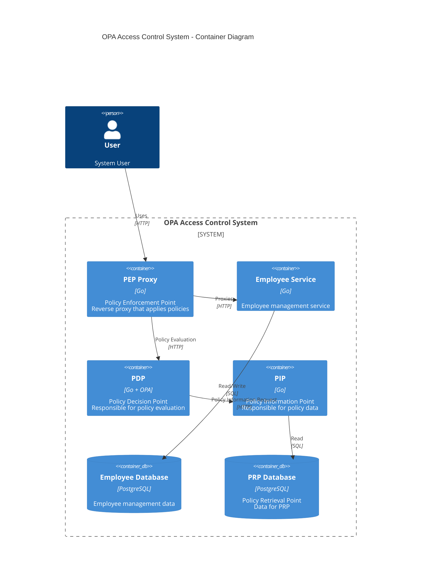
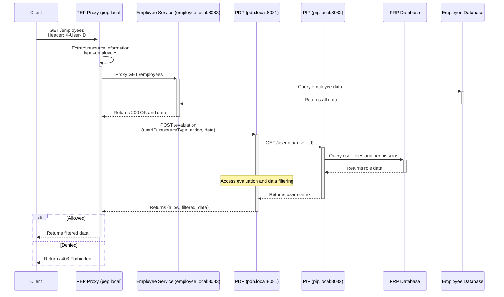

# Implementation of Access Control System for Microservices Using OPA

I have been working on a POC for an access control system using OPA, so I will summarize the details.

The design and implementation of the POC are published in the following repository, so please refer to it as well.

[bmf-san/poc-opa-access-control-system](https://github.com/bmf-san/poc-opa-access-control-system)

## 1. Introduction

### 1.1 Background and Challenges

First, I will define the important concepts discussed in this article, namely the difference between "Authorization" and "Access Control" as follows.

**Authorization**  
- Defines the range of operations a user can perform  
- Granting permissions tied to business logic  
- Control based on organizational structure and workflow  
- A more abstract concept closer to "business"

**Access Control**  
- Controls whether access to system resources is allowed  
- Restrictions on data and API access  
- Technical control mechanisms  
- A more concrete concept closer to "system"

I am involved in the development of a SaaS product, and I am constantly troubled by the complexity and difficulty of requirements related to access management.

As the organizational structures, business flows, and data access patterns of customers using the product diversify, I feel that access management systems face the following challenges:

1. **Addressing Complex Permission Requirements**  
   - Flexible permission settings  
   - Customizable permission models  
   - Individual responses to the demands of systems utilizing the permission management system

2. **Scalability and Maintainability**  
   - Adding new features and permission patterns  
   - Modifying existing permission logic  
   - Complexity of testing and debugging

3. **Balancing Flexibility and Consistency**  
   - Consistent application of permissions across the system  
   - Trade-offs with performance  
   - Trade-offs between flexibility in permission settings and system complexity

To address the above challenges, I believe that permission systems require architectures such as the following:

1. **Separation from Business Logic**  
   - Independent evolution of permission logic  
   - Minimizing impact on business logic  
   - Implementation of flexible permission models

2. **Fine-Grained Control**  
   - Resource-level control  
   - Field-level control  
   - Dynamic data filtering  
   - Contextual decision-making

3. **Extensible Design**  
   - Adding new permission models  
   - Implementing custom rules  
   - Ensuring scalability

### 1.2 About Open Policy Agent (OPA)

As a solution to these challenges, I considered adopting Open Policy Agent (OPA), a Graduated project of the Cloud Native Computing Foundation (CNCF), for the access control system.

OPA is a policy engine with the following features:

1. **Policy as Code**  
   - Policies can be managed as code  
   - Easy to apply version control and review processes  
   - Policies can be described in a testable format

2. **Declarative Policy Description**  
   - Intuitive policy description using the Rego language  
   - High readability and maintainability of policy logic  
   - Easy modularization and reuse

3. **Separation from Services**  
   - Policy decisions can be implemented as an independent service  
   - Complete separation of application code and policies  
   - Dynamic updates to policies are possible

The advantages of adopting OPA include the following points:

1. **Compatibility with Microservices**  
   - Can operate independently as a service  
   - Easy integration through REST API  
   - High performance and lightweight execution environment

2. **Rich Features**  
   - Field-level access control  
   - Description of complex policy rules  
   - Comprehensive testing support

3. **Active Community**  
   - Graduated project of CNCF  
   - Abundant documentation  
   - Proven adoption cases

## 2. Design of the Access Control System

### 2.1 Architecture Overview

This system adopts a proxy-based architecture and consists of the following main components.



#### Policy Enforcement Point (PEP)
- Operates as a reverse proxy  
- Intercepts all requests  
- Implements access control in conjunction with PDP  
- Applies filtering to response data

#### Policy Decision Point (PDP)
- Policy evaluation engine using OPA  
- Access decisions based on RBAC model  
- Applies field-level filtering rules  
- Utilizes contextual information in conjunction with PIP

#### Policy Information Point (PIP)
- Provides information necessary for policy decisions  
- Manages user information and roles  
- Provides organizational structure data  
- Collaborates with PRP

#### Policy Retrieval Point (PRP)
- Persistence of policy-related data  
- Mapping of roles and permissions  
- Association of users and roles  
- Management of access control settings

### 2.2 Access Control Flow

The basic request flow is as follows:

1. The client sends a request  
2. PEP intercepts the request and extracts necessary information  
3. PDP performs policy evaluation  
4. Additional contextual information is obtained from PIP  
5. Access is controlled based on the policy evaluation results  
6. Filtering is applied to the response data  
7. The result is returned to the client



## 3. Implementation Points

### 3.1 PEP Implementation Patterns

There are mainly the following patterns for implementing PEP (Policy Enforcement Point).

1. **Proxy-Based Implementation**  
   - A reverse proxy specialized in a single function (access control)  
   - Placed individually in front of each microservice  
   - Responsible only for access control, with no other functions  
   - Does not modify services

2. **Library-Based Implementation**  
   - Integrated as a library in each service  
   - Integrated with application code  
   - Allows for more granular control  
   - Requires changes to services

3. **Sidecar Pattern**  
   - Used in container environments like Kubernetes  
   - Placed as a sidecar in each service's Pod  
   - Maintains separation between services and PEP  
   - Highly compatible with container orchestration

4. **API Gateway Integration**  
   - Functions as the entry point for the entire system  
   - Multi-functional, including routing, authentication, rate limiting, etc.  
   - Centrally manages traffic to all services  
   - Also handles cross-cutting concerns beyond access control  
   - Risk of becoming a single point of failure

In this PoC, I chose a proxy-based implementation for the following reasons:

- Allows independent access control for each service  
- Clearly separates the responsibility of access control  
- No dependencies on other functions  
- Enables flexible control according to the requirements of each service  
- Lightweight and simpler implementation compared to an API gateway

The proxy-based implementation performs the following processing:

```go
func (p *Proxy) handleRequest(w http.ResponseWriter, r *http.Request) {
    // Retrieve user ID
    userID := r.Header.Get("X-User-ID")
    if userID == "" {
        http.Error(w, "X-User-ID header is required", http.StatusBadRequest)
        return
    }

    // Identify resource and action
    resource := extractResource(r.URL.Path)
    action := "view" // This PoC supports only GET method

    // Evaluate access with PDP
    allowed, filteredData, err := p.evaluateAccess(userID, resource, action)
    if err != nil {
        http.Error(w, err.Error(), http.StatusInternalServerError)
        return
    }
    if !allowed {
        http.Error(w, "Forbidden", http.StatusForbidden)
        return
    }

    // Proxy forwarding and response filtering
    response := p.forwardRequest(r)
    filteredResponse := p.applyFiltering(response, filteredData)
    w.Write(filteredResponse)
}
```

### 3.2 Access Control Model and Policy Implementation

#### 3.2.1 Supported Access Control Models

OPA is a flexible policy engine capable of implementing various access control models.

1. **RBAC (Role-Based Access Control)**  
   - Role-based access control  
   - Implementation model in this PoC  
   - Assigns roles to users  
   - Grants permissions to roles

2. **ABAC (Attribute-Based Access Control)**  
   - Attribute-based access control  
   - User attributes (department, position, etc.)  
   - Resource attributes (confidentiality level, owner, etc.)  
   - Environmental attributes (time, location, etc.) for decision-making

3. **ReBAC (Relationship-Based Access Control)**  
   - Relationship-based access control  
   - Relationships like a social graph  
   - Control based on organizational hierarchy

4. **Other Models**  
   - MAC (Mandatory Access Control)  
   - DAC (Discretionary Access Control)  
   - Combinations of these are also possible

#### 3.2.2 Approaches to Policy Definition

There are two main approaches to policy definition.

1. **Post-Filtering Approach**  
   ```rego
   # Example implementation in this PoC: Filtering after data retrieval
   allowed_fields[field] {
       roles := user_roles[input.user_id]
       some role in roles
       field_permissions := role_field_permissions[role]
       field = field_permissions[_]
   }
   ```

2. **Pre-Filtering Approach**  
   ```rego
   # Query generation example: Filtering before data retrieval
   generate_sql_query {
       roles := user_roles[input.user_id]
       allowed_fields := get_allowed_fields(roles)
       query := sprintf("SELECT %s FROM employees WHERE %s",
           [concat(", ", allowed_fields), build_conditions(roles)])
   }
   ```

#### Considerations on Trade-offs

1. **Post-Filtering (Implementation in this PoC)**  
   - Advantages:
     * Simple implementation  
     * Easy optimization of database queries  
     * Easy to utilize caching
   - Disadvantages:
     * Retrieval of unnecessary data  
     * Increased memory usage  
     * Waste of network bandwidth

2. **Pre-Filtering**  
   - Advantages:
     * Optimization of resource efficiency  
     * Retrieval of only the necessary data  
     * Improved scalability
   - Disadvantages:
     * Complexity of query generation logic  
     * Difficulty in database optimization  
     * Complexity of caching strategies

Guidelines for selection include the following perspectives:

- Use pre-filtering when dealing with large amounts of data  
- Use post-filtering for simple requirements  
- Differentiate based on performance requirements

#### 3.2.3 Implementation Example

In this PoC, the RBAC model is adopted, and the following policy is implemented.

```rego
# ex.
package rbac

# Default deny
default allow = false

# Access permission rules
allow {
    # Retrieve user roles
    roles := user_roles[input.user_id]

    # Check permissions for resource and action
    some role in roles
    permissions := role_permissions[role]
    some permission in permissions
    permission.resource == input.resource
    permission.action == input.action
}

# Field-level filtering
allowed_fields[field] {
    roles := user_roles[input.user_id]
    some role in roles
    field_permissions := role_field_permissions[role]
    field = field_permissions[_]
}
```

This policy enables the following:

1. Denies all access by default  
2. Checks permissions based on the user's roles  
3. Returns only the allowed fields

### 3.3 Data Model Design

Using PostgreSQL, the following schema is implemented.

```sql
-- PRP Database
CREATE TABLE roles (
    id UUID PRIMARY KEY,
    name VARCHAR(255) NOT NULL
);

CREATE TABLE users (
    id UUID PRIMARY KEY,
    name VARCHAR(255) NOT NULL
);

CREATE TABLE user_roles (
    user_id UUID REFERENCES users(id),
    role_id UUID REFERENCES roles(id),
    PRIMARY KEY (user_id, role_id)
);

CREATE TABLE role_permissions (
    role_id UUID REFERENCES roles(id),
    resource_id UUID REFERENCES resources(id),
    action_id UUID REFERENCES actions(id),
    PRIMARY KEY (role_id, resource_id, action_id)
);
```

This schema allows for:

1. Flexible association of users and roles  
2. Role-based permission management  
3. Clear definition of resources and actions

## 4. Insights Gained from Implementation

### 4.1 Advantages of OPA

1. **Separation of Policies and Applications**  
   - Changes to policies do not affect application code  
   - Independent version management and deployment of policies are possible  
   - Easy application of consistent policies across services

2. **Declarative Policy Description**  
   - Intuitive policy implementation using Rego  
   - High readability of policy logic  
   - Easy unit testing

3. **High Flexibility**  
   - Fine-grained control at the field level  
   - Contextual decision-making based on dynamic contexts  
   - Capability to implement complex rules

### 4.2 Implementation Challenges

1. **Learning Curve**  
   - Requires learning the Rego language  
   - Debugging can be difficult  
   - Complexity in policy design

2. **Impact on Performance**  
   - Slight overhead from the proxy  
   - Additional latency from policy evaluation  
   - Need for caching strategies

3. **Operational Complexity**  
   - Management of multiple services  
   - Distribution and updating of policies  
   - Monitoring and troubleshooting

### 4.3 Design Innovations

To address implementation challenges, innovations such as the following are required:

1. **Performance Optimization**  
   - Caching of policy evaluation results  
   - Retrieval of only the necessary context  
   - Efficient database queries

2. **Error Handling**  
   - Clear error messages  
   - Fallback strategies  
   - Detailed logging

3. **Ease of Testing**  
   - Unit testing of policies  
   - Automation of integration testing  
   - Establishment of testing environments

## 5. Outcomes of the PoC and Future Prospects

Through this system, it has been confirmed that an access control system using OPA is effective in the following ways:

1. **Consistency in Access Control**  
   - Unified policy application across services  
   - High maintainability of implementation  
   - Flexible permission management

2. **Improved Development Efficiency**  
   - Separation from business logic  
   - Reusability of policies  
   - Readability of policies  
   - Ensured ease of testing

3. **Operational Advantages**  
   - Limited impact range of policy changes  
   - Independence of policy deployment  
   - Separation of policies

On the other hand, challenges such as learning costs and infrastructure complexity have also become clear. Addressing these challenges will likely require appropriate education, tool development, and a phased approach to implementation.

## Personal Reflections

I believe that the most important logic in an access management system is the description and implementation of policies, and I felt that implementing this part with OPA can enhance flexibility and maintainability.

In particular, the ability to separate business logic means that changes in access control do not affect application code, which I see as a significant advantage.

This time, I adopted a proxy-based configuration, but I think it would be more scalable to consider a client-based configuration since the responsibilities of the proxy become heavier.

When policies and application code are tightly coupled, the communication costs between teams developing the access management system and those developing systems that utilize the access management system increase. This point is particularly important when the requirements for access management are expected to change flexibly with the growth of the product.

I also felt that the ease of testing policies is crucial for enhancing the quality of policies. By automating policy testing, the risks associated with changes to policies can be reduced.

This time, I did not implement optimizations for performance, but when adopting OPA in large-scale systems, I believe that implementations and policy designs that consider performance, such as caching policy evaluation results and optimizing database queries, will be required.

Regarding the migration from existing systems that do not adopt policy engines like OPA, I felt that extracting and separating policies, as well as a phased approach to implementation, are important yet challenging tasks.