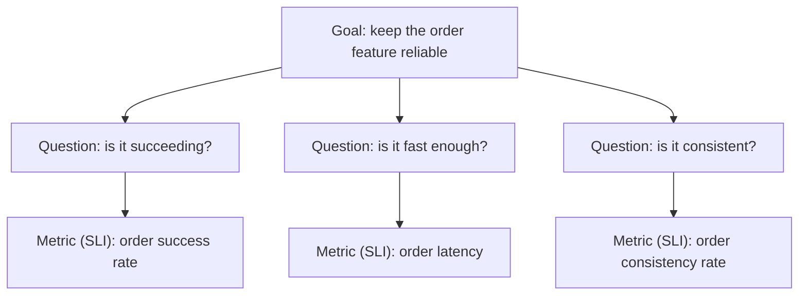

Start from "what signals can the monitoring tool capture" and you easily end up with plenty of alerts that nobody can act on. This article reframes the purpose of monitoring as decision-making, then lays out a tool-agnostic way to design monitoring, in this order: the big picture, design principles, scenario discovery, and SLI definition.

# The purpose of monitoring

The purpose of monitoring is not detection itself but **decision-making**. People usually cite four use cases for monitoring, yet each one delivers value only when **someone decides the next action** from what they observe.

- **Early detection of anomalies**: notice failures quickly and shorten downtime
- **Prevention**: spot warning signs and act before they grow
- **Safety and security**: detect unauthorized access or dangerous behavior and prevent damage
- **Quality**: keep the system behaving as usual

Concretely, a monitoring system exists to answer three questions.

1. **Should we page someone now?** — alerting
2. **What is happening?** — situational awareness (dashboards)
3. **Why did it happen?** — investigation and post-incident analysis (exploring telemetry)

These three have different requirements, so do not mix them in your design; conflating them is the biggest cause of noise and alert fatigue. Throughout the rest of the design, always distinguish which of the three questions a given piece of monitoring answers.

# Scope

As an introduction, this article aims to give you a working grasp of the big picture and the design process, independent of any specific tool or system. It grounds its terms and categories in widely established definitions (OpenTelemetry, the Google SRE book, ITIL 4, ISO/IEC 27001/27002, and others; see "The big picture"). It covers everything up to "making things measurable" — defining SLIs and starting measurement.

# The big picture

Three axes capture the big picture: what to draw on (data types), where to measure (measurement position), and what to measure (indicators). On top of that, map operational and security terms — events, alerts, audit monitoring — to established standards as well. No single standard defines categories like "liveness monitoring" or "performance monitoring" (they are industry vernacular), so the following grounds everything in established definitions.

**Data types** — Follow OpenTelemetry's signal definitions (a CNCF project and the de facto standard for instrumentation).

- **Metrics**: numeric time series; strong for aggregation and the primary material for alerting
- **Logs**: records of events; the primary material for investigation
- **Traces**: the path of a request; pinpoint bottlenecks and failure locations

These three are the primary material for monitoring. (OpenTelemetry also positions Baggage, which propagates context, as a signal, and is developing Profiles as a signal.) Alerts and dashboards are not signals but output forms (telemetry → evaluation/visualization → notification).

**Measurement position** — Follow the definitions from the Google SRE book.

- **Black-box monitoring**: measures externally visible behavior from the outside, as a user sees it. It captures user pain directly, but only detects problems happening right now.
- **White-box monitoring**: measures with telemetry from inside the system. It covers a wide range, from measuring symptoms like error rate and latency to identifying causes and detecting warning signs.

Whether something justifies paging a human depends not on the measurement position but on whether it captures a symptom (see Principle 1 in "Design principles"). In practice, white-box measurement often captures symptoms too — for example, an error rate measured at the load balancer.

**What to measure** — Take the four golden signals (latency, traffic, errors, saturation) as the minimal set (Google SRE book). Use RED to organize the request side and USE for the resource side, as a supplement. Concretely, the metrics look like this:

| Target | Frame | Example metrics |
| --- | --- | --- |
| Application (request-serving) | RED (Rate/Errors/Duration) | Request count / error rate / response-time distribution (p95, p99); plus saturation of thread pools, connection pools, and the like |
| System resources | USE (Utilization/Saturation/Errors) | Utilization / saturation / errors for CPU, memory, disk, and network |

**Operational and security terms** — Events and alerts follow the definition in ITIL 4's "Monitoring and Event Management" practice. ITIL 4 defines an event as "any change of state that has significance for the management of a service or configuration item (CI)." For security and audit monitoring, map to the controls in ISO/IEC 27002:2022 (8.15 Logging, 8.16 Monitoring activities). ISO/IEC 27001:2022 Annex A references these controls.

# Design principles

Here are the principles to return to when a design decision is unclear — one for each of the three questions: what, where, and how to measure. They all follow from "the purpose of monitoring is decision-making."

1. **What to measure — make symptoms the primary target.** Give top priority to measurements that answer "is the user in trouble?" directly. Treat cause-side measurements (CPU, disk, and so on) as an aid to prevention and investigation, and include as warning signs anything that will surely lead to a symptom if left alone (exhaustion forecasts, certificate expiry, and the like).
2. **Where to measure — measure closer to the user.** The closer the measurement point sits to the user, the more accurately it captures symptoms. Also, keep the measurement path independent of the target itself; avoid a setup where measurement stops when the target stops.
3. **How to measure — design measurement to match the failure mode.** Catch errors and slowness (explicit failures) with request measurement, and catch cases that look successful but hold the wrong result inside (silent failures) with consistency checks. Derive the detection method from the failure mode, and cover both modes.

# Gather prerequisites

Before you start designing, get to a point where you can explain the target of monitoring. If you design without understanding the target, scenario discovery stays shallow and you choose the wrong measurement points (Principle 2). Gather these four things.

- **Use cases**: who uses it and why. This becomes the raw material for user-impact scenarios.
- **Architecture**: the application and infrastructure layout, the request path, and external service dependencies. Use it to list candidate measurement points and to check the independence of the measurement path (Principle 2).
- **Existing telemetry**: the logs, metrics, and traces you already collect, and the gaps. This tells you whether to reuse or build anew.
- **Past incidents and inquiries**: raw material for scenario discovery.

If no up-to-date documents exist, create them now. Teams often draw an architecture diagram for the first time during monitoring design, and that alone has value.

# Discover user-impact scenarios

Design starts from a list of "things that would hurt if they happened to users." Start from user impact rather than from monitoring items or metrics, and a symptom-based design (Principle 1) follows naturally. Three tips for discovery:

- **Draw from both failure modes**: explicit failures (visible as errors or slowness) and silent failures (look successful but wrong inside). Cover only one and you will surely miss things.
- **Use source material**: past incidents, support inquiries, and failure cases from similar systems. This covers more than brainstorming alone.
- **Order by severity**: rank by the breadth and depth of impact, and design monitoring for the top ones first.

At this stage, do not chase presumed causes. Once you start asking "why does it happen," you slide back into cause-based design and the list sprawls. Identifying causes is the job of investigative telemetry.

# Defining SLIs

An SLI (Service Level Indicator) answers "is the user in trouble?" as a number, per scenario. Keep the count to three to five, and follow these four rules when you define them.

- **Separate specification from implementation**: the specification is a definition independent of measurement means (for example, "the fraction of login requests that returned a correct result within 2 seconds"); the implementation makes the measurement point, the pass/fail condition, and the population concrete. Agree on the specification first, and tool choices or measurement-point changes will not drag the definition around.
- **Build a scenario-to-SLI table**: state which SLI guards which scenario, and note the reason for any scenario you leave uncovered. This keeps clear which scenarios go unguarded.
- **Carry breakdown axes as labels**: build it so you can slice by tenant, caller, time of day, and so on. This isolates the partial failures that a single summary metric hides.
- **Start measuring as soon as you define it**: begin measurement first, even without thresholds or alerts. The baseline you accumulate becomes the material for future alert thresholds and SLO adoption.

# A worked example

Let us apply "Discover user-impact scenarios" and "Defining SLIs" to the order feature of a fictional e-commerce site and see what the monitoring-design output looks like.

First, the list of user-impact scenarios (the output of discovery).

| # | Scenario | Mode | Severity |
| --- | --- | --- | --- |
| S1 | The order cannot complete (error or timeout) | Explicit | High |
| S2 | Completing the order runs slow | Explicit | Medium |
| S3 | Shown as successful, but the system never accepted the order | Implicit | High |
| S4 | The system finalizes an order with the wrong amount or contents | Implicit | High |

Next, the scenario-to-SLI table (the output of SLI definition). It separates specification from implementation.

| SLI | Specification (measurement-agnostic) | Implementation (point, decision, population) | Scenarios guarded |
| --- | --- | --- | --- |
| Order success rate | Of order-confirmation requests, the fraction accepted correctly | At the load balancer access log, count 5xx and timeouts as failures. Population = all order-confirmation requests | S1 |
| Order latency | Of order-confirmation requests, the fraction answered within 2 seconds | At the same point, record response time and keep p95/p99 too | S2 |
| Order consistency rate | Of orders shown as successful, the fraction whose order data exists with the correct contents | Reconcile the order-completion event log against the order database every 5 minutes | S3, S4 |

Carry tenant, payment method, and client type as breakdown labels. The set stays at three SLIs; start measuring each as soon as you define it and accumulate a baseline. That is the monitoring-design output; from here, you can move on to alert design (thresholds, notifications, response procedures).

# The GQM approach

You can see the flow so far (purpose → user-impact scenarios → SLIs) as GQM (Goal-Question-Metric), a goal-driven measurement framework, applied to monitoring. Victor Basili and David Weiss proposed GQM in 1984, and Basili, Caldiera, and Rombach later organized it as a way to measure software quality. It defines measurement at three levels.

- **Goal (conceptual level)**: what to look at, from whose viewpoint, and for what purpose
- **Question (operational level)**: the questions that judge whether the goal holds
- **Metric (quantitative level)**: the data that answers each question quantitatively

Definition flows top-down from Goal to Metric; interpretation builds bottom-up from Metric to Goal. The key point: every metric ties to a question (that is, a goal). Keep only the metrics that tie to a goal, and you avoid the noise and alert fatigue that purposeless measurement brings. This overlaps with Principle 1 — start from symptoms (user impact), not from metrics.

This article's outputs map directly onto the GQM levels.

| GQM | Mapping in this article | E-commerce example |
| --- | --- | --- |
| Goal | The purpose of monitoring; the reliability to protect | Keep the order feature reliable |
| Question | User-impact scenarios | Is the order succeeding / fast enough / consistent? |
| Metric | SLI | Order success rate / order latency / order consistency rate |

A vague Goal blurs the questions and metrics that follow. Word it with Basili's goal template: "analyze <object> for <purpose>, focusing on <quality attribute>, from the viewpoint of <role>." One caveat: because GQM starts from goals, it misses failures that the stated goal does not imply. Combine it with the scenario discovery across both explicit and implicit modes (above) to fill the coverage.

# References

- [OpenTelemetry — Signals](https://opentelemetry.io/docs/concepts/signals/) (data types: metrics, logs, traces)
- [Google SRE Book — Monitoring Distributed Systems](https://sre.google/sre-book/monitoring-distributed-systems/) (black-box/white-box, four golden signals)
- [Brendan Gregg — The USE Method](https://www.brendangregg.com/usemethod.html)
- RED method (Rate/Errors/Duration; from Tom Wilkie)
- ITIL 4 — Monitoring and Event Management practice (definitions of event and alert)
- ISO/IEC 27002:2022 — 8.15 Logging / 8.16 Monitoring activities
- GQM (Goal-Question-Metric) — Basili, Caldiera, Rombach, "The Goal Question Metric Approach" (1994)
- [A Starter Guide to Implementing SLOs](/posts/slo-start-guide/) (the SLO starting point this article leaves out of scope)
