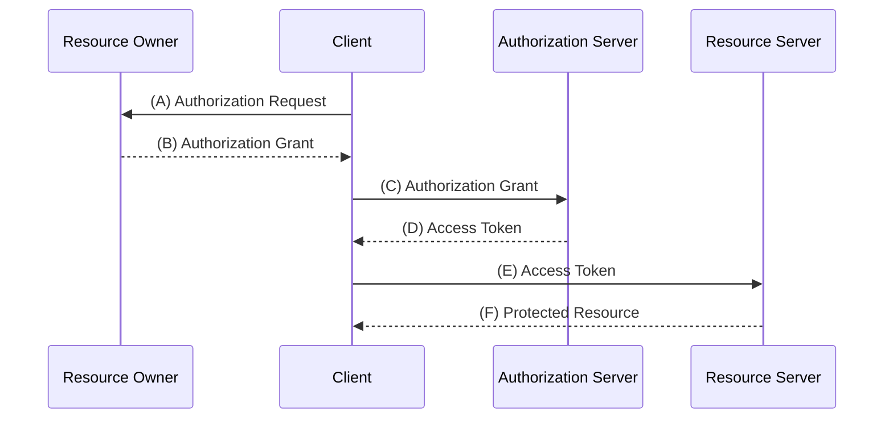
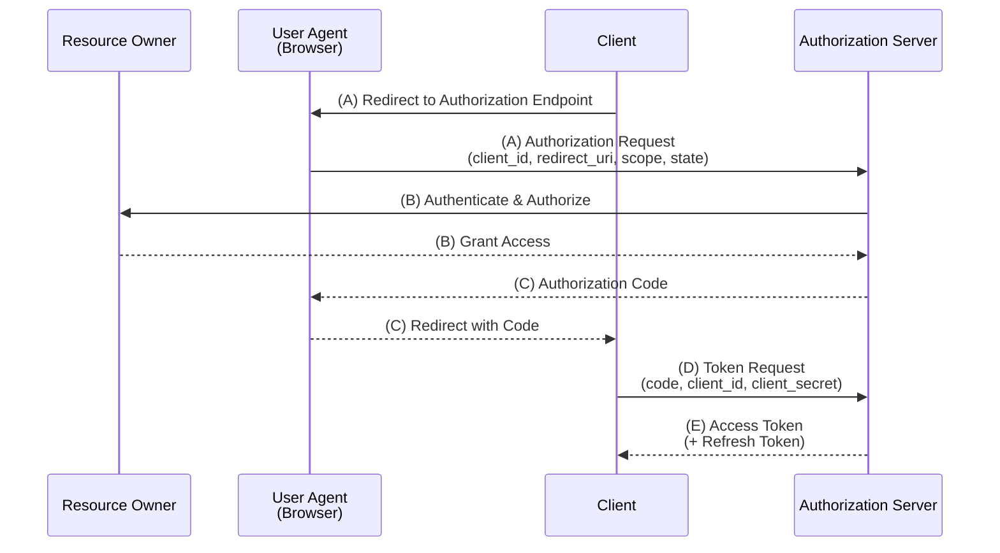
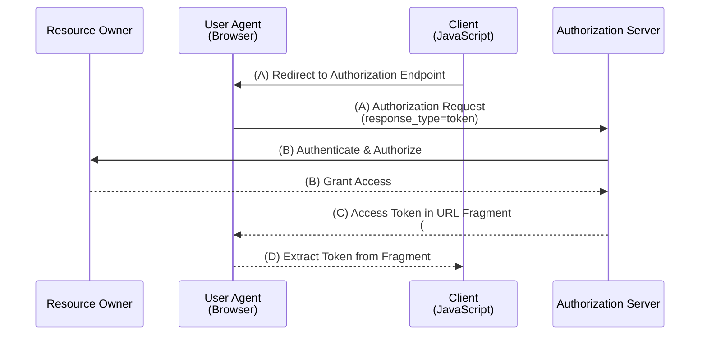
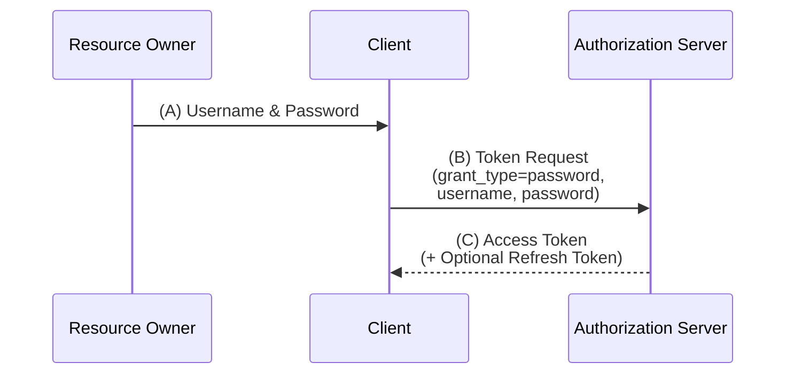
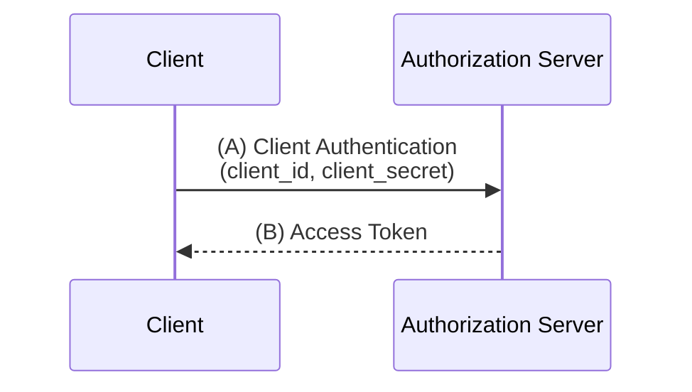
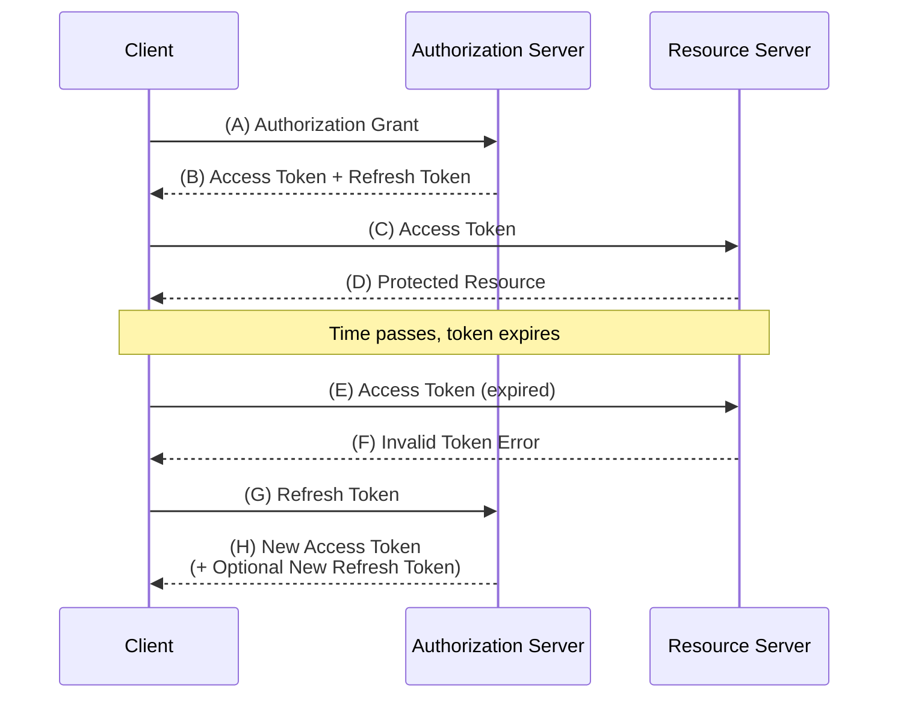
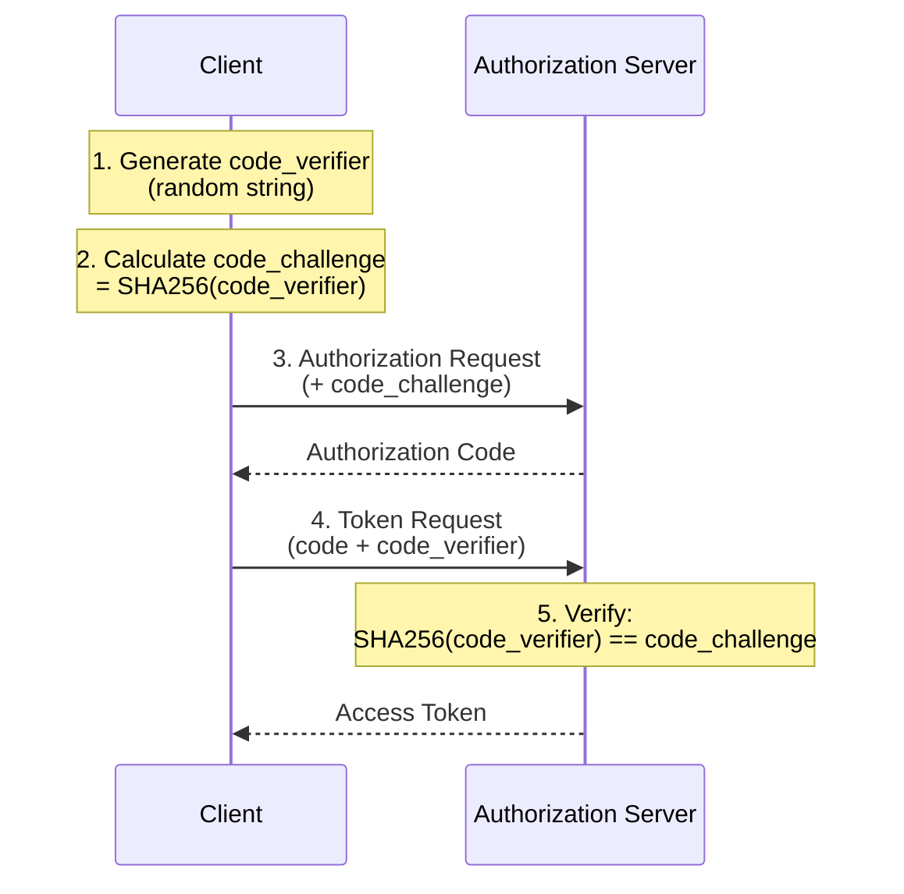

Based on RFC 6749 (OAuth 2.0 Authorization Framework) and RFC 6750 (Bearer Token Usage).

---

## RFC Terms (RFC 2119)

| Term | Meaning |
|-----|------|
| **MUST** / **REQUIRED** / **SHALL** | Absolute requirement |
| **MUST NOT** / **SHALL NOT** | Absolute prohibition |
| **SHOULD** / **RECOMMENDED** | Recommended (should be followed unless there is a special reason) |
| **SHOULD NOT** / **NOT RECOMMENDED** | Not recommended (should be avoided unless there is a special reason) |
| **MAY** / **OPTIONAL** | Optional (may or may not be implemented) |

---

## Overview

OAuth 2.0 is an authorization framework that allows third-party applications to obtain **limited access** to HTTP services.

In traditional client-server authentication models, third parties needed to directly use the resource owner's credentials. OAuth 2.0 resolves this issue by introducing **access tokens**.

---

## Four Roles

| Role | Description |
|-------|------|
| **Resource Owner** | Entity that grants access to protected resources (usually an end-user) |
| **Resource Server** | Server that hosts protected resources and accepts requests via access tokens |
| **Client** | Application that accesses protected resources on behalf of the resource owner with authorization |
| **Authorization Server** | Server that authenticates the resource owner and issues access tokens after obtaining authorization |



---

## Four Grant Types

### 1. Authorization Code Grant

**Most recommended flow. For web applications.**



| Step | Content |
|---------|------|
| (A) | Client redirects user agent to authorization endpoint |
| (B) | Authorization server authenticates resource owner and grants/denies access |
| (C) | Authorization server grants authorization code and redirects |
| (D) | Client exchanges authorization code for access token at token endpoint |
| (E) | Authorization server issues access token (and refresh token) |

**Features**:
- Authorization code is short-lived (RECOMMENDED: less than 10 minutes)
- Refresh tokens can be issued
- Client authentication is performed

### 2. Implicit Grant

**For JavaScript applications running in the browser.**



| Feature | Content |
|-----|------|
| Token Acquisition | Access token is obtained directly from the authorization endpoint |
| Refresh Token | Not issued |
| Client Authentication | Not performed |
| Security | Lower than authorization code grant (token exposed in URL fragment) |

**Note**: Removed in OAuth 2.1 (draft) for security reasons. Recommended to use authorization code grant with PKCE.

### 3. Resource Owner Password Credentials Grant

**Flow where the client directly receives the user's ID/password.**



| Feature | Content |
|-----|------|
| Purpose | Migration from legacy systems, highly trusted clients |
| Risk | Client has access to credentials, potential for misuse |
| Recommendation | Only if other grant types cannot be used |

**Note**: Removed in OAuth 2.1 (draft) for security reasons.

### 4. Client Credentials Grant

**Flow for accessing with the client's own permissions.**



| Feature | Content |
|-----|------|
| Purpose | Machine-to-machine communication (M2M), batch processing |
| Resource Owner | The client itself is the resource owner |
| User Involvement | Not required |

---

## Tokens

### Access Token

| Item | Content |
|-----|------|
| Role | Credential for accessing protected resources |
| Expiration | Short-lived (SHOULD: less than 1 hour, RFC 6750) |
| Format | Not specified in the specification (implementation-dependent, JWT is common) |
| Scope | Limits the accessible range |

### Refresh Token

| Item | Content |
|-----|------|
| Role | Used to refresh access tokens |
| Expiration | Long-lived (days to weeks) |
| Usage Location | Only at the token endpoint (not sent to resource server) |
| Issuance | Can be issued with authorization code grant, not issued with implicit |



---

## Endpoints

### Authorization Endpoint

| Item | Content |
|-----|------|
| Role | Obtaining authentication and authorization from the resource owner |
| Communication | TLS (MUST) |
| Grant Types Used | Authorization Code, Implicit |
| HTTP Method | GET (SHOULD), POST (MAY) |

**Request Parameters**:

| Parameter | Required | Description |
|-----------|:----:|------|
| `response_type` | REQUIRED | `code` (authorization code) or `token` (implicit) |
| `client_id` | REQUIRED | Client identifier |
| `redirect_uri` | OPTIONAL | Redirect URI |
| `scope` | OPTIONAL | Access scope |
| `state` | RECOMMENDED | Random value for CSRF protection |

### Token Endpoint

| Item | Content |
|-----|------|
| Role | Exchanges authorization grant for access token |
| Communication | TLS (MUST) |
| HTTP Method | POST (MUST) |
| Client Authentication | MUST (for confidential clients) |

**Request Parameters (Authorization Code Grant)**:

| Parameter | Required | Description |
|-----------|:----:|------|
| `grant_type` | REQUIRED | `authorization_code` |
| `code` | REQUIRED | Authorization code |
| `redirect_uri` | REQUIRED* | Same URI as specified during authorization request (*if specified during authorization) |
| `client_id` | REQUIRED* | Client identifier (*if not authenticated) |

**Response Example**:
```json
{
  "access_token": "2YotnFZFEjr1zCsicMWpAA",
  "token_type": "Bearer",
  "expires_in": 3600,
  "refresh_token": "tGzv3JOkF0XG5Qx2TlKWIA",
  "scope": "read write"
}
```

---

## Scope

| Item | Content |
|-----|------|
| Format | Space-separated string list |
| Role | Limits the accessible range |
| Definition | Defined by the authorization server (not specified in the specification) |
| Principle | Clients should request the minimum necessary scope |

**Example**:
```
scope=read write profile email
```

The authorization server may completely ignore the requested scope, partially allow it, or grant additional scopes.

---

## Bearer Token (RFC 6750)

### What is a Bearer Token

A security token that can be used by any party that possesses the token without proving possession of a cryptographic key.

### How to Send Tokens

| Method | Required | Example |
|-----|:------:|-----|
| **Authorization Header** | MUST (server) / SHOULD (client) | `Authorization: Bearer mF_9.B5f-4.1JqM` |
| Form-Encoded Body | MAY | `access_token=mF_9.B5f-4.1JqM` (POST body) |
| URI Query Parameter | SHOULD NOT | `?access_token=mF_9.B5f-4.1JqM` |

Resource servers must support the method using the Authorization Header (MUST).

### Security Requirements

| Requirement | Content | Strength |
|-----|------|:----:|
| **TLS Required** | Always sent over HTTPS | MUST |
| **Certificate Validation** | Validate TLS certificate chain | MUST |
| **Cookie Storage Prohibited** | Must not be stored in cookies that can be sent in plaintext | MUST NOT |
| **Short Expiration** | Recommended to be less than 1 hour (RFC 6750 Section 5.3) | SHOULD |
| **Avoid URL Transmission** | Tokens should not be included in page URLs | SHOULD NOT |

---

## Security Considerations (from RFC 6819)

### Major Threats and Countermeasures

| Threat | Countermeasure |
|-----|------|
| **CSRF Attack** | Validation using `state` parameter |
| **Authorization Code Interception** | Use of PKCE (Proof Key for Code Exchange) |
| **Token Leakage** | TLS required, short expiration, scope limitation |
| **Phishing** | Use only legitimate authorization servers, certificate validation |
| **Client Impersonation** | Client authentication, redirect URI validation |

### PKCE (RFC 7636)

An extension to safely use authorization code grant for public clients (SPA and mobile apps) instead of implicit grant.



---

## Modern Recommendations (OAuth 2.1)

OAuth 2.1 is a draft specification that integrates best practices from OAuth 2.0. Key changes:

| Change | OAuth 2.0 | OAuth 2.1 |
|-------|-----------|-----------|
| Implicit Grant | MAY | Removed |
| Password Grant | MAY | Removed |
| PKCE | OPTIONAL | REQUIRED |
| Strict Match for Redirect URI | SHOULD | MUST |
| Bearer Token (Query Parameter) | SHOULD NOT | MUST NOT |
| Refresh Token Rotation | - | SHOULD |

### Recommended Practices

| Item | Recommendation |
|-----|------|
| Grant Type | Authorization Code + PKCE |
| Implicit | Do not use |
| Password | Do not use |
| Token Format | JWT (signed) |
| Token Expiration | Access tokens should be short (SHOULD: less than 1 hour), refreshed with refresh tokens |
| Scope | Principle of least privilege |

---

## References

- [RFC 6749: The OAuth 2.0 Authorization Framework](https://openid-foundation-japan.github.io/rfc6749.ja.html)
- [RFC 6750: Bearer Token Usage](https://openid-foundation-japan.github.io/rfc6750.ja.html)
- [RFC 6819: OAuth 2.0 Threat Model and Security Considerations](https://openid-foundation-japan.github.io/rfc6819.ja.html)
- [RFC 7636: Proof Key for Code Exchange (PKCE)](https://datatracker.ietf.org/doc/html/rfc7636)