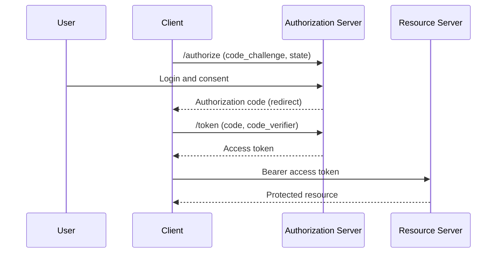

# Overview

OAuth 2.0 (RFC 6749) has seen wide use since it appeared in 2012. Because of its flexibility, developers could also choose "dangerous options", and real-world operation surfaced many attacks. **RFC 9700 (OAuth 2.0 Security Best Current Practice)** consolidates those lessons, and **OAuth 2.1** codifies them into a "secure by default" specification.

This post organizes the changes from OAuth 2.0 to 2.1 and the security measures shown by RFC 9700 and RFC 6819 (threat model).

The related specifications are as follows.

- [RFC 9700 Best Current Practice for OAuth 2.0 Security](https://www.rfc-editor.org/rfc/rfc9700)
- [RFC 6819 OAuth 2.0 Threat Model and Security Considerations](https://www.rfc-editor.org/rfc/rfc6819)
- [RFC 7636 PKCE](https://www.rfc-editor.org/rfc/rfc7636)
- [The OAuth 2.1 Authorization Framework (draft)](https://datatracker.ietf.org/doc/draft-ietf-oauth-v2-1/)

# Positioning: 6749 -> 9700 -> OAuth 2.1

Understanding the relationship among the three makes the big picture clear.

```
6749 (2012)          9700 (2025)              OAuth 2.1
raw OAuth   --lessons learned--> best-practice BCP --codified--> "secure by default" spec
"dangerous options too"          "what to protect"                "dangerous options removed"
```

The header of RFC 9700 states `Updates: 6749, 6750, 6819`, showing that it updates and extends the original RFCs.

# Prerequisite: the authorization code flow

OAuth has three roles.

- **Client**: the app that wants to call the API.
- **Authorization Server (AS)**: issues authorization codes and tokens.
- **Resource Server (RS)**: verifies access tokens and provides the API.

The current baseline is the "authorization code flow + PKCE".



# RFC 6819: threat model

RFC 6819 (2013) is a catalog that systematically enumerates the threats to OAuth 2.0. It lists threats and countermeasures by component: client, authorization server, token, refresh token, authorization code.

Since the modern countermeasure BCP is 9700, in practice you "start with 9700 and use 6819 for deeper dives and completeness checks". 6819 works well as a dictionary to look up "what threats exist for this pattern".

# RFC 9700: key recommendations

RFC 9700 has two parts: "Section 2 Best Practices (conclusions)" and "Section 4 Attacks and Mitigations (rationale)". Grasp the "what" in Section 2 first, then dig into the "why" in Section 4 only for the items you care about.

The main recommendations, in a table.

| Item | Content |
| --- | --- |
| redirect_uri | Match with exact string comparison (exception: only the port number of native localhost) |
| PKCE | Mandatory for public clients, recommended even for confidential clients |
| CSRF defense | One of PKCE / OIDC nonce / state |
| Mix-Up defense | Required when using multiple ASes (match with `iss`) |
| Implicit grant | Do not use (`response_type=token` is deprecated) |
| Sender-constrained | Recommend mTLS / DPoP |
| ROPC | Do not use (the password grant is MUST NOT) |
| Audience restriction | Narrow the token's target with scope / resource |
| Client authentication | Prefer asymmetric keys (mTLS / private_key_jwt) over shared secrets |

## The two deprecated modes

In particular, the formal deprecation (MUST NOT / SHOULD NOT) of the following two matters.

- **Implicit grant (`response_type=token`)**: the URL fragment exposes the access token, and it leaks through browser history, Referer, and logs. It also cannot be sender-constrained. Use the authorization code flow instead.
- **ROPC (Resource Owner Password Credentials)**: the client directly holds the user's password. The attack surface grows and it cannot coexist with MFA or passkeys. Use the authorization code flow instead.

# Representative attacks and countermeasures

## Authorization Code Injection

An attack where the attacker injects a stolen authorization code into their own session and impersonates the victim. Prevented by **PKCE**.

```
(1) At the authorization request: entrust code_challenge = SHA256(verifier) to the AS
(2) At token exchange: present code + code_verifier
                       the AS verifies SHA256(verifier) == challenge
Even if the attacker steals the code, they do not know the verifier that only the client holds, so it fails.
```

## Mix-Up attack

When a client uses several ASes, the attacker's AS forwards to a legitimate AS and makes the client confuse "which AS the response came from". Prevented by including the issuer identifier `iss` (RFC 9207) in the response and checking that it matches the destination.

You can carry `iss` in two ways. One is the RFC 9207 `iss` parameter (plaintext, unsigned), and the other is the `iss` claim of a signed ID Token. The former is a countermeasure that assumes an attacker who can operate a malicious AS but cannot intervene on the communication path; it relies on the premise that the attacker never sits on the response path from the legitimate AS toward the client, so it cannot rewrite the value. If you must consider a network man-in-the-middle (MITM), you need to carry `iss` in a signed ID Token (or JARM), where tampering breaks the signature.

## CSRF

With `state` (or PKCE / nonce), verify that the authorization response corresponds to the flow you started.

# How PKCE works (RFC 7636)

PKCE is a mechanism that ensures "even if someone steals an authorization code, no one but the correct client can turn it into a token".

- **code_verifier**: a random secret string that only the client knows.
- **code_challenge**: the SHA-256 hash of `code_verifier` (the S256 method).

You put `code_challenge` in the authorization request and send `code_verifier` at token exchange so the AS can verify it. Originally designed for native apps, it now applies to all clients, including web apps.

# Summary

- OAuth 2.0 was so flexible that developers could choose dangerous options. RFC 9700 consolidates those lessons, and OAuth 2.1 codifies them.
- What to protect: exact redirect_uri matching, mandatory PKCE, deprecation of Implicit/ROPC, Mix-Up defense, sender constraints, and audience restriction.
- Many of these originate from the threats in RFC 6819, which 9700 systematized into countermeasures.

# References

- [RFC 9700 Best Current Practice for OAuth 2.0 Security](https://www.rfc-editor.org/rfc/rfc9700)
- [RFC 6819 OAuth 2.0 Threat Model and Security Considerations](https://www.rfc-editor.org/rfc/rfc6819)
- [RFC 7636 Proof Key for Code Exchange](https://www.rfc-editor.org/rfc/rfc7636)
- [RFC 9207 OAuth 2.0 Authorization Server Issuer Identification](https://www.rfc-editor.org/rfc/rfc9207)
- [The OAuth 2.1 Authorization Framework (draft)](https://datatracker.ietf.org/doc/draft-ietf-oauth-v2-1/)
