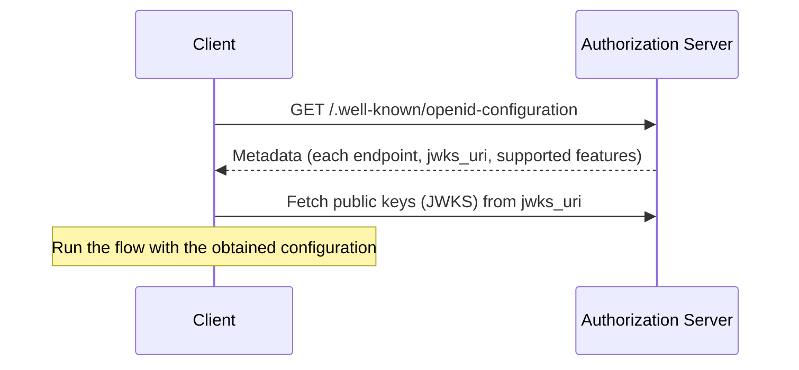
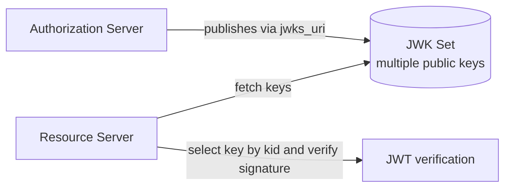

# Overview

When implementing OpenID Connect (OIDC), manually configuring the authorization endpoint, token endpoint, public key location, and so on is tedious and a breeding ground for misconfiguration. **Discovery** and **metadata** automate this.

This post confirms the role of the OIDC ID Token, then organizes how OpenID Connect Discovery and RFC 8414 (OAuth 2.0 Authorization Server Metadata) enable auto-configuration and key retrieval.

The related specifications are as follows.

- [OpenID Connect Core 1.0](https://openid.net/specs/openid-connect-core-1_0.html)
- [OpenID Connect Discovery 1.0](https://openid.net/specs/openid-connect-discovery-1_0.html)
- [RFC 8414 OAuth 2.0 Authorization Server Metadata](https://www.rfc-editor.org/rfc/rfc8414)

# The difference between OAuth and OIDC

First, let us organize the premise.

- **OAuth 2.0**: the **authorization** mechanism of "granting a client the right to call an API on behalf of a user". The star is the access token.
- **OpenID Connect**: a specification layered on top of OAuth 2.0 that adds "who is this user". It adds a JWT called the **ID Token** and provides **authentication**.

# What is in the ID Token

The ID Token is a JWT that represents "when and how the AS authenticated this user". The main claims are as follows.

| Claim | Meaning |
| --- | --- |
| `iss` | Issuer. The identifier of the AS |
| `sub` | The unique identifier of the user |
| `aud` | The intended audience of this token (the client ID) |
| `nonce` | Replay protection. Verify it matches the value in the authorization request |
| `auth_time` | The time authentication occurred |
| `exp` / `iat` | Expiration / issued-at time |

By verifying these claims, the client confirms that the legitimate AS issued the token, that it targets this client, and that no one tampered with it.

# What is Discovery

Discovery is a mechanism for a client to **automatically obtain** the AS's configuration. It reads endpoint URLs, supported features, key locations, and so on from a metadata document published by the AS.

Not configuring by hand has these benefits.

- Reduces misconfiguration (such as mistakenly configuring an attacker's URL).
- Lets compliant libraries automatically enable new features.
- Makes it easier to follow key rotation and changes in cryptographic methods.

# OpenID Connect Discovery

In OIDC, the AS publishes a metadata document at `/.well-known/openid-configuration`.

The metadata includes `authorization_endpoint`, `token_endpoint`, `userinfo_endpoint`, `jwks_uri`, and the supported scopes and signing algorithms.

# RFC 8414: AS Metadata

OpenID Connect Discovery is for OIDC, but **RFC 8414 (OAuth 2.0 Authorization Server Metadata)** makes it applicable to OAuth 2.0 in general. It publishes metadata at `/.well-known/oauth-authorization-server`.

RFC 9700 (Security BCP) also recommends publishing and using AS Metadata. For example, by publishing `code_challenge_methods_supported`, clients can detect whether the AS supports PKCE.

# jwks_uri and key rotation

Among the metadata, `jwks_uri` matters most. This URL distributes the AS's public keys (JWK Set); clients and resource servers fetch keys from there to verify JWS signatures.

Each key has a `kid` (Key ID), which the verifier matches against the JWT header's `kid` to select the right key. This lets the AS rotate keys without downtime by publishing old and new keys in parallel. For details on JWK/JWKS, see "[What is JOSE? An Overview of JWT, JWS, JWE, JWK, and JWA](/en/posts/jose-overview/)".

# Security benefits of metadata

RFC 8414 lists the benefits of using metadata.

- Compliant libraries can automatically enable security features.
- Reduces endpoint URL misconfiguration (such as pointing at an attacker's URL).
- Ensures key rotation and cryptographic agility.

# Summary

- The OIDC ID Token is "proof of authentication", used after verifying iss/sub/aud/nonce and so on.
- Discovery and metadata (OIDC Discovery / RFC 8414) let you fetch endpoints and keys automatically instead of configuring them by hand.
- Public key distribution via `jwks_uri` and `kid` enables key rotation without downtime.

# References

- [OpenID Connect Core 1.0](https://openid.net/specs/openid-connect-core-1_0.html)
- [OpenID Connect Discovery 1.0](https://openid.net/specs/openid-connect-discovery-1_0.html)
- [RFC 8414 OAuth 2.0 Authorization Server Metadata](https://www.rfc-editor.org/rfc/rfc8414)
