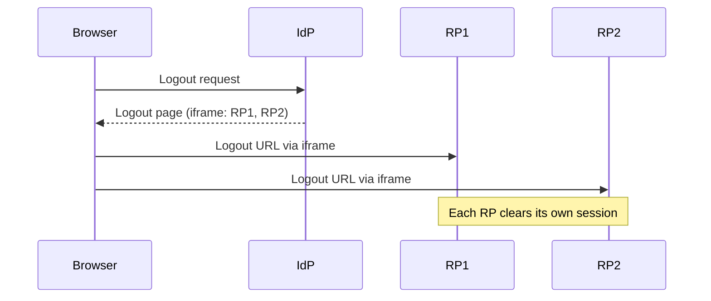
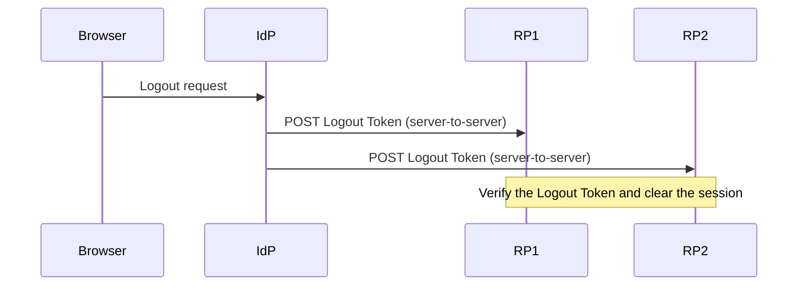

# Overview

Login mechanisms are often explained, but "logout" is surprisingly hard. Especially in an environment where a single IdP (authorization server) provides single sign-on to several apps, you need to think about "how far to clear the sessions" and "how to notify the other apps".

This post organizes OpenID Connect Front-Channel Logout / Back-Channel Logout, and the event notification mechanism via Security Event Token (RFC 8417).

The related specifications are as follows.

- [RFC 8417 Security Event Token (SET)](https://www.rfc-editor.org/rfc/rfc8417)
- [OpenID Connect Front-Channel Logout 1.0](https://openid.net/specs/openid-connect-frontchannel-1_0.html)
- [OpenID Connect Back-Channel Logout 1.0](https://openid.net/specs/openid-connect-backchannel-1_0.html)

# Why logout is hard in a distributed environment

In single sign-on (SSO), you authenticate at one IdP, and several RPs (Relying Parties = apps) share that session. Here, "logout" affects several places.

- The session on the IdP side
- The session on each RP side

Clearing just one place leaves the user logged in at the other RPs. So the IdP needs a mechanism to tell each RP "this user has logged out". The IdP can do this in two ways.

# Front-Channel Logout

Front-Channel Logout communicates logout **via the browser**. The IdP's logout page lays out `<iframe>`s pointing at each RP's logout URL, and the browser loads each of them to make each RP clear its session.



- Advantage: relatively simple to build.
- Disadvantage: depends on the browser. Susceptible to iframe blocking and third-party cookie restrictions.

# Back-Channel Logout

Back-Channel Logout communicates logout **via direct server-to-server communication**. The IdP directly POSTs a **Logout Token** (JWT) to each RP's logout endpoint.



- Advantage: does not depend on browser state. Less affected by third-party cookie restrictions.
- Disadvantage: the RP must provide a back-channel endpoint and build token verification.

The Logout Token is a JWT containing a logout event in the `events` claim, a kind of the Security Event Token described next.

# Security Event Token (RFC 8417)

The Security Event Token (SET) is a JWT for expressing "security-related events". It notifies related systems of logout, session revocation, account deactivation, and so on.

- The media type / `typ` is **`secevent+jwt`**. This prevents confusion with regular access tokens or ID Tokens (a practical example of Explicit Typing from JWT BCP RFC 8725).
- The `events` claim contains the event type and details.

```json
{
  "iss": "https://idp.example.com",
  "aud": "https://rp.example.com",
  "iat": 1700000000,
  "jti": "abc123",
  "events": {
    "http://schemas.openid.net/event/backchannel-logout": {}
  }
}
```

The SET is also the foundation for broader event federation such as CAEP (Continuous Access Evaluation Protocol) and SSF (Shared Signals Framework).

# Comparing Front-Channel and Back-Channel

| Aspect | Front-Channel | Back-Channel |
| --- | --- | --- |
| Delivery path | Browser (iframe) | Server-to-server (direct POST) |
| Browser dependency | Yes | No |
| Implementation difficulty | Relatively simple | Requires an endpoint on the RP |
| Impact of cookie restrictions | Susceptible | Less susceptible |

As third-party cookie restrictions advance, Back-Channel Logout is often considered more robust.

# Summary

- Logout in a distributed environment (SSO) needs to reconcile the sessions of the IdP and several RPs, and is surprisingly hard.
- Front-Channel communicates via the browser (iframe); Back-Channel communicates server-to-server (Logout Token).
- The Logout Token is a kind of Security Event Token (RFC 8417), with `secevent+jwt` making its purpose explicit.

# References

- [RFC 8417 Security Event Token (SET)](https://www.rfc-editor.org/rfc/rfc8417)
- [OpenID Connect Front-Channel Logout 1.0](https://openid.net/specs/openid-connect-frontchannel-1_0.html)
- [OpenID Connect Back-Channel Logout 1.0](https://openid.net/specs/openid-connect-backchannel-1_0.html)
