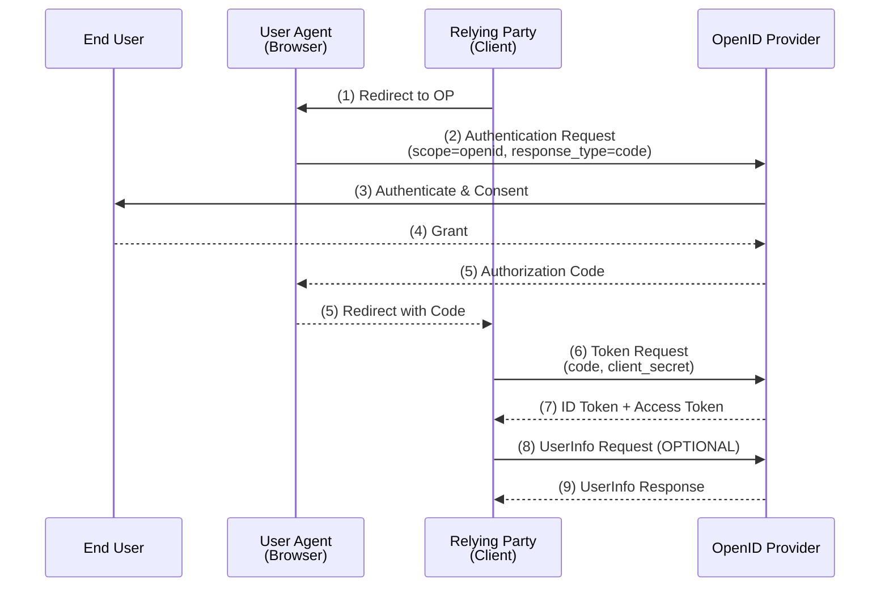
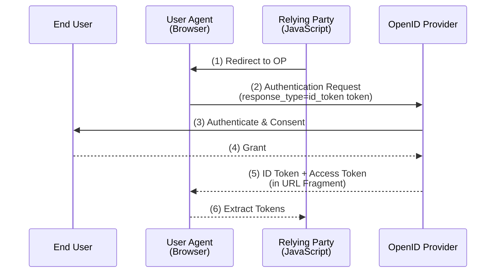
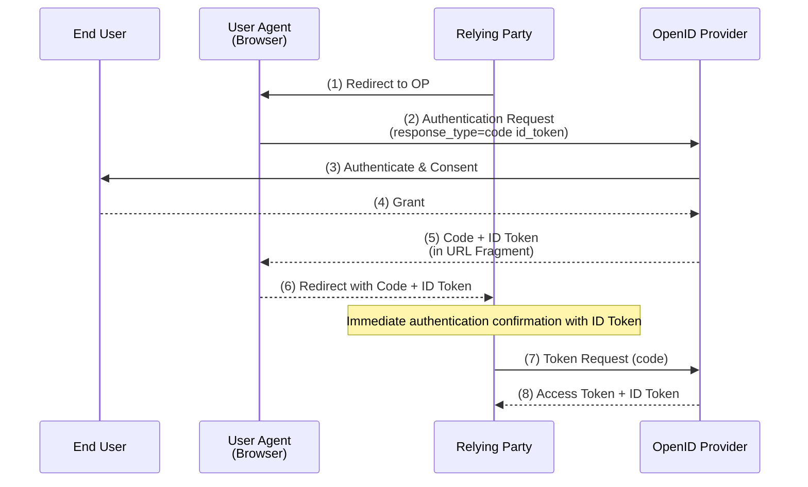

Summary based on OpenID Connect Core 1.0.

---

## RFC Terms (RFC 2119)

| Term | Meaning |
|-----|------|
| **MUST** / **REQUIRED** / **SHALL** | Absolute requirement |
| **MUST NOT** / **SHALL NOT** | Absolute prohibition |
| **SHOULD** / **RECOMMENDED** | Recommended (should be followed unless there is a special reason) |
| **SHOULD NOT** / **NOT RECOMMENDED** | Not recommended (should be avoided unless there is a special reason) |
| **MAY** / **OPTIONAL** | Optional (may or may not be implemented) |

---

## Overview

OpenID Connect (OIDC) is an **authentication protocol that adds a simple identity layer on top of the OAuth 2.0 protocol**.

While OAuth 2.0 is a framework for "authorization," OIDC achieves "authentication."

| Item | OAuth 2.0 | OpenID Connect |
|-----|-----------|----------------|
| Purpose | Authorization | Authentication |
| Obtained | Access Token | ID Token + Access Token |
| User Information | Not standardized | Standard claims defined |

---

## Terminology

| OAuth 2.0 | OpenID Connect | Description |
|-----------|----------------|------|
| Authorization Server | **OpenID Provider (OP)** | Authenticates users and issues ID Tokens |
| Client | **Relying Party (RP)** | Application requesting authentication from OP |

---

## ID Token

A core concept of OIDC. A **JWT (JSON Web Token) containing claims about the authentication event**.

### Structure of ID Token

```
Header.Payload.Signature
```

JWT consists of three parts, each Base64URL encoded.

### Required Claims (REQUIRED)

| Claim | Description |
|---------|------|
| **iss** | Issuer Identifier. URL identifying the OP (https scheme, MUST) |
| **sub** | Subject Identifier. Identifier for the end user (255 characters or less, ASCII) |
| **aud** | Audience. The intended recipient of this ID Token. Must include client_id (MUST) |
| **exp** | Expiration Time. Validity period (UNIX time) |
| **iat** | Issued At. Time of issuance (UNIX time) |

### Conditionally Required Claims

| Claim | Condition | Description |
|---------|------|------|
| **auth_time** | When max_age is specified (REQUIRED) | Time of authentication |
| **nonce** | If included in the request (REQUIRED) | Countermeasure against replay attacks |

### Optional Claims

| Claim | Description |
|---------|------|
| **acr** | Authentication Context Class Reference. Authentication context class |
| **amr** | Authentication Methods References. Array of authentication methods |
| **azp** | Authorized Party. Authorized party (if aud has multiple values) |
| **at_hash** | Access Token Hash. Hash value of the access token |

### Signature and Encryption

| Requirement | Strength |
|-----|:----:|
| ID Token must be signed | MUST |
| Signature algorithm must be other than none | MUST |
| If encrypted, encrypt after signing | MUST |

---

## Three Authentication Flows

### Flow Selection Guide

| Flow | response_type | Use Case |
|-------|---------------|------|
| **Authorization Code Flow** | `code` | Server-side applications |
| **Implicit Flow** | `id_token` or `id_token token` | Browser-based apps like SPAs |
| **Hybrid Flow** | `code id_token` / `code token` / `code id_token token` | When both characteristics are needed |

### 1. Authorization Code Flow

**The most recommended flow**. Tokens do not pass through the User Agent.



| Feature | Content |
|-----|------|
| Token Acquisition | Obtained from Token Endpoint |
| Client Authentication | Possible |
| Refresh Token | Can be issued |
| Security | High (tokens are not exposed to the browser) |

### 2. Implicit Flow

**For browser-based JavaScript applications.**



| Feature | Content |
|-----|------|
| Token Acquisition | Directly from Authorization Endpoint (URL fragment) |
| nonce | REQUIRED (countermeasure against replay attacks) |
| Client Authentication | Not possible |
| Refresh Token | Not issued |
| Security | Lower than Authorization Code Flow |

**Note**: In OAuth 2.1, **not recommended** for security reasons. Use Authorization Code Flow with PKCE.

### 3. Hybrid Flow

**A flow combining characteristics of Authorization Code Flow and Implicit Flow.**



| response_type | From Authorization Endpoint | From Token Endpoint |
|---------------|---------------------------|-------------------|
| `code id_token` | Code, ID Token | Access Token, ID Token |
| `code token` | Code, Access Token | Access Token, ID Token |
| `code id_token token` | Code, ID Token, Access Token | Access Token, ID Token |

---

## Authentication Request Parameters

### Required Parameters (REQUIRED)

| Parameter | Description |
|-----------|------|
| **scope** | Must include `openid` (MUST) |
| **response_type** | `code`, `id_token`, `id_token token`, `code id_token`, etc. |
| **client_id** | Client identifier registered with OP |
| **redirect_uri** | Must exactly match registered URI (MUST) |

### Recommended Parameters (RECOMMENDED)

| Parameter | Description |
|-----------|------|
| **state** | Random value for CSRF protection |

### Optional Parameters (OPTIONAL)

| Parameter | Description |
|-----------|------|
| **nonce** | Countermeasure against replay attacks. REQUIRED in Implicit/Hybrid Flow |
| **display** | How the authentication UI is displayed (`page`, `popup`, `touch`, `wap`) |
| **prompt** | Specifies authentication behavior (`none`, `login`, `consent`, `select_account`) |
| **max_age** | Maximum authentication age (seconds) |
| **ui_locales** | UI language (BCP47 format, space-separated) |
| **id_token_hint** | Previously issued ID Token |
| **login_hint** | Hint for login identifier (e.g., email address) |
| **acr_values** | Requested authentication context class |

### Values for prompt Parameter

| Value | Behavior |
|----|------|
| `none` | Authenticate without displaying UI. Error if not authenticated |
| `login` | Request re-authentication |
| `consent` | Display consent screen |
| `select_account` | Display account selection screen |

---

## UserInfo Endpoint

An OAuth 2.0 Protected Resource that returns claims about the authenticated user.

### Requirements

| Item | Requirement |
|-----|:----:|
| TLS | MUST |
| Support for HTTP GET | MUST |
| Support for HTTP POST | MUST |
| Bearer Token | MUST |
| CORS Support | SHOULD |

### Request Example

```http
GET /userinfo HTTP/1.1
Host: op.example.com
Authorization: Bearer SlAV32hkKG
```

### Response Example

```json
{
  "sub": "248289761001",
  "name": "Jane Doe",
  "given_name": "Jane",
  "family_name": "Doe",
  "email": "janedoe@example.com",
  "email_verified": true,
  "picture": "https://example.com/janedoe/me.jpg"
}
```

### Verification Requirements

| Requirement | Strength |
|-----|:----:|
| Ensure `sub` in UserInfo Response matches `sub` in ID Token | MUST |
| Verify OP's TLS certificate | MUST |
| If signed, verify signature | SHOULD |

---

## Standard Claims

### Profile Related

| Claim | Type | Description |
|---------|-----|------|
| sub | string | Subject Identifier (REQUIRED) |
| name | string | Full name |
| given_name | string | First name |
| family_name | string | Last name |
| middle_name | string | Middle name |
| nickname | string | Nickname |
| preferred_username | string | Preferred username |
| profile | string | Profile page URL |
| picture | string | Profile image URL |
| website | string | Website URL |
| gender | string | Gender |
| birthdate | string | Birthdate (YYYY-MM-DD format) |
| zoneinfo | string | Time zone (e.g., `Asia/Tokyo`) |
| locale | string | Locale (BCP47 format, e.g., `ja-JP`) |
| updated_at | number | Last updated time (UNIX time) |

### Contact Related

| Claim | Type | Description |
|---------|-----|------|
| email | string | Email address |
| email_verified | boolean | Whether email is verified |
| phone_number | string | Phone number (E.164 format recommended) |
| phone_number_verified | boolean | Whether phone number is verified |
| address | object | Address information (structured object) |

### Address Object

```json
{
  "formatted": "〒100-0001 東京都千代田区...",
  "street_address": "千代田1-1-1",
  "locality": "千代田区",
  "region": "東京都",
  "postal_code": "100-0001",
  "country": "JP"
}
```

### Notes

| Requirement | Strength |
|-----|:----:|
| Do not assume `preferred_username` is unique | MUST NOT |
| Do not assume `email` is unique | MUST NOT |

---

## Scope and Claims Mapping

| Scope | Returned Claims |
|---------|-------------------|
| `openid` | sub |
| `profile` | name, family_name, given_name, middle_name, nickname, preferred_username, profile, picture, website, gender, birthdate, zoneinfo, locale, updated_at |
| `email` | email, email_verified |
| `address` | address |
| `phone` | phone_number, phone_number_verified |

---

## Security Considerations

### TLS Requirements

| Endpoint | TLS |
|---------------|:----:|
| Authorization Endpoint | MUST |
| Token Endpoint | MUST |
| UserInfo Endpoint | MUST |

### Replay Attack Countermeasures

| Countermeasure | Strength |
|-----|:----:|
| Ensure nonce value has sufficient entropy | MUST |
| Store and verify nonce linked to session | MUST |

### CSRF Countermeasures

| Countermeasure | Strength |
|-----|:----:|
| Use state parameter | RECOMMENDED |
| Verify state linked to session | RECOMMENDED |

### Token Substitution Attack Countermeasures

| Countermeasure | Strength |
|-----|:----:|
| Ensure `sub` in UserInfo Response matches `sub` in ID Token | MUST |
| Verify at_hash in Implicit/Hybrid Flow | SHOULD |

### Others

| Item | Recommendation |
|-----|------|
| Set short expiration for Authorization Code | RECOMMENDED: within 10 minutes |
| Rotate signing/encryption keys regularly |
| Clickjacking protection | Use X-Frame-Options or frame-ancestors |

---

## Comparison with OAuth 2.0

| Item | OAuth 2.0 | OpenID Connect |
|-----|-----------|----------------|
| Main Purpose | Access authorization to resources | User authentication |
| Obtained Tokens | Access Token | ID Token + Access Token |
| User Identification | No standard | sub claim |
| User Information Retrieval | Service-specific APIs | Standardized UserInfo Endpoint |
| scope | Arbitrarily defined | Standardized like openid, profile, email, etc. |
| Session Management | Not specified | Supported by Session Management extension |

---

## Related Specifications

| Specification | Description |
|-----|------|
| OpenID Connect Core 1.0 | Core specification (subject of this document) |
| OpenID Connect Discovery 1.0 | Automatic retrieval of OP metadata |
| OpenID Connect Dynamic Client Registration 1.0 | Dynamic client registration |
| OpenID Connect Session Management 1.0 | Session management |
| OpenID Connect Front-Channel Logout 1.0 | Front-channel logout |
| OpenID Connect Back-Channel Logout 1.0 | Back-channel logout |

---

## References

- [OpenID Connect Core 1.0](https://openid-foundation-japan.github.io/openid-connect-core-1_0.ja.html)
- [OpenID Connect Discovery 1.0](https://openid-foundation-japan.github.io/openid-connect-discovery-1_0.ja.html)
- [OpenID Connect Dynamic Client Registration 1.0](https://openid-foundation-japan.github.io/openid-connect-registration-1_0.ja.html)
