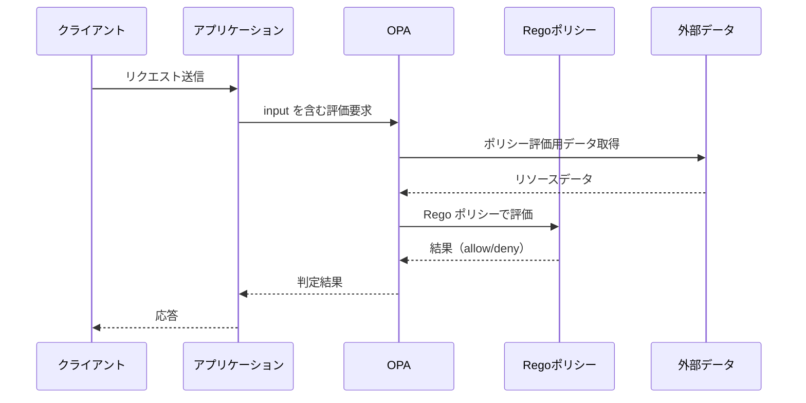
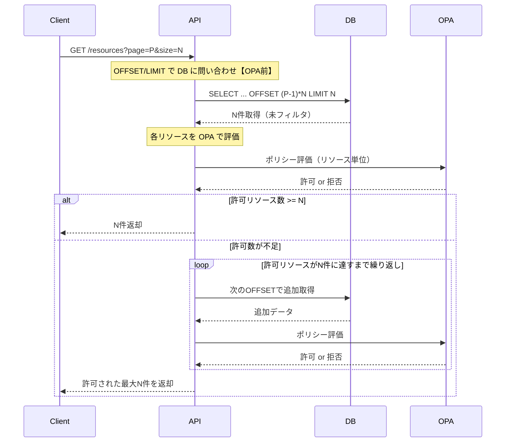
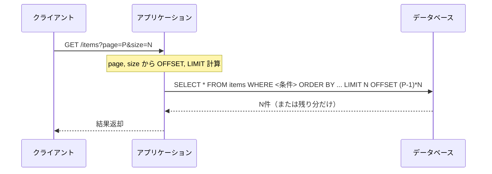

# Basics and Background of OPA
OPA (Open Policy Agent) is an engine that evaluates policies written in the Rego language based on input and external data to make decisions such as allow/deny.

For implementation examples, the [AWS Prescriptive Guidance on Multi-Tenant API Authorization Control](https://docs.aws.amazon.com/ja_jp/prescriptive-guidance/latest/saas-multitenant-api-access-authorization/introduction.html) is useful. It introduces strategies for implementing multi-tenant authorization in SaaS using OPA, which is also helpful for understanding the background of this article.

## Basic OPA Sequence
Below is the basic sequence of access control using OPA.

## Issues with Pagination
Below is the sequence when OPA is naively applied to pagination.

## Offset Pagination

## Cursor Pagination

## Challenges (Possible with SQL but Difficult with Naive OPA Evaluation)

| Aspect             | What was possible with SQL filtering             | Constraints with naive OPA evaluation                              |
| ------------------ | ------------------------------------------------ | ---------------------------------------------------------------- |
| Count Awareness    | Possible to get total count beforehand with WHERE clause | Cannot predict allowed count until after evaluation               |
| Order Consistency  | Achieve stable order and slice with ORDER BY + OFFSET/LIMIT | Mixed denied resources cause unstable display order and page boundaries |
| Page Number Consistency | Possible to display explicit pages like "21st to 40th" | Must construct pages based on allowed results, leading to inconsistency |
| Query Efficiency   | Possible to minimize retrieval and processing using indexes | Need to re-fetch and re-evaluate whenever allowed count is insufficient, increasing load |

## Consideration of Solutions
### 1. Naive Implementation (Offset or Cursor Pagination)
Retrieve all target resources beforehand and pass them to OPA for evaluation. OPA returns not only allow/deny decisions for each resource but also aggregated information like allowed list and denied count, enabling pagination and total hit count display on the app side.

- Advantages:
  - Relatively simple implementation
  - Stable pagination and hit count display based on OPA evaluation results
  - Can return an accurate slice to client requests
- Disadvantages:
  - Memory consumption and latency issues arise as data count increases due to full retrieval and evaluation
  - Re-evaluation may be needed upon re-request unless the evaluated list is retained or cached

### 2. Return Conditions for SQL Generation in OPA
Partially evaluate OPA policies as SQL WHERE clause equivalent conditions and apply them to SQL queries on the app side.

- Advantages: Efficient processing through SQL filtering
- Disadvantages: Requires input data for condition generation in OPA, making Rego policies act as condition generators (weakening policy design consistency)

### 3. Implement Pagination on the Frontend
The backend returns all allowed resources, and the client handles pagination.

- Advantages: Simple implementation, unaffected by OPA application order or count
- Disadvantages: Initial load and communication volume tend to be large due to full retrieval

## Conclusion
Applying OPA naively to list retrieval results in complex issues such as indeterminate return count, increased processing load, ambiguous page boundaries, and degraded user experience due to the inconsistency between pagination and policy evaluation.

There are trade-offs in applying OPA to pagination. It is necessary to clarify "what to prioritize (ease of implementation, performance, expressiveness, consistency)" and consider implementation accordingly.

## References
- [Write Policy in OPA, Enforce in SQL](https://blog.openpolicyagent.org/write-policy-in-opa-enforce-policy-in-sql-d9d24db93bf4)
- [GitHub Issue #1252: Pagination in OPA](https://github.com/open-policy-agent/opa/issues/1252)
- [AWS Prescriptive Guidance: Multi-Tenant API Access Authorization](https://docs.aws.amazon.com/ja_jp/prescriptive-guidance/latest/saas-multitenant-api-access-authorization/introduction.html)
