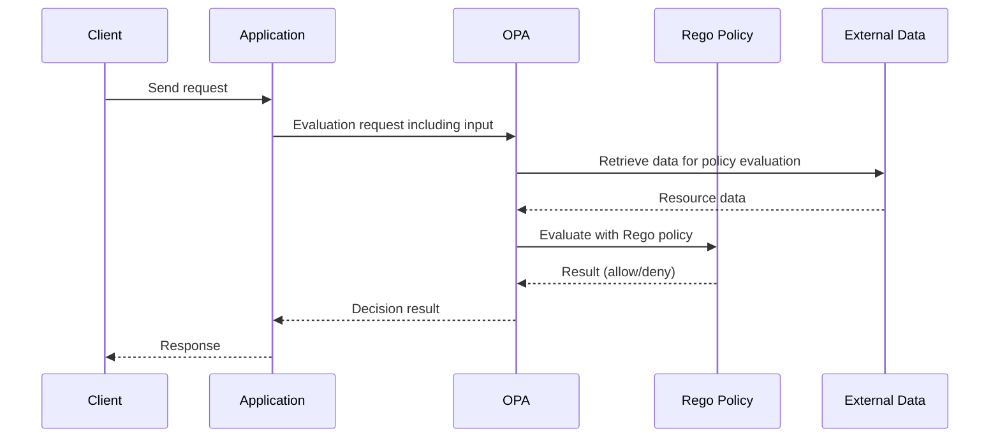
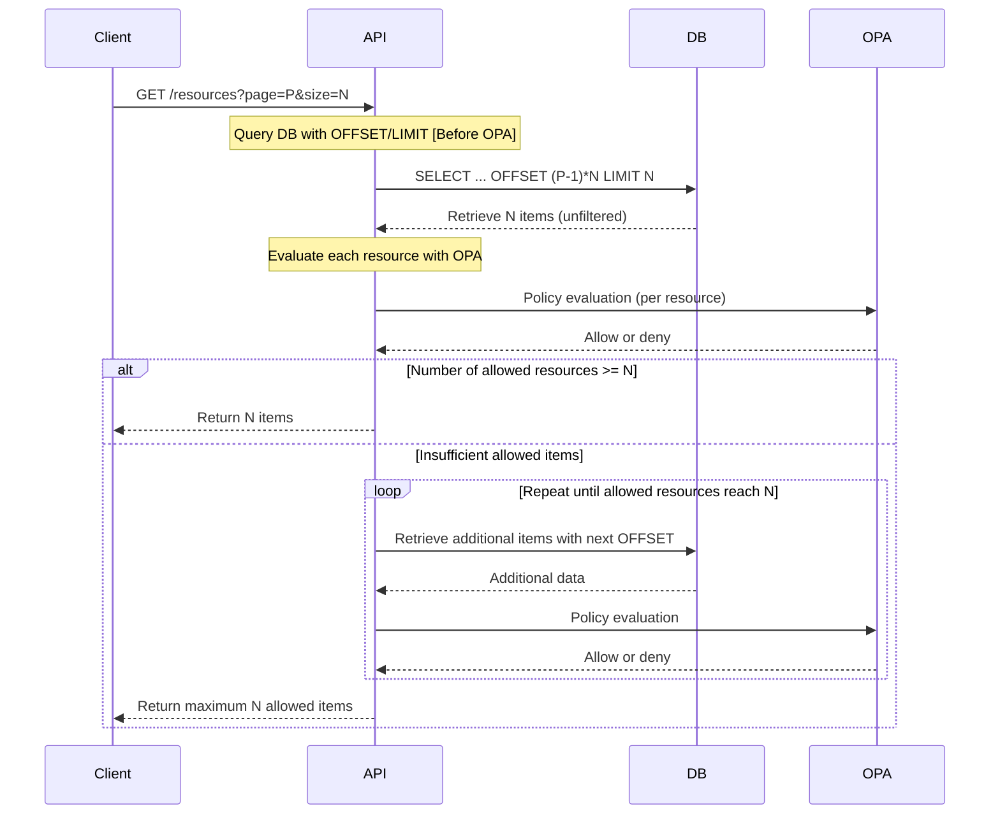
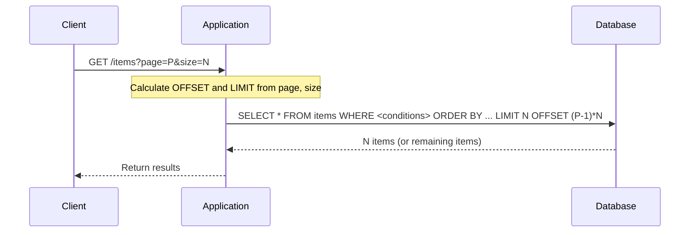
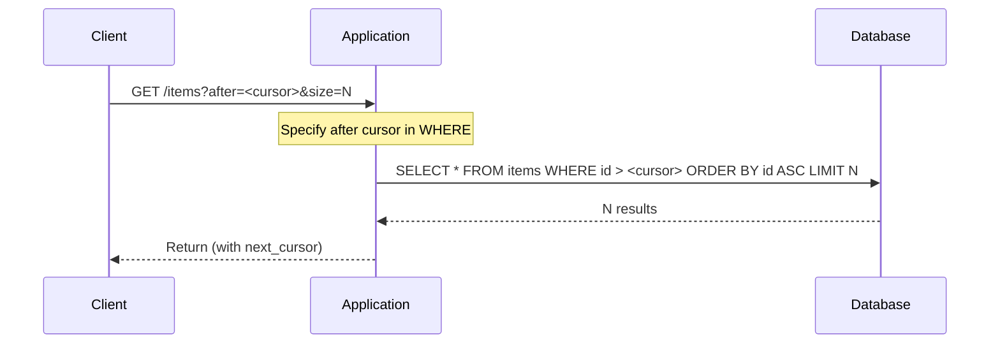

# Basics of OPA and Background Issues
OPA (Open Policy Agent) is an engine that uses policies written in the Rego language to evaluate based on input and external data, making decisions such as allow/deny.

For implementation examples, the [AWS Prescriptive Guidance Multi-Tenant API Authorization Control Guide](https://docs.aws.amazon.com/ja_jp/prescriptive-guidance/latest/saas-multitenant-api-access-authorization/introduction.html) is a useful reference. It introduces implementation strategies for multi-tenant authorization in SaaS using OPA, which also aids in understanding the background of this article.

## Basic OPA Sequence
The following is the basic sequence of access control using OPA.

## Challenges with Pagination
The following is the sequence when OPA is naively applied to pagination.

## Offset Pagination

## Cursor Pagination

## Issues (Possible in SQL, Difficult with Naive OPA Evaluation)

| Perspective        | What was possible with SQL filtering            | Constraints with Naive OPA Evaluation                          |
| ------------------ | ----------------------------------------------- | ------------------------------------------------------------- |
| Count Awareness     | Total count can be obtained in advance with WHERE clause | Allowed count cannot be determined until after evaluation, making prior predictions impossible |
| Order Consistency   | Stable order and slicing achieved with ORDER BY + OFFSET/LIMIT | Mixing denied resources leads to unstable display order and page boundaries |
| Page Number Consistency | Explicit page display like "21st to 40th items" possible | Pages must be constructed based on allowed results, leading to inconsistencies |
| Query Efficiency    | Minimal retrieval and processing possible by utilizing indexes | High load due to the need for re-retrieval and re-evaluation whenever allowed count is insufficient |

## Consideration of Solutions
### 1. Naive Implementation (Offset or Cursor Pagination)
Retrieve all target resources in advance and pass them to OPA for evaluation. OPA returns not only allow/deny decisions for each resource but also aggregated information such as allowed lists and denied counts, enabling pagination and total hit count display on the application side.

- **Advantages:**
  - Relatively simple implementation
  - Stable pagination and hit count display based on OPA evaluation results
  - Accurate slices returned for client requests
- **Disadvantages:**
  - Memory consumption and latency issues arise as data count increases due to full retrieval and evaluation
  - Re-evaluation may be necessary upon re-request unless the evaluated list is retained or cached

### 2. Return Conditions for SQL Generation in OPA
Partially evaluate OPA policies as conditions equivalent to SQL WHERE clauses representing allow conditions, applying them to SQL queries on the application side.

- **Advantages:** High efficiency processing through SQL filtering
- **Disadvantages:** Input data for condition generation is required by OPA, leading to Rego policies becoming condition generators (diluting consistency in policy design)

### 3. Implement Pagination on the Frontend
The backend returns all allowed resources, and the client handles paging.

- **Advantages:** Simple implementation, unaffected by OPA application order or count
- **Disadvantages:** Initial load and communication volume may increase due to full retrieval

## Conclusion
In the naive application of OPA for list retrieval, the inconsistency between pagination and policy evaluation leads to complex issues such as indeterminate return counts, increased processing load, ambiguous page boundaries, and degraded user experience.

There are trade-offs in applying OPA to pagination. It is necessary to clarify "what to prioritize (implementation ease, performance, expressiveness, consistency)" before considering implementation.

## References
- [Write Policy in OPA, Enforce in SQL](https://blog.openpolicyagent.org/write-policy-in-opa-enforce-policy-in-sql-d9d24db93bf4)
- [GitHub Issue #1252: Pagination in OPA](https://github.com/open-policy-agent/opa/issues/1252)
- [AWS Prescriptive Guidance: Multi-Tenant API Access Authorization](https://docs.aws.amazon.com/ja_jp/prescriptive-guidance/latest/saas-multitenant-api-access-authorization/introduction.html)