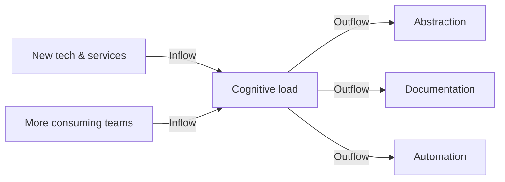
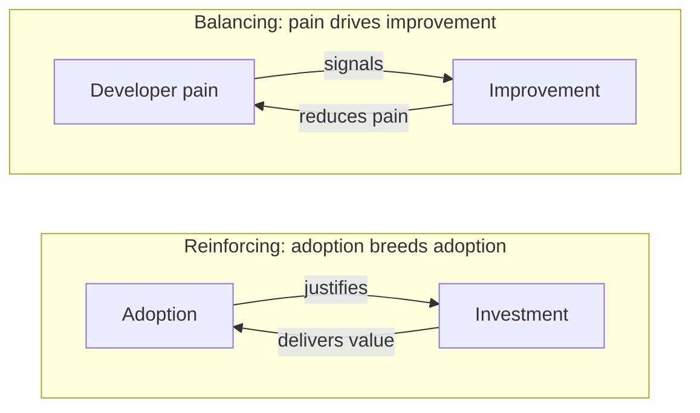
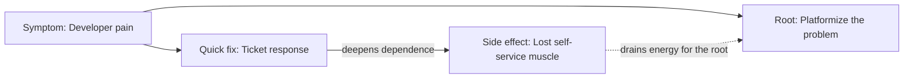

## Why This Lens

Platform engineering and systems thinking seem to share a lot of ground. This post is my attempt to put that hunch into words.

The core vocabulary of systems thinking lives in [Systems Thinking Basics](/en/posts/systems-thinking-basics). For the definition of platform engineering itself and the shape of an Internal Developer Platform (IDP), see [What is Platform Engineering? Building Internal Developer Platforms](/en/posts/platform-engineering-explained). This post applies the systems-thinking vocabulary — stocks, flows, delays, archetypes, leverage points — to platform engineering.

## Outline of the Affinity

Platform engineering pairs well with systems thinking because its subject stays dynamic from the start. Five traits stand out.

- Users, capabilities, and lifecycles all change over time
- It functions as a device for lowering cognitive load (a stock)
- It depends on a continuous feedback loop with internal customers
- Effects of investment, migration, and abstraction arrive with long delays
- Local optima and global optima keep drifting against each other

The rest of the post walks through these five.

## Read the Stocks

The easiest thing to overlook in platform design is the stock. Tools and UIs grab attention; the real concern is how things accumulate. Common stocks include:

- Developer cognitive load
- Platform adoption rate
- Developer trust
- Technical debt
- Documentation freshness

Cognitive load sits at the center. Each new technology or service adds inflow; abstraction, documentation, and automation drain it. Inflow alone overflows the tub. Outflow alone leaves it stagnant. The bathtub picture holds.

Stocks shift slowly. A new golden path does not drop the load right away. The level moves while you keep inflow and outflow in balance over time.

## Read the Feedback

Two loops live inside a platform at once. Both have to turn for the system to stay alive.

The first loop reacts to pain. Developer dissatisfaction or Four Keys regressions show up, and investment goes into easing the friction. That is the balancing loop. The second loop reinforces. The wider the adoption, the easier it becomes to justify investment; features and quality improve, which pulls adoption further. Platform as a Product rides this loop.

A reverse reinforcing loop runs alongside. When the platform feels awkward, each team rolls its own tools — shadow IT. The further it spreads, the harder the return to the standard becomes, and cognitive load and support costs climb. Without deliberate counter-investment, the rival loop wins.

## Read the Delays

Platform effects arrive late. Replacing a base layer takes months. A new abstraction takes quarters to land. Four Keys and DevEx scores move even later. Linking today's actions directly to today's metrics misreads the system.

Miss the delay and people pile on more action. They run a second dashboard because the first one stays silent. They pull a deadline forward because the migration looks stuck. The pattern overshoots and leaves more operational debt behind. Waiting for the effect to land tends to pay off on platforms.

## Common Archetypes

Different organizations repeat the same failure because the underlying structure looks similar. A few archetypes recur on platforms.

### Shifting the Burden

When toil grows, the fastest move is a ticket-by-ticket response. Yet each round of tickets deepens dependence on the central team. Energy that should go into platforming the problem dries up. Eventually "we run on tickets" becomes the norm. That is shifting the burden.

One way out: cap the total cost of the quick fix. Budget time for ticket work, and route the overflow into root-cause work by design, not by goodwill.

### Fixes That Fail

Shell scripts and copypaste runbooks pile up to ease daily friction. They feel handy at first, but automation without abstraction soon contradicts itself. Maintenance cost snowballs. Fixes That Fail.

### Tragedy of the Commons

A shared platform belongs to everyone and to no one. Without feedback, off-pattern usage layers up, and operating cost spreads thinly across all users. With no chargeback and no shared SLO view, the decline of the commons does not stop.

### Limits to Growth

The more the platform succeeds, the wider the usage; the wider the usage, the higher the cognitive load climbs. When the pace of improvement lags, satisfaction drops fast. Stacking more capabilities rarely helps. Raising the level of abstraction and reorganizing the layers tends to work for longer.

## Where the Leverage Sits

Meadows ranks twelve leverage points from weakest (#12) to strongest (#1). Here is the same list, mapped onto platform engineering.

| # | Meadows's lever | Example on a platform |
| --- | --- | --- |
| 12 | Numbers and parameters | SLO thresholds, budgets, quotas |
| 11 | Buffers | Spare capacity, lead-time buffer |
| 10 | Stock and flow structures | Abstractions, stock dashboards |
| 9 | Delays | Migration sprints, community time |
| 8 | Balancing loops | Pain metrics into improvement |
| 7 | Reinforcing loops | Adoption → investment → value → adoption |
| 6 | Information flows | Portal, service catalog, dashboards |
| 5 | Rules | Golden paths, policy as code |
| 4 | Self-organization | Inner Source, platform contribution model |
| 3 | Goals | Flow / DevEx over raw velocity |
| 2 | Paradigm | Internal product over central control |
| 1 | Transcending paradigm | Asking "what is the platform for?" |

Lower-numbered points carry more weight, yet take more effort to move. Tuning SLOs or budgets (#12) leaves cognitive load (#10) alone. Shift the paradigm (#2) and goals, rules, and information flows follow. Treating the platform as central control or as an internal product is the strongest leverage there is.

## Structure Is a Leverage Point Too

Code and infrastructure alone do not shape a platform's behavior. Conway's Law tells us the organization shapes the architecture and the behavior. Change the platform without changing the structure around it, and the system pulls back to where it began.

Team Topologies, by Skelton and Pais, offers an organizational answer. Team types and interaction modes become the design target, and the structure itself lowers cognitive load. In systems-thinking terms, that intervention reaches the high-leverage end of Meadows's list — self-organization through paradigm. This post does not go deep into it; the point is that the leverage on a platform never sits purely inside the tech.

## Wrap-Up

Platform engineering is not a stack of tools. A platform brings people, software, and interactions together into a system. Read its behavior. Diagnose the recurring archetypes. Apply force at the spots that move it most. The same budget reaches a different distance depending on whether this posture holds.

Before adding one more feature, draw your platform as a circle. The sense that the world runs on systems shows up at your feet too.

## References

- Donella H. Meadows, *Thinking in Systems: A Primer* (Chelsea Green Publishing, 2008)
- Cloud Native Computing Foundation App Delivery TAG, *CNCF Platforms White Paper* (2023)
- Nicole Forsgren, Jez Humble, and Gene Kim, *Accelerate: The Science of Lean Software and DevOps* (IT Revolution Press, 2018)
- Matthew Skelton and Manuel Pais, *Team Topologies: Organizing Business and Technology Teams for Fast Flow* (IT Revolution Press, 2019)

