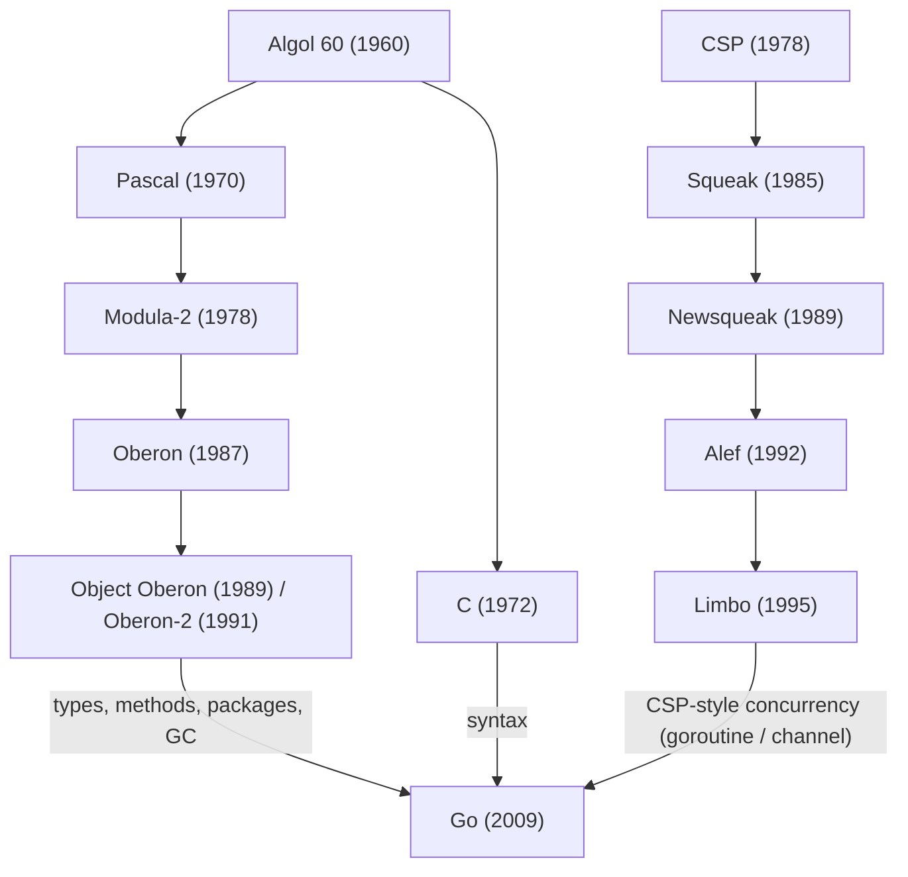

# Overview

The history of programming languages runs along two great lineages. Niklaus Wirth shaped one of them, the lineage of structure and modularity, from Pascal onward. Tony Hoare started the other with CSP, the root of a concurrency lineage. The two rivers cross over decades and finally merge into Go.

This article walks the path from Algol 60 to Go and organizes the traits and historical links of each language. Every claim rests on the sources at the end and matches the official Go FAQ and the primary references for each language.

# Two great lineages

Start with the big picture. The official Go FAQ describes Go's ancestry as three streams: most of the syntax comes from the C family; declarations and packages come from the Pascal/Modula/Oberon family; and concurrency comes from Newsqueak and Limbo, which trace back to Hoare's CSP. This article follows the same map.

- The Oberon line: a lean type system, object orientation without inheritance, module management through packages, and garbage collection
- The CSP line: process communication through channels, the `select` statement, and lightweight processes

# 1. The Algol 60 lineage: the origin of structured programming

## Algol 60 (1960)

Nearly every procedural language today descends directly from Algol 60.

Algol 60 offered block structure through `begin ... end`, local variable scope, and recursion, and it became the first major language to define its grammar formally in BNF (Backus–Naur Form). From C and Pascal to Java and Go, the basic rules of syntax start here.

## Pascal (1970)

Niklaus Wirth designed Pascal for teaching and for writing systems.

Pascal simplified Algol 60 and added a strict type system, including the `record` type. It also earned a reputation for fast compilation. Pascal spread structured programming across the world and stood beside C as a standard language.

# 2. Modularity and the Oberon lineage: Wirth's pursuit

This part follows how Wirth resisted the growing complexity of software and pursued simplicity and modularity.

## Modula-2 (1978)

Modula-2 succeeded Pascal and introduced the concept of the module, exactly as its name suggests.

It split the definition part (`DEFINITION MODULE`) from the implementation part (`IMPLEMENTATION MODULE`), which enabled separate compilation and encapsulation. It also supported simple concurrency through coroutines.

## Oberon (1987)

Wirth and Jürg Gutknecht designed Oberon together with a tiny operating system, Oberon OS. It strips Modula-2 down to the extreme.

Wirth removed the complex features and added only two things: type extension, which resembles single inheritance, and garbage collection. Oberon marks the peak of his philosophy: gain the most expressive power from the fewest features.

## Object Oberon (1989) and Oberon-2 (1991)

Two extensions added full object orientation to Oberon. Mössenböck, Templ, and Griesemer built Object Oberon; Mössenböck and Wirth built Oberon-2. Both introduced type-bound procedures with a receiver, that is, methods.

One choice stands out: they added no `class` construct. Instead, they attached methods directly to Oberon's type extension.

### The connection to Go

Go's design carries a clear mark of the Oberon line.

- It holds no `class` and binds methods to structs
- It uses type embedding instead of inheritance
- It manages modules through packages

The clearest link runs through a person. Robert Griesemer, one of Go's three creators, studied under Wirth and Mössenböck at ETH Zurich and co-authored Object Oberon (1989). An author of the Oberon line joined the Go design directly.

# 3. CSP and the concurrency lineage: the direct ancestor of Go's concurrency

Goroutines and channels, the defining features of Go, grew out of a concurrency model that centered on Bell Labs.

## CSP (1978)

Tony Hoare proposed CSP (Communicating Sequential Processes) in a 1978 paper as a theory and model of concurrency. Note that CSP names a concept, not a language.

CSP set out a clear philosophy: do not share memory to communicate; instead, communicate to share memory. It frames concurrency around processes and channels rather than threads and locks. Go inherited that idea as a proverb: "Do not communicate by sharing memory; instead, share memory by communicating."

## Squeak (1985)

Luca Cardelli and Rob Pike at Bell Labs built Squeak to express, in a programming language, the concurrency of a user interface that handles input devices such as mice and keyboards. They presented it as "a language for communicating with mice."

Squeak stands as an early experiment that expressed the CSP model as a programming language. Note that it differs from the Smalltalk implementation of the same name.

## Newsqueak (1989)

Rob Pike built Newsqueak on top of Squeak as a more practical concurrency language.

Its syntax sits close to C. Newsqueak realized first-class channels (`chan`), dynamic process and channel creation, and the `select` statement that waits on several channels at once. Each of these features appears in Go today.

## Alef (1992)

Phil Winterbottom at Bell Labs designed Alef for Plan 9, the next-generation operating system project. Alef appeared around 1992, and its language reference shipped with the second edition of Plan 9 in 1995. It expressed Newsqueak's channel-based CSP concurrency (`proc`, `task`, `chan`) in a compiled, C-like language.

Yet Alef carried a fatal weakness: it had no automatic memory management, that is, no garbage collection. Pike and others urged Winterbottom to add garbage collection, but it never happened. Manual memory management sits poorly with concurrency, and maintaining a variant language across many architectures proved hard. Plan 9 dropped Alef in its third edition, and its concurrency model carried over into a thread library for C (libthread).

## Limbo (1995)

Limbo followed as the direct successor of Alef. Sean Dorward, Phil Winterbottom, and Rob Pike built it for Inferno, a distributed operating system.

Limbo carried the CSP-style concurrency that Newsqueak and Alef had refined, and it added the automatic garbage collection that Alef lacked. Its typed channels, strong typing, and modularity show through clearly in Go's design. This is why the official Go FAQ names Newsqueak and Limbo as the ancestors of Go's concurrency.

# Conclusion: every lineage leads to Go

These languages form the lineage of technology that Go's designers passed through and refined on their way to Go.

The two lineages finally met, literally, in the Go team. From the Oberon line came Robert Griesemer; from CSP and Bell Labs came Rob Pike and Ken Thompson. They began designing Go in 2007.

Go built on the simple syntax of C. Onto it, the team brought a lean type system and package-based module management from Oberon and Oberon-2, and the CSP concurrency that grew from Newsqueak through Limbo. Then a modern runtime, with garbage collection, solved the memory management that Alef could not.

Behind a single line of Go lies more than half a century of language design. Once you know the lineage, the intent behind Go's design comes into sharper view.

# References

- [Go FAQ — What are Go's ancestors? / Why build concurrency on the ideas of CSP?](https://go.dev/doc/faq)
- [Rob Pike, "Origins of Go concurrency style" (OSCON 2010)](https://www.youtube.com/watch?v=3DtUzH3zoFo)
- [Wikipedia: Newsqueak](https://en.wikipedia.org/wiki/Newsqueak)
- [Wikipedia: Alef (programming language)](https://en.wikipedia.org/wiki/Alef_(programming_language))
- [Wikipedia: Limbo (programming language)](https://en.wikipedia.org/wiki/Limbo_(programming_language))
- [Mössenböck, Templ, Griesemer, "Object Oberon: An Object-Oriented Extension of Oberon" (ETH TR 109, 1989)](https://www.research-collection.ethz.ch/handle/20.500.11850/68697)
- [Cardelli, Pike, "Squeak: a language for communicating with mice" (SIGGRAPH 1985)](http://ordiecole.com/squeak/cardelli_squeak1985.pdf)
