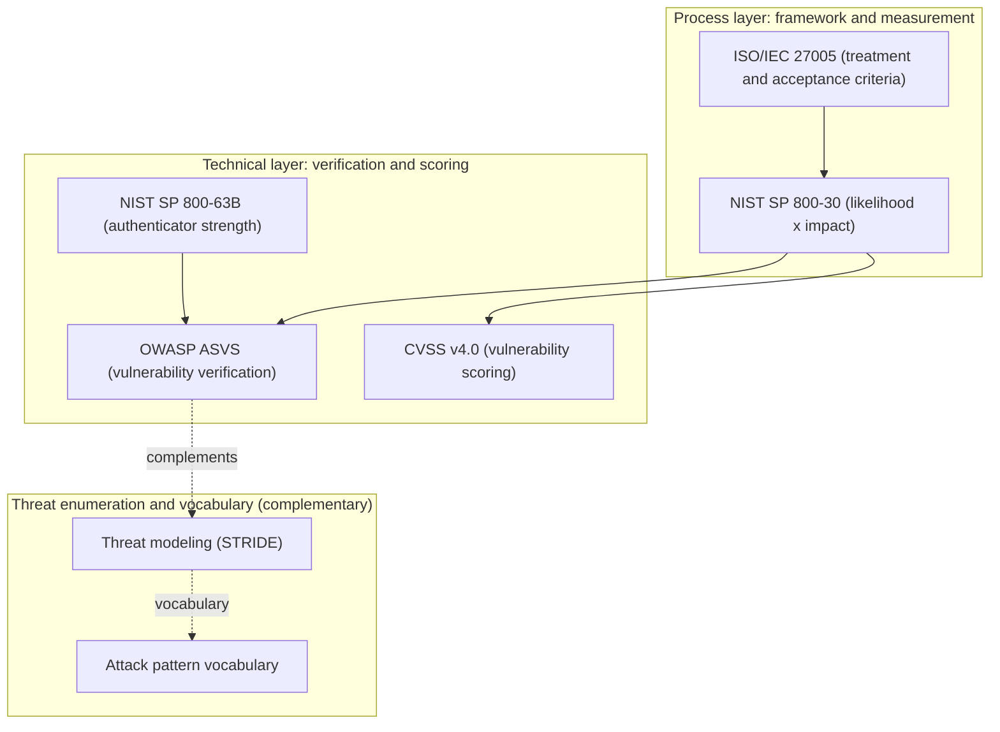

# Overview

When you set out to work on a risk assessment, standards and guides like NIST, ISO, and OWASP keep showing up, and you easily get lost over "which one to read, in what order, and for what purpose." Each covers a different scope, so lining them up with inconsistent terminology and granularity makes discussions fail to connect.

This article does not explain how to actually perform a risk assessment. Its goal is to organize, into a single map, the prerequisite knowledge worth sharing as common language before you start. Specifically, it covers:

- The basic concepts of assets, threats, vulnerabilities, and risk (the foundation for everything)
- Where the five key documents (NIST SP 800-30 / ISO/IEC 27005 / OWASP ASVS / NIST SP 800-63B / CVSS v4.0) fit within risk
- The methods and vocabulary that complement "threat enumeration," which the five alone cover thinly (threat modeling / OWASP Top 10 / MITRE ATT&CK)

It stays general-purpose and does not lean on any specific domain.

# Basic concepts: assets, threats, vulnerabilities, and risk

Every document builds on the following four terms. Without aligning on these first, later discussion drifts.

| Term | Definition | Example |
| --- | --- | --- |
| Asset | What you want to protect | Personal data, systems, trust in a service, availability |
| Threat | An event or actor that can harm an asset | External attackers, insider misuse, misconfiguration, disasters |
| Vulnerability | A weakness a threat can exploit | Implementation bugs, design flaws, operational gaps, unpatched software |
| Risk | The likelihood that a threat exploits a vulnerability to affect an asset, times the impact | e.g., an attacker exploits a known vulnerability on a public server and leaks personal data |

The key is to capture risk decomposed as follows.

> **Risk = f(likelihood of the threat, ease of exploiting the vulnerability, magnitude of impact)**

Using these three variables as an axis, you can position each document by which variable it addresses. The rest of this article uses this decomposition as its backbone.

# The whole map: which variable and which layer each document covers

Organizing the five key documents plus the complementary methods by the three risk variables and by "layer" gives the following.

| Document | Variable it mainly covers | Layer | In one line |
| --- | --- | --- | --- |
| NIST SP 800-30 | Likelihood times impact (how to measure) | Process (measurement) | How to measure risk |
| ISO/IEC 27005 | Treatment and acceptance criteria (after measuring) | Process (framework) | How much to accept and how to handle it |
| OWASP ASVS | Vulnerabilities (exhaustive enumeration) | Technical (verification) | What to verify |
| NIST SP 800-63B | Strength of vulnerabilities and countermeasures | Technical (authentication-specific) | A yardstick for authentication strength |
| CVSS v4.0 | Severity of a vulnerability (scoring) | Technical (scoring) | Scoring an individual vulnerability |
| Threat modeling (STRIDE) | Threats (enumeration at design time) | Method | Systematically listing threats |
| OWASP Top 10 / MITRE ATT&CK | Threats (attack vocabulary) | Vocabulary | A shared language for attacks |

By layer, these split broadly into a "process layer (framework and measurement)" and a "technical layer (verification and scoring)."

On this map, the five documents look **strong on vulnerabilities, impact, and measurement or treatment, but thin on enumerating the threats themselves**. The threat modeling and attack vocabulary in the final section fill that gap.

# What to grasp in each document

Below, each document follows the same shape: its purpose, key points, which of the three variables it covers, and where to use it.

## NIST SP 800-30 Rev.1 — how to measure risk

This document defines the procedure for a risk assessment. It answers "how do you measure risk" directly.

- The four steps of a risk assessment: **prepare, conduct, communicate results, maintain**
- **The distinction between a Threat Source and a Threat Event** (the tables in Appendices D and E work as-is)
- How to define the qualitative scales (Very Low to Very High) for Likelihood and Impact
- The **risk matrix** in Appendix I (a table that derives the risk level from likelihood and impact)
- **Variable it covers**: likelihood and impact (the measurement of risk itself)
- **Where to use it**: when you want to estimate the size of a risk on a consistent scale

## ISO/IEC 27005 — the risk management framework

This document lays out the framework of risk management. If 800-30 covers "how to measure," this one also covers "what to do after measuring."

- The difference between risk **assessment** (identification, analysis, evaluation) and risk **treatment**
- The four options for risk treatment: **avoid / reduce (modify) / share (transfer) / retain (accept)**, and the criteria for each
- The idea of deciding **risk acceptance criteria** up front. Without first defining how much you will accept, evaluation turns arbitrary
- **Variable it covers**: the decision after measuring (treatment and acceptance)
- **Where to use it**: when you decide a policy for an estimated risk. This is a paid standard, so explanatory materials from JIPDEC or IPA work for a conceptual understanding

## OWASP ASVS — a checklist of what to verify

This list systematizes application security verification items. Use it to list the "vulnerability" side thoroughly.

- Choosing between Levels 1 to 3 (L2 marks the standard line for typical apps, L3 targets high risk)
- Each category, such as authentication and session management, lists concrete verification requirements
- **Variable it covers**: vulnerabilities (coverage)
- **Where to use it**: when you check, item by item, whether your implementation has gaps

## NIST SP 800-63B — a yardstick for authenticator strength

A yardstick for authentication strength. It helps when you discuss authentication-related risk.

- The definitions of **AAL1/2/3** (Authentication Assurance Levels) and the authenticators each level allows
- Requirements for passwords (memorized secrets), rate limiting, and verifier compromise resistance
- The principle that **separates the identifier from the authenticator** (an identifier is not a secret)
- **Variable it covers**: the strength of vulnerabilities and countermeasures (authentication-specific)
- **Where to use it**: when you discuss authentication-specific weaknesses, such as using a guessable identifier for authentication

## CVSS v4.0 — scoring individual vulnerabilities

A common metric for assigning a severity score to an individual vulnerability.

- The structure of the Base / Threat / Environmental metrics
- **CVSS gives the "severity of a vulnerability," not "risk" itself** (FIRST states this explicitly). Only after you factor in your own organization's context through the Environmental metrics does it approach risk
- **Variable it covers**: severity of a vulnerability (scoring)
- **Where to use it**: when you rank individual vulnerabilities. Do not treat the score directly as risk

# The thin area with the five alone: threat enumeration and attack vocabulary

As the whole map shows, the five documents run strong on vulnerabilities, impact, and measurement or treatment, yet tend to run thin on **how to enumerate the threats themselves**. The following two fill that gap.

## Threat modeling (STRIDE, etc.)

A method for enumerating threats systematically at the design stage. STRIDE walks six categories.

- Spoofing
- Tampering
- Repudiation
- Information Disclosure
- Denial of Service
- Elevation of Privilege

Against ASVS's "what to verify (What)," threat modeling fills in "what threats even exist," so the two complement each other.

## OWASP Top 10 / MITRE ATT&CK

Use these as vocabulary for actual attack patterns.

- **OWASP Top 10**: a set of categories for the most critical risks common to web apps. It turns high-priority, well-known weaknesses into a shared language.
- **MITRE ATT&CK**: a knowledge base that systematizes attackers' tactics and techniques. It lets you describe how attackers operate in concrete vocabulary.

These connect threats and vulnerabilities as "actual attacks," which helps you estimate the likelihood of a risk concretely.

# Summary

- Capture risk decomposed as **f(likelihood of the threat, ease of exploiting the vulnerability, magnitude of impact)**. You can position each document by which of these three variables it covers.
- The process layer holds **NIST SP 800-30 (how to measure)** and **ISO/IEC 27005 (treatment and acceptance criteria)**; the technical layer holds **OWASP ASVS (verification) / NIST SP 800-63B (authentication strength) / CVSS v4.0 (scoring)**.
- Entry points by purpose: to measure risk, use 800-30; to decide a treatment policy, use 27005; to list vulnerabilities, use ASVS with threat modeling; to see authentication strength, use 800-63B; to score an individual vulnerability, use CVSS.
- The five alone stay thin on "threat enumeration." Complement them with **threat modeling (STRIDE)** and **OWASP Top 10 / MITRE ATT&CK**.
- A CVSS score or an ASVS check is only material, not "risk" as-is. Only when you weigh it against acceptance criteria and organizational context does it lead to a decision.

# References

- [NIST SP 800-30 Rev.1 Guide for Conducting Risk Assessments](https://csrc.nist.gov/pubs/sp/800/30/r1/final)
- [ISO/IEC 27005 Guidance on managing information security risks](https://www.iso.org/standard/80585.html)
- [OWASP Application Security Verification Standard (ASVS)](https://owasp.org/www-project-application-security-verification-standard/)
- [NIST SP 800-63B Digital Identity Guidelines: Authentication and Lifecycle Management](https://pages.nist.gov/800-63-3/sp800-63b.html)
- [CVSS v4.0 Specification Document (FIRST)](https://www.first.org/cvss/v4-0/)
- [OWASP Top 10](https://owasp.org/www-project-top-ten/)
- [MITRE ATT&CK](https://attack.mitre.org/)
- [OWASP Threat Modeling](https://owasp.org/www-community/Threat_Modeling)
- [Authentication and authorization basics](/posts/authentication-authorization-basics/)
- [What is OAuth 2.1? Changes from OAuth 2.0 and the Security BCP (RFC 9700)](/posts/oauth-2-1-security-bcp/)
- [Secure by Design](/posts/secure-by-design-software/)
- [Digital identity overview](/posts/digital-identity-overview/)
