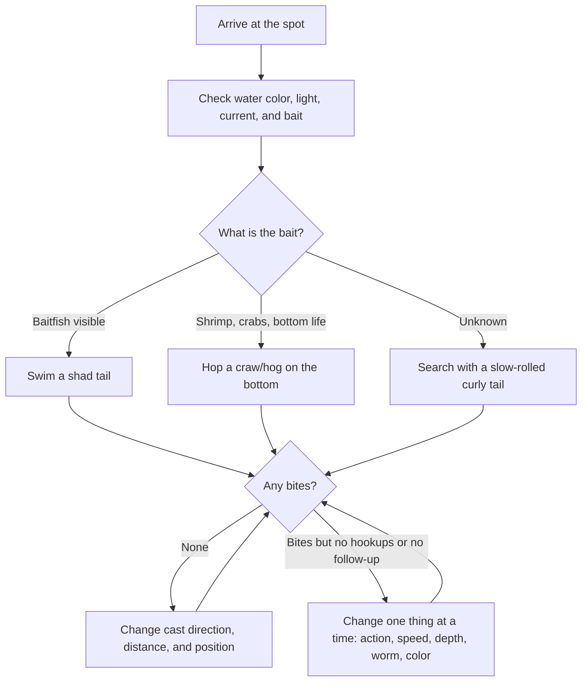
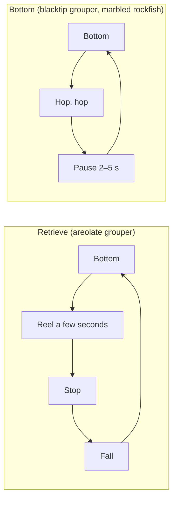
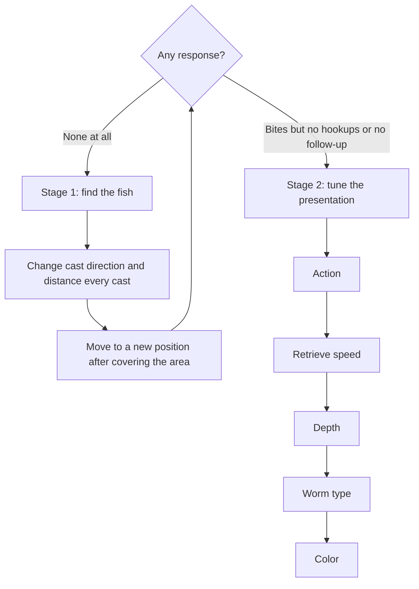

# Introduction
This guide lays out how to decide your next move when you fish soft plastics for rockfish. Read it top to bottom at the spot.

It covers three species: areolate grouper (oomonhata, *Epinephelus areolatus*), blacktip grouper (akahata, *Epinephelus fasciatus*), and marbled rockfish (kasago, *Sebastiscus marmoratus*). The approach works for both light rockfishing, which uses light jig heads for small fish, and hard rockfishing, which uses heavier rigs for big fish.

The guide sorts lures by worm type and action instead of product names, so you can map it onto the worms you already own. Decide in this order: species, worm type, action, color, then the next fallback.

# The Overall Decision Flow
The diagram below shows the big picture. Later sections explain each step.

# Know the Three Species First
Split rockfish into two types: fish that swim and fish that stick to the bottom. Areolate grouper belong to the first type. Blacktip grouper and marbled rockfish lean toward the second.

| Item | Areolate grouper | Blacktip grouper | Marbled rockfish |
| --- | --- | --- | --- |
| Scientific name | Epinephelus areolatus | Epinephelus fasciatus | Sebastiscus marmoratus |
| Habitat | Around reefs, especially reef next to sand | Coral and rocky reefs (4–160 m deep) | Coastal rocky reefs (shore to 200 m deep) |
| Main prey | Small fish | Crustaceans such as shrimp and crabs | Bristle worms, crustaceans, small fish |
| Movement | Roams widely and rises to mid-water | Stays near structure and terrain | Rarely roams; hides in cover and turns active at night |
| Target depth | Bottom to mid-water | Bottom | Bottom, holes, and rock edges |
| Basic approach | Retrieve | Hop, then pause | Make small moves and pause long |
| First-choice worm | Shad tail | Craw/hog | Craw, curly tail, straight |

## Areolate Grouper: Retrieve to Find a Swimming Grouper
Areolate grouper swim better than most groupers and sometimes rise to mid-water to chase baitfish. If you only work the bottom, you miss fish that hold higher up.

Let the lure touch bottom, then retrieve slowly while you change cast direction and depth. If nothing bites, touch bottom more often and give the fish more time to see the lure on the fall.

## Blacktip Grouper: Show Crustaceans Near the Bottom
Blacktip grouper stay around the bottom of rocky and coral reefs. Anglers sometimes see a landed blacktip grouper spit up shrimp or crabs, so a bottom approach that imitates crustaceans makes the baseline.

Hop the worm in small moves around the rocks, then pause to give the fish a chance to eat.

## Marbled Rockfish: Keep Tempting a Fish That Won't Move
Marbled rockfish rarely roam. They hide in cover during the day and come out to feed at night. They won't spot a worm from far away and chase it down.

Work the worm through holes and along rock edges, make small moves, and pause longer. In gaps between rocks or breakwater blocks, they often bite the moment the lure hits bottom. With a jig head rig, set the hook quickly before the fish dives into the rocks.

## Other Rockfish
Fit other rockfish into one of the two types to decide faster.

- Fish that chase baitfish and rise: treat them like areolate grouper and search with a retrieve.
- Fish that stay on structure or the bottom: treat them like blacktip grouper or marbled rockfish and fish the bottom.

# Choose by Worm Type
Pick a worm by the prey you want it to imitate.

| Type | Imitates | Best for | Target depth | Basic move |
| --- | --- | --- | --- | --- |
| Shad tail | Baitfish | Areolate grouper, active fish chasing bait | Bottom to mid-water, drop-offs, areas with current | Bottom → retrieve → stop → fall → retrieve |
| Craw/hog | Shrimp and crabs | Blacktip grouper, marbled rockfish, fish on the bottom | Around rocks, rock edges, bottom | Bottom → hop → hop → stop |
| Curly tail/grub | Wide appeal through vibration | When you can't narrow down the species or location | Bottom to mid-water, wide areas | Bottom → slow retrieve → fall |
| Straight/pin tail | Small, natural prey with a weak action | Small fish, tough bites, pressured fish | Mostly bottom | Straight retrieve, small lift and fall, shake, pause |

- Shad tail: keep it swimming. Areolate grouper respond well to a swimming action, so start your search with it.
- Craw/hog: keep it close to the bottom. Start with small moves of about 10–20 cm and avoid hopping it too hard.
- Curly tail/grub: the tail moves even on a slow retrieve, which makes it a good tool for finding where fish sit.
- Straight/pin tail: use it mainly for light rockfishing. Keep the action weak, small, and natural.

If a landed fish spits up its prey, match it. Baitfish point to a shad tail. Shrimp or crabs point to a craw/hog.

# Rig and Tackle Guidelines
## Rigs
| Rig | Setup | Best for | Notes |
| --- | --- | --- | --- |
| Jig head rig | Worm threaded on a jig head | Swimming retrieves, dropping into gaps between rocks or breakwater blocks | Snags easily. Set the hook quickly on marbled rockfish |
| Texas rig | Worm on an offset hook with a bullet sinker | Dragging or lift and fall over rocks and offshore reefs | An instant hookset often misses. Wait for the weight, then set firmly |
| Free rig / jika rig | Bottom rigs that combine a sinker and a hook | Bottom around rocks | Choose based on the spot and target |

## Tackle
The table below lines up Shimano's beginner guidelines for light and hard rockfishing. Line sizes use the Japanese numbering system (号).

| Item | Light rockfishing | Hard rockfishing |
| --- | --- | --- |
| Rod | Light game rod, about 7–7.6 ft | Rockfish rod, about 7–8 ft |
| Reel | 2000–2500 size spinning reel | 3000–4000 size high-gear spinning reel. Baitcasting for big fish |
| Line | PE #0.3–0.4 with a #1–1.5 fluorocarbon leader (60–80 cm), or straight #0.8–1 fluorocarbon | PE #1.5–2 with a #5–8 fluorocarbon leader (about 1.5 m) |
| Rig weight | Mostly 1–1.5 g. Use 2–3 g on days with strong current or wind | 5–30 g, adjusted for depth and current |
| Main targets | Small marbled rockfish and similar | Areolate grouper, blacktip grouper, larger marbled rockfish |

After the hookset, use the rod's power to lift the fish before it dives into the rocks. Fish hooked in mid-water have a harder time reaching cover, so a swimming presentation also raises your landing rate.

# Choosing Colors
Color effects vary a lot by situation, and no single color always wins. The table below lists common rules of thumb. Think about five factors before the species: light level, water clarity, bait, fish activity, and fishing pressure.

| Color family | When to use | Goal |
| --- | --- | --- |
| White/pearl/baitfish | Daytime, baitfish visible, targeting areolate grouper, searching wide | Look like baitfish |
| Green pumpkin | Clear water, sunny days, tough bites | Look like shrimp, crabs, and other bottom life. Start here when unsure |
| Red/orange | Murky water, weak response, imitating crustaceans | Stronger appeal |
| Glitter/flake | Daytime, bright light | Stand out through flash |
| Glow | Dark hours, dawn and dusk, murky water, deep water | Help fish find the worm in low light |

## Red Looks Dark in Deep Water
Seawater absorbs red light first. In deep or murky water, a red worm tends to look like a dark shadow instead of bright red.

Marbled rockfish that live in deep water have bright red bodies for the same reason: red turns a dull gray underwater and works as camouflage. "Red stands out" holds true in shallow water. In deep water, think of red as a color that stands out as a dark silhouette.

## Order for Changing Colors
Start with natural colors, then switch to high-appeal colors if nothing bites. If fish still don't respond, assume the spot holds no fish. Go back to stage 1 below and change where you cast.

# Basic Actions
Drag the worm where the bottom has few obstacles, use lift and fall or bottom bumping around rocks, and shake it in front of holes.

| Action | How | Best for | Tip |
| --- | --- | --- | --- |
| Straight retrieve | Reel at a constant speed | Areolate grouper; shad and curly tails | Start slow, then compare responses at faster and slower speeds |
| Swimming | Lift the worm off the bottom, reel, stop, and let it fall | Areolate grouper, active fish | Don't drag the bottom the whole time |
| Lift and fall | Lift, drop, and repeat after each bottom contact | All three species | Watch for bites during the fall |
| Bottom bump | Tap the bottom lightly, then pause 2–5 seconds | Blacktip grouper, marbled rockfish, sluggish fish | Avoid hard moves. Picture a shrimp hopping on the bottom |
| Drag | Pull slowly along the bottom, then stop | Marbled rockfish, blacktip grouper, sluggish fish | If it starts to snag, lift slightly and restart |
| Shake | Twitch the worm in place | Marbled rockfish, fish that hold there but won't bite | Keep the movement short and keep tempting the fish in front of it |

The diagram shows the basic cycles for retrieving and for bottom fishing.

# Basic Patterns by Species
## Areolate Grouper
Start with a shad tail and retrieve.

1. Cast and let it reach the bottom
2. Reel slowly
3. Stop briefly and let it fall
4. Reel again

Work the depth in steps: bottom, 50 cm up, 1 m up, then higher. If fish hold high, forget about the bottom. If nothing bites, switch to a curly tail, then change colors.

## Blacktip Grouper
Start with a craw/hog and hop it on the bottom.

1. Cast and let it reach the bottom
2. Hop it twice with small moves
3. Pause to give the fish time to bite
4. Repeat after each bottom contact

Work carefully around the rocks. If nothing bites, switch to a curly tail.

## Marbled Rockfish
Start with a craw, curly tail, or straight worm. Keep the action small and slow, and pause.

1. Let it reach the bottom
2. Move it a little
3. Pause
4. Move it just a short distance
5. Pause again

Focus on holes, rocks, and the edges of structure. Activity tends to rise at night.

# What to Change When Nothing Bites
Many rockfish don't travel far. Changing worms or colors where no fish live won't change your results. Find the fish first, then tune the presentation once you know fish hold there.

At stage 2, change one thing at a time. If you change several things at once, you can't tell what worked. Write down the conditions when you catch a fish. The notes help you decide on the next trip.

# Thinking by Situation
| Situation | Color | Worm and action |
| --- | --- | --- |
| Sunny, clear water | Natural | Smaller, weaker action. Straight worms when bites get tough |
| Cloudy | Natural to high-appeal | Normal action |
| Murky water | Red, glow, glitter | Strong-vibration worms with bigger moves |
| Dark hours, dawn and dusk | Glow, pearl | Strong-vibration worms |
| Baitfish visible | White, pearl, baitfish | Shad tail on a swimming retrieve |
| Fish likely on the bottom | Green pumpkin, red | Craw on a bottom bump |
| Tough bites | Natural | Straight or curly tail, small actions, longer pauses |

# What to Check First at the Spot
- [ ] Water color (clear or murky)
- [ ] Light (daytime, dawn and dusk, night)
- [ ] Current
- [ ] Wind direction and strength
- [ ] Bait (baitfish or crustaceans)
- [ ] Location of rocks and structure
- [ ] Drop-offs
- [ ] Breakwater blocks and other obstacles
- [ ] Depth at your feet
- [ ] Signs that other anglers already fished the spot

# Safety and Etiquette
- Wear a life jacket and spiked shoes on rocky shores.
- The spines on a marbled rockfish's fins and head hurt if they stick you. Hold the fish with a fish grip.
- Marbled rockfish rarely move, so their numbers recover slowly once anglers fish a spot out. Release small fish and keep only what you plan to eat.
- Size limits and catch rules differ by region. Check the local fishing regulations before your trip.

# Field Summary
Paste these six lines into a phone note.

- Areolate grouper: retrieve a shad tail. Don't stick to the bottom
- Blacktip grouper: hop a craw on the bottom, then pause
- Marbled rockfish: make small moves along rock edges and pause longer
- Baitfish in mind: shad tail on a swimming retrieve
- Bottom in mind: craw on a bottom bump
- No bites: change where you cast first, then change one thing at a time

# References
- [fish.shimano.com - Areolate grouper: characteristics and how to catch them (Japanese)](https://fish.shimano.com/ja-JP/content/beginners/fish/oomonhata/index.html)
- [fish.shimano.com - Marbled rockfish: characteristics and how to catch them (Japanese)](https://fish.shimano.com/ja-JP/content/beginners/fish/kasago/index.html)
- [fish.shimano.com - Rockfish lure fishing for beginners (Japanese)](https://fish.shimano.com/ja-JP/content/beginners/fishingstyle/lurefishing/rockfish/index.html)
- [fish.shimano.com - Light game fishing for beginners (Japanese)](https://fish.shimano.com/ja-JP/content/beginners/fishingstyle/lurefishing/lightgame/index.html)
- [ja.wikipedia.org - Areolate grouper (Japanese)](https://ja.wikipedia.org/wiki/%E3%82%AA%E3%82%AA%E3%83%A2%E3%83%B3%E3%83%8F%E3%82%BF)
- [ja.wikipedia.org - Blacktip grouper (Japanese)](https://ja.wikipedia.org/wiki/%E3%82%A2%E3%82%AB%E3%83%8F%E3%82%BF_%28%E9%AD%9A%E9%A1%9E%29)
- [ja.wikipedia.org - Marbled rockfish (Japanese)](https://ja.wikipedia.org/wiki/%E3%82%AB%E3%82%B5%E3%82%B4)
- [oceanservice.noaa.gov - Why is the ocean blue?](https://oceanservice.noaa.gov/facts/oceanblue.html)

