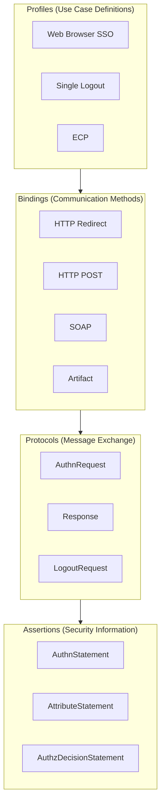
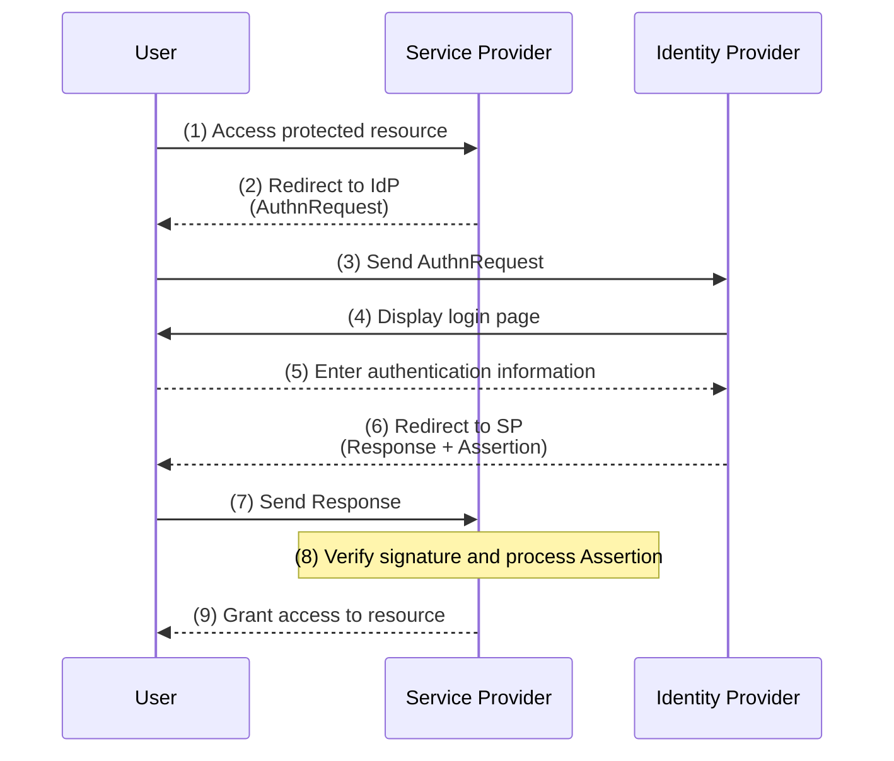
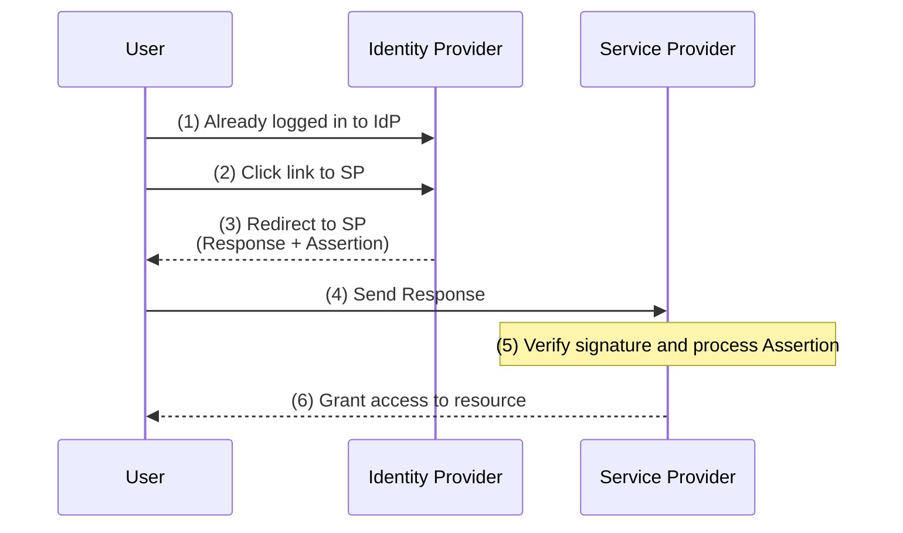
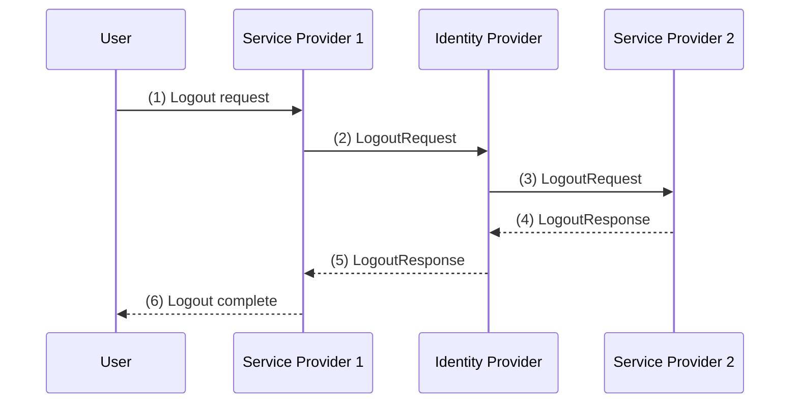

OASIS Security Assertion Markup Language (SAML) 2.0 key points summary.

---

## Overview

SAML (Security Assertion Markup Language) is an **XML-based standard for exchanging authentication and authorization data**.

It is a framework for securely exchanging user authentication and attribute information between different security domains. It is primarily used for SSO (Single Sign-On) in enterprise environments.

| Item | Content |
|-----|------|
| Established | OASIS (March 2005) |
| Format | XML |
| Main Uses | Web Browser SSO, Federation |
| Predecessor | SAML 1.1 |

---

## Comparison with OAuth/OIDC

| Item | SAML 2.0 | OAuth 2.0 / OIDC |
|-----|----------|------------------|
| Purpose | Authentication + Attribute Exchange | Authorization (OAuth) / Authentication (OIDC) |
| Data Format | XML | JSON |
| Token Format | XML Assertion | JWT (OIDC) |
| Signature Method | XML Signature | JWS |
| Encryption Method | XML Encryption | JWE |
| Main Uses | Enterprise SSO | Web/Mobile Apps |
| Complexity | High | Low |

---

## Key Terms

| Term | Description |
|-----|------|
| **Identity Provider (IdP)** | Entity that authenticates users and issues Assertions |
| **Service Provider (SP)** | Entity that receives Assertions and provides services |
| **Assertion** | XML document issued by IdP containing authentication, attribute, and authorization information |
| **Principal** | Entity being authenticated (usually the end-user) |

---

## Four Components of SAML

SAML is structured with a hierarchical design.



### 1. Assertions

XML documents containing security information about the subject.

### 2. Protocols

Request/response message sets.

### 3. Bindings

Methods for transferring SAML messages over lower-layer protocols.

### 4. Profiles

Combinations of Assertions, Protocols, and Bindings for specific use cases.

---

## Assertion

### Structure

```xml
<saml:Assertion Version="2.0"
    ID="_abc123"
    IssueInstant="2024-01-15T10:00:00Z">

    <saml:Issuer>https://idp.example.com</saml:Issuer>

    <saml:Subject>
        <saml:NameID>user@example.com</saml:NameID>
        <saml:SubjectConfirmation Method="urn:oasis:names:tc:SAML:2.0:cm:bearer">
            <saml:SubjectConfirmationData
                NotOnOrAfter="2024-01-15T10:05:00Z"
                Recipient="https://sp.example.com/acs"/>
        </saml:SubjectConfirmation>
    </saml:Subject>

    <saml:Conditions NotBefore="..." NotOnOrAfter="...">
        <saml:AudienceRestriction>
            <saml:Audience>https://sp.example.com</saml:Audience>
        </saml:AudienceRestriction>
    </saml:Conditions>

    <saml:AuthnStatement AuthnInstant="2024-01-15T09:59:00Z">
        ...
    </saml:AuthnStatement>

    <saml:AttributeStatement>
        ...
    </saml:AttributeStatement>

</saml:Assertion>
```

### Three Types of Statements

| Statement | Description |
|-----------|------|
| **AuthnStatement** | Information about the authentication event (method, time) |
| **AttributeStatement** | User attribute information (name, email, group, etc.) |
| **AuthzDecisionStatement** | Authorization decision (access permission/denial to resources) |

### SubjectConfirmation Method

Method to confirm the validity of an Assertion.

| Method | Description |
|--------|------|
| **bearer** | Usable by the holder of the Assertion |
| **holder-of-key** | Usable by the holder of a specific key |
| **sender-vouches** | Usable based on criteria confirmed by the issuer |

---

## Protocols

### Major Protocols

| Protocol | Description |
|-----------|------|
| **Authentication Request Protocol** | SP requests authentication from IdP |
| **Single Logout Protocol** | Logout from all SPs |
| **Artifact Resolution Protocol** | Obtain Assertion via Artifact |
| **Name Identifier Management Protocol** | Change/terminate identifiers |

### AuthnRequest

```xml
<samlp:AuthnRequest
    ID="_req123"
    Version="2.0"
    IssueInstant="2024-01-15T10:00:00Z"
    Destination="https://idp.example.com/sso"
    AssertionConsumerServiceURL="https://sp.example.com/acs"
    ProtocolBinding="urn:oasis:names:tc:SAML:2.0:bindings:HTTP-POST">

    <saml:Issuer>https://sp.example.com</saml:Issuer>

    <samlp:NameIDPolicy
        Format="urn:oasis:names:tc:SAML:1.1:nameid-format:emailAddress"
        AllowCreate="true"/>

</samlp:AuthnRequest>
```

### Response

```xml
<samlp:Response
    ID="_res456"
    Version="2.0"
    IssueInstant="2024-01-15T10:00:05Z"
    Destination="https://sp.example.com/acs"
    InResponseTo="_req123">

    <saml:Issuer>https://idp.example.com</saml:Issuer>

    <samlp:Status>
        <samlp:StatusCode Value="urn:oasis:names:tc:SAML:2.0:status:Success"/>
    </samlp:Status>

    <saml:Assertion>
        <!-- Assertion content -->
    </saml:Assertion>

</samlp:Response>
```

---

## Bindings

Methods for transferring SAML messages.

| Binding | Method | Features |
|---------|---------|------|
| **HTTP Redirect** | GET | Sent as URL query parameters with DEFLATE compression. Size limit applies |
| **HTTP POST** | POST | Sent as Base64 encoded in HTML form |
| **HTTP Artifact** | GET/POST | Sends a small Artifact for reference, retrieved separately |
| **SOAP** | POST | Sent in SOAP envelope. Back-channel communication |
| **PAOS** | - | Reverse SOAP. For ECP Profile |

### HTTP Redirect Binding

```
https://idp.example.com/sso?
    SAMLRequest=fZJNT8MwDIbv...（DEFLATE + Base64）
    &RelayState=token
    &SigAlg=...
    &Signature=...
```

### HTTP POST Binding

```html
<form method="post" action="https://sp.example.com/acs">
    <input type="hidden" name="SAMLResponse" value="PHNhbW...（Base64）"/>
    <input type="hidden" name="RelayState" value="token"/>
    <input type="submit" value="Submit"/>
</form>
```

---

## Profiles

### Web Browser SSO Profile

The most common profile. There are two flows.

#### SP-Initiated SSO



**Feature**: The user first accesses the SP and requests authentication from the IdP.

#### IdP-Initiated SSO



**Feature**: The user logs in to the IdP first and accesses the SP from there. No AuthnRequest needed.

### Single Logout Profile



---

## Binding × Profile Combinations

Possible combinations for Web Browser SSO Profile:

| AuthnRequest Sending | Response Sending |
|-----------------|--------------|
| HTTP Redirect | HTTP POST |
| HTTP POST | HTTP POST |
| HTTP Redirect | HTTP Artifact |
| HTTP POST | HTTP Artifact |

---

## Metadata

XML documents describing IdP and SP configuration information.

### IdP Metadata Example

```xml
<EntityDescriptor entityID="https://idp.example.com">
    <IDPSSODescriptor>
        <KeyDescriptor use="signing">
            <ds:KeyInfo>...</ds:KeyInfo>
        </KeyDescriptor>
        <SingleSignOnService
            Binding="urn:oasis:names:tc:SAML:2.0:bindings:HTTP-Redirect"
            Location="https://idp.example.com/sso"/>
        <SingleLogoutService
            Binding="urn:oasis:names:tc:SAML:2.0:bindings:HTTP-POST"
            Location="https://idp.example.com/slo"/>
    </IDPSSODescriptor>
</EntityDescriptor>
```

### SP Metadata Example

```xml
<EntityDescriptor entityID="https://sp.example.com">
    <SPSSODescriptor>
        <KeyDescriptor use="signing">
            <ds:KeyInfo>...</ds:KeyInfo>
        </KeyDescriptor>
        <AssertionConsumerService
            Binding="urn:oasis:names:tc:SAML:2.0:bindings:HTTP-POST"
            Location="https://sp.example.com/acs"
            index="0"/>
        <SingleLogoutService
            Binding="urn:oasis:names:tc:SAML:2.0:bindings:HTTP-POST"
            Location="https://sp.example.com/slo"/>
    </SPSSODescriptor>
</EntityDescriptor>
```

### Information Included in Metadata

| Item | Description |
|-----|------|
| EntityID | Unique identifier of the entity (URI) |
| SSO Endpoint | URL for Single Sign-On |
| SLO Endpoint | URL for Single Logout |
| ACS | Assertion Consumer Service URL |
| Certificate | Public key for signature verification and encryption |

---

## Security Considerations

### Signature and Encryption

| Target | Signature | Encryption |
|-----|:----:|:-----:|
| AuthnRequest | Recommended | - |
| Response | Recommended | - |
| Assertion | Required (usually) | Optional |

### TLS Requirements

| Requirement | Recommendation |
|-----|:-----:|
| HTTP over SSL 3.0 / TLS 1.0 or higher | Recommended |
| Response signature when using HTTP POST | Required |

### Major Threats and Countermeasures

| Threat | Countermeasure |
|-----|------|
| **Replay Attack** | Assertion expiration (NotOnOrAfter), InResponseTo verification |
| **Man-in-the-Middle Attack** | Mandatory TLS, signature verification |
| **Assertion Forgery** | Signature verification with XML Signature |
| **Session Hijacking** | Secure session management, SLO implementation |

### Assertion Verification Checklist

| Item | Verification Content |
|-----|---------|
| Signature | Signed with the legitimate IdP's private key |
| Issuer | Trusted IdP's EntityID |
| Audience | Targeted to own SP |
| NotBefore / NotOnOrAfter | Within valid period |
| InResponseTo | Matches the ID of the sent AuthnRequest |
| Recipient | Matches own SP's ACS URL |

---

## NameID Format

Format of user identifiers.

| Format | Description |
|--------|------|
| `unspecified` | No specific format |
| `emailAddress` | Email address format |
| `persistent` | Persistent pseudonymous identifier |
| `transient` | Temporary identifier (per session) |
| `X509SubjectName` | X.509 certificate Subject |

### Privacy Considerations

| Format | Usage |
|--------|------|
| **persistent** | Persistently identify the same user (opaque value) |
| **transient** | One-time identifier. Prevents linking across SPs |

---

## Error Handling

### Status Code

| StatusCode | Description |
|------------|------|
| `Success` | Success |
| `Requester` | Error on the requester's side |
| `Responder` | Error on the responder's side |
| `VersionMismatch` | SAML version mismatch |

### Second-Level Status Code

| StatusCode | Description |
|------------|------|
| `AuthnFailed` | Authentication failed |
| `NoPassive` | Passive authentication not possible |
| `UnknownPrincipal` | Unknown user |
| `RequestDenied` | Request denied |

---

## References

- [SAML 2.0 Technical Overview](https://docs.oasis-open.org/security/saml/Post2.0/sstc-saml-tech-overview-2.0.html)
- [SAML 2.0 Core Specification](https://docs.oasis-open.org/security/saml/v2.0/saml-core-2.0-os.pdf)
- [SAML 2.0 Bindings](https://docs.oasis-open.org/security/saml/v2.0/saml-bindings-2.0-os.pdf)
- [SAML 2.0 Profiles](https://docs.oasis-open.org/security/saml/v2.0/saml-profiles-2.0-os.pdf)
- [SAML 2.0 - Wikipedia](https://en.wikipedia.org/wiki/SAML_2.0)