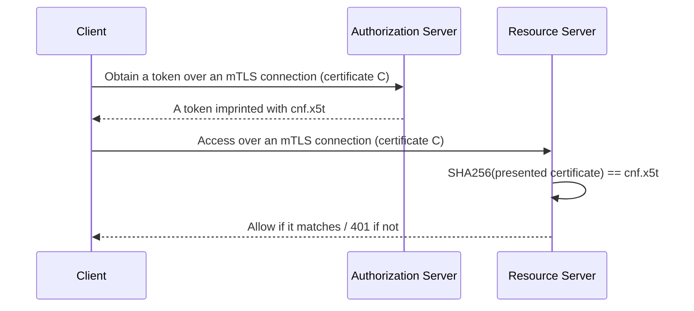
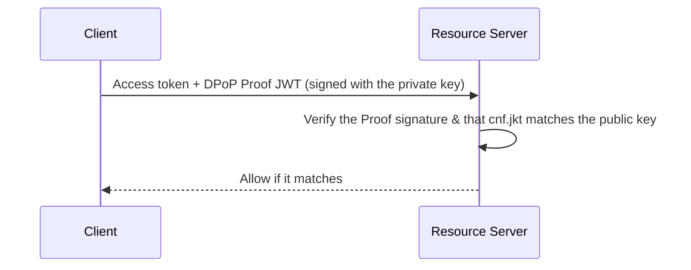

# Overview

An ordinary access token (a bearer token) treats "whoever holds it as the legitimate holder". In other words, if someone steals it, the attacker can use it as is. **Sender-constrained tokens** address this weakness.

This post organizes sender constraints via mTLS (RFC 8705) and DPoP (RFC 9449), and Resource Indicators (RFC 8707) that narrow the token's audience.

The related RFCs are as follows.

- [RFC 8705 OAuth 2.0 Mutual-TLS Client Authentication and Certificate-Bound Access Tokens](https://www.rfc-editor.org/rfc/rfc8705)
- [RFC 9449 OAuth 2.0 Demonstrating Proof of Possession (DPoP)](https://www.rfc-editor.org/rfc/rfc9449)
- [RFC 8707 Resource Indicators for OAuth 2.0](https://www.rfc-editor.org/rfc/rfc8707)

# The weakness of bearer tokens

A bearer token works simply when you place it in the request's Authorization header.

```
attacker's stolen token --> resource server
resource server: "there is a token, go ahead"
```

Because anyone who holds the token can use it, the token is weak to leakage and replay.

# What "sender-constrained" means

A sender-constrained token binds the token to "a specific sender only". At the time of use, it requires proof of possession of a secret (a key or certificate) that only that sender holds, so that an attacker who merely stole it cannot use it.

The common mechanism is to imprint the thumbprint (hash) of the key or certificate in the token via the **`cnf` (confirmation) claim**.

```
At issuance: imprint the thumbprint of the key/certificate in the token via cnf
At use:      check that the presented key/certificate matches cnf
             -> an attacker without the private key cannot make it match
```

People call this key confirmation / proof-of-possession / holder-of-key. Whereas a bearer is only "authorization", a sender constraint combines "authorization + proof of the sender (authentication)".

# mTLS (RFC 8705)

RFC 8705 brings mutual TLS (mTLS) into OAuth and defines two independent features.

1. **mTLS client authentication**: authenticate with a client certificate instead of a `client_secret`.
2. **Certificate-bound access tokens**: bind the token to the client certificate (sender constraint).

The certificate-binding flow is as follows.



`cnf.x5t#S256` is the SHA-256 thumbprint of the certificate in base64url. Even if an attacker steals the token, they do not hold the certificate's private key, so they cannot present the same certificate in the mTLS handshake and cannot use it.

# DPoP (RFC 9449)

DPoP (Demonstrating Proof of Possession) achieves a sender constraint at the **application layer** without using certificates. The client holds a key pair and, on each request, attaches a **DPoP Proof JWT** signed with its private key in a header.

- The DPoP Proof contains `htm` (HTTP method), `htu` (URL), `jti`, and `iat`, binding it to the request.
- The access token imprints the public key's thumbprint `cnf.jkt`. The resource server checks that the Proof's signing key matches the token's `cnf.jkt`.



Because it needs no certificate operations, it suits SPAs and mobile apps.

Note that although the mechanism of DPoP is itself proof-of-possession via public-key cryptography, its purpose is not to "authenticate the client's identity". The client generates the key itself, with no CA or registered identity involved. What DPoP proves is only "the presenter holds the key (`cnf.jkt`) bound to this access token"; its role is strictly to **bind the bearer token to a key**. It differs in intent from `private_key_jwt` (RFC 7523), which authenticates "who you are" with asymmetric keys, even though both use public-key technology. Also, `htm`, `htu`, `jti`, and `iat` bind the Proof to a single specific request, which prevents replay.

# Choosing between mTLS and DPoP

| Aspect | mTLS (8705) | DPoP (9449) |
| --- | --- | --- |
| Target of binding | TLS client certificate | application-layer key pair |
| Where proof happens | TLS layer (handshake) | application layer (Proof JWT) |
| Contents of cnf | `x5t#S256` (certificate hash) | `jkt` (public key hash) |
| Certificate operations | required | not required |
| Suited for | service-to-service (easy to run mTLS in the infra) | SPA / mobile |

# Resource Indicators (RFC 8707): narrowing the audience

A countermeasure orthogonal to sender constraints is **Resource Indicators**, which narrows the token's audience (`aud`). Adding the `resource` parameter to a token request makes the AS restrict the issued token's `aud` to that destination.

```
without resource: aud is broad -> a token for one RS also passes at another RS (spread risk)
with resource:    aud = specific RS -> even if stolen, it is rejected at other RSs (localized damage)
```

- **Audience restriction (8707)**: even if stolen, it "does not pass at other RSS" = narrows the scope of damage.
- **Sender constraint (8705 / 9449)**: even if stolen, "an attacker without the private key cannot use it" = nullifies the theft itself.

These two are orthogonal, and combining both is the most robust. RFC 9700 also recommends this pairing.

# Summary

- Bearer tokens are weak to theft because "whoever holds it can use it".
- Sender-constrained tokens bind to a key/certificate via `cnf`, so that even if stolen, an attacker without the private key cannot use them.
- mTLS (8705) is TLS-layer / certificate binding; DPoP (9449) is application-layer / key binding. mTLS suits service-to-service, DPoP suits SPA/mobile.
- Combining with Resource Indicators (8707) that narrows the audience achieves both localized damage and nullified theft.

# References

- [RFC 8705 OAuth 2.0 Mutual-TLS Client Authentication and Certificate-Bound Access Tokens](https://www.rfc-editor.org/rfc/rfc8705)
- [RFC 9449 OAuth 2.0 Demonstrating Proof of Possession (DPoP)](https://www.rfc-editor.org/rfc/rfc9449)
- [RFC 8707 Resource Indicators for OAuth 2.0](https://www.rfc-editor.org/rfc/rfc8707)
