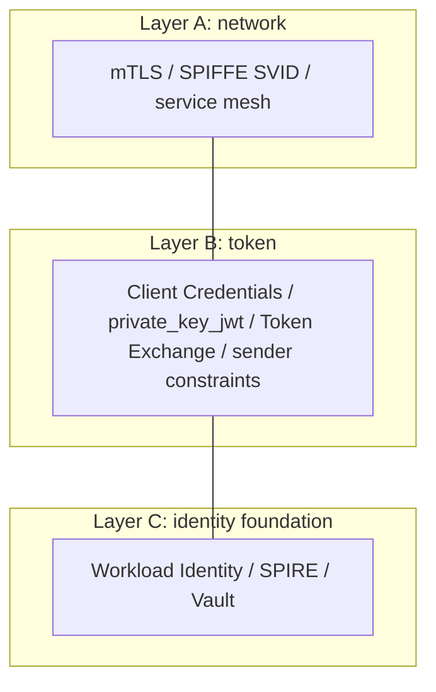
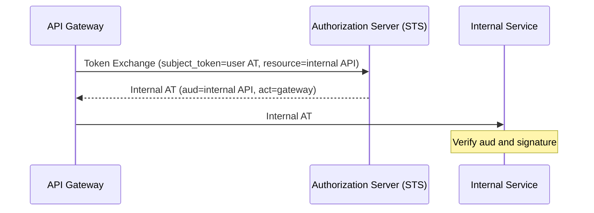

# Overview

When we talk about authentication, "human -> service" authentication over the browser is often discussed, but in microservices, "service -> service" authentication is just as important. When service A calls service B, how does B confirm that "the caller really is A"? How is the user's authority carried across services?

This post organizes service-to-service authentication in three layers - network, token, and identity foundation - and surveys mTLS, Token Exchange, SPIFFE, and Zero Trust.

The related specifications and materials are as follows.

- [RFC 8693 OAuth 2.0 Token Exchange](https://www.rfc-editor.org/rfc/rfc8693)
- [RFC 7521 Assertion Framework for OAuth 2.0](https://www.rfc-editor.org/rfc/rfc7521) / [RFC 7523 JWT Profile for OAuth 2.0 Client Authentication](https://www.rfc-editor.org/rfc/rfc7523)
- [SPIFFE](https://spiffe.io/)
- [NIST SP 800-207 Zero Trust Architecture](https://doi.org/10.6028/NIST.SP.800-207) / [NIST SP 800-204A](https://doi.org/10.6028/NIST.SP.800-204A)
- [Google BeyondProd](https://cloud.google.com/docs/security/beyondprod)

# Why service-to-service authentication is a "different problem"

The premises differ from end user authentication.

| Aspect | End user authentication | Service-to-service authentication |
| --- | --- | --- |
| Subject | Human (browser) | Process (automated) |
| Interaction | Password / MFA / consent screen | Non-interactive |
| State | Cookie / session | East-west traffic, cookies are thin |
| Attacker | An outsider | An intruding internal service / impersonation |

Consider three questions.

1. Is the caller's identity genuine -> the service's **authentication (AuthN)**
2. Is this call permitted -> the call's **authorization (AuthZ)**
3. On whose user context is this call -> **delegation** of the user's authority

Many incidents happen by skipping (1) on the premise that "it's the internal network, so it's safe". This is exactly the premise that Zero Trust denies.

# The big-picture map of the three layers



In practice it becomes a combination of A x B x C. For example, "distribute keys with Workload Identity (C), authenticate connections with mTLS (A), and carry the user context with Token Exchange (B)".

# Layer A: the network layer

## mTLS

Ordinary TLS authenticates only the server with a certificate, but mTLS (mutual TLS) also has the client present a certificate for two-way authentication. It guarantees "the peer of this connection is a genuine service holding a legitimate certificate". It does not reveal "on whose user context" the call runs, so combine it with Layer B.

## SPIFFE / SPIRE

SPIFFE is a CNCF standard for "giving services a verifiable identity". It gives an identity by the workload's true nature, not by IP or hostname.

```
SPIFFE ID:  spiffe://example.org/ns/prod/sa/payment-api
SVID:       an X.509 certificate or JWT that proves that ID
SPIRE:      an implementation that automatically issues and rotates SVIDs
```

An SVID has two forms: the X.509-SVID for mTLS (Layer A) and the JWT-SVID for tokens (Layer B). The JWT-SVID avoids JWT pitfalls (such as alg confusion) by using only JWS Compact Serialization and restricting the JOSE header.

## Service mesh

A service mesh such as Istio has sidecars (Envoy, etc.) transparently establish mTLS. Apps get mutual authentication without changing code, and the mesh automates certificate rotation.

# Layer B: the token layer

## Client Credentials and private_key_jwt

The basic form where a service obtains a token as "itself" without a user is the Client Credentials Grant. Doing its client authentication with asymmetric keys rather than a shared secret (`client_secret`) is **private_key_jwt (RFC 7521 / 7523)**. The client presents a JWT signed with its private key, and the AS verifies it with the public key. Because the AS does not have to store a shared secret, it resists leakage.

## Token Exchange (RFC 8693)

The standard grant for safely carrying a user's authority across services is Token Exchange. It converts one token into a token suited to a different purpose or destination (with the AS acting as a Security Token Service).

Token Exchange offers two modes.

- **Impersonation**: the new token has only `sub=user`. No trace of the delegate remains.
- **Delegation**: the new token contains an `act` claim (e.g., `{"sub":"user","act":{"sub":"serviceB"}}`), retaining "who is actually acting". Because it remains auditable, this is preferable in practice.

`act` can express a chain of delegation via nesting. For access control decisions, use only the top-level claims and the outermost `act` (the inner acts are history/information).



## Sender constraints and Resource Indicators

Even between services, binding a bearer to its sender with **sender constraints (mTLS / DPoP)** and narrowing the audience (`aud`) with **Resource Indicators** works well. For details, see "[What are Sender-Constrained Tokens?](/en/posts/sender-constrained-tokens-mtls-dpop/)". Because mTLS is easy to run in the infrastructure between services, it becomes the first choice there.

# Layer C: the identity foundation

This layer handles "how to safely distribute and rotate secrets (certificates, keys, tokens)", and it sees the most incidents.

| Foundation | Mechanism |
| --- | --- |
| K8s ServiceAccount + Workload Identity | Link a Pod's short-lived SA token to cloud IAM |
| GCP Workload Identity Federation | Exchange an external IdP/K8s SA for short-lived Google credentials |
| AWS IAM Roles (IRSA) | Attach an IAM role to a Pod/instance, with temporary credentials via STS |
| SPIFFE / SPIRE | Automatically issue SVIDs to workloads |
| HashiCorp Vault | Issue dynamic secrets with short-lived leases |

The shared philosophy is "do not place long-lived static secrets. Short-lived + automatic rotation + identity-based issuance".

# Zero Trust (NIST SP 800-207 / 800-204A)

Service-to-service authentication is at the core of Zero Trust.

```
Perimeter defense: "trust it because it's the internal network" -> free lateral movement once breached
Zero Trust:        "do not trust by network location" -> verify every request
                   = mTLS(who from) + token verification(what is allowed) + least privilege(aud/scope)
```

NIST SP 800-207, centered on the Policy Decision Point (PDP) and Policy Enforcement Point (PEP), requires authenticating and authorizing every resource access individually, with least privilege, dynamic policy, and continuous monitoring. NIST SP 800-204A is a guide for using a service mesh (mTLS, L7 authorization) in microservices.

# A practical example: Google BeyondProd

BeyondProd is Google's implementation that "builds trust from code provenance, service identity, and trusted hardware, rather than network location".

- **ALTS**: mutual authentication and transport encryption between services. It binds the identity to the service (not the hostname). It serves as Google's version of mTLS.
- **Binary Authorization for Borg (BAB)**: verifies code provenance and only permits deployment of reviewed, verifiable builds.
- **End User Context (EUC) Ticket**: a short-lived ticket that passes the end user identity to services, separate from the service identity. The call chain forwards it. It corresponds to the user-context propagation of Token Exchange.

A backend responds only after confirming: "is the certificate valid (is it trusted code)", "does the caller's service identity have permission", "is the EUC ticket valid", and "can that user access the data". This forms a trinity of service identity, code trust, and user context.

# A selection cheat sheet and antipatterns

| Situation | Recommendation |
| --- | --- |
| Mutually authenticate all internal service-to-service traffic | mTLS (transparent via a mesh) + SPIFFE/SPIRE |
| A service's own processing without a user | Client Credentials (auth via mTLS / private_key_jwt) |
| Carry a user's authority to an internal service | Token Exchange with Delegation (with act) |
| Strengthen token-theft countermeasures | Sender constraints (mTLS for service-to-service) |
| Separate tokens per RS | Resource Indicators to narrow aud |
| Stop distributing static secrets | Workload Identity / SPIRE |

Antipatterns to avoid are as follows.

- "No authentication because it's the internal network" -> allows lateral movement after a breach.
- Forwarding user-facing tokens directly to internal services -> narrow the aud with Token Exchange.
- Baking long-lived service account keys into containers -> make them short-lived with Workload Identity.
- Leaving service-to-service tokens as bearer -> bind them with mTLS/DPoP.
- Judging service identity by IP/hostname -> judge by workload identity.

# Summary

- Service-to-service authentication protects "who from / what we allow / on whose behalf" across three layers: network, token, and identity foundation.
- Authenticate connections at Layer A (mTLS/SPIFFE), handle user context and authority at Layer B (Token Exchange/sender constraints), and safely distribute secrets at Layer C (Workload Identity).
- Zero Trust (NIST 800-207) and BeyondProd are good examples that systematize and apply this way of thinking.

# References

- [RFC 8693 OAuth 2.0 Token Exchange](https://www.rfc-editor.org/rfc/rfc8693)
- [RFC 7523 JWT Profile for OAuth 2.0 Client Authentication and Authorization Grants](https://www.rfc-editor.org/rfc/rfc7523)
- [SPIFFE](https://spiffe.io/)
- [NIST SP 800-207 Zero Trust Architecture](https://doi.org/10.6028/NIST.SP.800-207)
- [NIST SP 800-204A](https://doi.org/10.6028/NIST.SP.800-204A)
- [Google BeyondProd](https://cloud.google.com/docs/security/beyondprod)
