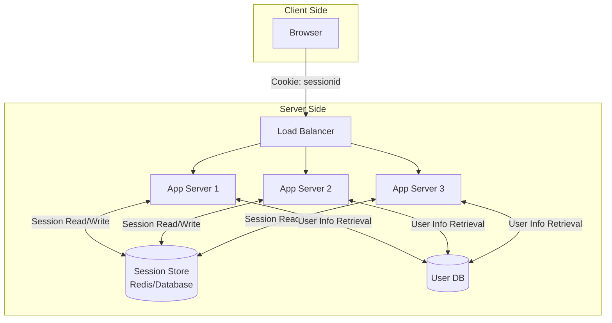
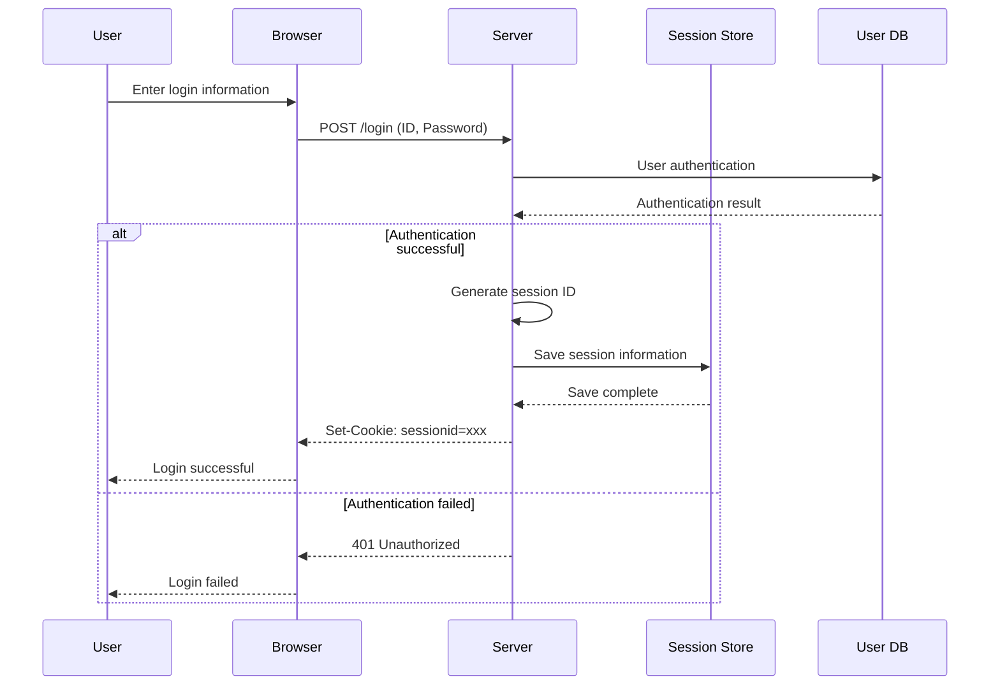
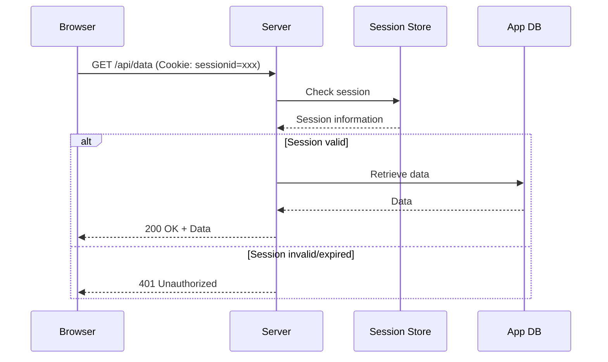
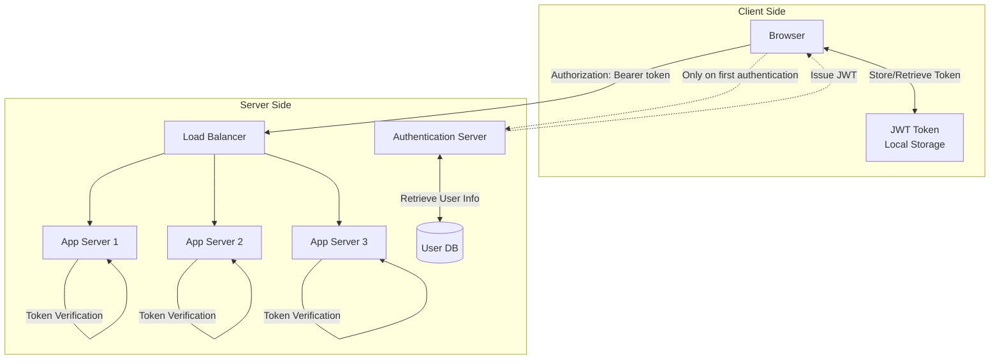
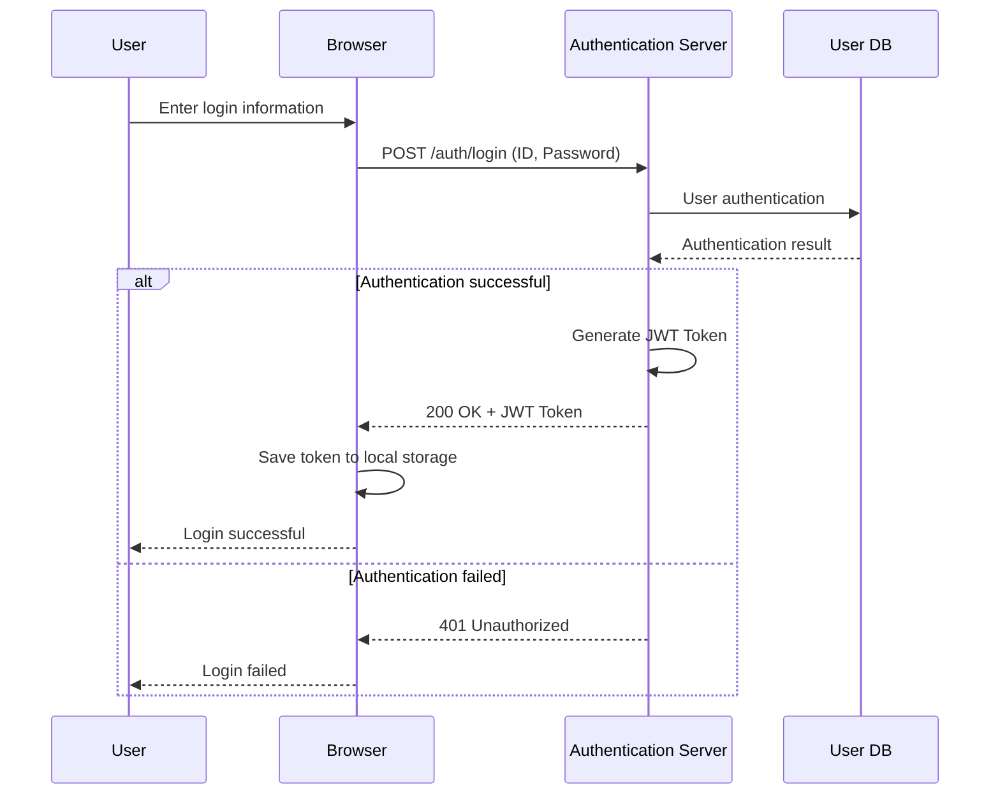
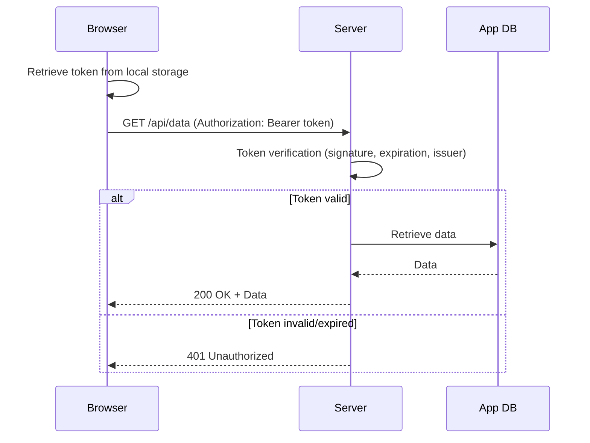
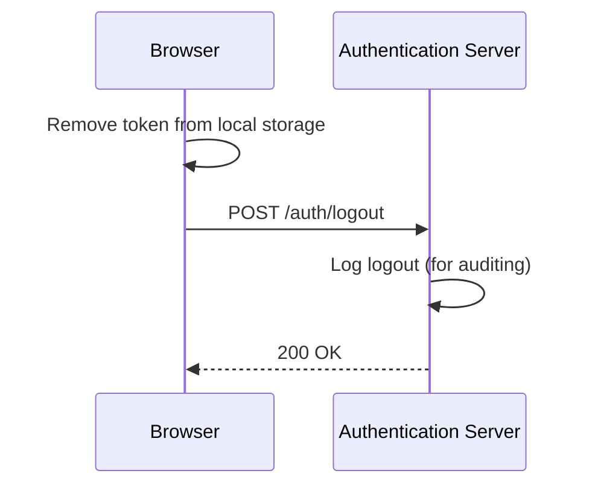

# Session-Based vs Token-Based Authentication

## Overview

In web application development, the choice of authentication method significantly impacts the system's scalability, security, and maintainability. This article comprehensively compares and explains session-based authentication and token-based authentication, from technical details to implementation considerations.

## Basics of Authentication

### What is Authentication?
Authentication is the process of verifying that a user attempting to access a system is indeed who they claim to be. It is a mechanism that validates a user's identity, ensuring that only legitimate users can access the system.

**Difference between Authentication and Authorization**:
- **Authentication**: Confirms "who you are"
- **Authorization**: Determines "what you can do"

### Features
The basic features provided by an authentication system include the following:

1. **Identity Verification**
   - Matching user ID and password
   - Support for Multi-Factor Authentication (MFA)
   - Extensibility to biometric and certificate authentication

2. **Session Management**
   - Maintaining login state
   - Managing session expiration
   - Handling logout processes

3. **Security Controls**
   - Applying password policies
   - Account lockout features
   - Detecting and preventing unauthorized access

4. **Auditing and Logging**
   - Recording login and logout events
   - Tracking authentication failures
   - Monitoring security events

### Non-Functional Requirements
The non-functional requirements expected from an authentication system include the following:

1. **Performance**
   - Fast authentication processing
   - Handling a large number of simultaneous authentication requests
   - Stability of response times

2. **Scalability**
   - Linear scaling with an increase in the number of users
   - Support for horizontal scaling
   - Efficiency of load balancing

3. **Availability**
   - High availability (target: over 99.9%)
   - Automatic recovery in case of failures
   - Ensuring service continuity

4. **Security**
   - Encrypted communication (TLS)
   - Secure storage of authentication information
   - Measures against session hijacking

5. **Maintainability**
   - Ease of configuration changes
   - Efficiency of monitoring and operations
   - Speed of incident response

As it is a core function of the system, high availability and scalability are required.

## Session-Based Authentication

### Structure
Session-based authentication is a method where the server manages the user's login state.

The main components include:

- **Session Store**: Stores session information (Redis, Database, etc.)
- **Session ID**: A unique identifier issued to the client
- **Cookie**: Holds the session ID on the client side

### Sequence

#### Login Flow

#### Authenticated Request Flow

#### Logout Flow

### Advantages and Disadvantages

#### Advantages

1. **Security**
   - Session information is managed on the server side
   - Session invalidation is reflected immediately
   - Sensitive information is not stored on the client side

2. **Simple Implementation**
   - A well-established method that has been around for a long time
   - Can be implemented using standard features of frameworks
   - Easy debugging and troubleshooting

3. **Fine Control**
   - Flexible settings for session timeout
   - Dynamic updates of session information are possible
   - Session management on a per-user basis

4. **Browser Compatibility**
   - Seamless experience with automatic cookie sending
   - Works even in environments with JavaScript disabled
   - Easy to combine with CSRF countermeasures

#### Disadvantages

1. **Scalability Constraints**
   - Session store can easily become a single point of failure
   - Complexity during horizontal scaling
   - Capacity limitations of the session store

2. **Performance Issues**
   - Requires access to the session store for every request
   - Affected by network latency
   - Concentrated load on the session store

3. **Operational Complexity**
   - Requires monitoring and maintenance of the session store
   - Session synchronization in distributed environments
   - Considerations for backup and recovery

4. **Multi-Platform Compatibility**
   - Constraints on cookie management in mobile apps
   - Complexity in API interconnections
   - Difficulty in sharing authentication information between microservices

5. **Impact of Failures**
   - Session store failures affect all users
   - Complexity of session migration during scale-out
   - Challenges in restoring sessions during disaster recovery

## Token-Based Authentication

### Structure
Token-based authentication is a method where the client holds the token and sends it with each request for authentication.

The main components include:

- **JWT Token**: A self-contained token that includes user information and permissions
- **Authentication Server**: Responsible for issuing and managing tokens
- **Local Storage**: Token storage on the client side

### Sequence

#### Login Flow

#### Authenticated Request Flow

#### Logout Flow

**Note**: Since JWT tokens are self-contained, immediate invalidation on the server side is difficult. Actual invalidation can be achieved through the following methods:
- **Client-side deletion**: Remove the token from local storage (the primary means of invalidation)
- **Short expiration**: Set a short expiration for access tokens (15 minutes to 1 hour)
- **Refresh token invalidation**: Invalidate only the refresh token on the server side
- **Key rotation**: Change the signing key in emergencies to invalidate all tokens

### Advantages and Disadvantages

#### Advantages

1. **Scalability**
   - No need for session management on the server side
   - Easy horizontal scaling
   - Each app server can independently verify tokens

2. **Performance**
   - No need for access to the session store
   - Fast authentication processing with local verification
   - Reduction in network communication

3. **Multi-Platform Compatibility**
   - Easy implementation in mobile apps
   - Standard method for API interconnections
   - Simple sharing of authentication information between microservices

4. **Stateless**
   - No need to maintain state on the server side
   - Easy load balancing
   - Limited impact scope during failures

5. **Standardization**
   - Complies with industry standards like JWT
   - Abundant libraries and tools available
   - Easy integration with other systems

#### Disadvantages

1. **Security Risks**
   - Tokens are stored on the client side (threat of XSS attacks)
   - Large impact scope if tokens are stolen
   - Immediate invalidation on the server side is difficult (due to the self-contained nature of JWT)
   - Security risks when using local storage

2. **Token Size**
   - JWTs are typically larger than session IDs
   - Further bloated if they include permission information
   - Impact on network bandwidth

3. **Implementation Complexity**
   - Management of access and refresh token pairs
   - Numerous security considerations (key management, signature algorithms)
   - Implementation of token refresh flows
   - Consideration of key rotation strategies

4. **Debugging Difficulty**
   - Need to verify token contents
   - Complexity in identifying issues in distributed environments
   - Complexity in log management

5. **Browser Limitations**
   - Size limitations of local storage
   - Vulnerability to XSS attacks
   - Constraints in private browsing

## Comparison of Methods

### Technical Feature Comparison

| Item                    | Session-Based                      | Token-Based                        |
| ----------------------- | ---------------------------------- | ---------------------------------- |
| **State Management**    | Stateful (state held on server)   | Stateless (information in token)   |
| **Data Storage Location**| Server-side (session store)       | Client-side (local storage, etc.)  |
| **Network Communication**| Session check on every request     | Token verification only (local)    |
| **Scalability**         | Dependent on session store         | Easy horizontal scaling             |
| **Security Model**      | Server-controlled                  | Distributed client-server model     |

### Performance Comparison

| Metric                  | Session-Based                      | Token-Based                        |
| ----------------------- | ---------------------------------- | ---------------------------------- |
| **Authentication Time** | Depends on session store access    | Token verification time (usually a few ms) |
| **Network Load**        | Session ID (small)                | JWT (medium to large)              |
| **Server Load**         | Read/write to session store        | CPU-intensive signature verification |
| **Memory Usage**        | Proportional to number of sessions | Almost constant                     |

### Security Comparison

| Threat                  | Session-Based                      | Token-Based                        |
| ----------------------- | ---------------------------------- | ---------------------------------- |
| **Session Fixation Attack**| Vulnerable (requires countermeasures)| Not affected                      |
| **Session Hijacking**   | Vulnerable (HTTPS required)       | Vulnerable (HTTPS required)        |
| **XSS Attack**          | Mitigated with HttpOnly Cookie    | Vulnerable when using local storage |
| **CSRF Attack**         | Vulnerable (CSRF Token required)  | Minimal impact                     |
| **Token Leakage**       | Limited impact if session ID leaks | Significant impact if JWT leaks    |

## Selection Guidelines

### When to Use Session-Based Authentication

1. **Traditional Web Applications**
   - Primarily server-side rendering
   - Operated on a single domain
   - Emphasis on compatibility with existing systems

2. **When High Security is Required**
   - Immediate session invalidation is necessary
   - Desire for complete control on the server side
   - Financial systems, etc.

3. **When a Simple Structure is Desired**
   - Small to medium-sized applications
   - Skill level of the operations team
   - Minimizing development and maintenance costs

### When to Use Token-Based Authentication

1. **Modern Web Applications**
   - SPA (Single Page Application)
   - Microservices architecture
   - API-centric design

2. **When Scalability is Important**
   - Large user base
   - Need for horizontal scaling
   - Cloud-native environments

3. **Multi-Platform Compatibility**
   - Integration with mobile apps
   - Use across multiple domains
   - Integration with external APIs

### Implementation Considerations

#### Implementation Points for Session-Based Authentication

1. **Choosing a Session Store**
   - Redis: High performance, distributed support
   - Database: Persistence, transaction support
   - Memory: Simple, limited to a single server

2. **Security Measures**
   - Setting HttpOnly and Secure Cookies
   - Implementing CSRF Tokens
   - Countermeasures against session fixation attacks

3. **Operational Considerations**
   - Monitoring the session store
   - Backup and recovery procedures
   - Sticky session settings during load balancing

#### Implementation Points for Token-Based Authentication

1. **Token Design**
   - Access token
   - Refresh token
   - Minimal payload
   - Safe update mechanism using token pairs

2. **Security Measures**
   - Strong signature algorithms (RS256 recommended)
   - Key management and rotation strategies
   - Selection of token storage location

3. **Operational Considerations**
   - Mechanism for token invalidation
   - Establishing key management infrastructure
   - Designing audit logs

## Conclusion

Session-based authentication and token-based authentication each have distinct features and applicable scenarios. 

Choosing the appropriate authentication method requires a comprehensive consideration of system requirements, scale, security demands, the skill level of the development team, and operational structure. Additionally, a hybrid approach that combines both methods is also possible.

As technology continues to advance, authentication methods are also evolving, making it essential to keep abreast of ongoing technological trends and to review authentication methods in line with system growth.