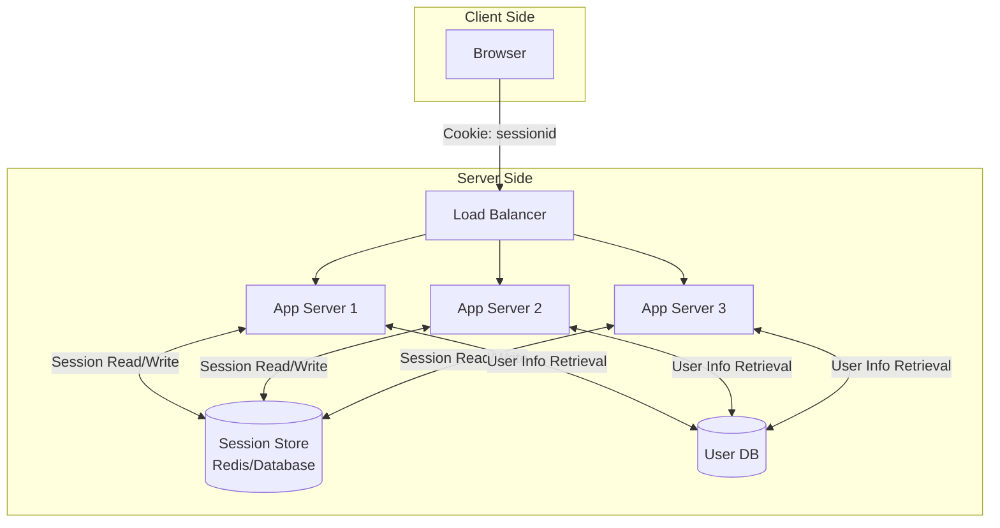
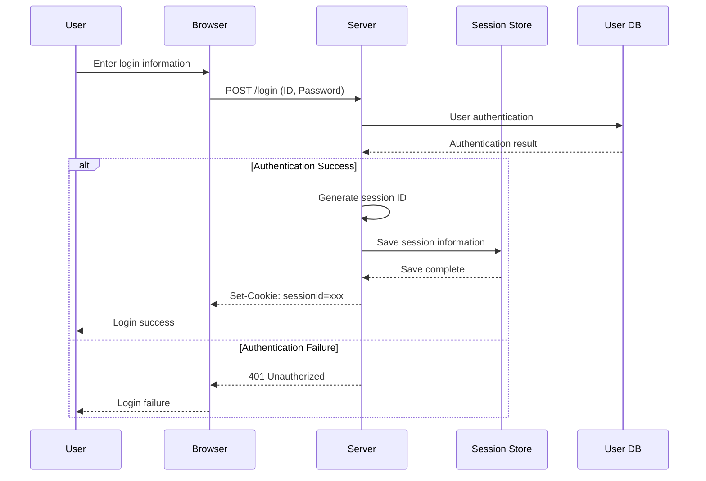
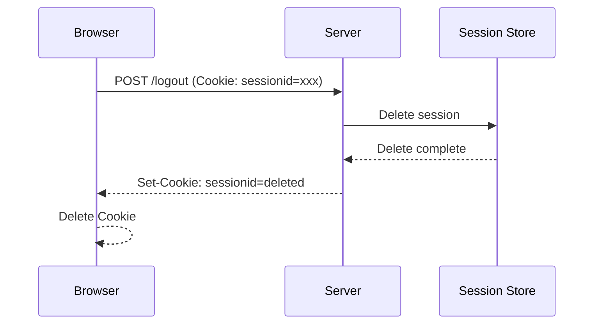
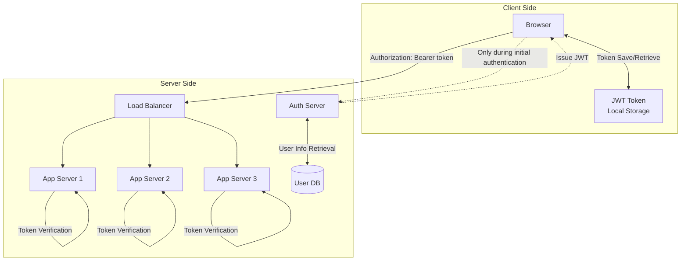
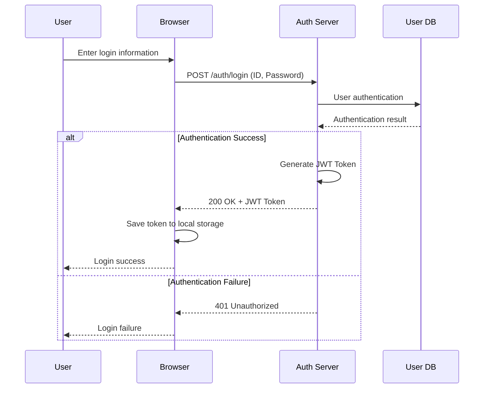
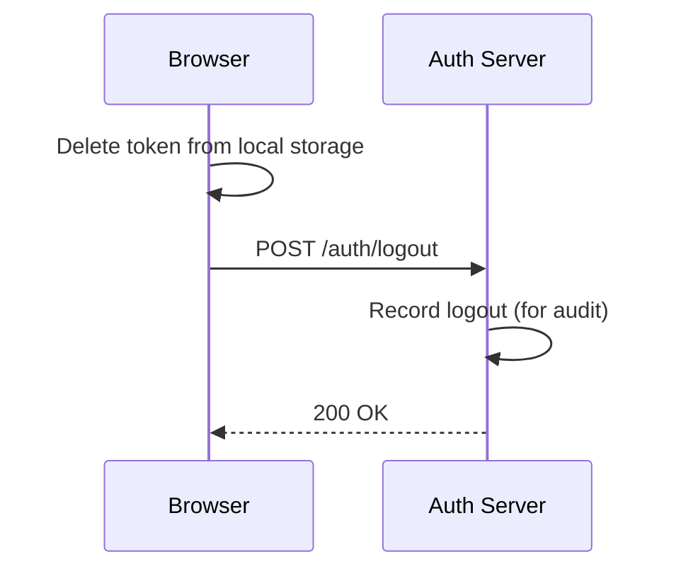

# Session-based and Token-based Authentication Methods

## Overview

In web application development, the choice of authentication method is a design decision that significantly impacts the system's scalability, security, and maintainability. This article provides a comprehensive comparison and explanation of session-based and token-based authentication, from technical details to implementation considerations.

## Basics of Authentication

### What is Authentication?
Authentication is the process of verifying that a user attempting to access a system is indeed who they claim to be. It involves verifying the user's identity to ensure that only legitimate users can access the system.

**Difference between Authentication and Authorization**:
- **Authentication**: Verifying "who you are"
- **Authorization**: Determining "what you can do"

### Features
The basic features provided by an authentication system include:

1. **Identity Verification**
   - Matching user ID and password
   - Support for multi-factor authentication (MFA)
   - Extensibility to biometric and certificate authentication

2. **Session Management**
   - Maintaining login state
   - Managing session expiration
   - Logout processing

3. **Security Control**
   - Applying password policies
   - Account lockout functionality
   - Detection and prevention of unauthorized access

4. **Audit and Logging**
   - Recording login and logout activities
   - Tracking authentication failures
   - Monitoring security events

### Non-functional Requirements
Non-functional requirements for an authentication system include:

1. **Performance**
   - Fast authentication processing
   - Handling a large number of simultaneous authentication requests
   - Stability of response times

2. **Scalability**
   - Linear scaling with the increase in user numbers
   - Support for horizontal scaling
   - Efficiency of load balancing

3. **Availability**
   - High availability (target: 99.9% or more)
   - Automatic recovery in case of failure
   - Ensuring service continuity

4. **Security**
   - Encrypted communication (TLS)
   - Secure storage of authentication information
   - Protection against session hijacking

5. **Maintainability**
   - Ease of configuration changes
   - Efficiency of monitoring and operations
   - Speed of incident response

As a core function of the system, high availability and scalability are required.

## Session-based Authentication

### Architecture
Session-based authentication is a method where the server manages the user's login state.

The main components include:

- **Session Store**: Stores session information (Redis, Database, etc.)
- **Session ID**: A unique identifier issued to the client
- **Cookie**: Holds the session ID on the client side

### Sequence

#### Login Flow

#### Authenticated Request Flow

#### Logout Flow

### Advantages and Disadvantages

#### Advantages

1. **Security**
   - Session information is managed on the server side
   - Immediate reflection of session invalidation
   - Sensitive information is not stored on the client side

2. **Simple Implementation**
   - Established method with a long history
   - Implementable with standard framework features
   - Easy debugging and troubleshooting

3. **Granular Control**
   - Flexible session timeout settings
   - Dynamic updates of session information possible
   - Session management on a per-user basis

4. **Browser Compatibility**
   - Seamless experience with automatic cookie transmission
   - Operates even in environments where JavaScript is disabled
   - Easy combination with CSRF protection

#### Disadvantages

1. **Scalability Constraints**
   - Session store can become a single point of failure
   - Complexity during horizontal scaling
   - Capacity limitations of the session store

2. **Performance Issues**
   - Requires session store access for every request
   - Impact of network latency
   - Load concentration on the session store

3. **Operational Complexity**
   - Requires monitoring and maintenance of the session store
   - Session synchronization in distributed environments
   - Considerations for backup and recovery

4. **Multi-platform Support**
   - Constraints on cookie management in mobile apps
   - Complexity in API integration
   - Difficulty in sharing authentication information among microservices

5. **Impact During Failures**
   - Session store failure affects all users
   - Complexity of session migration during scale-out
   - Challenges in session recovery during disaster recovery

## Token-based Authentication

### Architecture
Token-based authentication is a method where the client holds a token and sends it with each request for authentication.

The main components include:

- **JWT Token**: A self-contained token containing user information and permissions
- **Auth Server**: Responsible for issuing and managing tokens
- **Local Storage**: Stores tokens on the client side

### Sequence

#### Login Flow

#### Authenticated Request Flow

#### Logout Flow

**Note**: Since JWT tokens are self-contained, immediate invalidation on the server side is difficult. Actual invalidation is achieved through the following methods:

- **Client-side Deletion**: Delete the token from local storage (primary invalidation method)
- **Short Expiration**: Set a short expiration time for access tokens (15 minutes to 1 hour)
- **Refresh Token Invalidation**: Invalidate only the refresh token on the server side
- **Key Rotation**: Change the signing key in emergencies to invalidate all tokens

### Advantages and Disadvantages

#### Advantages

1. **Scalability**
   - No need for session management on the server side
   - Easy horizontal scaling
   - Each app server can independently verify tokens

2. **Performance**
   - No need for session store access
   - Fast authentication processing with local verification
   - Reduced network communication

3. **Multi-platform Support**
   - Easy implementation in mobile apps
   - Standard method for API integration
   - Easy sharing of authentication information among microservices

4. **Statelessness**
   - No need to maintain state on the server side
   - Simple load balancing
   - Limited impact during failures

5. **Standardization**
   - Compliance with industry standards like JWT
   - Abundance of libraries and tools
   - Easy integration with other systems

#### Disadvantages

1. **Security Risks**
   - Tokens are stored on the client side (threat of XSS attacks)
   - Large impact if tokens are stolen
   - Difficult immediate invalidation on the server side (due to JWT's self-contained nature)
   - Security risks when using local storage

2. **Token Size**
   - JWT is larger than a typical session ID
   - Further bloating if it includes permission information
   - Impact on network bandwidth

3. **Complexity of Implementation**
   - Management of access and refresh token pairs
   - Many security considerations (key management, signature algorithms)
   - Implementation of token refresh flow
   - Consideration of key rotation strategy

4. **Difficulty in Debugging**
   - Need to check token contents
   - Complexity in identifying issues in distributed environments
   - Complexity of log management

5. **Browser Limitations**
   - Size limitations of local storage
   - Vulnerability to XSS attacks
   - Constraints in private browsing

## Comparison by Method

### Technical Feature Comparison

|          Item          |           Session-based           |             Token-based             |
| ---------------------- | --------------------------------- | ----------------------------------- |
| **State Management**   | Stateful (server-side state)      | Stateless (information in token)    |
| **Data Storage**       | Server-side (session store)       | Client-side (local storage, etc.)   |
| **Network Communication** | Session check for every request | Token verification only (local processing) |
| **Scalability**        | Dependent on session store        | Easy horizontal scaling             |
| **Security Model**     | Server-side control               | Distributed client-server model     |

### Performance Comparison

|         Metric         |          Session-based          |        Token-based        |
| ---------------------- | ------------------------------- | ------------------------- |
| **Authentication Time**| Dependent on session store access time | Token verification time (usually a few ms) |
| **Network Load**       | Session ID (small)              | JWT (medium to large)     |
| **Server Load**        | Read/write to session store     | CPU-intensive signature verification |
| **Memory Usage**       | Proportional to number of sessions | Almost constant          |

### Security Comparison

|            Threat            |      Session-based      |         Token-based         |
| ---------------------------- | ----------------------- | --------------------------- |
| **Session Fixation Attack**  | Vulnerable (requires countermeasures) | No impact              |
| **Session Hijacking**        | Vulnerable (HTTPS required) | Vulnerable (HTTPS required) |
| **XSS Attack**               | Mitigated with HttpOnly Cookie | Vulnerable when using local storage |
| **CSRF Attack**              | Vulnerable (CSRF Token required) | Minimal impact          |
| **Token Leakage**            | Limited impact if session ID is leaked | Large impact if JWT is leaked |

## Selection Guidelines

### When Session-based Authentication is Suitable

1. **Traditional Web Applications**
   - Server-side rendering focused
   - Operated within a single domain
   - Emphasis on compatibility with existing systems

2. **High Security Requirements**
   - Immediate session invalidation needed
   - Desire for complete server-side control
   - Financial systems, etc.

3. **Desire for Simple Architecture**
   - Small to medium-sized applications
   - Skill level of the operations team
   - Minimization of development and maintenance costs

### When Token-based Authentication is Suitable

1. **Modern Web Applications**
   - SPA (Single Page Application)
   - Microservices architecture
   - API-centric design

2. **Scalability is Important**
   - Large user base
   - Need for horizontal scaling
   - Cloud-native environment

3. **Multi-platform Support**
   - Integration with mobile apps
   - Use across multiple domains
   - Integration with external APIs

### Considerations for Implementation

#### Key Points for Implementing Session-based Authentication

1. **Choice of Session Store**
   - Redis: High performance, distributed support
   - Database: Persistence, transaction support
   - Memory: Simple, limited to single server

2. **Security Measures**
   - Setting HttpOnly, Secure Cookie
   - Implementation of CSRF Token
   - Countermeasures against session fixation attacks

3. **Operational Considerations**
   - Monitoring of session store
   - Backup and recovery procedures
   - Sticky Session settings during load balancing

#### Key Points for Implementing Token-based Authentication

1. **Token Design**
   - Access Token
   - Refresh Token
   - Minimal payload
   - Safe update mechanism with token pairs

2. **Security Measures**
   - Strong signature algorithm (RS256 recommended)
   - Key management and rotation strategy
   - Choice of token storage location

3. **Operational Considerations**
   - Mechanism for token invalidation
   - Infrastructure for key management
   - Design of audit logs

## Conclusion

Session-based and token-based authentication are authentication methods with different characteristics and applicable scenarios.

Choosing the appropriate authentication method requires comprehensive consideration of system requirements, scale, security demands, development team skills, and operational setup. A hybrid approach combining both methods is also possible.

As technology advances, authentication methods continue to evolve, making it important to keep abreast of technological trends and periodically review authentication methods to align with system growth.