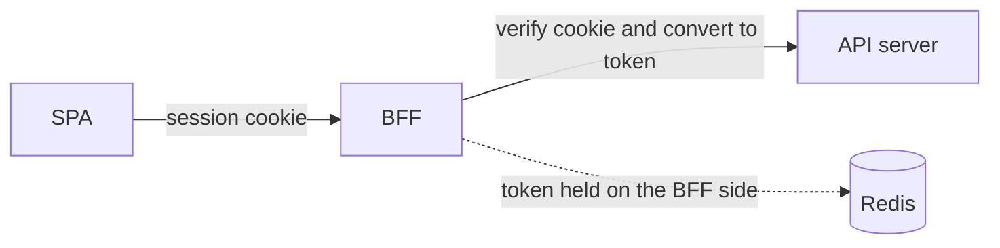
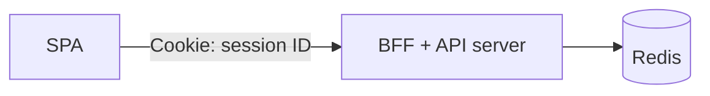

# Overview

When implementing authentication in an SPA (single-page application), you always run into the question of "where to store the access token". localStorage is convenient but weak to XSS. So where should you put it?

This post organizes the comparison of token storage locations, a BFF (Backend For Frontend) design that keeps tokens out of the browser, and the practical judgment that "starting token-less is enough". For the concept of BFF itself, see "[What is BFF (Backend For Frontend)?](/en/posts/bff-explained/)".

# The token storage problem

If you hold a token in an SPA, the risks differ by storage location.

| Location | Stolen by XSS | CSRF | Notes |
| --- | --- | --- | --- |
| localStorage | Stolen (fatal) | No effect | Fully visible to JS. Never put long-lived tokens here |
| sessionStorage | Stolen | No effect | Only differs in that it disappears when the tab closes |
| Memory (JS variable) | Risk only while running | No effect | Disappears on reload. Relatively safe for short-lived ATs |
| httpOnly Cookie | Not readable (safe) | Countermeasure required | Untouchable from JS. CSRF defense via SameSite |

When XSS hits (an attack where malicious JS runs on the page), an attacker steals everything readable from JS (localStorage / sessionStorage / JS variables). JS cannot read an httpOnly Cookie, so an attacker cannot steal it. The basic rule: put long-lived secrets in an httpOnly Cookie.

# 2-Token + 2-Storage (the practical answer for a standalone SPA)

The best practice when you cannot stand up a BFF and call the API directly from the SPA is "2-Token + 2-Storage".

| Token | Role | Lifetime | Storage |
| --- | --- | --- | --- |
| Access Token | API authorization | Very short (5-10 min) | Memory (JS variable) |
| Refresh Token | Re-issue the AT | Long (days to weeks) | httpOnly, Secure, SameSite=Strict Cookie |

Even when XSS hits, an attacker can steal only the short-lived AT in memory, and it expires in minutes. The core Refresh Token sits inside an httpOnly Cookie, so JS cannot steal it.

# The BFF pattern: keeping JWTs out of the browser

To be even more robust, use the BFF pattern. The idea is to "never hand a JWT to the browser". Insert a thin relay server (the BFF) between the frontend and the API; between the browser and the BFF, use session cookies, and only between the BFF and the API use tokens.



The browser side holds no JWT at all, so XSS finds "no" token to steal. Removing the target of the attack itself cuts token leakage risk at the root.

# The authentication state with a BFF

With a BFF, the frontend handles no tokens at all and entrusts the authentication state to a session cookie.

```js
// The frontend only adds credentials: 'include'. It does not put a token in a header.
const res = await fetch('https://bff.example.com/api/user', {
  method: 'GET',
  credentials: 'include',
});
```

The browser automatically sends the session cookie to the BFF, and the BFF takes out the token bound to the session and forwards it to the API. A big advantage of a BFF is that "token", "expiry timer", and "localStorage read/write" disappear from the frontend code.

# Do not put a JWT directly in a cookie

"Maintaining login with a persistent cookie" is a correct idea, but putting the JWT body into the cookie's content is a no-go, for two reasons.

1. **Size limit**: a cookie is up to about 4 KB total per domain. A JWT quickly exceeds 4 KB when you pile on authorization scopes and so on, and the browser stops accepting it.
2. **Cannot be revoked**: if the cookie contains a JWT, the BFF judges it OK with signature verification alone, so even a password change or forced logout cannot stop it until it expires.

The correct answer is to "put only a session ID (a short random string) in the cookie, and hide the JWT on the BFF side (e.g., in Redis)".

```
key:   session:sess_abc123
value: { user_id, access_token, refresh_token }
TTL:   synchronized with the cookie's expiration
```

This avoids the cookie size problem and, on logout, revokes immediately by simply deleting the Redis key.

# The authentication server and the BFF are separate

The BFF and the authentication server (IdP) have different roles, so you should separate them clearly.

- **Authentication server**: the "pro who makes keys" that handles ID/password management, MFA, and token issuance/signing.
- **BFF**: the "agent" that issues cookies for the frontend and handles tokens on behalf of the browser.

Separating them keeps the authentication server off the front line and lets you use a configuration suited to client characteristics for web/mobile.

# Starting token-less is enough

This is an important decision point. If the target is "the browser (SPA) only", you do not need to introduce JWT/OIDC from the start. Starting with old-fashioned session authentication that relies solely on a session ID (Redis) behind the BFF is the most cost-effective in both development speed and operational cost.



The advantages of starting token-less are as follows.

- No need to build the complex OAuth/OIDC flows (authorization code / PKCE / refresh token rotation).
- Because you hand no JWT to the browser, it resists XSS, and SameSite cookies make it resist CSRF too.
- Logout and revocation are just deleting the Redis key.

When you should switch to a JWT-based approach is at these moments.

- **When adding a native app**: an Authorization header + token becomes the baseline rather than cookies.
- **When going to microservices**: having all APIs consult a central Redis becomes a bottleneck, so you flow signed JWTs.
- **When integrating with external services**: you cannot share session IDs, and you need JWTs whose scope you can control.

If you insert a BFF from the start, the frontend's peer is always the BFF (cookie), so even if you overhaul the backend to a JWT-based approach later, you do not have to change the frontend code.

# Summary

- Token storage locations have different risks. Put long-lived secrets in an httpOnly Cookie and short-lived ATs in memory.
- The BFF pattern keeps JWTs out of the browser, eliminating the target of XSS itself.
- Do not put a JWT directly in a cookie; hold it with a session ID + Redis.
- If you have an SPA only, starting token-less (session) is enough. You can move to JWT once you need it.

# References

- [What is BFF (Backend For Frontend)?](/en/posts/bff-explained/)
- [Session-based and Token-based Authentication Methods](/en/posts/session-token-authentication/)
- [OWASP: JSON Web Token for Java Cheat Sheet](https://cheatsheetseries.owasp.org/cheatsheets/JSON_Web_Token_for_Java_Cheat_Sheet.html)
