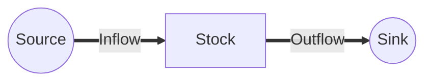
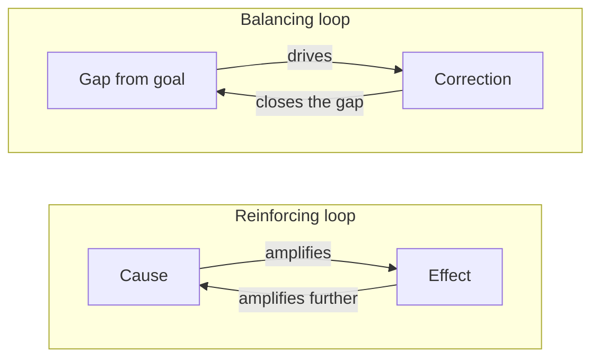
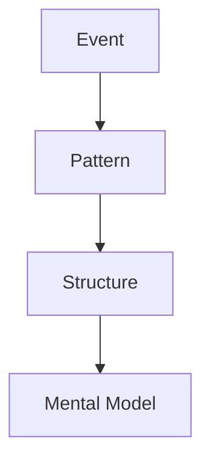
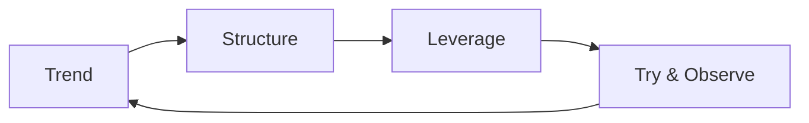

Many problems resist us. A fix backfires, or a symptom returns once the cause looks gone. Systems thinking is a way to handle these stubborn problems.

Here I lay out the core ideas of systems thinking, grounded in Donella Meadows' Thinking in Systems. No background required. Read it as an entry point for seeing things as connections, not points.

## Stop Thinking in Straight Lines

We link cause and effect in a line. A makes B, B makes C, so A is to blame. That is linear thinking.

Reality loops back. C feeds A and shifts the situation again. Cut the line out, and you miss how your own move returns to you.

Local optimization is the same trap. Fix only your slice and the burden shifts elsewhere, hurting the whole. Move on a short horizon, and long-term side effects stay hidden.

Systems thinking swaps lines for loops, parts for wholes, and short term for long term. Shift the view and a different problem appears.

## What a System Is

A system is a whole made of three things: elements, connections, and a purpose. Pile up elements and you do not yet have a system. Once they relate and produce behavior, you do.

A school is more than students, teachers, and rooms. The purpose of learning, together with the act of teaching and the act of studying, turns it into a school. Swap elements and the system carries on; change the connections or the purpose, and it becomes a different thing.

Hunting for who to blame rarely solves the problem. Behavior comes from the connections and the purpose, not the individuals.

## Stocks and Flows

The first tool is stocks and flows. A stock is what accumulates; flows move in and out. Water in a bathtub is a stock; the tap and the drain are its flows.

Savings, trust, inventory, fatigue — much of life fits this shape. The key point: stocks move slowly. Raise the inflow and the level still falls if outflow runs higher. Levels take time to change.

Just feeling that "stocks lag" cuts down the panic of cranking only the tap.

## Feedback Loops

A stock shapes its flows, and those flows shape the stock back. That circle is a feedback loop. The world runs on combinations of these loops.

Loops come in two kinds. A balancing loop pulls toward a target and steadies it; a thermostat shows this well. A reinforcing loop amplifies a gap and accelerates; money makes money, rumors breed rumors.

A snowballing problem points to a reinforcing loop; a stuck one points to a balancing loop. Spotting which loop dominates already narrows the moves worth trying.

## Delays

Feedback comes late. The gap between acting and seeing the result is a delay. Miss the delay and you pile on more action, then overshoot.

A shower makes this obvious. Hot water lags, so you turn the knob too far, scald yourself, jerk back, and freeze. Supply and demand, the economy, hiring — almost any swinging behavior hides a delay.

Wait for the effect to land. Knowing about delay alone prevents overreaction.

## Resilience, Self-Organization, Hierarchy

Lasting systems share three traits. Meadows names resilience, self-organization, and hierarchy.

Resilience is the ability to spring back after a shock. Strip the spare capacity to chase efficiency and you lose it, leaving the system brittle. Self-organization is the power to remake yourself and learn; ecosystems and markets adapt because of it. Hierarchy means the whole is a nest of smaller wholes.

Stop chasing pure efficiency. Keep room to spare and variety. Those are the conditions of a system that does not break easily.

## Read the Iceberg

The event you see is only the tip. Below it lie repeating patterns, then the structures that produce them, and at the bottom the beliefs people hold. This is the iceberg model.

Hit only the event and you treat symptoms. Notice the pattern, drop to the structure that drives it, then question the belief. Deeper layers resist change but pay off more. A problem that keeps coming back usually means the bottom belief never moved.

## Three Levels of Practice: Events, Patterns, Structures

The Japanese edition of Meadows' Thinking in Systems closes with a commentary by Junko Edahiro (the book's translator) that sorts the use of systems thinking into three levels: **beginner, intermediate, advanced**. The levels map onto the top three layers of the iceberg model and differ in how deep you look.

**Beginner: See the events.**

You react to what has come up. A customer complaint lands. A server briefly goes down. One product sells out. A meeting runs past its slot. You knock down these surface problems one at a time. The work matters, but the structure itself does not change.

**Intermediate: See the patterns.**

You watch the repeats behind the events. The same kind of complaint returns each season. Incidents pile up at month-end. A particular product line keeps running out of stock. The same meeting overruns week after week. Reframe single cases as recurring problems and your range of moves widens. KPI trends, time-series, ticket categories, and incident analysis live at this level.

**Advanced: See the structure.**

You face the structure that produces the patterns. Why does the product design keep generating the same complaints? Why does the work cycle pile load onto the end of the month? Why does demand forecasting miss the same product repeatedly? Why does that meeting overrun under its current format? The targets include product design, business processes, decision rules, incentives, organizational structure, information flow, and mental models.

To find a leverage point and shift the structure itself, you have to drop to the advanced level. Chase events alone and the same problem returns in a new shape.

## Draw a Loop

A causal loop diagram makes your mental structure visible. Link elements with arrows, marking which ones raise the next and which ones lower it. Trace the circle: same direction means reinforcing, mixed directions mean balancing.

The picture lets you share your assumptions and grounds the discussion. The first sketch need not be perfect. One rough drawing already surfaces a loop you missed.

## A Process for Systems Thinking

Systems thinking is not a flash of insight; it moves in stages. A rough flow looks like this.

1. Plot how things change over time — draw the trend as a line
2. Drop into the structure — sketch the loops and delays behind the trend
3. Pick a leverage point — find a spot that moves the structure itself
4. Try it and watch — observe results and redraw the picture

Skip perfection. The act of drawing and redrawing is the practice.

## Common Archetypes

The same failures repeat across very different fields. Their underlying structures look alike. Meadows called these recurring shapes **system traps**, and Peter Senge re-cast them as ten archetypes in *The Fifth Discipline*. A few of the most common follow.

### Limits to Growth

Something grows on a reinforcing loop, then stalls. Capacity, people, or market runs out, and the loop loses steam. The move that works is loosening the limit, not pushing the growing side harder.

### Fixes That Fail

Painkillers and workarounds that hide symptoms erode the underlying capacity. The short term feels easier; the long run brings dependence and decay.

### Shifting the Burden

Treat only the symptom and the symptomatic treatment itself turns into the new structure. A close cousin of Fixes That Fail; the weight here sits on the dependence hardening into place.

### Drifting Goals

Faced with a target out of reach, people lower the target instead of closing the gap. Once lowered, it drops again next time. The slow retreat is hard to notice.

### Escalation

When two parties each ramp up to match the other, both keep climbing. Price wars, arms races, and shouting matches share this shape. Without one side stopping first, both push to the ceiling.

### Tragedy of the Commons

Each person takes a fair share from a shared resource until the whole runs dry. Acting optimally as individuals adds up to ruin. Manners, shared budgets, fisheries, groundwater, the global climate — the same shape appears at any scale.

### Name the Trap, Avoid the Trap

Meadows called these archetypes system traps. The point of learning them is twofold. Name a trap so you can diagnose it, and pick a design that does not fall into the same trap in the first place. Asking "is this Limits to Growth?" or "is Escalation kicking in?" already speeds up the read.

The moves differ by archetype, yet share a posture. When you see a symptom, drop one layer and inspect the structure. Watch whether a short-term fix eats away at long-term capacity. Put feedback around any shared resource: rules, cost-sharing, monitoring. Each of these is a way of hunting for a leverage point.

## Pick the Leverage Point

In plain terms, Meadows describes a leverage point as **a place where a small shift produces a big change in system behavior**. Effort lands differently depending on where you aim.

Her list of intervention points falls into four tiers below. The higher the tier, the bigger the leverage. Yet the same spots get harder to see and draw more resistance as you climb.

### Physical level (low leverage)

- **Numbers and parameters** — tax rates, subsidies, constants
- **Buffers** — the size of stocks that absorb fluctuations
- **Stock and flow structures** — physical layout and nodes
- **Delays** — time lags relative to the system's pace

### Feedback loops

- **Balancing loops** — strength of the correction
- **Reinforcing loops** — strength of the amplification

### Information and rules

- **Information flow** — who can access what
- **Rules** — incentives, penalties, constraints

### Power to change the structure (high leverage)

- **Self-organization** — the power to add and evolve structure
- **Goals** — what the system is for
- **Paradigms** — the mindset that produces goals, structure, and rules
- **Transcending paradigms** — refusing to treat any paradigm as absolute

### Why We Reach for the Weak End

Jay Forrester, the founder of system dynamics, made a sharp observation. People often sense where the leverage point sits. Yet most of the time they push the change in the wrong direction. We pour resources into easy-to-move spots like numbers. The places that move the structure itself we leave alone.

Structure resists sight, and agreement on it resists settlement. Price and budget debates push forward. Debates that question the goal or the paradigm shake the participants' footing, so they stall.

### Aim for the Strong Spots

Tuning numbers feels safe. The structure does not move. Open up the information flow and behavior changes. Shift the goal or the mindset and the whole system acts differently.

Stop loading the weak spots with effort. Reach for the strong ones. Even against resistance, climb toward the higher-leverage spots, a little at a time. That payoff is what systems thinking offers.

## How It Differs from Related Approaches

People often confuse systems thinking with structural thinking and design thinking. The three overlap, yet each one looks at a different object.

- **Structural thinking**: Sorts information into layers and categories, often with MECE. The frame stays static and rarely tracks the dynamic give-and-take between elements.
- **Design thinking**: Reframes the problem through user empathy, then probes with quick prototypes. Its strength sits in finding what to build.
- **Systems thinking**: Tracks connections, loops, delays, and stock changes. It asks how behavior emerges over time.

Roughly speaking, structural thinking excels at sorting. Design thinking excels at creation. Systems thinking excels at understanding behavior.

The three are not exclusive. Combining them is the practical move. Use design thinking to find the problem. Use systems thinking to read the structure behind it. Use structural thinking to lay out the next moves. A flow like that works in real settings.

## Wrap-Up

Systems thinking is the habit of looking at structure, not symptoms. See connections, not elements; see loops and delays, not isolated events. The view turns "who to blame" into "what to change."

Pick one event near you and draw it as a circle. The sense that the world runs on systems settles in, one sketch at a time.

## References

- Donella H. Meadows, *Thinking in Systems: A Primer* (Chelsea Green Publishing, 2008)
- Peter M. Senge, *The Fifth Discipline: The Art and Practice of the Learning Organization* (Doubleday, rev. 2006)
- Donella H. Meadows, *Leverage Points: Places to Intervene in a System* (The Sustainability Institute, 1999)
- Change Agent Inc., "Systems Thinking" (in Japanese) — <https://www.change-agent.jp/systemsthinking/>
