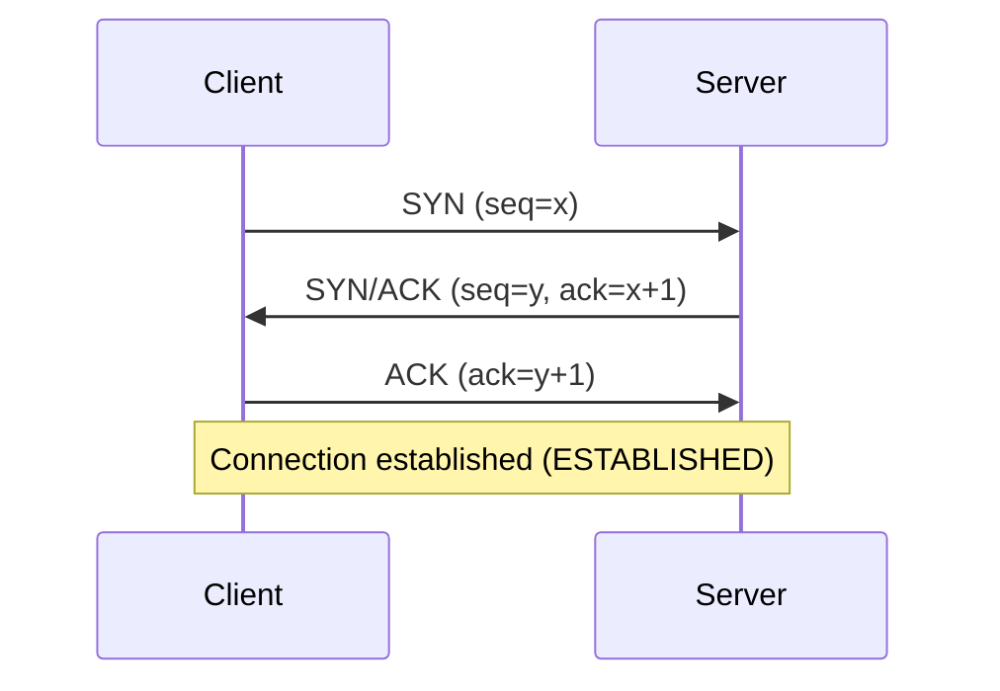

# What Is the Three-Way Handshake?
The three-way handshake is the procedure where a client and a server establish a connection before they start communicating over TCP. Through three packets (SYN → SYN/ACK → ACK), both sides confirm that they can send and receive data.

# Why It Matters
TCP provides reliable communication. Before sending data, both sides need to confirm that they can talk to each other and need to share the initial sequence number (ISN) that anchors the conversation. The three-way handshake performs exactly this setup.

# The Steps

1. SYN: The client requests a connection and sends its own initial sequence number x.
2. SYN/ACK: The server accepts the request, sends its own initial sequence number y, and acknowledges the client with ack=x+1.
3. ACK: The client sends back ack=y+1, which completes the connection.

# State Transitions
During the handshake, the client and the server each move through several states.

- Client: CLOSED → SYN-SENT → ESTABLISHED
- Server: LISTEN → SYN-RECEIVED → ESTABLISHED

# Why Three Messages Instead of Two?
With only two messages, the server cannot confirm that the client can actually receive its response. The third ACK lets both sides confirm reachability in each direction. It also stops a stale SYN that arrived late on the network from opening a wrong connection.

# Closing a Connection
Establishing a connection takes three steps, but closing it takes a four-way handshake, where each side sends its own FIN and ACK.

# Summary
- The three-way handshake is how TCP establishes a connection.
- The three steps SYN → SYN/ACK → ACK confirm two-way reachability and share the initial sequence numbers.
- TCP needs three messages to guarantee reachability in both directions and to reject stale SYNs.
