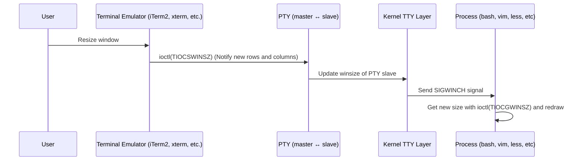

## Introduction

When developing TUI (Terminal User Interface) applications, using existing TUI libraries like `vim` or `htop` makes implementation easy. However, without understanding how the terminal operates, why Raw Mode is necessary, or what ANSI escape sequences are, you won't know what high-level APIs are doing, making it difficult to troubleshoot issues.

This article explains the terminal specifications and implementations necessary for TUI development from the following perspectives:

- Basic Concepts: Organizing terms like terminal, shell, TTY, termios, etc.
- Operating Principles: Input processing by Line Discipline, screen control via escape sequences
- Implementation Methods: Specific implementation examples in Go language (high-level API/low-level API)

Understanding terminal specifications allows you to choose TUI libraries or decide on custom implementations, making it easier to identify the cause of problems during debugging.

## Prerequisite Knowledge: Organizing Terms

To understand TUI development, you first need to understand terms related to terminals.

### Console

Refers to the physical input/output device of a computer. Originally meant the keyboard and display directly connected to the PC itself. In OS terms, it is treated as the "main standard input/output terminal of the system."

### Terminal

A general term for devices or software that perform input/output to a computer. Historically referred to physical terminal devices, but now mainly refers to virtual terminals implemented in software.

### Terminal Emulator

An application that reproduces the functions of a physical terminal device in software. Examples include iTerm2, GNOME Terminal, Windows Terminal, and xterm. Terminal emulators pass keyboard input to programs and render output on the screen. They interpret ANSI escape sequences for screen control.

Main terminal emulators include:

- macOS: Terminal.app, iTerm2
- Linux: GNOME Terminal, Konsole, xterm
- Windows: Windows Terminal, ConEmu

### CLI (Command Line Interface)

An interface form where commands are input as text and output is also received as text. It is a concept contrasted with GUI (Graphical UI). Shells, REPLs, and TUIs are types of CLIs.

### Command Line

Refers to the actual input line where the user inputs one line on the CLI. Lines like `ls -l` or `git commit -m "msg"`. The shell parses and executes this string.

### Shell

A command interpretation program that receives commands and executes programs. Examples include bash, zsh, fish, and PowerShell. It operates on the terminal but is a process independent of the terminal.

The main roles of the shell are:

- Command parsing (token splitting, redirection processing, etc.)
- Managing environment variables
- Process launching and control (job control. A job is a collection of processes)
- Providing scripting functionality

### TUI (Text User Interface)

A character-based interface that provides an interactive UI using the entire screen. Unlike a regular CLI (shell) that executes commands line by line, a TUI controls the entire screen, achieving a rich user experience using cursor movement, colors, borders, menus, forms, etc.

The differences between TUI and CLI are as follows:

| Item         | CLI (Shell, etc.)                                               | TUI                                                               |
| ------------ | ----------------------------------------------------------------- | ----------------------------------------------------------------- |
| Input Method | Line-based (confirmed with Enter)<br>Processed in canonical mode | Key-based (processed instantly when pressed)<br>Processed in non-canonical (raw) mode |
| Screen Usage | Sequentially outputs text to standard output                      | Freely redraws and updates the entire screen (rectangular area)   |
| Cursor Control | Automatically moves to the next line (basic continuous output)  | Can move to any position with ANSI escape, etc.                   |
| Echo Back    | Enabled (input characters are automatically displayed)            | Disabled (drawn by the app as needed)                             |
| Terminal Mode | Canonical Mode<br>= Line editing and signal processing enabled   | Raw Mode<br>= Input is immediately passed to the app              |
| Examples     | bash, zsh, fish, Python REPL, etc.                               | vim, less, htop, nmtui, etc.                                      |

### POSIX (Portable Operating System Interface)

A standard specification to maintain compatibility among Unix-like systems. Formulated by IEEE (Institute of Electrical and Electronics Engineers), it defines APIs for system calls, terminal control, file I/O, threads, etc. Many commands and system calls on macOS and Linux are POSIX compliant.

POSIX-compliant OSs include:

- Linux (Ubuntu, Debian, Red Hat, etc.)
- macOS (Darwin)
- BSD systems (FreeBSD, OpenBSD, etc.)
- Solaris, AIX

The latest specifications are as follows:

- POSIX.1-2024 (IEEE Std 1003.1-2024)
- [Online Version](https://pubs.opengroup.org/onlinepubs/9799919799/)

### POSIX Terminal Interface

A standard API for input/output control of terminals defined by POSIX. Using the termios structure and its related functions (`tcgetattr()`, `tcsetattr()`, etc.), it configures terminal modes, defines special characters, sets baud rates (data transfer speed in serial communication), etc. This standardization allows the same code to work across POSIX-compliant OSs.

Specification documents are as follows:

- [POSIX.1-2024 - General Terminal Interface](https://pubs.opengroup.org/onlinepubs/9799919799/basedefs/V1_chap11.html)

### Unix Terminal Interface

The traditional mechanism for terminal control in Unix-like OSs. The TTY driver manages terminal devices within the kernel, and the line discipline handles input/output processing (line editing, echo back, special character processing, etc.). POSIX standardizes this Unix terminal interface.

### TTY (TeleTYpewriter)

TTY is a general term for terminal devices in Unix-like OSs. Originally a device for connecting physical teletypewriters (electric typewriters), it now refers to terminal devices in general, including virtual terminals (PTY).

### TTY Line Discipline

Line discipline is a software layer located between the TTY driver and user processes in the kernel of Unix-like OSs, responsible for terminal input/output processing.

The roles of line discipline are as follows:

1. Line Editing Function
   - Delete characters with Backspace
   - Delete the entire line with Ctrl+U
   - Delete words with Ctrl+W

2. Echo Back
   - Automatically sends input characters back to the terminal
   - Allows users to confirm their input

3. Special Character Processing
   - Ctrl+C → Sends SIGINT signal
   - Ctrl+Z → Sends SIGTSTP signal (pauses the process)
   - Ctrl+D → EOF (end of input)

4. Character Conversion
   - Newline code conversion (CR ↔ LF)
   - Uppercase/lowercase conversion (old systems)

5. Input Buffering
   - Canonical Mode: Buffers input line by line until Enter key
   - Non-Canonical Mode: Passes input character by character immediately

### termios

A POSIX standard terminal control structure. Manages the following settings:

- Input Mode (`c_iflag`): Newline conversion, flow control, etc.
- Output Mode (`c_oflag`): Output processing settings
- Control Mode (`c_cflag`): Baud rate, character size, etc.
- Local Mode (`c_lflag`): Echo, canonical mode, signal generation, etc.
- Special Characters (`c_cc`): Definitions for Ctrl+C, Ctrl+Z, EOF, etc.
- Timeout (`VMIN`, `VTIME`): Read control in non-canonical mode

In TUI development, termios is used to implement Raw Mode (raw input mode).

### ioctl (Input/Output Control)

`ioctl` is a generic system call for device control in Unix-like OSs. Through file descriptors, it instructs device drivers to perform special operations that cannot be done with regular read/write operations.

Main operations include:

- Getting and setting termios
- Getting window size

### tcgetattr / tcsetattr

High-level API functions for terminal control defined by POSIX. Using `ioctl` system call directly, you can write portable and readable code.

On POSIX-compliant systems, using `tcgetattr`/`tcsetattr` is recommended. You can write code without worrying about platform differences (such as constant name differences).

In Go language, there is no wrapper for `tcgetattr`/`tcsetattr` in the standard library, so the following options are available:

1. Use `golang.org/x/term` (high-level)
```go
import "golang.org/x/term"

// Get current settings
oldState, err := term.GetState(fd)

// Set to Raw Mode
newState, err := term.MakeRaw(fd)

// Restore
err := term.Restore(fd, oldState)
```

2. Use `golang.org/x/sys/unix` to directly use `ioctl` (low-level)
```go
import "golang.org/x/sys/unix"

// Equivalent to tcgetattr
termios, err := unix.IoctlGetTermios(fd, unix.TIOCGETA)

// Equivalent to tcsetattr
err := unix.IoctlSetTermios(fd, unix.TIOCSETA, termios)
```

The `golang.org/x/term` package uses `ioctl` from `golang.org/x/sys/unix` internally, absorbing platform differences.

### PTY (Pseudo Terminal)

A virtual terminal device used by terminal emulators. It actually operates as a pair of two device files.

- Master side: Operated by the terminal emulator
- Slave side: Connected to the shell or TUI app

In POSIX.1-2024 (IEEE Std 1003.1-2024), the master side is called "manager," and the slave side is called "subsidiary."

Shells and TUI apps treat the slave side as a "real terminal," so they can use the same API (termios, etc.) as physical terminals. This allows applications to not have to be aware of whether they are dealing with a physical or virtual terminal.

Examples of device files are as follows:

- Linux: `/dev/pts/0`, `/dev/pts/1`...
- macOS: `/dev/ttys000`, `/dev/ttys001`...

### ANSI Escape Sequence

Special character string commands for controlling terminal display. Control codes starting with the ESC character (`\x1b` or `\033`) instruct cursor movement, color change, screen clearing, etc.

Main control sequences are as follows:

- `\x1b[31m`: Change to red text
- `\x1b[2J`: Clear screen
- `\x1b[H`: Move cursor to top left (1,1)
- `\x1b[10;20H`: Move cursor to row 10, column 20

In TUI development, these sequences are directly output to achieve screen drawing, partial updates, and coloring. Standardized as ANSI X3.64 and widely adopted after being implemented in VT100 terminals.

### Terminal Input/Output Flow

```mermaid
flowchart TB
    U[User] --> TERM[Terminal Emulator (iTerm2, xterm, etc.)]
    TERM --> PTY[Virtual Terminal (PTY master <-> slave)]
    PTY --> TTY[TTY + Line discipline (ICANON / ECHO / ISIG)]
    TTY --> APP[TUI App (bash, vim, htop, etc.)]
    APP -->|termios setting change| TTY
    APP -->|Output (ANSI escape)| TERM
    TERM -->|Rendering| U
```

## Terminal Behavior to Control in TUI Development

TUI (Text User Interface) applications do not interpret commands like shells but **directly handle terminal (TTY) input/output control**.

Specifically, using the `termios` API, **change terminal mode settings (e.g., disable canonical mode, disable echo, etc.)** and use ANSI escape sequences to draw and update the entire screen.

In a normal shell environment, the terminal is set to canonical mode (`ICANON`), and user input is **buffered line by line and passed to the program after being confirmed with the Enter key**.

```bash
$ stty -a | grep icanon
lflags: icanon isig iexten echo echoe echok echoke -echonl echoctl # Canonical mode enabled
```

Therefore, input characters are automatically echoed on the screen, and the line is sent to the shell when the Enter key is pressed.

```bash
$ ls
example.txt
```

On the other hand, TUI applications like `vim` or `less` **switch the terminal to non-canonical mode**.

This allows key input to be passed to the application character by character immediately, and the application performs its own input processing and screen drawing.

```bash
$ vim

In another terminal:
$ ps aux | grep vim # Check vim terminal
$ stty -a < /dev/ttys049 | grep icanon
lflags: -icanon -isig -iexten -echo -echoe echok echoke -echonl echoctl # Canonical mode disabled
```

## Overview of Knowledge Required for TUI Development

To create a TUI app, you need to understand and control the following technical elements:

1. Terminal Mode Settings
2. Input Processing
3. Screen Control
4. Terminal Size Management
5. Buffering

In the following sections, we will explain these technical elements in detail, including specifications and implementation methods.

### Terminal Mode Settings
The **line discipline** of the terminal (TTY) is a software layer in the kernel that controls how input and output are handled. There are mainly three operating modes (Canonical/Non-Canonical/Raw), which can be switched by setting flags in the `termios` structure.

These modes are all realized by the **TTY line discipline** in the kernel. `termios` and the `stty` command are interfaces for changing this line discipline setting.

#### Canonical Mode (Cooked Mode)

The normal terminal input mode and the **default terminal setting**. It has line editing functions, buffers input line by line, and passes it to the application after being confirmed with the Enter key.

Main features are as follows:

- Line-based input buffering
- Line editing functions (Backspace, Ctrl+U, Ctrl+W, etc.)
- Echo back (automatic display of input characters)
- Special character processing (Ctrl+C, Ctrl+Z, Ctrl+D, etc.)
- Newline code conversion (`\r` ↔ `\n`)

Uses include:

- Normal shell operations (bash, zsh, etc.)
- Interactive programs

Cooked Mode is another name for Canonical Mode.

#### Non-Canonical Mode

A mode with `ICANON` disabled.

Line editing functions are provided by the kernel's TTY line discipline, but in non-canonical mode, that processing is disabled, and the application needs to handle it.

Main features are as follows:

- Immediate input character by character
- No line editing functions (Backspace is just a character)
- Echo and signal processing can be individually retained

Uses include:

- Timeout input
- CLI tools with custom input control

Non-canonical mode alone may still have echo and signal processing remaining, so if you want complete control, use Raw mode.

#### Raw Mode

A mode that almost completely disables input/output conversion and control of the terminal. Commonly used in TUI applications.

Main features are as follows:

- Disables all processing, including special characters and newline conversion
- Input is passed to the application as a byte stream
- No echo
- No signal generation (Ctrl+C, etc. are treated as characters)

Uses include:

- TUI apps (vim, less, htop, etc.)
- Games, custom screen control tools

`stty`'s `-cooked` is synonymous with `raw`, and Raw mode is treated as the opposite of Cooked mode.

#### Mode Comparison Table

| Item                 | Canonical (Cooked) | Non-Canonical | Raw         |
| -------------------- | ------------------ | ------------ | ----------- |
| Input Buffering      | Line-based         | Character-based | Character-based |
| Line Editing Function | Enabled            | Disabled     | Disabled    |
| Echo Back            | Enabled            | Depends*     | Disabled    |
| Special Characters (Signal) | Enabled            | Depends*     | Disabled    |
| Newline Conversion   | Enabled            | Depends*     | Disabled    |
| Main Uses            | Shell, Interactive Input | Custom CLI  | TUI, Games |

### Input Processing

In input processing, "what key was pressed" is analyzed.

You need to handle **non-standard character inputs** such as arrow keys, function keys, and mouse events. These are sent as multi-byte escape sequences.

In TUI apps, you need to parse these escape sequences and perform appropriate operations.

#### Escape Sequences for Special Keys

| Key      | Sequence        | Byte Sequence |
| --------- | ----------------- | ------------ |
| ↑         | `ESC[A`           | `\x1b[A`     |
| ↓         | `ESC[B`           | `\x1b[B`     |
| →         | `ESC[C`           | `\x1b[C`     |
| ←         | `ESC[D`           | `\x1b[D`     |
| Home      | `ESC[H`           | `\x1b[H`     |
| End       | `ESC[F`           | `\x1b[F`     |
| Page Up   | `ESC[5~`          | `\x1b[5~`    |
| Page Down | `ESC[6~`          | `\x1b[6~`    |
| F1-F4     | `ESC[OP`-`ESC[OS` | `\x1b[OP` etc. |

#### Control Characters

| Character | ASCII              | Description |
| --------- | ------------------ | ---------- |
| Ctrl+C    | 3                  | SIGINT     |
| Ctrl+D    | 4                  | EOF        |
| Ctrl+Z    | 26                 | SIGTSTP    |
| Enter     | 13 (CR) / 10 (LF)  | Newline    |
| Tab       | 9                  | Tab        |
| Backspace | 127 (DEL) / 8 (BS) | Backspace  |
| ESC       | 27                 | Escape     |

### Screen Control (ANSI Escape Sequences)

In screen control, "what to display where" is instructed.

You need to perform all operations necessary for TUI drawing, such as moving the cursor to any position, changing colors, and clearing the screen.

Main control sequences are as follows.

#### Cursor Control

| Sequence         | Description                        |
| ------------------ | --------------------------------- |
| `ESC[H`            | Move cursor to home position (1,1) |
| `ESC[{row};{col}H` | Move to specified position (1-indexed) |
| `ESC[{n}A`         | Move n lines up                   |
| `ESC[{n}B`         | Move n lines down                 |
| `ESC[{n}C`         | Move n columns right              |
| `ESC[{n}D`         | Move n columns left               |
| `ESC[s`            | Save cursor position              |
| `ESC[u`            | Restore cursor position           |
| `ESC[?25l`         | Hide cursor                       |
| `ESC[?25h`         | Show cursor                       |

#### Screen Clear

| Sequence | Description                           |
| ---------- | ------------------------------------ |
| `ESC[2J`   | Clear entire screen                  |
| `ESC[H`    | Move cursor to home                  |
| `ESC[K`    | Clear from cursor to end of line     |
| `ESC[1K`   | Clear from start of line to cursor   |
| `ESC[2K`   | Clear entire line                    |

#### Color and Style

#### Basic Style

| Sequence | Description             |
| ---------- | ---------------------- |
| `ESC[0m`   | Reset all attributes   |
| `ESC[1m`   | Bold                   |
| `ESC[4m`   | Underline              |
| `ESC[7m`   | Reverse                |

#### Foreground Color (Text Color)

| Sequence | Color     |
| ---------- | --------- |
| `ESC[30m`  | Black     |
| `ESC[31m`  | Red       |
| `ESC[32m`  | Green     |
| `ESC[33m`  | Yellow    |
| `ESC[34m`  | Blue      |
| `ESC[35m`  | Magenta   |
| `ESC[36m`  | Cyan      |
| `ESC[37m`  | White     |

#### Background Color

| Sequence | Color     |
| ---------- | --------- |
| `ESC[40m`  | Black     |
| `ESC[41m`  | Red       |
| `ESC[42m`  | Green     |
| `ESC[43m`  | Yellow    |
| `ESC[44m`  | Blue      |
| `ESC[45m`  | Magenta   |
| `ESC[46m`  | Cyan      |
| `ESC[47m`  | White     |

#### Extended Color Mode

| Sequence              | Description                 |
| ----------------------- | -------------------------- |
| `ESC[38;5;{n}m`         | Foreground color (n: 0-255) |
| `ESC[48;5;{n}m`         | Background color (n: 0-255) |
| `ESC[38;2;{r};{g};{b}m` | Foreground color (RGB True Color) |
| `ESC[48;2;{r};{g};{b}m` | Background color (RGB True Color) |

#### Alternate Screen Buffer

| Sequence   | Description                                                   |
| ------------ | ------------------------------------------------------------ |
| `ESC[?1049h` | Switch to alternate screen buffer (used by vim/less, etc.) |
| `ESC[?1049l` | Return to normal screen buffer                             |

### Terminal Size Management

TUI apps need to draw according to the terminal size. Also, when the user changes the window size, it needs to be redrawn.

The terminal size is managed by the winsize structure held by the kernel's TTY structure, and the terminal emulator notifies changes with ioctl(TIOCSWINSZ), and the kernel sends SIGWINCH to connected processes.



### Buffering

When sending many control sequences, sending them one by one slows down. Buffering and flushing at once can prevent screen flickering and improve performance.

---

These are the five elements of terminal control necessary for TUI development. In the next section, we will look at how to implement these in Go language.

## Learning TUI Implementation in Go

Here, we will explain how to implement the five technical elements described in the previous section in Go language.

Using the `golang.org/x/term` package (high-level API), you can learn the basics of TUI development through a simple implementation example of about 230 lines.

To make it easier to learn the overall picture of the knowledge required for terminals, we will implement it considering each technical element.

### Features to Implement
### 1. Terminal Mode Settings
- Set to Raw Mode with `term.MakeRaw()`
- Save and restore settings with `term.GetState()`/`term.Restore()`
- Always restore to the original state when the program ends

### 2. Input Processing
- Read key input one byte at a time
- Parse escape sequences to recognize arrow keys
- Process control characters like Ctrl+C

### 3. Screen Control (ANSI Escape Sequences)
- Cursor movement (`\033[{row};{col}H`)
- Screen clear (`\033[2J\033[H`)
- Set color (foreground color)

### 4. Terminal Size Management
- Get current size with `unix.IoctlGetWinsize()`
- Detect window size changes with `SIGWINCH` signal

### 5. Buffering
- Buffer output with `bufio.Writer`
- Accumulate multiple drawing operations in the buffer
- Reflect on the screen at once with `Flush()` to prevent flickering

### Implementation
```go
package main

import (
	"bufio"
    "fmt"
    "os"
    "os/signal"
    "syscall"
	"time"

    "golang.org/x/term"
)

// Structure to manage terminal state
type Terminal struct {
	fd       int
	oldState *term.State
	width    int
	height   int
	writer   *bufio.Writer
}

// 1. Terminal Mode Settings
func NewTerminal() (*Terminal, error) {
	fd := int(os.Stdin.Fd())

	// Save current settings
	oldState, err := term.GetState(fd)
	if err != nil {
		return nil, err
	}

	// Set to Raw Mode
	_, err = term.MakeRaw(fd)
	if err != nil {
		return nil, err
	}

	// Get initial size
	width, height := getTerminalSize(fd)

	return &Terminal{
		fd:       fd,
		oldState: oldState,
		width:    width,
		height:   height,
		writer:   bufio.NewWriter(os.Stdout),
	}, nil
}

// Restore to original state on exit
func (t *Terminal) Restore() {
	t.writer.WriteString("\033[?25h") // Show cursor
	t.writer.WriteString("\033[0m")   // Reset color
	t.writer.Flush()
	term.Restore(t.fd, t.oldState)
}

// 4. Terminal Size Management
func getTerminalSize(fd int) (width, height int) {
	width, height, err := term.GetSize(fd)
    if err != nil {
        return 80, 24 // Default value
    }
    return width, height
}

func (t *Terminal) UpdateSize() {
	t.width, t.height = getTerminalSize(t.fd)
}

// 2. Input Processing
func (t *Terminal) ReadKey() (rune, string, error) {
    buf := make([]byte, 1)
    _, err := os.Stdin.Read(buf)
    if err != nil {
		return 0, "", err
	}

	// Ctrl+C
	if buf[0] == 3 {
		return 0, "CTRL_C", nil
	}

	// ESC key (escape sequences for arrow keys, etc.)
	if buf[0] == 27 {
		// Wait a bit and check for the next byte
        seq := make([]byte, 2)
        os.Stdin.Read(seq)

        if seq[0] == '[' {
            switch seq[1] {
			case 'A':
				return 0, "UP", nil
			case 'B':
				return 0, "DOWN", nil
			case 'C':
				return 0, "RIGHT", nil
			case 'D':
				return 0, "LEFT", nil
			}
		}
		return 0, "ESC", nil
	}

	// Normal character
	return rune(buf[0]), "", nil
}

// 3. Screen Control (ANSI Escape Sequences)
func (t *Terminal) Clear() {
	t.writer.WriteString("\033[2J\033[H")
}

func (t *Terminal) MoveTo(row, col int) {
	t.writer.WriteString(fmt.Sprintf("\033[%d;%dH", row, col))
}

func (t *Terminal) SetColor(fg int) {
	t.writer.WriteString(fmt.Sprintf("\033[%dm", fg))
}

func (t *Terminal) Write(s string) {
	t.writer.WriteString(s)
}

// 5. Buffering
func (t *Terminal) Flush() {
	t.writer.Flush()
}

func main() {
	// Terminal check
	if !term.IsTerminal(int(os.Stdin.Fd())) {
		fmt.Fprintln(os.Stderr, "Error: Must be run in an interactive terminal")
		os.Exit(1)
	}

	// Initialization
	term, err := NewTerminal()
	if err != nil {
		fmt.Fprintf(os.Stderr, "Failed to initialize: %v\n", err)
		os.Exit(1)
	}
	defer term.Restore()

	// Detect window size changes
	sigCh := make(chan os.Signal, 1)
	signal.Notify(sigCh, syscall.SIGWINCH)
    go func() {
        for range sigCh {
			term.UpdateSize()
        }
    }()

	// Cursor position
	x, y := term.width/2, term.height/2

    // Main loop
	for {
		// Clear screen
		term.Clear()

		// Title
		term.MoveTo(1, term.width/2-10)
		term.SetColor(36) // Cyan
		term.Write("TUI Demo (press 'q' to quit)")

		// Display information
		term.MoveTo(3, 2)
		term.SetColor(33) // Yellow
		term.Write(fmt.Sprintf("Terminal Size: %dx%d", term.width, term.height))

		term.MoveTo(4, 2)
		term.Write(fmt.Sprintf("Cursor Position: (%d, %d)", x, y))

		// Draw frame
		for row := 5; row < term.height-1; row++ {
			term.MoveTo(row, 1)
			term.SetColor(34) // Blue
			term.Write("|")
			term.MoveTo(row, term.width)
			term.Write("|")
		}

		// Display cursor (marker)
		term.MoveTo(y, x)
		term.SetColor(32) // Green
		term.Write("●")

		// Operation instructions
		term.MoveTo(term.height, 2)
		term.SetColor(37) // White
		term.Write("Arrow keys: move | q: quit")

		// Flush buffer (reflect on screen at once)
		term.Flush()

		// Wait for key input
		ch, key, err := term.ReadKey()
		if err != nil {
			break
		}

		// Key processing
		switch key {
		case "CTRL_C":
			return
		case "UP":
			if y > 5 {
				y--
			}
		case "DOWN":
			if y < term.height-1 {
				y++
			}
		case "LEFT":
			if x > 2 {
				x--
			}
		case "RIGHT":
			if x < term.width-1 {
				x++
			}
		}

		if ch == 'q' || ch == 'Q' {
			return
		}

		// Wait a bit (to detect resize events)
		time.Sleep(50 * time.Millisecond)
	}
}
```

### Execution

```bash
go run main.go
```

The operation method is as follows.

- Arrow keys: Move the cursor (●)
- q: Quit
- Ctrl+C: Quit
- Window size change: Automatically detected (reflected on the next key input)

### Implementation Details
### Terminal Structure
```go
type Terminal struct {
	fd       int // File descriptor
	oldState *term.State // Original terminal settings
	width    int // Terminal width
	height   int // Terminal height
	writer   *bufio.Writer // Buffered Writer
}
```

The Terminal structure is a structure for managing the state of the terminal.

fd is a file descriptor, which refers to the file being operated on.

In Unix-like OSs, input/output (files, terminals, sockets, etc.) is managed by an integer identifier.

The following are standard file descriptor numbers and names.

|Number|Name|Description|
|-|-|-|
|0|stdin|Standard input (keyboard input)
|1|stdout|Standard output (screen output)
|2|stderr|Standard error output|

The file descriptor for standard input can be obtained as follows.

```go
fd := int(os.Stdin.Fd()) // Get file descriptor for stdin
```

You can use `fd` to operate terminal settings.

```go
// Get current terminal settings
term.GetState(fd)

// Set to Raw Mode
term.MakeRaw(fd)

// Get terminal size
term.GetSize(fd)
```

### Setting Raw Mode

Setting Raw Mode is done as follows.

```go
oldState, _ := term.GetState(fd)
term.MakeRaw(fd)
defer term.Restore(fd, oldState)
```

When setting Raw Mode, you must use `term.Restore()` to restore to the original state, otherwise it will not return to the original state when the program ends.

### Optimization by Buffering
```go
writer := bufio.NewWriter(os.Stdout)
writer.WriteString("...") // Accumulate multiple drawings in the buffer
writer.Flush() // Reflect on the screen at once to prevent flickering
```

When buffering, use `writer.Flush()` to flush the buffer.

### Detecting Size Changes with SIGWINCH

SIGWINCH is a signal sent when the window size is changed.

When receiving SIGWINCH, call `term.UpdateSize()` to update the window size.

```go
sigCh := make(chan os.Signal, 1)
signal.Notify(sigCh, syscall.SIGWINCH)
go func() {
	for range sigCh {
		term.UpdateSize()
	}
}()
```

## Lower-Level Implementation: Using `golang.org/x/sys/unix`

The `golang.org/x/term` package uses `golang.org/x/sys/unix` internally. Here, we will look at a lower-level implementation that directly manipulates each flag of `termios`.

In this implementation, you can learn:

- Direct manipulation of each flag of `termios` (`Iflag`, `Oflag`, `Lflag`, `Cflag`, `Cc`)
- Use of `ioctl` system call (`IoctlGetTermios`/`IoctlSetTermios`)
- API calls equivalent to `tcgetattr`/`tcsetattr`

By comparing with the high-level implementation, you can understand what `golang.org/x/term` is doing internally.

```go
package main

import (
    "bufio"
    "fmt"
    "os"
    "os/signal"
    "syscall"
	"time"

	"golang.org/x/sys/unix"
)

// Low-level implementation directly manipulating termios
// Learn in a form close to the internal implementation of golang.org/x/term

// Structure to manage terminal state
type Terminal struct {
	fd       int
	oldState unix.Termios // Directly hold termios structure
	width    int
	height   int
	writer   *bufio.Writer
}

// 1. Terminal Mode Settings (Low-level)
func NewTerminal() (*Terminal, error) {
	fd := int(os.Stdin.Fd())

	// Equivalent to tcgetattr: Get current termios settings
	oldState, err := unix.IoctlGetTermios(fd, unix.TIOCGETA)
    if err != nil {
		return nil, fmt.Errorf("failed to get termios: %w", err)
	}

	// Create Raw Mode settings
	newState := *oldState

	// Input flags (c_iflag)
	newState.Iflag &^= unix.IGNBRK | unix.BRKINT | unix.PARMRK |
		unix.ISTRIP | unix.INLCR | unix.IGNCR | unix.ICRNL | unix.IXON

	// Output flags (c_oflag)
	newState.Oflag &^= unix.OPOST

	// Local flags (c_lflag)
	newState.Lflag &^= unix.ECHO | unix.ECHONL | unix.ICANON |
		unix.ISIG | unix.IEXTEN

	// Control flags (c_cflag)
	newState.Cflag &^= unix.CSIZE | unix.PARENB
	newState.Cflag |= unix.CS8

	// Control characters (c_cc)
	newState.Cc[unix.VMIN] = 1  // Read at least 1 byte
	newState.Cc[unix.VTIME] = 0 // No timeout

	// Equivalent to tcsetattr: Apply new settings
	if err := unix.IoctlSetTermios(fd, unix.TIOCSETA, &newState); err != nil {
		return nil, fmt.Errorf("failed to set raw mode: %w", err)
	}

	// Get initial size
	width, height := getTerminalSize(fd)

	return &Terminal{
		fd:       fd,
		oldState: *oldState,
		width:    width,
		height:   height,
		writer:   bufio.NewWriter(os.Stdout),
	}, nil
}

// Restore to original state on exit
func (t *Terminal) Restore() {
	t.writer.WriteString("\033[?25h") // Show cursor
	t.writer.WriteString("\033[0m")   // Reset color
	t.writer.Flush()

	// Equivalent to tcsetattr: Restore to original settings
	unix.IoctlSetTermios(t.fd, unix.TIOCSETA, &t.oldState)
}

// 4. Terminal Size Management (Direct ioctl call)
func getTerminalSize(fd int) (width, height int) {
	// Get window size with TIOCGWINSZ ioctl
	ws, err := unix.IoctlGetWinsize(fd, unix.TIOCGWINSZ)
	if err != nil {
		return 80, 24 // Default value
	}
	return int(ws.Col), int(ws.Row)
}

func (t *Terminal) UpdateSize() {
	t.width, t.height = getTerminalSize(t.fd)
}

// 2. Input Processing
func (t *Terminal) ReadKey() (rune, string, error) {
	buf := make([]byte, 1)
	_, err := unix.Read(t.fd, buf) // Directly use system call
	if err != nil {
		return 0, "", err
	}

	// Ctrl+C
	if buf[0] == 3 {
		return 0, "CTRL_C", nil
	}

	// ESC key (escape sequences for arrow keys, etc.)
	if buf[0] == 27 {
		// Wait a bit and check for the next byte
		seq := make([]byte, 2)
		unix.Read(t.fd, seq)

		if seq[0] == '[' {
			switch seq[1] {
			case 'A':
				return 0, "UP", nil
			case 'B':
				return 0, "DOWN", nil
			case 'C':
				return 0, "RIGHT", nil
			case 'D':
				return 0, "LEFT", nil
			}
		}
		return 0, "ESC", nil
	}

	// Normal character
	return rune(buf[0]), "", nil
}

// 3. Screen Control (ANSI Escape Sequences)
func (t *Terminal) Clear() {
	t.writer.WriteString("\033[2J\033[H")
}

func (t *Terminal) MoveTo(row, col int) {
	t.writer.WriteString(fmt.Sprintf("\033[%d;%dH", row, col))
}

func (t *Terminal) SetColor(fg int) {
	t.writer.WriteString(fmt.Sprintf("\033[%dm", fg))
}

func (t *Terminal) Write(s string) {
	t.writer.WriteString(s)
}

// 5. Buffering
func (t *Terminal) Flush() {
	t.writer.Flush()
}

func main() {
	// Initialization
	term, err := NewTerminal()
	if err != nil {
		fmt.Fprintf(os.Stderr, "Failed to initialize: %v\n", err)
		os.Exit(1)
	}
	defer term.Restore()

	// Detect window size changes (SIGWINCH)
	sigCh := make(chan os.Signal, 1)
	signal.Notify(sigCh, syscall.SIGWINCH)
	go func() {
		for range sigCh {
			term.UpdateSize()
		}
	}()

	// Cursor position
	x, y := term.width/2, term.height/2

	// Main loop
	for {
		// Clear screen
		term.Clear()

		// Title
		term.MoveTo(1, term.width/2-15)
		term.SetColor(36) // Cyan
		term.Write("TUI Demo (Low-level termios API)")

		// Explanation of termios settings
		term.MoveTo(3, 2)
		term.SetColor(33) // Yellow
		term.Write("Using unix.IoctlGetTermios/IoctlSetTermios")

		term.MoveTo(4, 2)
		term.Write(fmt.Sprintf("Terminal Size: %dx%d", term.width, term.height))

		term.MoveTo(5, 2)
		term.Write(fmt.Sprintf("Cursor Position: (%d, %d)", x, y))

		// Explanation of set flags
		term.MoveTo(7, 2)
		term.SetColor(37) // White
		term.Write("Raw Mode flags:")
		term.MoveTo(8, 4)
		term.Write("- ICANON off: Disable line buffering")
		term.MoveTo(9, 4)
		term.Write("- ECHO off: Disable echo back")
		term.MoveTo(10, 4)
		term.Write("- ISIG off: Disable signal generation")
		term.MoveTo(11, 4)
		term.Write("- VMIN=1, VTIME=0: Read one byte at a time")

		// Draw frame
		for row := 13; row < term.height-1; row++ {
			term.MoveTo(row, 1)
			term.SetColor(34) // Blue
			term.Write("|")
			term.MoveTo(row, term.width)
			term.Write("|")
		}

		// Display cursor (marker)
		term.MoveTo(y, x)
		term.SetColor(32) // Green
		term.Write("●")

		// Operation instructions
		term.MoveTo(term.height, 2)
		term.SetColor(37) // White
		term.Write("Arrow keys: move | q: quit")

		// Flush buffer (reflect on screen at once)
		term.Flush()

		// Wait for key input
		ch, key, err := term.ReadKey()
		if err != nil {
			break
		}

		// Key processing
		switch key {
		case "CTRL_C":
			return
		case "UP":
			if y > 13 {
				y--
			}
		case "DOWN":
			if y < term.height-1 {
				y++
			}
		case "LEFT":
			if x > 2 {
				x--
			}
		case "RIGHT":
			if x < term.width-1 {
				x++
			}
		}

		if ch == 'q' || ch == 'Q' {
			return
		}

		// Wait a bit (to detect resize events)
		time.Sleep(50 * time.Millisecond)
	}
}
```

With this low-level implementation, you can understand:

- What each flag of `termios` specifically controls
- How `tcgetattr`/`tcsetattr` of POSIX standard is implemented in Go language
- The actual usage of `ioctl` system call

By understanding both high-level implementation (`golang.org/x/term`) and low-level implementation (`golang.org/x/sys/unix`), you can see the overall picture of terminal control.

## Conclusion

In this article, we explained the terminal specifications necessary for TUI development, from organizing terms to implementation.

### What We Learned

1. Organizing Terms and Concepts
   - The relationship between terminal, shell, TTY, Line Discipline, termios, etc.
   - The positioning of POSIX and Unix terminal interface

2. Five Elements of TUI Development
   - Terminal Mode Settings (Canonical/Non-Canonical/Raw)
   - Input Processing (Parsing escape sequences)
   - Screen Control (ANSI escape sequences)
   - Terminal Size Management (SIGWINCH)
   - Buffering (Prevent flickering)

3. Understanding Implementation
   - How to use high-level API (`golang.org/x/term`)
   - Direct manipulation of `termios` with low-level API (`golang.org/x/sys/unix`)
   - The relationship between `tcgetattr`/`tcsetattr` and `ioctl`

# Promotion

I am developing a git TUI/CLI tool called [ggc](https://github.com/bmf-san/ggc). The reason I wanted to learn about terminals was the development of this application.

If you like it, please give it a star.

# References

## Specifications and Standards
- [POSIX.1-2024 - General Terminal Interface](https://pubs.opengroup.org/onlinepubs/9799919799/basedefs/V1_chap11.html)
- [termios(3) - Linux manual page](https://linuxjm.sourceforge.io/html/LDP_man-pages/man3/termios.3.html)
- [TTY Line Discipline - Linux Kernel Documentation](https://docs.kernel.org/driver-api/tty/tty_ldisc.html)

## Wikipedia
- [Computer terminal](https://en.wikipedia.org/wiki/Computer_terminal)
- [Terminal emulator](https://en.wikipedia.org/wiki/Terminal_emulator)
- [Text-based user interface](https://en.wikipedia.org/wiki/Text-based_user_interface)
- [POSIX terminal interface](https://en.wikipedia.org/wiki/POSIX_terminal_interface)
- [Seventh Edition Unix terminal interface](https://en.wikipedia.org/wiki/Seventh_Edition_Unix_terminal_interface)
- [Pseudoterminal](https://en.wikipedia.org/wiki/Pseudoterminal)
- [ANSI escape code](https://en.wikipedia.org/wiki/ANSI_escape_code)

## Tutorials and Implementations
- [Serial Programming/termios - Wikibooks](https://en.wikibooks.org/wiki/Serial_Programming/termios)
- [golang.org/x/term - Go Package Documentation](https://pkg.go.dev/golang.org/x/term)
- [ioctl(2) - Linux manual page](https://man7.org/linux/man-pages/man2/ioctl.2.html)