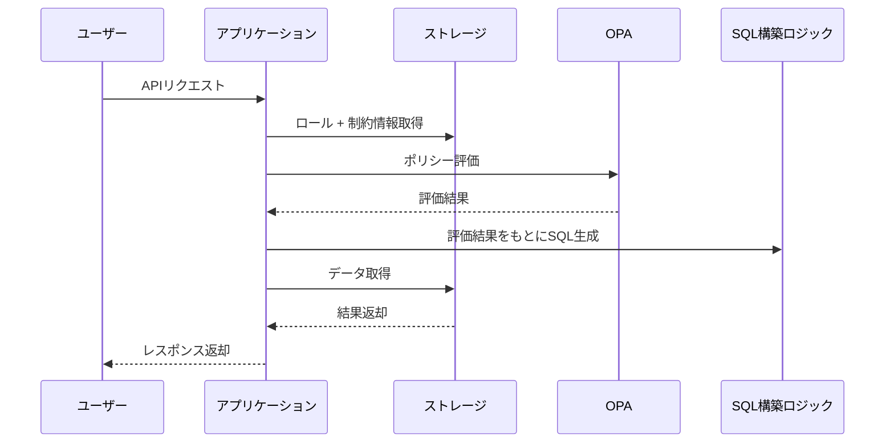
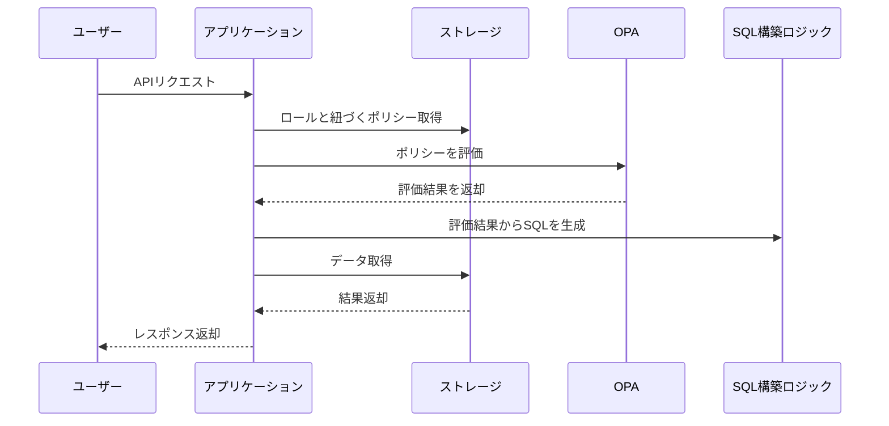

# 概要
Open Policy Agent（OPA）は、ポリシーによるアクセス制御を疎結合な形で実現できる強力な仕組みである。Regoという宣言的言語でルールを記述し、アプリケーション側からはシンプルな形式でポリシー評価を利用できる。

本記事では、OPAを利用したアクセス制御の代表的なパターンを整理し、それぞれの特徴や適した用途、実装負荷などを比較する。

以下に、あなたが挙げた4つのアクセス制御アプローチをベースに、表形式を調整・拡張した案を示します。もとの3分類を4分類に整理し、**SQL生成アプローチ**と**ASTアプローチ**を分離しました。また、責務分離の観点もあわせてアップデートしました。

# アクセス制御パターン一覧
| パターン名                                  | Regoの役割                                   | アプリの役割                                 | 特徴                                                        |
| ------------------------------------------- | -------------------------------------------- | -------------------------------------------- | ----------------------------------------------------------- |
| **① Allow/Deny 判定（ナイーブアプローチ）** | 許可・拒否の真偽値を評価                     | 結果に基づいて処理の可否を制御               | 評価が軽量で高速。Rego本来のモデルに忠実                    |
| **② SQL生成アプローチ**                     | 完成されたSQLを生成（テンプレート/埋め込み） | Regoから受け取ったSQLをそのまま実行          | 柔軟だがRegoにSQL依存が生まれる。ポリシーにアプリ依存が混入 |
| **③ 条件抽出（構造化条件）アプローチ**      | SQLに使うフィルタ条件（構造体）を返却        | 条件をもとにSQL/ESなどのクエリを生成して実行 | 条件ロジックとデータ処理が明確に分離され、スケーラブル      |
| **④ ASTアプローチ（Partial Evaluation）**   | 条件式をASTで返却                            | ASTをSQL等に変換または別の評価に利用         | 再利用性が高く柔軟だが、実装が複雑で理解コストも高い        |

# 責務分離の観点から見る各パターン
| パターン名                                  | Regoの責務                                     | アプリの責務                   | 責務分離のバランス                                  |
| ------------------------------------------- | ---------------------------------------------- | ------------------------------ | --------------------------------------------------- |
| **① Allow/Deny 判定（ナイーブアプローチ）** | 許可か否かの判定のみ                           | 許可結果に応じた処理実行       | ✔ 完全に分離。Regoは「Yes/No」だけを返す            |
| **② SQL生成アプローチ**                     | 完成SQLの出力（ロジック＋形式を含む）          | そのまま実行                   | ❌ 責務が混在。RegoにSQL構文知識が必要               |
| **③ 条件抽出（構造化条件）アプローチ**      | 許可条件（例：`department_id IN [1,2]`）の生成 | 条件を元にSQL等を構築・実行    | ✔ 条件ロジックとデータ処理がきれいに分離            |
| **④ ASTアプローチ（Partial Evaluation）**   | ポリシーの条件式を抽象構文（AST）で返却        | ASTを解釈・変換してSQL等に適用 | △ 分離はされるが、アプリ側のAST理解・変換実装が必要 |

## 備考：ポリシー管理と責務の帰属
- **ナイーブ or 条件抽出型**は、Regoの内容が抽象的でビジネスロジックに近く、**プロダクトチームでも管理しやすい**傾向がある
- **SQL生成型やAST型**は実装依存・変換処理が複雑化するため、**基盤チームなどによる共通管理**が現実的である

# ユーザー設定とOPAの連携について
動的なアクセス制御※を必要とするアプリケーションにおいては、ユーザーが設定した権限情報をどのようにOPAに供給するかが重要な設計ポイントとなる。

※ポリシーだけでアクセス制御が完結する形を静的としたとき、ポリシーと任意の設定情報を扱う形を動的と定義している。

OPAはステートレスなポリシーエンジンであり、評価時に必要なデータを外部から明示的に供給する必要がある。以下に主なアプローチとその特徴を示す。

## データ供給アプローチの比較
ポリシー評価に必要なデータ（評価対象ではなく、ポリシー評価のために補足情報など。）をOPAに渡すアプローチについての比較。

| アプローチ              | 実現性 | メリット                         | デメリット                                     |
| ----------------------- | ------ | -------------------------------- | ---------------------------------------------- |
| DB保存 → OPA評価        | ◎      | 標準的で柔軟性があり、再利用可能 | 実装がやや複雑                                 |
| OPAに静的データ埋め込み | △      | 実装が単純                       | 更新の手間がある                               |
| OPAから都度外部参照     | △      | 動的に取得可能                   | 遅延・信頼性の課題があり、推奨されない運用方法 |

動的な権限設定を必要とするユースケースでは、以下の理由からDB保存型のアプローチが最も現実的である：

- 権限設定はUIから行われ、設定内容が頻繁に更新される可能性がある
- 設定情報はロールや部署など複雑な構造を持ち、永続化しておく必要がある
- 他プロセスとの一貫性、再利用性、バージョン管理がしやすい

```
ユーザー：部署Aと部署Bにアクセス可と設定
↓（保存）
DB：user_role_policies テーブルに保存
↓（評価時）
アプリ or PDP：設定を取得し、input.dataとしてOPAに渡す
↓
OPA：Regoルールで評価
```

このように、ユーザー設定 → DB保存 → OPA連携という責務の流れを明確に分離することで、柔軟かつ保守性の高いアクセス制御設計を実現できる。

# ポリシー設計を見直す
ただ、この記事を書きながら思いついたのだが、DB保存 → OPA評価のアプローチは無駄があるかもしれない。

DBに保存される設定値とポリシーを分けていることがおそらく無駄で、ポリシーにまとめてポリシーとしてデータを保持すれば、アクセス制御フローにおけるロジックがシンプルになる。

## 前提
- RBACにおいて、ロールと制約情報（DBに保存されるデータ。ロールが持つアクセス制御の条件を表現したもの。）があるとする
- データ量が多いことを想定してSQLフィルタリングのアプローチ（OPAにSQL生成のための条件を返却させる）を前提とする
  - cf. [OPAにおけるページネーションへの影響と解決策に関する検討](https://bmf-tech.com/posts/OPA%E3%81%AB%E3%81%8A%E3%81%91%E3%82%8B%E3%83%9A%E3%83%BC%E3%82%B8%E3%83%8D%E3%83%BC%E3%82%B7%E3%83%A7%E3%83%B3%E3%81%B8%E3%81%AE%E5%BD%B1%E9%9F%BF%E3%81%A8%E8%A7%A3%E6%B1%BA%E7%AD%96%E3%81%AB%E9%96%A2%E3%81%99%E3%82%8B%E6%A4%9C%E8%A8%8E)

### ロール+制約情報とポリシーを両立させる場合


- 制約情報は **アプリケーション固有の形式**で持たれているため、OPAではそのまま活用できない。制約情報は実質的にポリシーの役目を担っている。
- Regoポリシーの役割は限定的（許可・拒否判断のしているが、SQLの条件になるようなデータを返却する形でも同様）。
- 制約が増えるほど、アプリ側のSQL生成ロジックが肥大化・複雑化。

制約情報からSQLを生成すれば良いので、このような場合であればOPAは複雑性の注入を上回るコストメリットを発揮しづらい。

### 制約情報をポリシーに寄せて、ロールとポリシーの純粋な関係にする場合


シーケンスとしては一部しか変わっていないので変わらないように見えるが、ポリシーというデータモデルをロールから切り出すことができるため、責務分離がしやすくなる。

つまり、アプリケーション側はSQL生成のロジックのみを持ち、OPAはアクセス制御のための条件を返すことに集中できる。OPAにデータを渡して評価させる基本的なアクセス制御の形式と比べると、SQLフィルタリングのアプローチは結合度がやや高いが、OPAのメリットを活かすことができる。


# まとめ
権限モデルに基づいた全体設計とポリシーというデータモデルをどう設計していくか重要である。

# 余談
OPAはユーザー設定に基づく（ユーザー設定をinputにする）ようなアクセス制御のユースケースに抜群に相性が良いとは言えないかも知れない。

OPAのinputに期待されるデータはアクセス制御対象の情報で、アクセス制御のためのルールではないような気がしている。

そのようなアプローチではポリシー（rego）ファイルと外部に保存される設定情報が結合するため、ポリシーと設定の両方の変更が必要になってしまう。

それを許容できるかどうかは要件やトレードオフ、解決したいこと次第ではあるが、本来は静的なアクセス制御をする形がOPAのメリットを最大限に活かせる形だとすると最適ではないように思える。

OPAというかポリシーベースのアーキテクチャにおける考慮点かもしれない。


