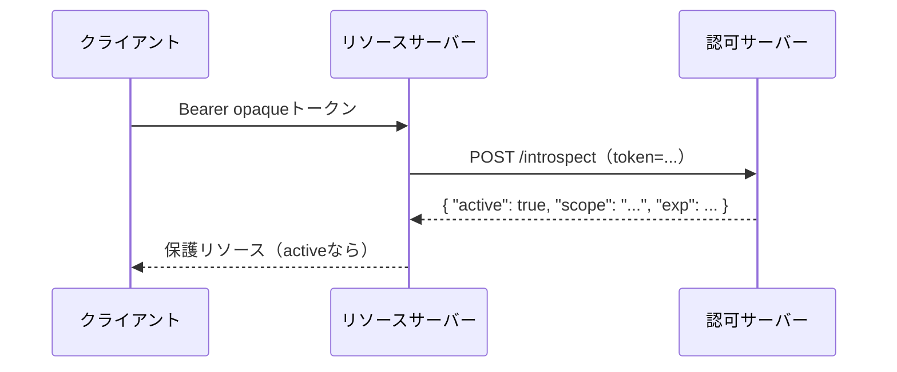
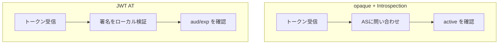

# 概要

アクセストークンを受け取ったリソースサーバーは、それが有効かどうかをどう判断するのか。アクセストークンには大きく2つの方式があり、検証のやり方も、失効の効き方も異なる。

この記事では、opaqueトークン + Token Introspection（RFC 7662）と、JWTアクセストークン（RFC 9068）の検証方法を比較する。あわせて、Token Revocation（RFC 7009）による失効の仕組みまで整理する。

関連するRFCは以下の通り。

- [RFC 7662 OAuth 2.0 Token Introspection](https://www.rfc-editor.org/rfc/rfc7662)
- [RFC 9068 JSON Web Token (JWT) Profile for OAuth 2.0 Access Tokens](https://www.rfc-editor.org/rfc/rfc9068)
- [RFC 7009 OAuth 2.0 Token Revocation](https://www.rfc-editor.org/rfc/rfc7009)

# 2つのアクセストークン方式

アクセストークンには次の2種類がある。

- **opaqueトークン**: 中身に意味のない不透明な文字列。検証には発行元のASへの問い合わせが必要。
- **JWTアクセストークン**: 自己完結型のJWT。署名を検証すれば、ASに問い合わせずローカルで検証できる。

# opaque + Token Introspection（RFC 7662）

opaqueトークンは、リソースサーバーが単独では中身を判断できない。そこで、ASの**introspectionエンドポイント**に問い合わせて、トークンの状態やメタ情報を得る。



レスポンスの`active`が最重要で、`true`なら有効、`false`なら無効。ほかに`scope`、`sub`、`exp`、`client_id`、`aud`などが返る。introspectionエンドポイントはクライアント認証が必要である。

- 利点: **即時失効が効く**。ASが状態を持っているため、失効させれば次の問い合わせで`active: false`になる。
- 欠点: リクエストごとにASへの問い合わせが発生し、ASがボトルネックになりうる。

# JWTアクセストークン（RFC 9068）

JWTアクセストークンは、必要な情報（sub, scope, exp, audなど）をトークン自体に含む。リソースサーバーは署名を検証すれば、ASに問い合わせずローカルで検証できる。

RFC 9068が定める主なポイント。

- ヘッダの`typ`は**`at+jwt`**（アクセストークン用JWTであることを明示）。これにより、ID Tokenなど別用途のJWTとの混同を防ぐ。
- 必須クレーム: `iss`、`exp`、`aud`、`sub`、`client_id`、`iat`、`jti`。
- リソースサーバーは`aud`が自分向けか、`exp`が切れていないか、署名が正しいかを検証する。

- 利点: ローカル検証でスケールしやすい。ASへの問い合わせが不要。
- 欠点: **即時失効が苦手**。有効期限が切れるまで、トークン単体では止められない。

# 2方式の比較



| 観点 | opaque + Introspection | JWT AT |
| --- | --- | --- |
| 検証 | ASに問い合わせ | ローカル検証 |
| 即時失効 | 効く | 苦手（expまで有効） |
| スケール | ASがボトルネックになりうる | しやすい |
| ネットワーク負荷 | 高い（毎回問い合わせ） | 低い |

# Token Revocation（RFC 7009）

RFC 7009は、トークンを明示的に失効させるための**revocationエンドポイント**を定義する。ログアウトやパスワード変更、トークン漏洩時に、クライアントがトークンを失効させる。

```
POST /revoke
token=45ghiukldjahdnhzdauz&token_type_hint=refresh_token
```

- opaqueトークンなら、失効はintrospectionに即反映される。
- JWTアクセストークンは自己完結型のため、revocationしても署名検証だけで通してしまう実装では止まらない。そのため実務では次の対策を組み合わせる。
  - アクセストークンを**短命**にする（数分〜10分程度）。
  - **ブラックリスト**（jtiやユーザーIDをRedis等に短期間保持）でチェックする。

# まとめ

- アクセストークンにはopaqueとJWTの2方式があり、検証と失効の性質が異なる。
- opaque + Introspectionは即時失効に強いが、ASへの問い合わせが必要。
- JWT ATはローカル検証でスケールしやすいが、即時失効が苦手。短命化やブラックリストで補う。
- Token Revocation（RFC 7009）は失効の標準手段。JWTでは短命化・ブラックリストと併用する。

# 参考リンク

- [RFC 7662 OAuth 2.0 Token Introspection](https://www.rfc-editor.org/rfc/rfc7662)
- [RFC 9068 JWT Profile for OAuth 2.0 Access Tokens](https://www.rfc-editor.org/rfc/rfc9068)
- [RFC 7009 OAuth 2.0 Token Revocation](https://www.rfc-editor.org/rfc/rfc7009)
