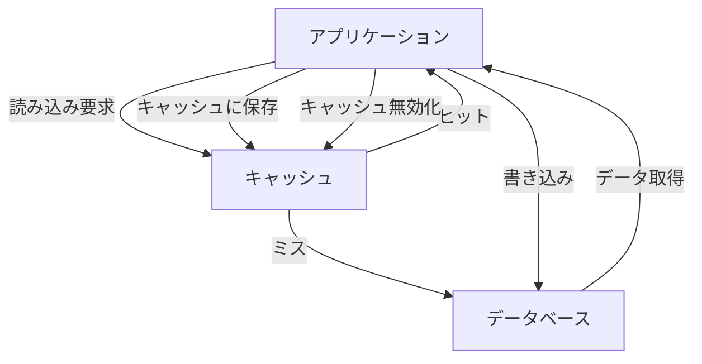
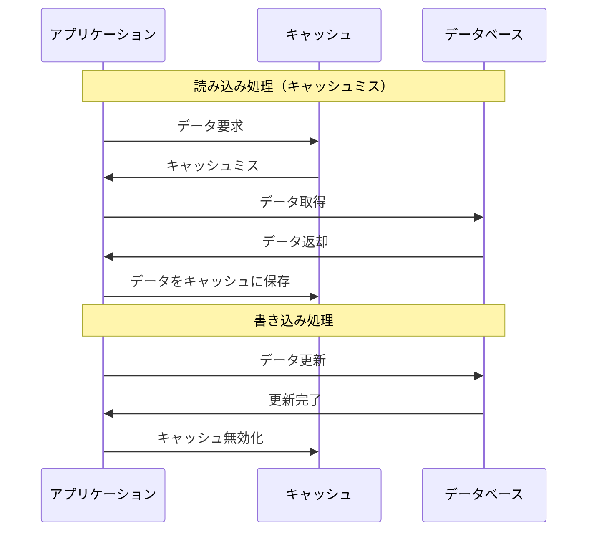
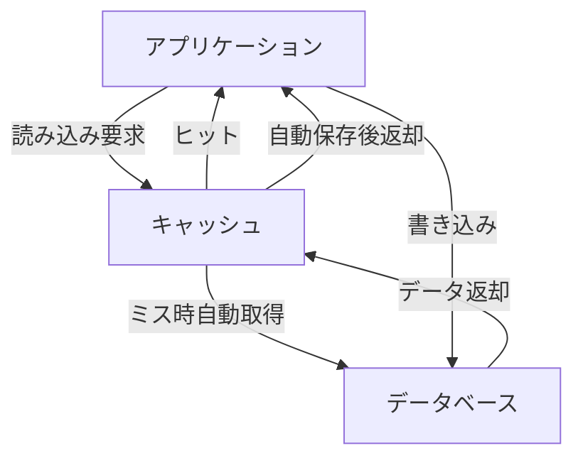
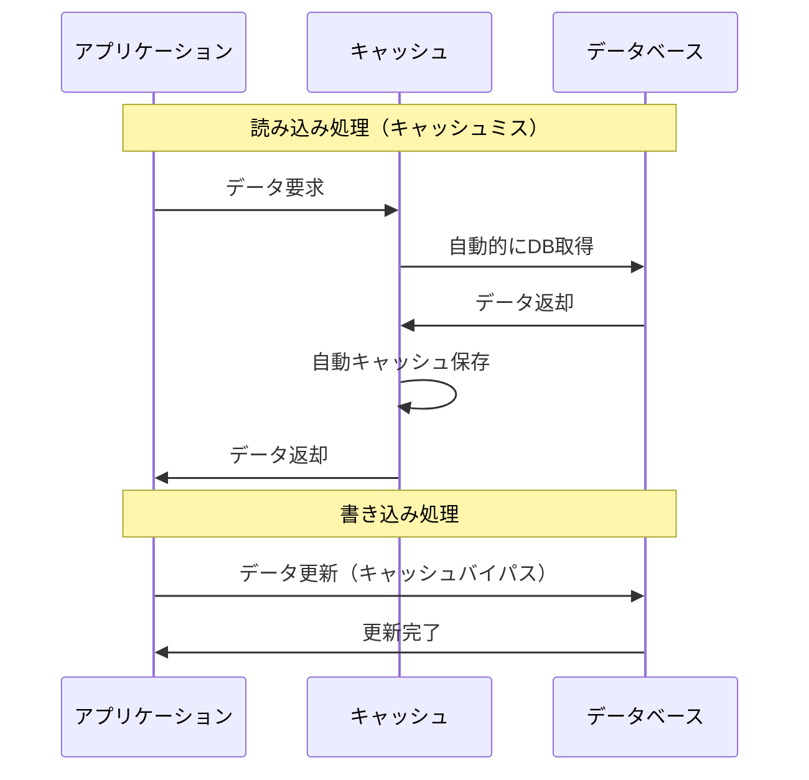
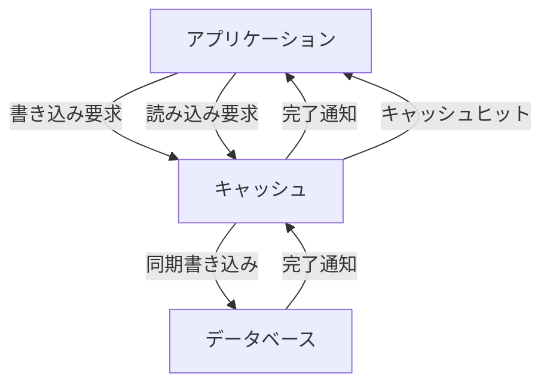
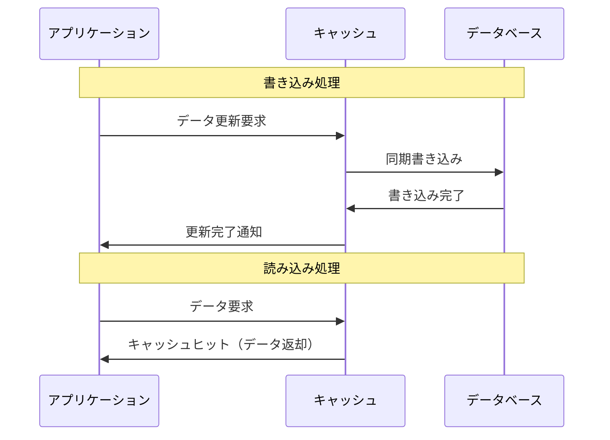
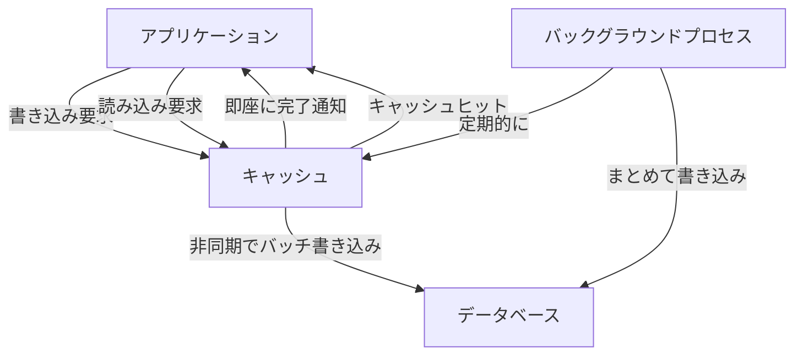
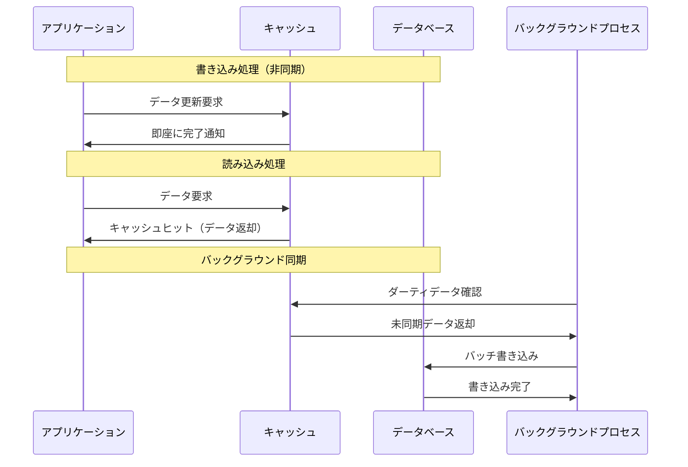
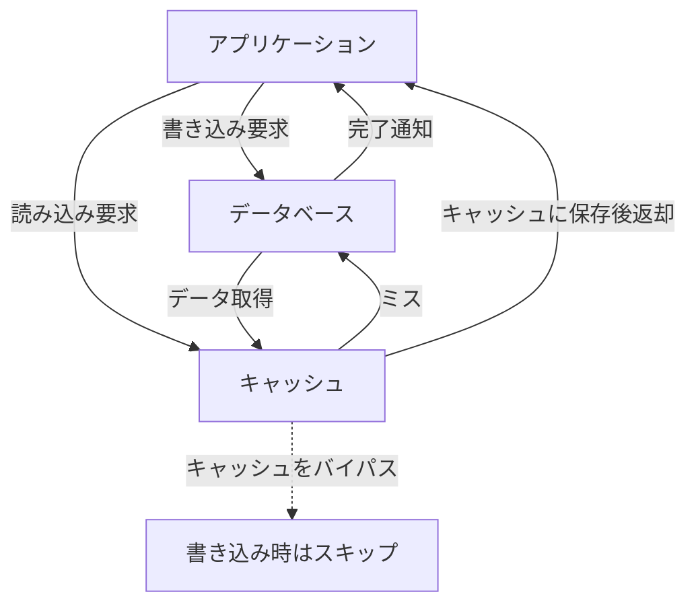
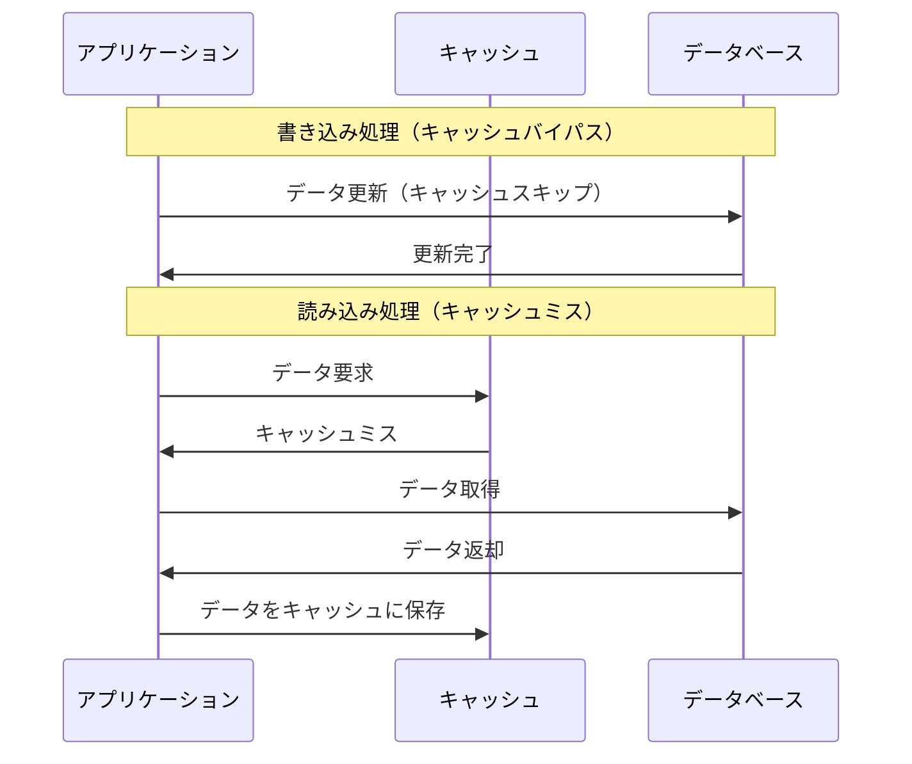

Webアプリケーションや分散システムでパフォーマンスを高めるために不可欠なのが「キャッシュ」の基本的な活用パターンについて書く。

* キャッシュアサイド（Cache Aside）
* リードスルー（Read Through）
* ライトスルー（Write Through）
* ライトバック（Write Back）
* ライトアラウンド（Write Around）

## キャッシュアサイド（Cache Aside）

### 概要

アプリケーション側が必要に応じてキャッシュを明示的に操作するパターンである。

### 読み込み時の流れ

1. キャッシュにデータがあるか確認（**キャッシュヒット**）
2. なければDBから取得してキャッシュに保存（**キャッシュミス**）

### 書き込み時の流れ

1. データベースを更新
2. 必要に応じてキャッシュを削除 or 更新

### 特徴

* キャッシュ管理をアプリケーションが行う
* 読み込み頻度が高く、更新頻度が低いデータに向いている
* キャッシュとDBの整合性はアプリ側の責任である

### 利用例

* Redis、Memcached等を使ったWebアプリケーション

## リードスルー（Read Through）

### 概要

読み込み時にキャッシュがDBからの取得を自動的に処理するパターンである。アプリケーションはキャッシュのみとやり取りし、キャッシュミス時の処理は透過的に行われる。

### 読み込み時の流れ

1. アプリケーションはキャッシュに読み込み要求
2. キャッシュヒット時はそのまま返却
3. キャッシュミス時はキャッシュ自身がDBからデータを取得し、自動的にキャッシュに保存してからアプリケーションに返却

### 特徴

* キャッシュがDBアクセスを透過的に処理する
* アプリケーションはキャッシュの存在を意識しなくて良い
* キャッシュミス時の処理がアプリケーションから隠蔽される
* 書き込みは通常DBに直接行う

### 利用例

* ORMのL2キャッシュ機能、CDN、プロキシキャッシュ、Hibernate等

## ライトスルー（Write Through）

### 概要

書き込み操作がまずキャッシュに行われ、**同時にDBにも書き込む**戦略である。

### 書き込み時の流れ

1. キャッシュを更新
2. 同じ内容をDBにも即時反映

### 特徴

* キャッシュとDBが常に整合性を保つ
* 書き込みの遅延はやや大きい
* 読み込みは高速かつ一貫性がある

### 利用例

* 一貫性が重視されるユーザープロファイル、設定情報、マスターデータなど

## ライトバック（Write Back）

### 概要

書き込み操作はまずキャッシュにのみ反映し、**DBへの書き込みは非同期的に遅延処理**される。

### 書き込み時の流れ

1. キャッシュにのみ書き込み（ダーティマーク付与）
2. アプリケーションには即座に完了を通知
3. 後でバッチ or イベント駆動でDBを更新

### 特徴

* 書き込みが高速（低レイテンシ）
* クラッシュ時にデータ消失のリスクがある
* 高頻度な更新に向く（同じキーへの連続更新が最終結果だけで済む）
* ダーティデータの管理が重要

### 利用例

* CPUキャッシュ、ログ、ゲームの一時スコア、計測データなど

## ライトアラウンド（Write Around）

### 概要

書き込み操作を**キャッシュに反映せず、DBのみに書き込む**戦略である。

### 書き込み時の流れ

1. キャッシュをバイパスしてDBへ直接書き込み

### 読み込み時の流れ

* 読み込み時にキャッシュミスが発生 → DBから読み出してキャッシュに保存

### 特徴

* 書き込みがキャッシュを汚染しない（不要なデータをキャッシュに載せない）
* 書いた直後の読み込みでミスが起きやすい（キャッシュに存在しないため）

### 利用例

* アクセスログ、一時ファイル、バックアップデータなど（低頻度アクセスのレコード）

## 各パターンの比較表

| 戦略               | 概要                           | 読み込み高速 | 書き込み高速  | 整合性              | キャッシュ管理     |
| ------------------ | ------------------------------ | ------------ | ------------- | ------------------- | ------------------ |
| キャッシュアサイド | アプリが明示的にキャッシュ操作 | ◎            | △（管理必要） | △（手動）           | アプリが管理       |
| リードスルー       | キャッシュが透過的にDB取得     | ◎            | △（DBに直接） | △（読み込み時のみ） | 自動（読み込み）   |
| ライトスルー       | キャッシュとDBに同時書き込み   | ◎            | △（同期待機） | ◎（常に同期）       | 自動               |
| ライトバック       | キャッシュのみ書き込み後で同期 | ◎            | ◎（非同期）   | △（遅延同期）       | 自動（リスクあり） |
| ライトアラウンド   | 書き込み時はキャッシュバイパス | ◎            | ◎（DB直接）   | △（読み込みで整合） | 自動               |

## まとめ

どの戦略がベストかは、ユースケースとトレードオフによる。

* **読み込みが主で整合性も重視** → ライトスルー
* **読み込みの透過性を重視** → リードスルー
* **書き込み性能最重視、若干のデータ消失リスクOK** → ライトバック
* **低頻度アクセス、キャッシュ効率重視** → ライトアラウンド
* **細かい制御が必要、開発工数をかけられる** → キャッシュアサイド

選択時は以下の要素を考慮する：

* **整合性要件**: 強整合性が必要かどうか
* **性能要件**: 読み込み/書き込みのどちらを重視するか
* **可用性要件**: データ消失リスクの許容度
* **運用コスト**: 管理の複雑さと開発工数

キャッシュ戦略をうまく使いこなすことで、アプリケーションの性能と可用性は大きく向上する。各プロジェクトの要件に合った選択が重要である。

