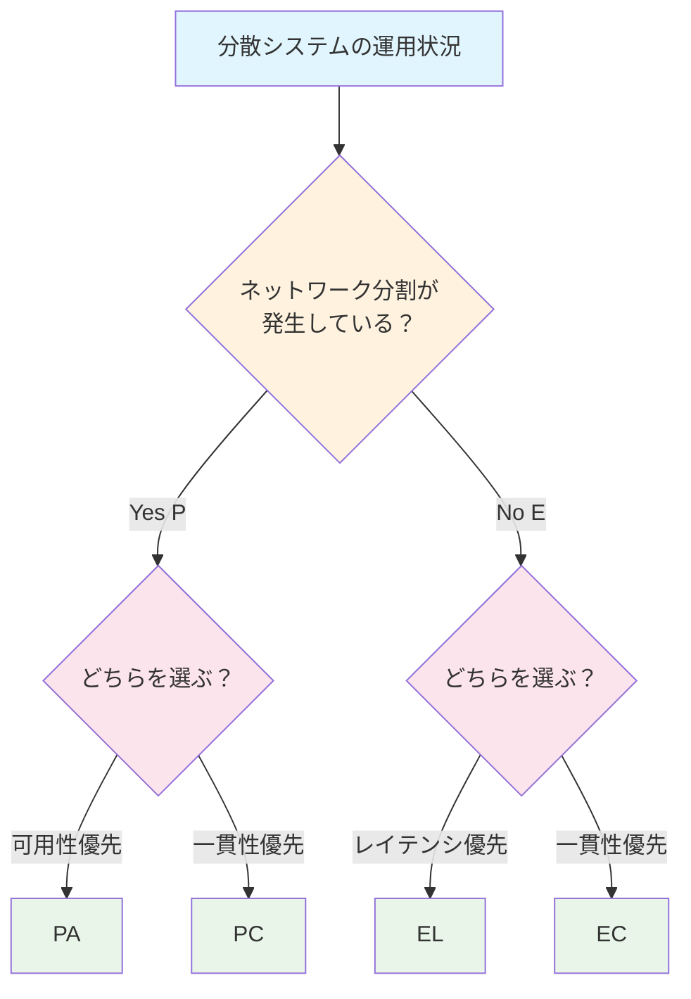

分散システムにおける重要な理論であるCAP定理とPACELC定理について書く。

# CAP定理とは

CAP定理とは、分散システムにおいて以下の3つの特性のうち、**同時に2つまでしか実現できない**という理論である：

* **Consistency（一貫性）**：全ノードが同じデータを返す
* **Availability（可用性）**：常に応答が返る
* **Partition Tolerance（分断耐性）**：ネットワークが分断しても動作を続ける

分散システムでは、Partition（P）は避けられないため、実質「**CかAのどちらかを選ぶ**」という選択を迫られることになる。

# CAP定理のミスリーディング

CAP定理の「3つのうち2つ」という公式は以下の理由でミスリーディングである：

1. **分割は滅多に起きない**：分割のない状態では、CもAも失われない
2. **細かい粒度での選択**：同じシステム内で操作やデータごとに異なる選択が可能
3. **度合いの問題**：3つの属性は0か1ではなく、それぞれ度合いがある

例：

| システム  | 分類 | 解説                           |
| --------- | ---- | ------------------------------ |
| Zookeeper | CP   | 可用性を犠牲にして一貫性を維持 |
| Cassandra | AP   | 一貫性を緩めて高可用性を維持   |

# PACELC定理とは

CAP定理には重要な抜け穴がある。それは「**Partitionが起きていないときのトレードオフが語られていない**」ことである。

PACELC定理はこの問題を補完する形で登場した理論である。PACELC定理では、分割（P）が発生した場合、システムは可用性（A）と一貫性（C）のトレードオフを行わなければならない。そうでない場合（E）、システムはレイテンシ（L）と一貫性（C）のトレードオフを行わなければならないとされる。

つまり、分散システムは以下の2つの状況でそれぞれ異なるトレードオフに直面する：

* **Partition時**：AかCを選ぶ（CAP定理と同じ）
* **Partitionが無いとき**：LかCを選ぶ必要がある

これは、分割が発生していない通常時においても、強い一貫性を維持するためには通信によるレイテンシが発生し、低レイテンシを優先するなら一貫性を緩める必要があることを示している。

**PACELC定理の構成要素**：
* **P**: Partitionが発生した場合
* **A/C**: 可用性 or 一貫性
* **E**: それ以外（Partitionがないとき）
* **L/C**: レイテンシ or 一貫性

**各分類の特徴**：
- **PA系**: 分割時は可用性優先（例：Cassandra、DynamoDB）
- **PC系**: 分割時は一貫性優先（例：HBase、MongoDB強一貫性モード）
- **EL系**: 平常時は低レイテンシ優先（例：キャッシュシステム）
- **EC系**: 平常時も一貫性優先（例：Spanner、分散RDBMS）

この定理により、分散システムの設計者は平常時と異常時の両方における設計判断を明確に整理できるようになる。

# まとめ

分散システムの設計においては、CAP定理とPACELC定理の両方を考慮することが重要である。これにより、システムの可用性、一貫性、レイテンシに関するトレードオフを明確に理解し、適切な設計選択を行うことができる。

# 参考
- [en.wikipedia.org - CAP theorem](https://en.wikipedia.org/wiki/CAP_theorem)
- [en.wikipedia.org - PACELC design principle](https://en.wikipedia.org/wiki/PACELC_design_principle)
- [www.infoq.com - 12年後のCAP定理: "法則"はどのように変わったか](https://www.infoq.com/jp/articles/cap-twelve-years-later-how-the-rules-have-changed/)
