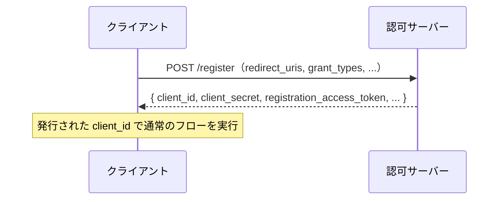

# 概要

OAuthのクライアントは、通常は事前に認可サーバー（AS）へ手動で登録し、`client_id`や`client_secret`を発行してもらう。しかし、クライアントの数が非常に多かったり、フェデレーション環境で動的にクライアントが増えたりする場合、手動登録は現実的でない。

これを解決するのが**Dynamic Client Registration（RFC 7591）**と**Dynamic Client Registration Management（RFC 7592）**である。この記事ではその仕組みと、セキュリティ上の注意点を整理する。

関連するRFCは以下の通り。

- [RFC 7591 OAuth 2.0 Dynamic Client Registration Protocol](https://www.rfc-editor.org/rfc/rfc7591)
- [RFC 7592 OAuth 2.0 Dynamic Client Registration Management Protocol](https://www.rfc-editor.org/rfc/rfc7592)

# なぜDCRが必要か

- **多数のクライアント**: SaaSやプラットフォームで、多くのアプリが自動的にクライアントとして登録される場合。
- **フェデレーション**: 複数のASと連携する環境で、クライアントを動的に登録したい場合。
- **自動化**: 手動のクライアント管理を、APIを通じて自動化したい場合。

# RFC 7591：登録

RFC 7591は、クライアントがASの**登録エンドポイント**にメタデータをPOSTして、自身を動的に登録する仕組みを定義する。

登録リクエストには、`redirect_uris`、`grant_types`、`token_endpoint_auth_method`、`client_name`などのクライアントメタデータを含む。ASは検証のうえ、`client_id`（必要なら`client_secret`）を発行する。

# RFC 7592：管理

RFC 7592は、登録済みクライアントを**読み取り・更新・削除**するための管理プロトコルである。登録時に発行される**registration access token**と、クライアント固有の管理URL（configuration endpoint）を使って操作する。

| 操作 | メソッド |
| --- | --- |
| 読み取り | GET |
| 更新 | PUT |
| 削除 | DELETE |

registration access tokenは、そのクライアントの管理操作を認可するためのトークンで、漏洩すると他人にクライアント設定を書き換えられるため厳重に管理する。

# セキュリティ考慮

DCRは便利だが、「誰でも登録できる」ことがそのままリスクになりうる。

- **オープンな登録**: 認証なしで誰でもクライアントを登録できると、攻撃者が自由にクライアントを作れる。初期アクセストークン（initial access token）で登録を制限することが多い。
- **redirect_uri の検証**: 動的に登録されたクライアントの`redirect_uri`を緩く扱うと、トークン横取りの入り口になる。完全一致で検証する（RFC 9700）。
- **Mix-Up攻撃との関係**: 攻撃者が自分のASにクライアントを動的登録し、Mix-Up攻撃の足がかりにするケースがある。複数ASを扱うクライアントは`iss`による対策が必要（[OAuth 2.1とは？](/posts/oauth-2-1-security-bcp/)参照）。

# まとめ

- DCRは、クライアントをAPIで動的に登録・管理する仕組み（RFC 7591登録 / RFC 7592管理）。
- 多数クライアントやフェデレーション環境で手動登録を避けるために使う。
- 「誰でも登録できる」リスクがあるため、初期アクセストークンやredirect_uri検証で守る。

# 参考リンク

- [RFC 7591 OAuth 2.0 Dynamic Client Registration Protocol](https://www.rfc-editor.org/rfc/rfc7591)
- [RFC 7592 OAuth 2.0 Dynamic Client Registration Management Protocol](https://www.rfc-editor.org/rfc/rfc7592)
