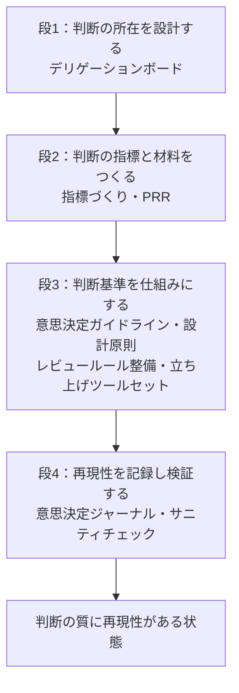

# はじめに

チームが小さいうちは、重要な判断の多くは特定の個人の頭の中で完結する。しかし人が増え、判断が現場に分散してくると、その質は人と場面に依存してばらつきはじめる。組織のボトルネックは、いつのまにか「判断」に移っている。

このとき打ち手として並ぶのが、1on1、OKR、レビュールール、指標づくりといったマネジメント施策である。どれも判断の質を支えるものだが、個別に足していくと、全体として何を目指しているのかを説明できない寄せ集めになりやすい。

本記事では、こうした施策を個別の集合としてではなく、「判断の質と再現性」を軸にした一つの体系として設計する考え方を述べる。その体系を、ここでは「デッキ」と呼ぶ。

# 何を軸にするか：判断の質と再現性

体系にするには、ばらばらの施策を貫く一本の軸が要る。ここで軸に置くのは「判断の質と再現性」である。

質が高いだけでは、その判断は特定の個人に閉じてしまう。基準が言語化されていなければ、任せることは「丸投げ」になり、結局はレビューで自分がすべてを見直すことになる。だからこそ、質には「再現性」を伴わせたい。

目指す状態は「判断の質に再現性がある」ことだ。担当者や場面が変わっても、判断の質が一定以上に保たれ、しかもその判断を説明できる。この軸を据えると、多くのマネジメント施策が「判断の質と再現性のための部品」として一列に並ぶ。

# 「デッキ」という捉え方

施策を並べてみて、しっくり来たのが「デッキ」という捉え方である。カードゲームのデッキのように、必要な型（カード）の束を持ち、場面に応じて引いて使う。

重要なのは、デッキが「寄せ集め」ではないという点である。デッキには狙いがあり、カードどうしが噛み合っている。新しいプロジェクトを立ち上げるときも、ゼロから施策を考えるのではなく、このデッキから必要なカードを引いて始められる。そうした再利用可能な型の束として、マネジメントを設計する。

# 判断を軸にした4つの段

デッキのカードは、「判断」を軸に4つの段でつながる。段が進むほど、判断は特定の個人から離れ、チームで説明・再現できる状態に近づく。各カード（施策）にはそれぞれ固有の目的があり、デッキ全体の狙いに寄与しつつ、単体でも一つの課題を解く。

具体例として、私が実際に組んでいるデッキのカードを段ごとに挙げる。ただし、ここで挙げるのはあくまで例であり、そろえるべきカードが決まっているわけではない。どの段にどのカードをどれだけ持つかは、チームの状態に合わせて決めるものであり、チームが変わればデッキも組み替わる。

1. **判断の所在を設計する**：どの判断を誰が持つかを明確にし、委譲の範囲を合意する。たとえば「デリゲーションボード」で、どの判断をどこまで委ねるかを一枚に可視化する
2. **判断の指標と材料をつくる**：勘ではなく、指標と材料にもとづいて判断できるようにする。基盤開発の「指標づくり」や、本番投入前に観点を洗い出す「PRR（Production Readiness Review）」がここに当たる
3. **判断基準を仕組みにする**：誰でも同じように判断・設計できるよう、基準を型にする。「どう決めるか」を定めた意思決定ガイドライン、「何が良い設計か」を定めた設計原則、レビューの重みを機械的に判定するレビュールールの整備、立ち上げツールセットなどが並ぶ
4. **再現性を記録し検証する**：下した判断を「意思決定ジャーナル」に記録し、「自分がいなくてもチームが説明・判断できるか」をアーキテクチャ理解のサニティチェックで検証する

段で並べると、カードどうしの依存も見えてくる。たとえば設計原則は、それを支える指標や材料がそろって初めて機能し、下した判断は意思決定ジャーナルに記録されて初めて次に再利用できる。前の段が、次の段を支える関係になっている。

# 作っただけでは効かない

ここが最も重要な点だが、どの施策も「作っただけ」では効かない。ガイドラインやチェックは、置いてあるだけでは誰も見ない。成果に変わるには条件がある。

- **運用され続ける**：更新・記録・実施が止まれば、すぐに形骸化する
- **実際に使われる（定着）**：判断やレビューの場で参照されて初めて効く。人が忘れるのであれば、lintやCI、AIレビューのように「仕組みで機械的に効く」形にする
- **他の施策と連動する**：抽象的な基準は、具体を与える別の施策とセットで初めて使える
- **チームで共有・合意されている**：一人の頭の中にある型は、再現性を生まない

施策のカードを増やすよりも、既存のカードが「効く条件」を満たしているかを見るほうが、効果は大きいことが多い。

# 誰に効くのか、そして事業価値へ

この体系は、誰の何を良くするのか。3つの層で整理できる。

- **個人**：判断の拠り所ができるので、経験の浅いメンバーでも大きく外さずに決められる。過去の判断とその理由をたどれるため、新しく入った人ほど立ち上がりが速い
- **チーム**：「その人にしかわからない」判断が減り、任せられる範囲が自然と広がる。判断や知識が個人の記憶に留まらず、チームの側に積み上がっていく
- **組織**：何がうまくいったかを測って次に活かせる。立ち上げのたびに白紙から考えるのではなく、手元の型を土台にして始められる

そして、これらの価値は最終的に事業価値へと転化する。判断の質と再現性が上がるほど、チームは人が増えても質を落とさずにスケールでき、意思決定のリスクも下がる。判断の再現性への投資は、事業の速度と安全性に変わる。マネジメント施策を「コスト」ではなく「投資」として説明できるのは、この接続があるからである。

# 型は個性を奪わない

最後に、最も誤解されやすい点に触れておく。判断を型にすると言うと、「メンバーの個性を奪い、考え方を縛るのではないか」と身構える人がいる。しかし、実際はむしろ逆である。

型とは、個々の強みや専門性を抽象化し、チームという一つの人格に還元するための仕組みである。誰かが持つ良い判断の仕方を、その人だけのものにせず、チームの共有資産にする。個性を消すのではなく、個性を「チームの力」に変換する装置だと捉えれば、標準化への抵抗感はずいぶん変わるはずである。

# まとめ

- マネジメント施策を「良さそう」の寄せ集めにしない。判断の質と再現性を軸に、一つの体系（デッキ）として設計する
- 施策は「所在 → 材料 → 仕組み → 検証」の4段で判断につながる
- どの施策も作っただけでは効かない。運用・定着・連動・合意という条件を満たして初めて成果になる
- 個人・チーム・組織の価値は、最終的に事業の速度と安全性へと転化する
- 型は個性を奪わない。強みをチームという一つの人格に還元する

この体系はまだ運用しながら育てている途中である。それでも、「施策を足す」から「体系を設計する」へと発想を切り替えるだけで、マネジメントの解像度が上がっていくと考えている。
