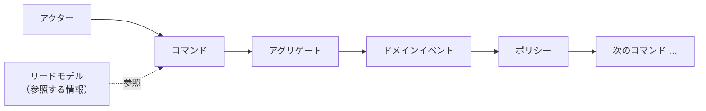
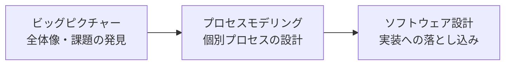
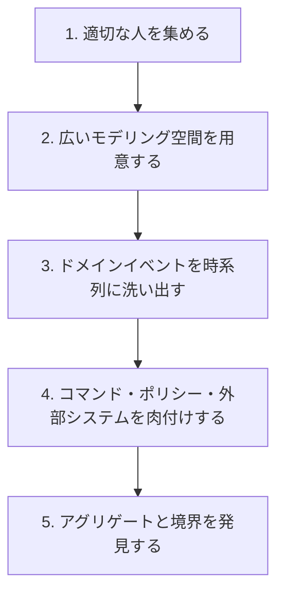

# 概要

システム開発では、業務の知識が特定の人に偏っていることが多い。

開発者はコードやデータの構造には詳しいが、現場の業務の細かな流れまでは把握しきれていない。逆に業務担当者は現場には詳しいが、それがシステムのどこにどう対応するのかは分からない。

この状態のまま設計を進めると、認識のズレが後から表面化し、手戻りや不具合の原因になる。

こうした「業務知識の分断」を解消するための手法のひとつが、**イベントストーミング（EventStorming）**である。

本稿では、イベントストーミングとは何か、どのような要素で構成され、どのように進めるのかを、開発者以外にも伝わるように整理する。

# イベントストーミングとは

イベントストーミングは、**付箋と壁を使って業務の流れを可視化する、ワークショップ形式のモデリング手法**である。

2012年に Alberto Brandolini 氏が、ドメイン駆動設計（DDD）の文脈で考案した。なお公式の表記は単語を分けない「EventStorming」である。

特徴は次の通りである。

* コンピュータを使わず、大きな壁・ロール紙・色分けした付箋だけで進められる
* 開発者と業務担当者（ドメインエキスパート）を同じ場に集める
* UMLのような厳密な記法を必要とせず、誰でも参加できる

重要なのは、イベントストーミングが**設計図そのものを作る手法ではない**という点である。

目的は、関係者が一緒に手を動かしながら、**業務の流れを発見し、認識をそろえること**にある。きれいな図を残すこと以上に、その過程で参加者の頭の中に共通理解が築かれることに価値がある。

# なぜ「イベント」に注目するのか

イベントストーミングでは、まず**ドメインイベント**を起点にする。

ドメインイベントとは、**業務の中で実際に起きた出来事・事実**のことである。「注文が確定した」「在庫が引き当てられた」「支払いが完了した」のように、すべて**過去形**で表現する。

なぜイベントを起点にするのか。それは、イベントが**部門や職種をまたいで共通の言葉になりやすい**からである。

例えば「注文が確定した」という事実は、営業・倉庫・会計のいずれの立場から見ても「起きたこと」として共有できる。一方で、テーブル構造やクラス設計から会話を始めると、業務担当者は会話に入りづらくなる。

「起きた事実」という誰もが理解できる単位から始めることで、立場の異なる人どうしが同じ土俵で議論できるようになる。

# 基本の構成要素（付箋の色）

イベントストーミングでは、要素ごとに付箋の色を分けて貼っていく。色は流派によって多少異なるが、代表的なものは次の通りである。

| 付箋の色 | 要素 | 意味 |
| --- | --- | --- |
| オレンジ | ドメインイベント | 業務で起きた事実（過去形）。例: 注文が確定した |
| 青 | コマンド | イベントを引き起こす操作・意思決定。例: 注文を確定する |
| 黄（小） | アクター | コマンドを実行する人。例: 顧客、担当者 |
| 黄（大） | アグリゲート | コマンドを受けイベントを生む、関連データのまとまり。例: 注文 |
| 紫 | ポリシー | 「〜したら必ず〜する」という反応ルール |
| 緑 | リードモデル | 意思決定のために参照する情報・画面 |
| ピンク | 外部システム | 決済代行や配送業者などの外部サービス |
| 赤 | ホットスポット | 疑問・対立・未解決の論点 |

これらは、おおむね次のような流れでつながっていく。

「誰かが（アクター）操作を行い（コマンド）、その結果として事実が起きる（ドメインイベント）。その事実が次の動きを呼ぶ（ポリシー）」という因果の連鎖を、付箋の並びとして可視化していくわけである。

特に赤の**ホットスポット**は重要である。議論の中で出てきた「ここはどうなっているのか分からない」「部門によって解釈が違う」といった論点を、その場で消さずに貼り出しておくことで、**組織内の認識のズレや課題を見える化**できる。

# 3つの粒度（フォーマット）

イベントストーミングは、目的に応じて粒度を使い分ける。代表的なものは次の3つである。

| フォーマット | 目的 | 主に扱う要素 |
| --- | --- | --- |
| ビッグピクチャー | 事業全体・部門横断の流れを俯瞰し、課題や不整合を発見する | ドメインイベント、ホットスポット |
| プロセスモデリング | 個別の業務プロセスを設計・改善する | コマンド、ポリシー、リードモデル、外部システム |
| ソフトウェア設計 | イベント駆動ソフトウェアを詳細に設計する | アグリゲート、集約の境界 |

まず**ビッグピクチャー**で全体像と課題を把握し、次に**プロセスモデリング**で個別の流れを詰め、最後に**ソフトウェア設計**で実装に落とし込む、という流れで段階的に解像度を上げていくことが多い。

# 進め方（ワークショップの流れ）

基本的な進め方は次の通りである。

### 1. 適切な人を集める

イベントストーミングの成否は、参加者で決まると言ってよい。

必要なのは、**質問する人**（多くは開発者）と、**答える人**（業務に詳しいドメインエキスパートやプロダクトオーナー）の両方である。どちらか一方だけでは、業務の実態を正しく描けない。

### 2. 広いモデリング空間を用意する

付箋をいくらでも貼り足せるよう、長い壁とロール紙を用意する。途中で空間が足りなくなると発想が制限されるため、スペースは大きいほどよい。リモートで行う場合は Miro などのオンラインホワイトボードを使う。

### 3. ドメインイベントを時系列に洗い出す

まずはオレンジの付箋に、業務で起きる出来事を**過去形で**書き出す。最初は順番を気にせず量を出し、その後で時系列に並べ替えていく。

### 4. コマンド・ポリシー・外部システムを肉付けする

並んだイベントに対して、「何がこのイベントを引き起こしたのか（コマンド）」「誰が行うのか（アクター）」「このイベントの後に必ず起きることは何か（ポリシー）」「外部のどのサービスが関わるか」を加えていく。

### 5. アグリゲートと境界を発見する

最後に、コマンドとイベントのまとまりから**アグリゲート**を見出し、関連する要素のかたまりに境界を引いていく。これが、後述する境界づけられたコンテキストの発見につながる。

# ドメイン駆動設計とのつながり

イベントストーミングは、ドメイン駆動設計（DDD）と特に相性がよい。

* **境界づけられたコンテキストの発見**: 付箋のまとまりを観察すると、「ここから先は別の業務領域だ」という境界が自然に浮かび上がる
* **ユビキタス言語の獲得**: 議論を通じて、立場によって意味が違っていた言葉が整理され、チーム共通の語彙が育つ
* **イベント駆動アーキテクチャへの入口**: ドメインイベントを起点に設計するため、イベント駆動やマイクロサービスの設計に展開しやすい

境界づけられたコンテキストについては、別稿「[境界付けられたコンテキストとは](/posts/bounded-context-explanation/)」も参照されたい。

# 注意点・落とし穴

便利な手法だが、いくつか注意点がある。

* **適切な人がいないと価値が薄れる**: 業務を知る人が不在だと、推測だけのモデルになってしまう
* **図の完成度が目的ではない**: 本質は、過程で参加者の頭の中に作られる共通理解にある。きれいな成果物を作ること自体を目的にしない
* **ビッグピクチャーは対面が望ましい**: 広い探索はオンラインだと進めづらく、対面のほうが効果が高いとされる

# まとめ

* イベントストーミングは、付箋と壁を使って業務の流れを可視化する、ワークショップ形式のモデリング手法である
* 「業務で起きた事実」であるドメインイベントを起点にすることで、立場の異なる人どうしが同じ土俵で議論できる
* ドメインイベント・コマンド・アグリゲート・ポリシーなどを色分けした付箋で並べ、因果の連鎖として可視化する
* 目的に応じてビッグピクチャー・プロセスモデリング・ソフトウェア設計の3つの粒度を使い分ける
* 本質は図そのものではなく、過程で築かれる共通理解にある

# 参考

* [EventStorming 公式サイト](https://www.eventstorming.com/)
* [ドメイン駆動設計をはじめようソフトウェアの実装と事業戦略を結びつける実践技法](https://www.oreilly.co.jp/books/9784814400737/)

