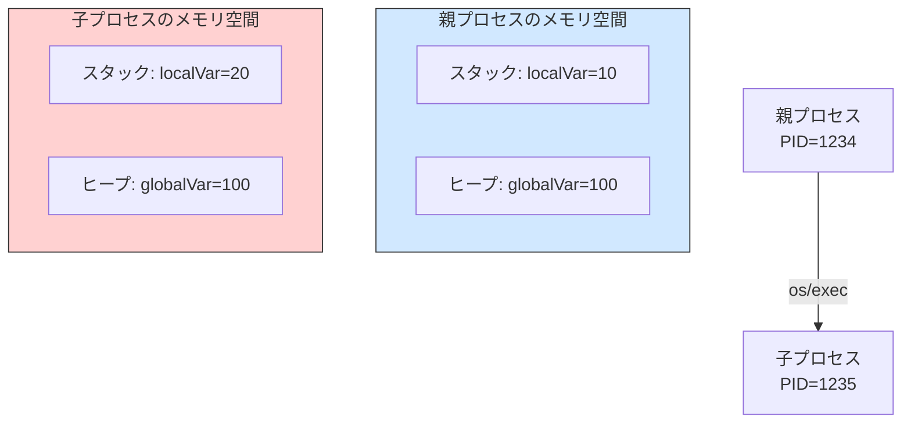
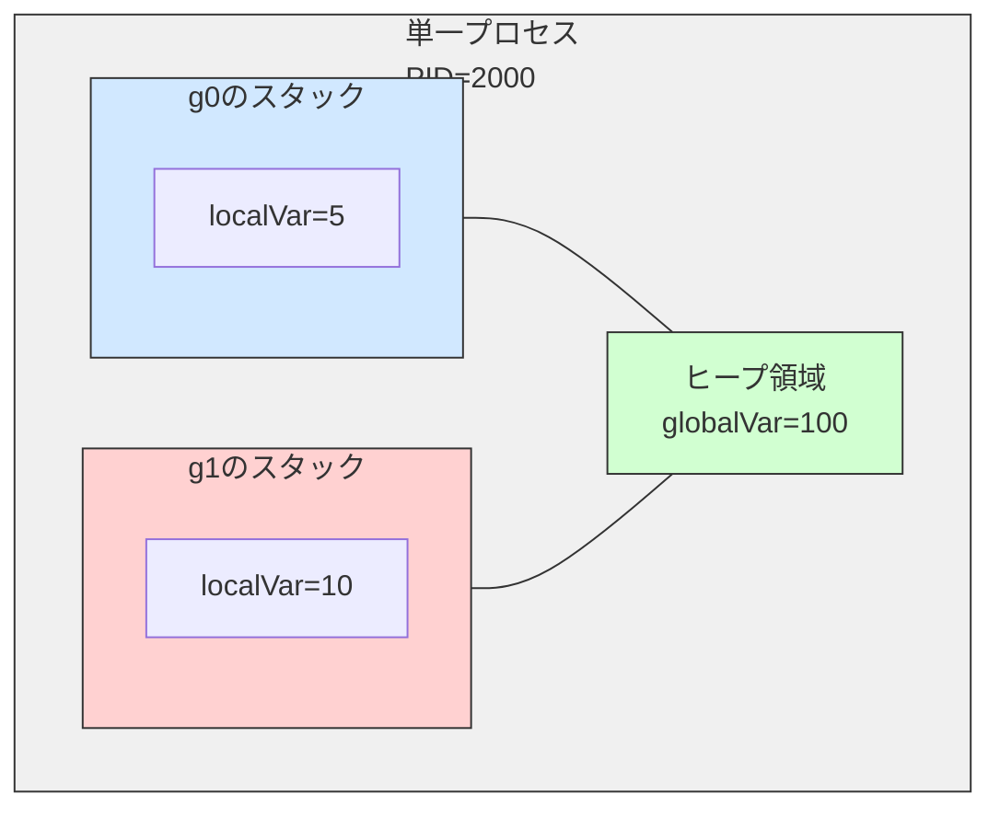

# 

# 概要

Goを使って、プロセスのアドレス空間・goroutineの動作・スタックとヒープを軽く覗いてみる。

# 子プロセスとアドレス空間の違いを確認する

Goでは標準的に`os/exec`パッケージを使って新しいプロセスを起動する。
`os/exec`は内部的にUnix系OSでは`fork()`＋`exec()`相当の処理を行い、新しいプログラム（この例では自分自身）を実行する。

親子プロセスで同じ変数のアドレスを表示し、メモリ空間の独立性を確認してみる。

```go
package main

import (
	"fmt"
	"os"
	"os/exec"
)

var globalVar = 100

func main() {
	localVar := 10
	fmt.Printf("Parent: PID=%d, globalVar=%p, localVar=%p\n",
		os.Getpid(), &globalVar, &localVar)

	cmd := exec.Command(os.Args[0], "child")
	cmd.Stdout = os.Stdout
	cmd.Run()
}

func init() {
	if len(os.Args) > 1 && os.Args[1] == "child" {
		localVar := 20
		fmt.Printf("Child: PID=%d, globalVar=%p, localVar=%p\n",
			os.Getpid(), &globalVar, &localVar)
		os.Exit(0)
	}
}
```

```sh
Parent: PID=15224, globalVar=0x100720448, localVar=0x14000102020
Child: PID=15225, globalVar=0x10502c448, localVar=0x14000090020
```

## 実行結果の意味

* **プロセス分離**: 親と子で異なるPIDが表示される。
* **アドレス空間の独立性**:

  * グローバル変数`globalVar`もローカル変数`localVar`も、親と子で異なるアドレスが表示される。
  * これは、Unix系OSがプロセスごとに独立した**仮想アドレス空間**を割り当てるためである。
    数値が似て見える場合もあるが、物理メモリ上では完全に別物である。

## プロセス間のメモリ空間図解



# goroutineとメモリ共有の観察

Goの軽量スレッドである**goroutine**を使用してメモリを観察する。goroutineは同一プロセス内で動作するため、仮想アドレス空間を共有する。
これを確かめるため、複数のgoroutineでグローバル変数とローカル変数のアドレスを表示してみる。

```go
package main

import (
	"fmt"
	"os"
	"runtime"
	"sync"
	"time"
)

var globalVar = 100

func worker(id int, wg *sync.WaitGroup) {
	defer wg.Done()

	localVar := id * 10
	fmt.Printf("Goroutine %d: PID=%d, globalVar=%p (value=%d), localVar=%p (value=%d)\n",
		id, os.Getpid(), &globalVar, globalVar, &localVar, localVar)

	// グローバル変数を変更（意図的にdata raceを発生させる）
	// 複数goroutineが同期なしに同じ変数へアクセス → 競合状態
	globalVar += id
	time.Sleep(100 * time.Millisecond)
}

func main() {
	localVar := 5
	fmt.Printf("Main: PID=%d, globalVar=%p (value=%d), localVar=%p (value=%d)\n",
		os.Getpid(), &globalVar, globalVar, &localVar, localVar)
	fmt.Printf("Number of goroutines: %d\n", runtime.NumGoroutine())

	var wg sync.WaitGroup
	for i := 1; i <= 3; i++ {
		wg.Add(1)
		go worker(i, &wg)
	}

	wg.Wait()
	fmt.Printf("Final globalVar value: %d\n", globalVar)
	fmt.Printf("Number of goroutines: %d\n", runtime.NumGoroutine())
}
```

```sh
Main: PID=19628, globalVar=0x1031503c8 (value=100), localVar=0x14000104020 (value=5)
Number of goroutines: 1
Goroutine 3: PID=19628, globalVar=0x1031503c8 (value=100), localVar=0x14000104050 (value=30)
Goroutine 1: PID=19628, globalVar=0x1031503c8 (value=100), localVar=0x14000180000 (value=10)
Goroutine 2: PID=19628, globalVar=0x1031503c8 (value=103), localVar=0x14000096000 (value=20)
Final globalVar value: 106
Number of goroutines: 1
```

## 分析

1. **同じPID**
   すべてのgoroutineは同じプロセス内で動作するため、PIDも同一である。
2. **グローバル変数の共有**
   `globalVar`のアドレスが全goroutineで同じである。
3. **ローカル変数の独立性**
   各goroutineは独立した**スタック**を持つが、この例では`localVar`のアドレスを取得して`fmt.Printf`に渡しているため、エスケープ解析によってヒープに配置される。それでも各goroutineで異なるメモリ領域に配置されており、独立性は保たれている。
4. **データ競合**
   `globalVar`の値が106になったのはたまたまで、実行タイミングによって結果は変わる。
   安全に並行処理を行うには、チャネルやミューテックスなどの同期機構が必要である。
   → `go run -race`で競合検出可能。

## goroutine間のメモリ共有図解



# goroutineとチャネルによる安全な並行処理

チャネルを使えば、共有変数を直接更新せずにデータをやり取りできる。

```go
package main

import (
	"fmt"
	"time"
)

var globalVar = 100

func worker(id int, ch chan<- string) {
	localVar := id
	ch <- fmt.Sprintf("Goroutine %d: globalVar=%p, localVar=%p", id, &globalVar, &localVar)
}

func main() {
	ch := make(chan string)
	for i := 0; i < 3; i++ {
		go worker(i, ch)
	}

	for i := 0; i < 3; i++ {
		fmt.Println(<-ch)
	}
	time.Sleep(100 * time.Millisecond)
}
```

# ヒープ領域とガベージコレクション

Goでは動的メモリはヒープに置かれることが多いが、配置先は**エスケープ解析**で確認できる。

```go
package main

import "fmt"

func main() {
	heapSlice := make([]int, 3)
	heapSlice[0] = 42
	fmt.Printf("heapSlice addr: %p\n", &heapSlice[0])
}
```

```sh
heapSlice addr: 0x140000ac030
```

* ヒープ領域はGCによって管理され、明示的に解放する必要はない。

# スタックとヒープの違い

| 項目         | スタック                           | ヒープ             |
| ------------ | ---------------------------------- | ------------------ |
| 管理方法     | 関数呼び出しに伴い自動で確保・解放 | GCが管理           |
| 領域の独立性 | goroutineごとに独立                | プロセス全体で共有 |
| 速度         | 高速                               | 相対的に遅い       |
| 配置条件     | エスケープしない変数               | エスケープする変数 |

# まとめ

1. **プロセスの独立性**
   子プロセスは親プロセスとは別の仮想アドレス空間を持ち、変数は共有されない。
2. **goroutineのメモリ共有**
   同一プロセス内で動作し、グローバル変数を共有するが、スタックは独立している。
3. **メモリ管理の特性**
   Goはエスケープ解析でスタックとヒープを自動的に振り分け、GCでヒープを管理する。

